# 某数藏平台夹带 20 亿跑路！！！

> 原文：[`mp.weixin.qq.com/s?__biz=MzIyMDYwMTk0Mw==&mid=2247542436&idx=4&sn=e04a7eaa7d68f4444421e4a6ea28bc9c&chksm=97cbed9ca0bc648accab602f7d5314108a1260cbac655ae0ff3cc56519f95fe774db8f585d13&scene=27#wechat_redirect`](http://mp.weixin.qq.com/s?__biz=MzIyMDYwMTk0Mw==&mid=2247542436&idx=4&sn=e04a7eaa7d68f4444421e4a6ea28bc9c&chksm=97cbed9ca0bc648accab602f7d5314108a1260cbac655ae0ff3cc56519f95fe774db8f585d13&scene=27#wechat_redirect)

某数藏平台市值 20 亿，结果这两天跑路了，现在维权群里哀嚎一片。

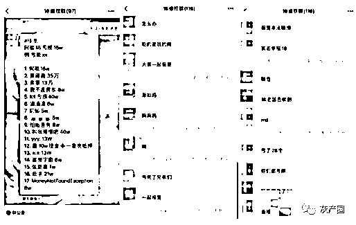

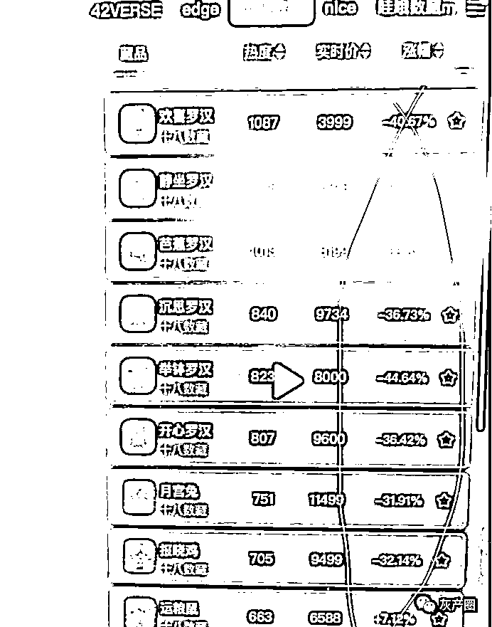

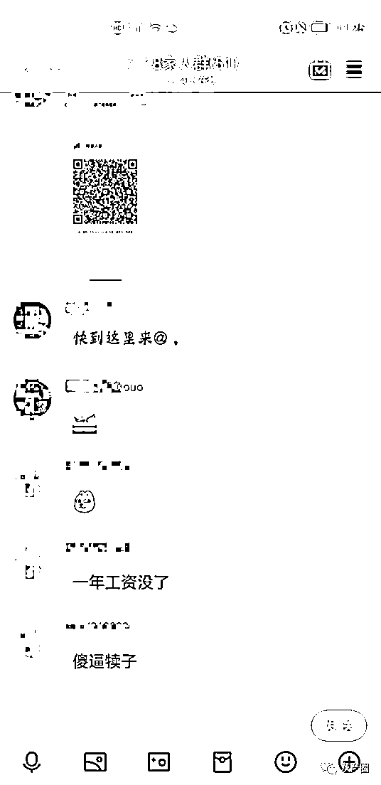

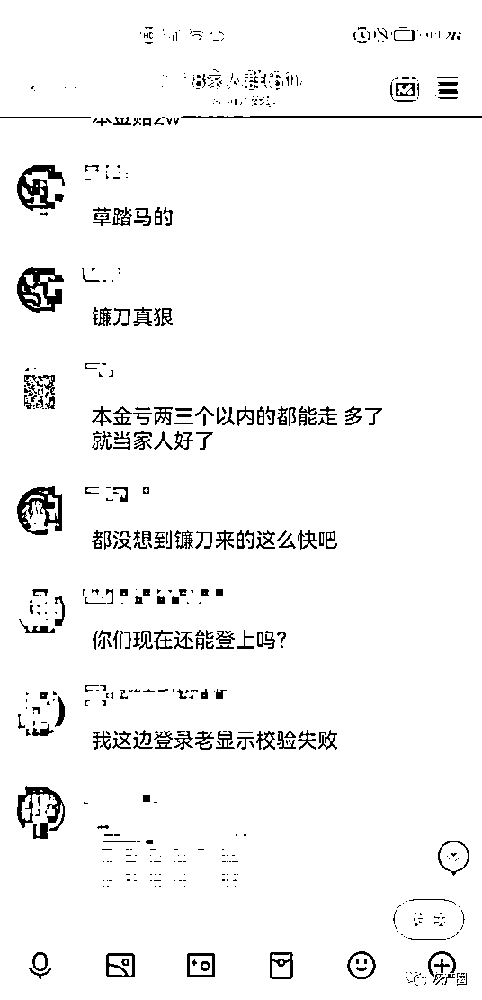

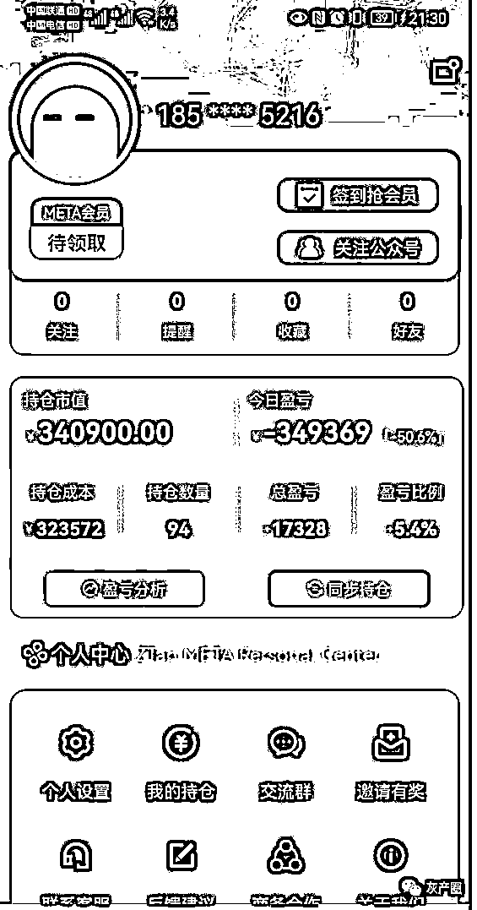

近期市场 NFT 一片走弱的时候，18 数藏在一众中显得清新脱俗，1 元的藏品尼玛半个多月翻了 8000 倍，市值一下冲到 20 亿，说割就割？而且割死了还能继续喊，你看看 18 数藏还在放利好，说现在这个行情只是暂时的，还有大户在抄底！狗把你咬了一口，跟你说等下要保你，你信吗？

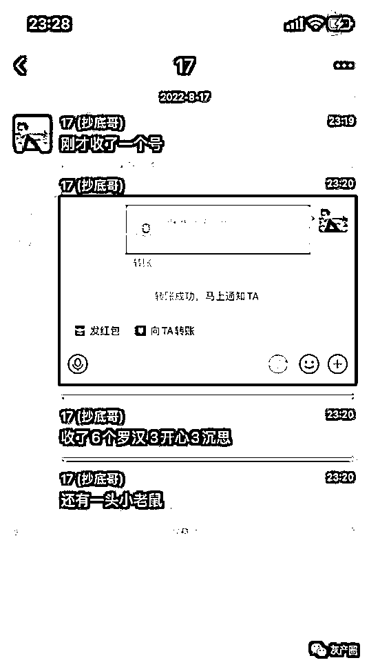

这边是 18 林某的钱包，里面好东西不少，有兴趣自己可以再看看现在实时里面情况。

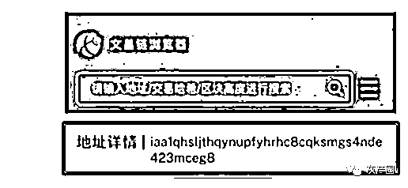

我查的时候，藏品总数 3619 个，交易数量 4162 个，也就是说，这个 18，不仅搞老鼠仓，还超发，甚至同样编号的数字藏品烂仓里了，这用来干什么，想必也不用我多说。

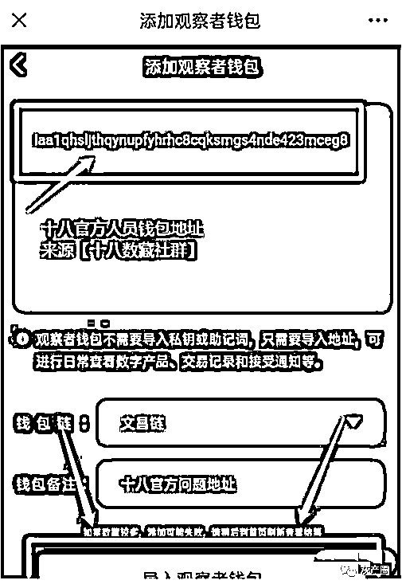

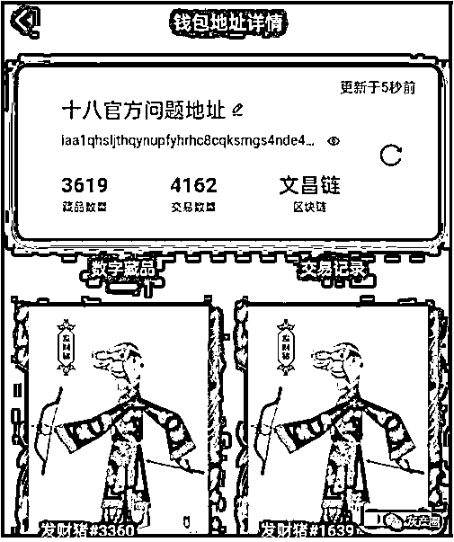

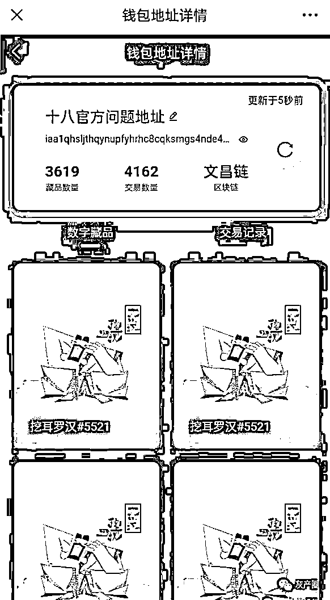

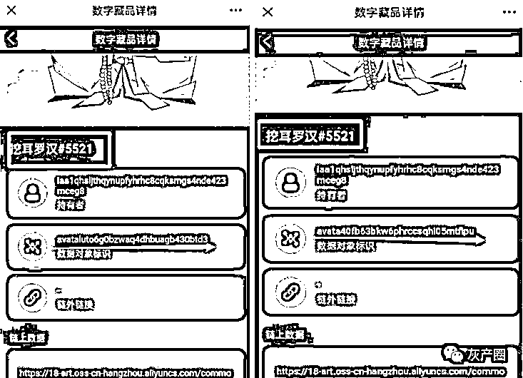

再顺着看转移记录，发现 18 的地址接受了大量不明地址罗汉，这个数量级的罗汉，不是砸死你？砸盘以后，18 一直解释是散户在砸盘，你说散户砸盘能砸的到这个量级，单天砸跌了 80%，这散户的水平也太尼玛的牛逼了。

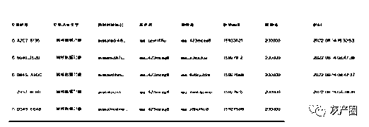

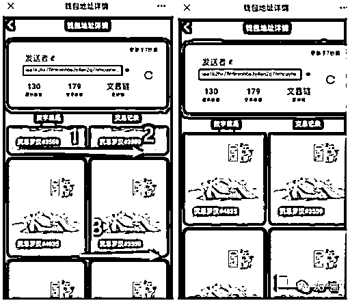

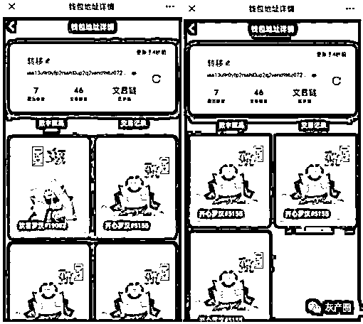

18 不仅内部花样老鼠仓、无限超发，公司还没资质。只能查到 ICP。网络文化经营许可证、艺术品经营备案、区块链服务平台备案、网络安全等级备案都没有。

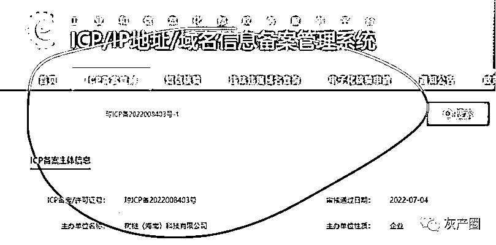

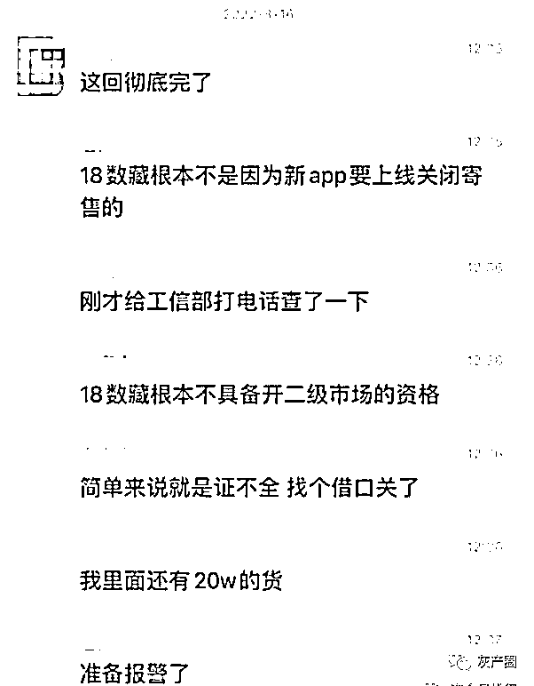

公司 06 月 08 日才成立，一开始法定代表人为王平，8 月 15 日却突然更换为“18 先生——柏松”；好巧不巧，这边刚换负责人，iBOX 就讲这个 18 柏松是之前 ibox 的负责人？这你还敢玩？

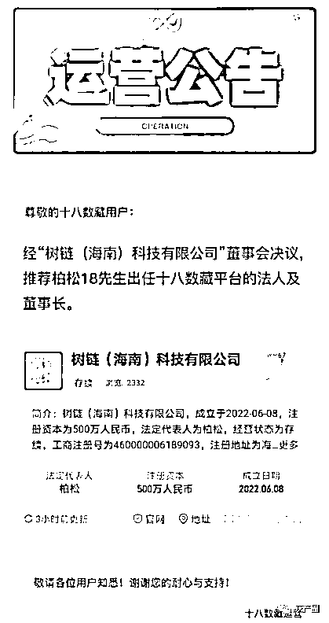

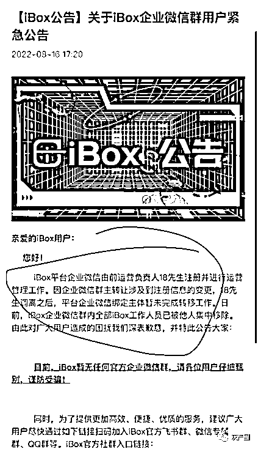

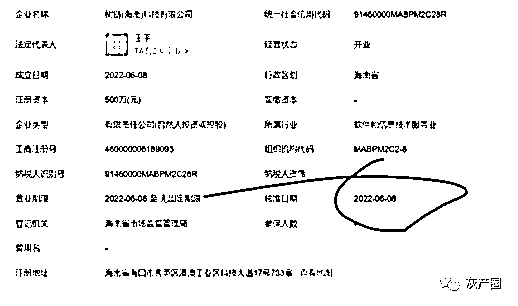

注册资金 500 万元，实缴资本 0 元，参保人数 0 人，6 月注册公司，7 月出的台子，8 月就倒的公司，真指望不了什么。

但几天有不少 ib 大户都开始给 18 数藏造势，居然还有群在疯狂抄底。一边是哭嚎遍地，一边是造势抄底，18 的心理素质真是强大，1 所有寄售下架了，还造势？下面是一位参与 18 的人员语录，大家有兴趣可以读一下。

合成飞天鹿王时还是没忍住，入了黄忠，亏损 3 万元，彻底离场。

18 数藏当初第一天老鼠抢购时自己就去抢了，然后抢购 2 个小时没抢到，火气是有点大的，要不你就卖完，要不你就别抢，次日 18 给了所有订单的全部空投，后来开了市场以后以打野的心态 500 元一个把 2 个老鼠卖掉了。

后来在生肖鸡 1.5 万时又进场，18 好割割的套路持 2 送 1，在持新品继续送，拿了 5 万本金入的，在一个礼拜以后 10 万出了本金，又一个礼拜以后出了 8 万利润，5 万仓库在里面。

2 天前平台藏品大跌，18 割说的原因就是消费活动，以及支付额度的问题。想吃点肉，你要和平台，机构，大户，小散做对手，最后还是没能全身而退！

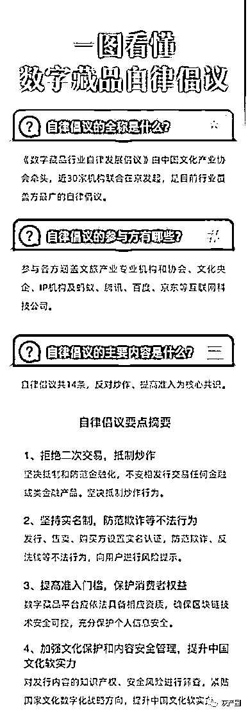

而且 18 的野心，不只是割散户，明面上散户自己大户持有数量三等分，合作共赢，结果有的大户，没收到内部消息，被套死了。另外，国家今天出台了政策，二级市场的交易已经无路可退，连幻藏都倒了，你还在期待什么呢？

来源：资金盘排行

