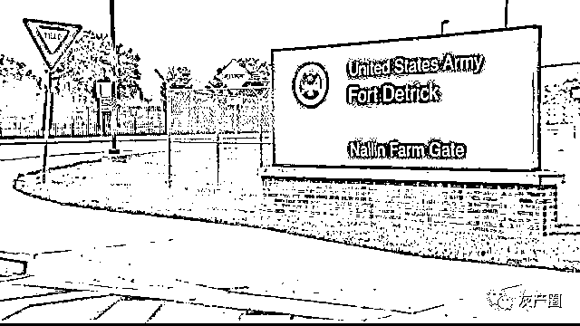

# 有多少？干什么？安全吗？多国专家质疑美海外生物实验室

> 原文：[`mp.weixin.qq.com/s?__biz=MzIyMDYwMTk0Mw==&mid=2247542436&idx=6&sn=687b25b209e13b357c870aaf628dd9ee&chksm=97cbed9ca0bc648a4bc3afa696d50bb9b696e34aadcf21152f84b78ef452c1b33eeda2430736&scene=27#wechat_redirect`](http://mp.weixin.qq.com/s?__biz=MzIyMDYwMTk0Mw==&mid=2247542436&idx=6&sn=687b25b209e13b357c870aaf628dd9ee&chksm=97cbed9ca0bc648a4bc3afa696d50bb9b696e34aadcf21152f84b78ef452c1b33eeda2430736&scene=27#wechat_redirect)

据新华社消息，近期，美国操控的海外生物实验室问题持续引发国际关注。多国专家学者表示，美国可能在海外生物实验室秘密从事军事生物研究。致命微生物泄漏、非法跨境转移炭疽杆菌等生物毒剂、实验室周边时常出现不明原因疫情等事实表明，美国是全世界军事生物活动的最大制造者、资助者和扩散者，时刻威胁全球公共卫生安全。

**━━━━━**

**实验室总数超 300**

**冷战时期，美国在本土及海外不断扩充生物实验室数量。“9·11”事件后，美国又以“反恐”之名、打着“保护生物安全”的名义资助、操控其他国家的大量生物实验室。根据美国向《禁止生物武器公约》缔约国大会提交的数据，美国在全球 30 个国家控制了 336 个生物实验室。这些实验室分布在东南欧、中亚、非洲和东南亚等地区，给世界带来重重隐患。**

**以原苏联地区为例，美国操控的生物实验室遍布原苏联各加盟共和国及其周边的 20 多个国家。据美方公布的数据，美在乌克兰控制 26 家生物实验室和其他相关设施。乌克兰危机升级之后，这些存储大量危险病原体、从事危险研究的实验室引发担忧。**

**俄罗斯国防部发言人科纳申科夫今年 3 月曾表示，美在乌克兰哈尔科夫的一个实验室常年秘密研究蝙蝠向人类传播疾病的途径。俄军辐射、化学和生物防护部队司令基里洛夫说，美方为乌生物实验室提供 3200 万美元资金用于执行“UP-8”项目，从事汉坦病毒、克里米亚-刚果出血热病毒等危险病原体研究。**

**俄罗斯微生物学家、联合国生物和化学武器委员会前成员伊戈尔·尼库林说，世界上只有一个国家在他国领土上操控数百个军事生物实验室，并为此花费数十亿美元，那就是美国。美方声称其资助乌克兰的生物实验室从事医疗卫生科学研究，这种说法是站不住脚的，“如果这些项目完全由五角大楼的预算提供资金，那它只能是军事性质”。**

****━━━━━****

****恶劣行径频频曝光****

****二战后，美军德特里克堡实验室获取了侵华日军 731 部队的人体试验数据。美军在越南战争中也曾使用“橙剂”等生物武器，给当地民众和生态环境造成不可逆的伤害。虽然美国 1972 年就签署了《禁止生物武器公约》，但美国军方资助和控制的生物实验室在世界各地秘密从事军事生物活动的恶劣行径不断曝光，引发国际社会关切、质疑和愤怒。****

****据格鲁吉亚国家安全部门披露，美方在格控制的卢加尔中心曾对当地志愿者测试一种新致命毒素，导致数十人死亡。2015 年，格报告新型叮蝇咬伤现象，这种叮蝇较本土叮蝇存活时间更长且携带具致死性的危险寄生虫。格媒体说，美军在卢加尔中心研究昆虫生物攻击，通过生物攻击传播疾病。****

****据韩国《统一新闻》报道，驻韩美军在韩国 4 个美军基地内设立了生物实验室，进行炭疽杆菌、蓖麻毒素等高危生化研究。根据韩国国防部与驻韩美军 2015 年公开的信息，从 2009 年至 2015 年，美军曾数次将灭活炭疽杆菌样本运送到韩国，并进行过 16 次实验，还引进过一次鼠疫杆菌。美军还曾“误送”未妥善灭活的炭疽杆菌到韩国，曝光后引起当地民众强烈抗议。然而，美方并未停止相关活动。****

****2016 年 1 月，日本冲绳县政府在驻日美军嘉手纳基地附近的水源地检测出高浓度的有害化学物质全氟辛烷磺酸，但日方无权进入基地调查，美方也一直拒绝承认并拒绝接受调查。据日本《冲绳时报》日前报道，驻日美军内部邮件显示，驻日美军首次承认了冲绳污染事件的污染源是嘉手纳基地。****

****肯尼亚国际问题学者卡文斯·阿德希尔对新华社记者说，美国在全球控制的生物实验室秘而不宣，外界对它们的目的和运行状态一无所知，这些神秘又有军事背景的实验室对世界安全构成严重威胁。一些历史案例表明，美国操控的生物实验室时有安全事故，造成不可挽回的破坏与损失，有可能使全人类陷入健康危机。****

******━━━━━******

******缺乏监管广受质疑******

******在新冠疫情暴发的背景下，美控制的生物实验室仍在进行高危病原体等研究，安全事故频发，其安全性和透明度遭到多国专家强烈质疑。这些实验室究竟秘密从事何种研究？为何阻挠国际多边核查和监管？美国欠国际社会一个合理的解释。******

******阿德希尔说,《禁止生物武器公约》是防止生物武器扩散的国际合作框架，对和平利用最新生物技术、维护全球生物安全和人类健康意义重大。美国作为缔约国在全世界操控不透明的生物实验室，并阻挠多边核查，这严重违背了该公约。美国有责任严格遵守公约，主动公布其生物研究相关细节。******

******尼日利亚阿布贾大学政治与国际关系学者谢里夫·加利说，美国在海外操控生物实验室的做法让外界产生疑虑。有报道说美国在尼资助或参与大量生物医学实验项目，他认为此类项目应该开放，让医学专业人士和国际社会了解实际情况。******

******土耳其医学生物学和遗传学专家科尔库特·乌卢詹表示，美国在世界各地主导的生物实验室必须向国际科学委员会开放，其活动需要由独立机构进行监督，以防止任何泄漏。******

******来源：新京报******

************************

************