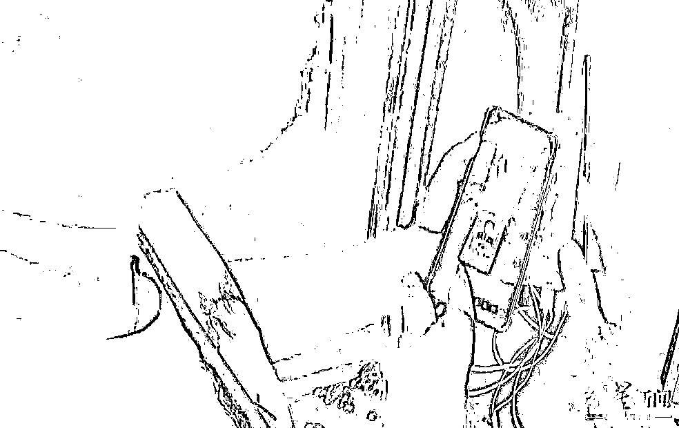

# “你转了账没有？”“转账没有？”“有没有转账？”

> 原文：[`mp.weixin.qq.com/s?__biz=MzIyMDYwMTk0Mw==&mid=2247542436&idx=7&sn=852ab4f4a3dc7ba28910214b934a021e&chksm=97cbed9ca0bc648a52fe392c0bde5aa5fd62e9289dc44b538db6be4d67963386abd809c1c449&scene=27#wechat_redirect`](http://mp.weixin.qq.com/s?__biz=MzIyMDYwMTk0Mw==&mid=2247542436&idx=7&sn=852ab4f4a3dc7ba28910214b934a021e&chksm=97cbed9ca0bc648a52fe392c0bde5aa5fd62e9289dc44b538db6be4d67963386abd809c1c449&scene=27#wechat_redirect)

试想，一家几口人

起早贪黑、辛辛苦苦

**积攒了多年的辛苦钱**

**如果不小心被骗走**

**生活将遭遇多大的打击**

为了避免这样的事情发生

我们的民警真的是很拼了

⬇⬇⬇

[`mp.weixin.qq.com/mp/readtemplate?t=pages/video_player_tmpl&action=mpvideo&auto=0&vid=wxv_2539582718016471041`](https://mp.weixin.qq.com/mp/readtemplate?t=pages/video_player_tmpl&action=mpvideo&auto=0&vid=wxv_2539582718016471041)

16 日 10 时 50 分

四川省资阳市反诈中心

接到预警指令

雁江区村民尹某

正遭遇电信诈骗

**反诈民警多次拨打尹某电话**

**而电话那头始终无人接听**

民警马上联系尹某的丈夫刘某

没想到刘某竟将他当成了骗子

情急之下

**民警用 110 号码**

**再次拨打了刘某的电话**

**刘某这才意识到事情是真的**

但他和妻子不在一起

也联系不上妻子

通过刘某了解到

家里的银行卡上

**存着全家多年务农**

**积攒的 20 余万元辛苦钱**

反诈中心迅速组织警力

分散到全镇各处及进山寻找

民警冒着烈日在山上搜寻尹某

找遍了 3 座山

最终在一块玉米地找到了

正在和诈骗嫌疑人通话的尹某

**“你转了账没有？”**

**“转账没有？”**

**“有没有转账？”**

**“你转钱了没？”**

**“有没有转钱？”**

......

“没有转钱......”

“哎呀，把我们担心惨了！”

找到尹某的民警

一口气连问了五遍

有没有给诈骗分子转钱

在得到没转钱的回答后

民警终于放心了

民警找到尹某，尹某从玉米地深处出来还拿着充电宝

后来，尹某跟民警说

诈骗分子一直在给她打电话

说自己是公检法

还说尹某涉案了

让尹某把反诈的 APP 卸载了

听到这里

民警又忍不住问了一遍

**“一分钱没转吗？”**

**“没有”**

**“只要没转钱就对了”**

尹某收到假警察发来的证件

警方提示

群众若遇到

冒充公检法办案人员的电话

要第一时间

向当地公安机关核实情况

多和家人商量

**不要轻信任何**

**要求转账到“安全账户”**

**或透露账户名和密码的“电话指令”**

来源：新华网（ID：newsxinhua），长安剑

