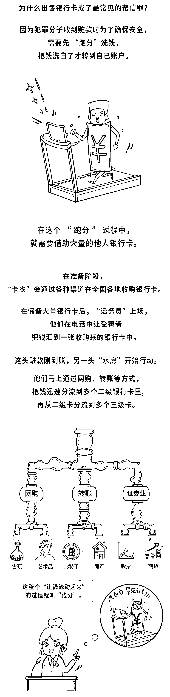

# 看完“跑分”软件操作流程后，他决定报案

> 原文：[`mp.weixin.qq.com/s?__biz=MzIyMDYwMTk0Mw==&mid=2247542436&idx=8&sn=13774248dbaf336e9d0267a42f243557&chksm=97cbed9ca0bc648a920cd58cc9e8340e9f3692dc9807a42a9aee1a0838ca066457a290b172a7&scene=27#wechat_redirect`](http://mp.weixin.qq.com/s?__biz=MzIyMDYwMTk0Mw==&mid=2247542436&idx=8&sn=13774248dbaf336e9d0267a42f243557&chksm=97cbed9ca0bc648a920cd58cc9e8340e9f3692dc9807a42a9aee1a0838ca066457a290b172a7&scene=27#wechat_redirect)

**2021 年 12 月中旬**

**李先生用手机浏览兼职信息时**

**被拉进某“翻墙”聊天软件**

**他看到群里有人讲解**

**下载安装一款“跑分”软件的视频**

**传授绑定银行卡转移资金获利**

**以及规避法律打击的方法**

**意识到这些操作可能涉嫌犯罪后**

**李先生随即向公安机关报案**

**……**

在办理凌某、姚某等 21 人帮助信息网络犯罪活动案时，甘肃省白银市白银区检察院通过提前介入将证据关口前移，并严格落实宽严相济刑事政策，依法对 18 名被告人提起公诉，对 3 名情节轻微的犯罪嫌疑人作出相对不起诉决定。近日，法院以帮助信息网络犯罪活动罪判处被告人凌某、姚某等 18 人有期徒刑一年至六个月不等，各并处罚金。

2021 年 12 月中旬，家住白银区的李先生用手机浏览兼职信息时，被拉进某“翻墙”聊天软件，在聊天过程中，李先生看到群里有人讲解下载安装一款“跑分”软件的视频，传授绑定银行卡转移资金获利以及规避法律打击的方法。李先生看完详细的操作流程后，认为该平台可能涉嫌犯罪，随即向公安机关报案。

警方侦查后发现，该“跑分”软件利用人们想要轻松赚钱的心理，帮助诈骗、赌博犯罪非法转移、结算资金。随后，警方通过对某“翻墙”聊天软件中的“跑分”交流群进行远程数据勘验，发现了使用该“跑分”软件的大量用户，立即展开抓捕。

今年 2 月 21 日，凌某、姚某等 21 人被抓获归案。到案后，21 人均称是通过手机浏览网站时下载安装了某“翻墙”聊天软件、加速器后，再下载安装了“跑分”软件。

据悉，凌某等人在那款“跑分”软件中缴纳了 2000 元至几万元不等的保证金，并绑定本人及亲属的多张银行卡，以此获取订单。获取订单成功后，绑定的银行卡会被转入与订单数额相等的钱，凌某等人再将银行卡中的钱转到“跑分”软件客服提供的银行卡中，这就完成了一笔“跑分”操作。转账完成后，客服会以千分之六或者千分之七向凌某等人返利。为逃避公安机关的打击，该“跑分”软件不断变换名称和图标。

**图解跑分↓↓↓**

**经查，2021 年 4 月至 2022 年 2 月，凌某、姚某等 21 人采用上述方法帮助不法分子非法结算资金 55 万余元至 1144 万余元不等。**

“该案涉案人数众多，金额较大，社会影响广泛，取证难度很大。”办案民警说。因此，公安机关向检察机关发出提前介入邀请。

“我们依托侦查监督与协作配合办公室的职能作用，在侦查阶段、审查起诉前多次派员提前介入，发现该案存在资金来源不清、银行卡交易明细不清、犯罪嫌疑人主观明知不清等问题。”白银区检察院检察官介绍。为引导公安机关全面收集证据，检察官与侦查人员同步阅卷，共同协商，提出书面引导侦查建议 90 余条，要求明晰涉案银行卡层级，并提取、恢复犯罪嫌疑人手机中的聊天记录等电子数据，用客观证据证实结算资金来源的非法性及各犯罪嫌疑人的主观故意，为案件后续快捕快诉打下了良好基础。

“在办案过程中，我们不仅考虑法律效果，还着重考虑政治效果和社会效果，综合研判、精准量刑，根据不同人员的主观恶性和情节轻重作区分处理。”白银区检察院副检察长于宏发介绍。**因该案涉案人员普遍比较年轻，法律意识淡薄，缺乏社会经验，检察机关认真研判后，对犯罪情节轻微、主观恶性不大、自愿认罪认罚的 3 人作出相对不起诉决定，对其余 18 人提出了确定刑量刑建议。**同时，本着教育为主、惩罚为辅的原则，该院向被不起诉的在校大学生李某所在学校发出检察意见书，建议学校对被不起诉人进行批评教育，并向在校学生进行法治宣传，引导学生树立正确的价值观和消费观，不随意向他人出租、出借实名制银行卡，提高防范意识，有效抵制和预防犯罪。

**延伸阅读·“帮信罪”的罪与罚**

**帮助信息网络犯罪活动罪**简称“帮信罪”，是指明知他人利用信息网络实施犯罪，为其犯罪提供互联网接入、服务器托管、网络存储、通讯传输等技术支持，或者提供广告推广、支付结算等帮助，情节严重的行为。

**“帮信罪”有很多行为类型，**比如收购、出售、出租银行卡、手机卡；提供或操作“GOIP”“猫池”“多卡宝”等设备，为电诈团伙搭建远程“机房”；利用社交媒体账号等方式为电诈团伙推广引流；为网络犯罪分子制作、封装、维护非法软件；职业“码农”团伙依附非法平台疯狂“跑分”等。

**根据刑法规定，“帮信罪”的法定刑为三年以下有期徒刑或者拘役，并处或者单处罚金。**根据《最高人民法院、最高人民检察院关于办理非法利用信息网络、帮助信息网络犯罪活动等刑事案件适用法律若干问题的解释》第 17 条的规定，对于“帮信罪”被判处刑罚的，司法机关可以依法宣告职业禁止；对于被判处管制、宣告缓刑的，可以根据犯罪情况，依法宣告禁止令。此外，还会有相关行政处罚。

同时，惩戒措施也不可避免。针对银行卡，会有信用惩戒、限制业务、严管账户等措施，不仅在一定时间内影响相关人员的贷款和信用卡申请，5 年内还会被暂停相关单位和个人银行账户非柜面业务，支付账户所有业务等；针对手机卡，则会在惩戒期内停止行为人的新入网业务，各基础运营商只保留 1 个手机号码。

来源：检察日报，利箭在出击

