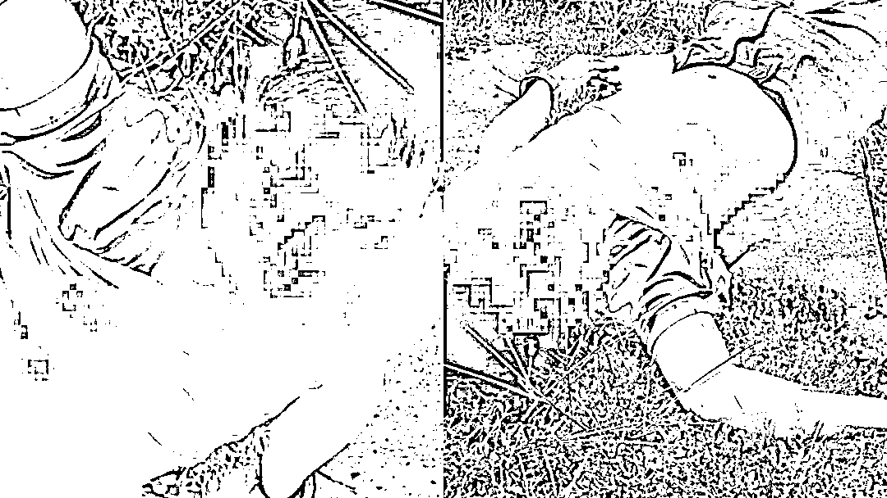

# 林志颖车祸后最新消息！好友称其已到普通病房，颜值恐难恢复原貌

> 原文：[`mp.weixin.qq.com/s?__biz=MzIyMDYwMTk0Mw==&mid=2247542492&idx=3&sn=ce83b70adc6eedf531ef7d06c896ab8e&chksm=97cbede4a0bc64f27efe3e9e3fd4c01d56f19b90900c1b8ee066da8bc11268064af88f65474e&scene=27#wechat_redirect`](http://mp.weixin.qq.com/s?__biz=MzIyMDYwMTk0Mw==&mid=2247542492&idx=3&sn=ce83b70adc6eedf531ef7d06c896ab8e&chksm=97cbede4a0bc64f27efe3e9e3fd4c01d56f19b90900c1b8ee066da8bc11268064af88f65474e&scene=27#wechat_redirect)

# 

图文均来源网络

01

说起林志颖大家都不陌生吧，咱们的不老男神。

可就在前不久的时间我们的男神出了一场严重的交通事故。

人人都羡慕的不老容颜，没被时间打败，却被一场意外打败了。

这意外发生在 7 月 22 日，距离现在已经过去有 28 天了。

想起那天的事故还是觉得有些庆幸，还好有路过的好心人不顾自己的生命安全，出手相救，将林志颖从死神手里抢救出来。

据在场的人员述说，当时的林志颖满脸鲜血，已经无法交流，一旁的儿子还好没什么大事，估计是吓找了，站在一旁。

而车子就在将林志颖拉出后的五秒就起火爆炸了，差点就带走了他的性命。

图片来源：网络，侵删

虽说时间过去有一段时间了，在这期间，网友也纷纷关注着林志颖的状况。

据媒体爆料，林志颖的伤情非常严重，不仅身体多个部位受到重创，还要进行面部的修复手术。

图片来源：网络，侵删

关于林志颖的手术进度，有位不具名的医师对外透露，林志颖“骨头复位得蛮漂亮”，预估半年可以恢复正常运动。

如果有其他地方骨折、脑部有受伤，会优先治疗，最后再进行脸骨重建。

消息一爆出，网友纷纷在下面留言，祝其早日康复。

而在这些评论中，就有一条让人看完感到破防：

> “这就是佛讲的因果：最漂亮的脸偏偏遭毁容、最会游泳的偏偏死于溺水、最懂音乐的偏偏失聪。”

这次意外车祸，或许真的是老天嫉妒他的不老容颜了。

图片来源：网络，侵删

8 月 3 号，微博上林志颖的大哥林志杰发言：“志颖安全了，感谢大家的陪伴与祈祷。”

8 月 8 日，台湾艺人姚元浩称林志颖已转入普通病房，总算让大家放下心头大石。

8 月 16 日，林志颖的妻子陈若仪更新动态，分享出一张牵手照，从镜头中来看，林志颖身穿病号服躺在病床上，手肘部位还缠着纱布，陈若仪配文称：挺过风雨，终会看见曙光。

照片中不仅有林志颖和妻子，还有坐在一旁只露着一根腿的儿子，说明一家人都会陪伴在他身边等他身体痊愈，小小的一张图看似什么都没有，却包含了一个家庭的温馨，令人感动暖心。

图片来源：网络，侵删

其实林志颖之所以能有如此好运，还真的和他热血友善的人生，有着密切联系。

02

15 岁时，林志颖跟同学在台北逛街时，因完美的外形和健康阳光的气质被广告商发掘。

1991 年，16 岁的他，在学校演出学校舞台剧时，被飞碟公司星探发掘（捧红小虎队的经纪公司），正式签约飞碟唱片公司；

1992 年，17 岁的他，在第一首专辑推出时，其中主打歌《十七岁的雨季》火遍大江南北。

直到现在，这首歌还有很多人会唱：

> “十七岁那年的雨季，我们有共同的期许，也曾经紧紧拥抱在一起/十七岁那年的雨季，回忆起童年的点点滴滴，却发现成长已慢慢接近…”

1993 年，18 岁的林志颖在香港红馆开演唱会，是有史以来第一个完全以国语歌曲演唱的歌手，也是年纪最轻的。

很多人不知道，林志颖和相声演员郭德纲年纪相仿，郭德纲仅仅年长一岁。

但是两人相比起来，郭德纲却显得年长很多。

图片来源：网络，侵删

在《爸爸去哪儿》节目里，李湘的女儿王诗龄第一次看到林志颖时，就目不转睛，说：

“kimi 的爸爸好帅啊。”

此时的林志颖，已经将近 40。

小孩子对好看的认知是单纯的，他们不会撒谎；

以前大众对好看的认知也是单纯的，凭借一张俊俏的脸就能红得一塌糊涂。

**不过，林志颖并不是只靠脸吃饭。**

03

从出道到现在，他所参演的作品其实跟同届的人相比，并不多。

因为他把自己的很大一部分精力用在了追梦的路上。

> 23 岁，拥有第一辆法拉利。并用自己的红色法拉利战车，第一次赛车比赛拿到季军奖杯。
> 
> 24 岁，参加世界国际 A 级越野赛，成台湾第一个参加国际顶级赛事的车手。
> 
> 26 岁，在珠海赛车场拿到赛车生涯第一个冠军。
> 
> 27 岁，赛车达到颠峰状态，拿到 9 座职业车赛奖杯，7 个冠军奖杯，2 座亚军，并成为台湾年度冠军车手。
> 
> 34 岁，林志颖正式成为中国队后备队员，该队是世界 F1 赛场上唯一的中国队。
> 
> ......

**他对赛车的爱，是刻入骨子里的；他对梦想的追求，坚持了半辈子。**

在人们以往的认知里，高速度的行驶、高难度的漂移，每一次的比赛都是危险和荣誉并行的。

并且，在他 24 岁时，就已经出现过一次事故，让粉丝们着实捏了一把冷汗。

之前也有过一次车祸，那时车祸导致林志颖右脚掌断了三根骨头，打了四根钢钉固定。

当时很多人劝他放弃，但他还是坚持下来了，并且坚持了半辈子。

甚至在这次车祸发生的前的一个月，他还去参加了赛车比赛。

04

怎么说也是从阎王面前走过的人，都说大难不死，必有后福，相信林志颖的福气还在后面呢。

如今林志颖的病情慢慢在好转，估计陈若仪也终于可以松口气。接下来就是好好休养，迎接面部手术。

希望林志颖能后早日康复，身体才是最重要的。也希望他接下来的面部手术能顺利完成，颜值可以恢复如初。

对于林志颖的好消息，粉丝们都默默为偶像祈祷，希望他能早日康复，快点回归幕前。

希望偶像早日归来，也希望中国有更多这样的优质明星！

喜欢你的人，都一直在等你。

最后提醒出门开车，一定要注意安全，不光是为了自己，更是为了家人。拒绝冲动行驶，拒绝酒驾，拒绝不安全驾驶。平平安安开车出门，平平安安回家。

来源： 幸福小酒馆 作者：小琳 

欢迎关注灰产圈官方服务号

](http://mp.weixin.qq.com/s?__biz=Mzg5ODAwNzA5Ng==&mid=2247488098&idx=3&sn=638c5dd62ca652e1a1f2fd5b8420b00f&chksm=c0687b35f71ff223bca5031da035e3ab56f77f3ecfe42e587322e6e0f1302dc4d3e3fb354f18&scene=21#wechat_redirect)

← 向右滑动与灰产圈互动交流 →

