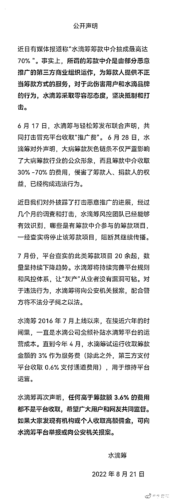
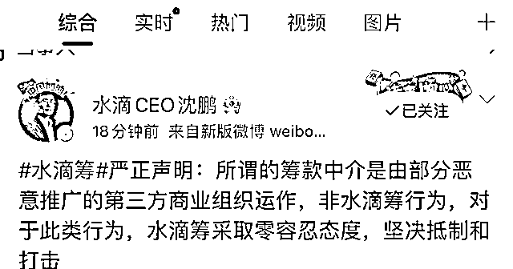
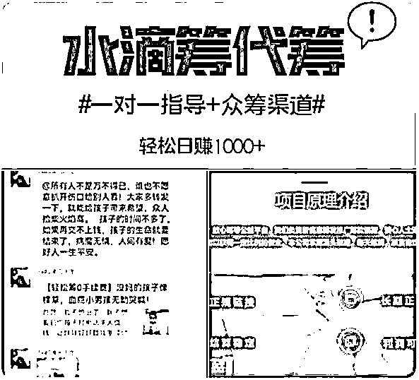
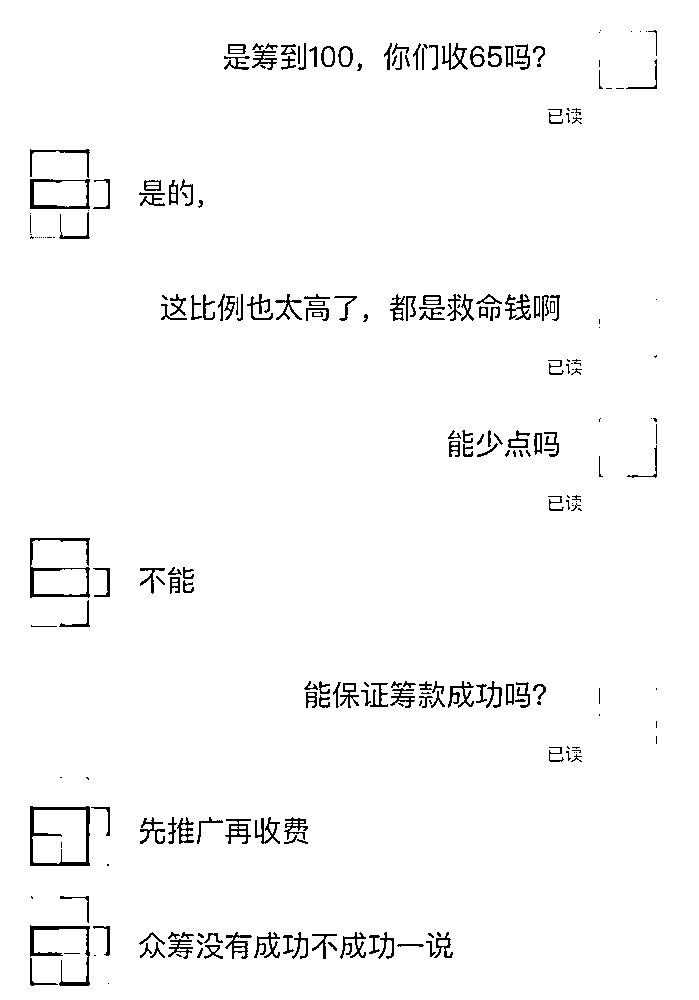

# 水滴筹“抽取七成”？

> 原文：[`mp.weixin.qq.com/s?__biz=MzIyMDYwMTk0Mw==&mid=2247542492&idx=4&sn=74c1c10682576e40b9d6f067ae147705&chksm=97cbede4a0bc64f23f62c6839f89d1d0b3089d4d86efa7ea32a899157142b6b4b506e4a6d193&scene=27#wechat_redirect`](http://mp.weixin.qq.com/s?__biz=MzIyMDYwMTk0Mw==&mid=2247542492&idx=4&sn=74c1c10682576e40b9d6f067ae147705&chksm=97cbede4a0bc64f23f62c6839f89d1d0b3089d4d86efa7ea32a899157142b6b4b506e4a6d193&scene=27#wechat_redirect)

8 月 21 日，“水滴筹”相关话题登顶微博热搜榜。该话题主要涉及此前曝光的水滴筹存在“筹款抽佣”一事。 

水滴筹发布的声明称，近日有媒体报道称“水滴筹筹款中介抽成最高达 70%”，事实上，**所谓的筹款中介是由部分恶意推广的第三方商业组织运作，为筹款人提供不正当筹款方式的服务。**

上周，针对“灰产”问题，水滴筹首次披露了打击恶意推广的相关数据：目前已累计管控恶意推广案例 800 余起，管控恶意推广的用户账号 600 多个。惊人的是筹款中介从中抽成比例高达 30%-70%。

↑水滴筹官方微博截图

水滴筹 CEO 沈鹏转发了该声明，并表示，所谓的筹款中介是由部分恶意推广的第三方商业组织运作，非水滴筹行为，对于此类行为，水滴筹采取零容忍态度，坚决抵制和打击。

网友热评：

> 读书小马甲：中介从中抽成比例竟然高达 30%-70%，这不是抽成而是在抽脸。有种被黑中介诈骗的感觉，以后不会在这类平台捐一分钱。
> 
> 路人-9527：这是在消耗人们的善良。
> 
> 看对到做对：医院天天都有几拨水滴筹的人，来问患者开通水滴筹不。
> 
> 七九三十：上次想捐的，一看 30%的手续费，立马撤回。
> 
> 小课堂：很无奈！虽然明知道有些家庭最后能拿到的只是一部分，但也没办法……已经累计捐了几千块了，以后可能也会捐下去吧，希望增加监管力度。
> 
> JY 疯丫头：肯定有贩卖个人信息，我留了个手机号就不停打电话给我，绝了。

近期，有媒体调查并报道了“职业筹款推广人”这一群体。这些职业筹款人为网络筹款求助者有偿提供推广服务，雇佣推手在微博、微信群内大量传播筹款信息，并向求助者收取高达七成的捐款抽成。有人认为“职业筹款”是乘人之危，对互联网慈善事业有很大伤害，需要行业和监管部门及时关注。

 6 月 22 日，某购物平台卖家发布的水滴筹代筹业务兼职。

的确，单是“抽取七成”这一细节，就难以让人接受。无论是筹款的当事人，还是捐过款的网友，看到本是救命的善款，大部分都进入了“职业筹款推广人”的口袋，心里都不是滋味，也不得不追问：**这样的“推广”合理吗？是不是违背了慈善的初衷，走向了畸形？**

水滴筹专项调查小组把这类行为定义为“恶意推广”，专家表示，恶意推广虽然给患者筹到一部分资金，但代价却是对整个行业生态的破坏，导致广大用户对求助案例真实性产生质疑，进而影响对大病筹款行业的信任，**这会让其他筹款人更难获得帮助。** 

**对此你怎么看？**

延伸阅读： 

[大病筹款也有诈骗？轻松筹、水滴筹就“推广费”发布联合声明](http://mp.weixin.qq.com/s?__biz=MzIyMDYwMTk0Mw==&mid=2247538079&idx=2&sn=1466adb4bc64e25122bb74949f33eb97&chksm=97cb9ea7a0bc17b19d6d8f307db8ad9cb7ab435470360613ee1a8cc7cfddab1b060331a29739&scene=21#wechat_redirect)

[做公益还是做生意？“职业筹款人”抽走七成救命钱！](http://mp.weixin.qq.com/s?__biz=MzIyMDYwMTk0Mw==&mid=2247540651&idx=6&sn=d859aa975ab510182493d165944efa09&chksm=97cb9493a0bc1d85e7ead6fffb52f07c0482a0169bcbd742cb897c3c6325d2d095b2eebb9947&scene=21#wechat_redirect)

[“职业筹款人”抽走 7 成救命捐款，这还算哪门子慈善？](http://mp.weixin.qq.com/s?__biz=MzIyMDYwMTk0Mw==&mid=2247538787&idx=4&sn=6c1934c0114a01b22e5c087d0f63a49e&chksm=97cb935ba0bc1a4da1e3128286eaa08ab621615d62d8207ee74e991a828953bec341d223b496&scene=21#wechat_redirect)

来源：央视网综合@水滴筹、光明日报、法治日报

欢迎关注灰产圈官方服务号

](http://mp.weixin.qq.com/s?__biz=Mzg5ODAwNzA5Ng==&mid=2247488098&idx=3&sn=638c5dd62ca652e1a1f2fd5b8420b00f&chksm=c0687b35f71ff223bca5031da035e3ab56f77f3ecfe42e587322e6e0f1302dc4d3e3fb354f18&scene=21#wechat_redirect)

← 向右滑动与灰产圈互动交流 →

