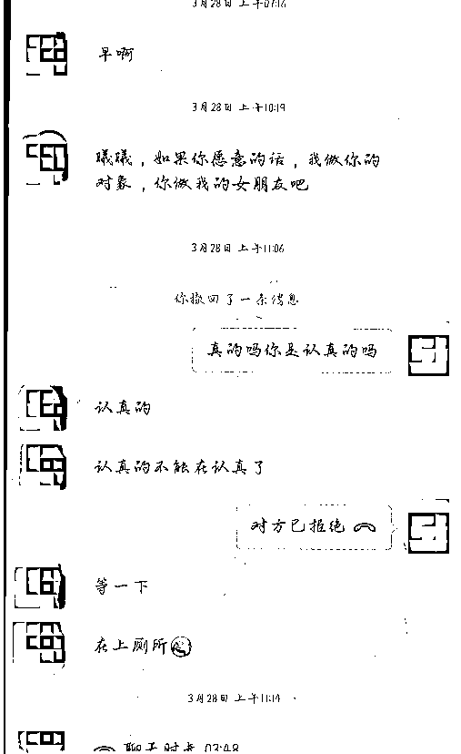
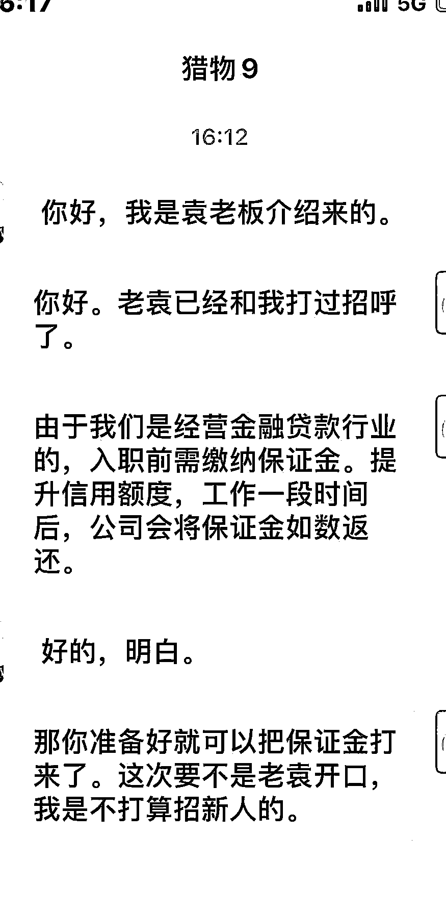

# “甜妹”一句哥哥 6 万到账，被抓后猛男忏悔

> 原文：[`mp.weixin.qq.com/s?__biz=MzIyMDYwMTk0Mw==&mid=2247542492&idx=5&sn=9fb1bf0d96c6d8a628a17bb6f965ad7d&chksm=97cbede4a0bc64f2df7f6c29b444437daaefa3454474d790184a4bd40ca6b0b1d9a01ac996da&scene=27#wechat_redirect`](http://mp.weixin.qq.com/s?__biz=MzIyMDYwMTk0Mw==&mid=2247542492&idx=5&sn=9fb1bf0d96c6d8a628a17bb6f965ad7d&chksm=97cbede4a0bc64f2df7f6c29b444437daaefa3454474d790184a4bd40ca6b0b1d9a01ac996da&scene=27#wechat_redirect)

恋爱是一件美好的事

网络的快速发展

为恋爱搭建了更便捷的渠道

但在网上恋爱

可得小心别落入陷阱

那一句句甜言蜜语

可能都是射向你钱包的利箭

**善解人意的“女友”竟是胖小伙**

**1**

前段时间，安徽马鞍山的朱先生在某交友软件上看到一条信息，便与对方互加了微信。

很快，对方给朱先生发来美女照片，声称这就是其本人。聊天中，对方表示愿意做他的女朋友，还给朱先生拨打了语音电话。

语音一聊，朱先生发现对方声音甜美，善解人意，很快陷入情网之中。

有天，“女友”给朱先生又打来语音电话，称其爷爷生病了，需要去北京治疗。“她”说，因为手头没有多少积蓄，打算将居住的房子卖了给爷爷治病，万一爷爷的病治不好，自己也不想活了。

听“女友”这么一说，朱先生有点着急，担心女友想不开，并表示自己可以帮忙。

就这样，一周内，朱先生分 6 次给对方转账 3 万多元。

看了这些话，连神仙都要动感情：真是个温柔、体贴、懂事的女孩子呀！很可惜，对方是个男人。

直到朱先生再也联系不上“女友”后，才意识到上当受骗。

近日，警方将犯罪嫌疑人钱某抓获归案，经审查，其对自己以谈恋爱为由实施诈骗的行为供认不讳。

他伪装成女性，在社交平台上将自己打造成漂亮、独立，孤身一人照顾爷爷的人设，说话十分温柔，迷惑性极强。

变声器了解一下…… 

目前，案件还在进一步办理中。

**2**

**完美“男友”多方设局杀猪盘**

前段时间，张女士到安徽滁州打工，在一个聊天交友软件里面认识了自称是某大公司的老板袁某。

结识之后，袁某总是会细心体贴地帮助张女士安抚烦恼并向其表示好感，想要一场甜甜恋爱的张女士也就正式和袁某确定了恋爱关系。

说起来袁某的一张嘴可真是甜呐！从日常作息到平日喜好，没有一样不嘘寒问暖。

这位袁某因为“心疼女友”，就给她介绍了一个“好工作”。

张女士听到条件丰厚欣然同意，于是加了袁某这个所谓金融贷款公司老板和另一名员工的微信。

张女士出于对男朋友的信任，很快就给贷老板转了入职保证金，前前后后交纳了所谓的入职保证金 15 余万。

接到报案后，滁州警方对案件线索进行细致梳理，发现所谓袁某、贷老板、员工的真实身份均为袁某一人。

目前，因涉嫌诈骗犯罪，袁某已被滁州市检察机关批准逮捕。

****专门招聘擅长聊天的人引流****

****3****

**以上这二位都是单枪匹马骗人，还有专门雇人聊天的“杀猪盘”团伙。**

**前段时间，山东济宁邹城市公安局网安大队发现本地网上的小广告——**“在家无聊，同城兼职，下载某某相亲网站 APP，聊天即可赚钱，月入过万不是梦”。****

****

**民警调查发现，招到人员后，他们大量注册某相亲网站男性账号，开通会员，匹配异性进行聊天。**

**聊天过程中以想进一步接触交往为由，不断索要对方的手机号和微信号，一旦索要成功，聊天者的任务就完成了。**

**随后，老板会按引流数给这帮聊天儿的人发工资。加了微信干什么呢？自然是各种设局，各种引诱，各种诈骗了……**

**在经过连续多日的分析研判后，山东邹城市局网安大队迅速收网，先后在多地抓获犯罪嫌疑人 16 名，扣押作案手机 25 部、电脑 6 台，涉案资金 150 余万元。**

**经审讯，该团伙成员对其利用“杀猪盘”实施诈骗的行为供认不讳，案件正进一步调查中。**

****

**良言一句三冬暖**

**恶语伤人六月寒** 

**谁都喜欢听好话**

**谁都希望别人能关心自己**

**但会说话的天赋**

**可不是叫你用来骗人的**

**你骗了人，犯了法**

**那我们就只好来找你了**

**来源：昆明反电信网络诈骗中心 图片：网络截图 素材：安徽网警/山东网警**

****

**欢迎关注灰产圈官方服务号**

******](http://mp.weixin.qq.com/s?__biz=Mzg5ODAwNzA5Ng==&mid=2247488098&idx=3&sn=638c5dd62ca652e1a1f2fd5b8420b00f&chksm=c0687b35f71ff223bca5031da035e3ab56f77f3ecfe42e587322e6e0f1302dc4d3e3fb354f18&scene=21#wechat_redirect)**

**← 向右滑动与灰产圈互动交流 →**

****