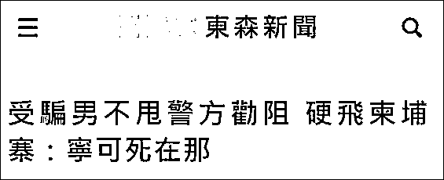
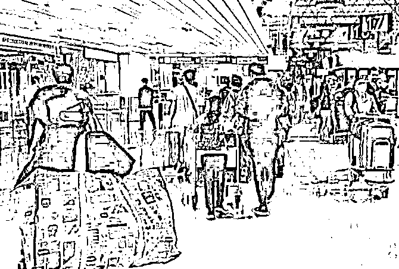

# "在台湾活不下去了，宁可死在柬埔寨"

> 原文：[`mp.weixin.qq.com/s?__biz=MzIyMDYwMTk0Mw==&mid=2247542492&idx=6&sn=d8394baf4d80608a3df9275a09195428&chksm=97cbede4a0bc64f28947a171f36d041b18bf24a840678a33922a24c86310e1ac2665b1175fc4&scene=27#wechat_redirect`](http://mp.weixin.qq.com/s?__biz=MzIyMDYwMTk0Mw==&mid=2247542492&idx=6&sn=d8394baf4d80608a3df9275a09195428&chksm=97cbede4a0bc64f28947a171f36d041b18bf24a840678a33922a24c86310e1ac2665b1175fc4&scene=27#wechat_redirect)

“在台湾活不下去了，死在柬埔寨也无所谓，宁可死在那”，据东森新闻网 19 日报道，近日，一名被诈骗的台湾男子如此回复劝阻他别去柬埔寨的警方工作人员。

报道称，近日，台湾新北市警方发现 3 个人口贩卖团伙，在逮捕 15 名嫌犯后，冲到机场试图阻止正要出境的 6 名受害者。6 人年龄均在 21-36 岁之间，他们听信诈骗集团谎言，以为只需要会打字，就能在柬埔寨拿到每月 4 万美金的薪资。

其中 5 人经警方劝阻未登机，打消外出务工念头，但有 1 人执意上飞机，并称自己在台湾已经“活不下去了”、“死在那边也无所谓”，认为“就算有危险也要去试试看”，因此执意登机。后来，岛内相关部门向泰国警方通报此事，泰国警方才将其遣返。

高雄也发生了一起类似案件。1 名 30 多岁的男子在发小的怂恿下决定飞往柬埔寨求职，并偷偷瞒着家人办好了所有证件。家人发现时，他已经买好了机票，并执意离开，警方曾上门劝阻，该男子不听。最后，是他父母报案，请求警方作废该男子的证件，此事才暂时告一段落。

本月初，岛内警察还曾在机场拦下一名 31 岁苏姓男子，对方自称一个叫芳芳的女子邀请他去柬埔寨赌场工作，包吃包住包机票外，还有高薪福利，男子宣称这是“上帝给的机会”。当警方告诉他，约 90%去柬埔寨求职的民众，都被人口贩子控制，男子竟回怼，“我是 10％的天选之人”；另一名疑似被骗往柬埔寨的女子则对警方称，“缺钱缺到快被鬼抓走，我走投无路了！”“我宁愿死在柬埔寨！”

据 TVBS 新闻报道，从 7 月底至本月 14 日为止，台湾警方在机场举着宣传牌，提醒民众小心海外打工陷阱，成功拦阻 26 起诈骗案，但仍有 73 人坚持出境。

台湾资深刑警认为，这也是另一种台湾年轻人的悲哀，甘愿赴柬埔寨的台湾人大多学历低下、工作能力不足，他们在台湾找不到工作，且多半是与亲人相处不睦，甚至是已与家属断绝关系、不相往来，在种种因素下成为社会边缘人，这才宁可抱着生命危险去闯一闯，各种悲惨遭遇让人摇头。

在诈骗案频出之际，民进党仅派人在机场举牌拦截的做法引发岛内舆论不满。

18 日，中时新闻网刊发评论指出，台湾民众在海外遭诈骗的事件频传，当局相关单位不作为，还带头以所谓“吹哨者”、赴柬埔寨工作者和营救者为对象，发动了三波舆论攻势。

第一波，亲赴柬埔寨救人的岛内网红曾拍摄视频介绍营救过程，不料外事部门火速斥责这是假消息，并要民众勿以讹传讹，亲绿网军也跟着攻击，气得该网红反驳“政府认错很难吗？”

亲绿网军的第二波攻势是针对赴柬埔寨及东南亚工作的人，故意强调是被骗的人好逸恶劳、贪婪、只想赚快钱，甚至放出风声说不必管他们；第三波攻势则是污蔑一些在柬埔寨及东南亚的抢救行动是“黑道的两面手法”——先拐卖人再救人，还讥讽国民党“立委”到柬埔寨救人是“政治消费”。蔡政府自己没能力救人，又看不得别人救援成功，还加以抹黑，这种心态实在可恶可恨。

文章质问台当局，自台湾民众被诱骗去柬埔寨的事件被揭发以来，蔡政府就一直无心也无力处理，受害案例越来越多、情节也越来越骇人，但向来爱在脸书和推特等社交媒体发文的蔡英文，迄今未置一词，不知道她是没有看到还是没有感觉？

来源：观察者网

欢迎关注灰产圈官方服务号

](http://mp.weixin.qq.com/s?__biz=Mzg5ODAwNzA5Ng==&mid=2247488098&idx=3&sn=638c5dd62ca652e1a1f2fd5b8420b00f&chksm=c0687b35f71ff223bca5031da035e3ab56f77f3ecfe42e587322e6e0f1302dc4d3e3fb354f18&scene=21#wechat_redirect)

← 向右滑动与灰产圈互动交流 →

