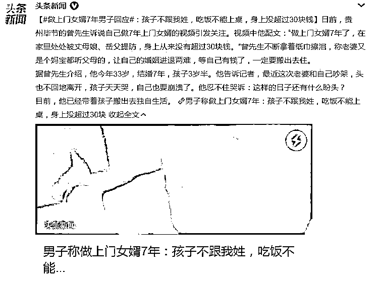

# 7 年的上门女婿：孩子不跟我姓，处处被丈母娘、岳父提防……入赘真如寄人篱下?

> 原文：[`mp.weixin.qq.com/s?__biz=MzIyMDYwMTk0Mw==&mid=2247542562&idx=3&sn=08c02b8bf46d10a1987fd29a925706fa&chksm=97cbec1aa0bc650c0cad531617eab0b3a75500378b0b4c738baf970021658e0d5ebb3114307e&scene=27#wechat_redirect`](http://mp.weixin.qq.com/s?__biz=MzIyMDYwMTk0Mw==&mid=2247542562&idx=3&sn=08c02b8bf46d10a1987fd29a925706fa&chksm=97cbec1aa0bc650c0cad531617eab0b3a75500378b0b4c738baf970021658e0d5ebb3114307e&scene=27#wechat_redirect)

[`v.qq.com/iframe/preview.html?width=500&height=375&auto=0&vid=v3352ofjvh1`](https://v.qq.com/iframe/preview.html?width=500&height=375&auto=0&vid=v3352ofjvh1)

这几年网上流行打拳，女拳男拳打得不可开交，牵扯到性别的话题常常火得猝不及防。今天我就看到一个和性别有关的话题，话题火得一塌糊涂，火得如醉如痴：

日前，贵州毕节的曾先生诉说自己做 7 年上门女婿的视频引发关注。视频中他配文：“做上门女婿 7 年了，在家里处处被丈母娘、岳父提防，身上从来没有超过 30 块钱。”曾先生不断拿着纸巾擦泪，称老婆又是个妈宝都听父母的，让自己的婚姻进退两难，等自己有钱了，一定要搬出去住。

这则新闻是“九派新闻”隆重供稿的，我把新闻全文看了两遍，觉得根本就没啥“猛料”，就是对小夫妻间的鸡毛蒜皮，如果这个能算新闻，家家都可做一期新闻，一期大新闻。

我随便摘两段：

|“曾先生：我一直都在开理发店，但是这几年生意也不好，不仅没有赚到钱，还负了不少债。现在每天带着孩子在店里，也没有什么生意。”

“曾先生：那时候太喜欢她了，让我做什么我都愿意。而且我家里兄弟姐妹比较多，我有一个姐姐，一个妹妹，一个弟弟。妻子家里也一共姐妹 6 个，但是没有儿子。她比较依赖父母，**希望我去她家里做上门女婿，我就答应了。**”|

从曾先生的描述里，目前家庭经济比较窘迫，但窘迫不是曾先生一家独有，某种程度上说，如今很多家庭都存在类似的窘迫。何况曾先生 30 出头，孩子 4 岁，此时夫妻经济存在一定的艰难我认为不是稀奇事。如果 30 多岁的夫妻日子滋润得无忧无虑，那奋斗还有什么意义？

所以我认为曾先生的视频算是一种矫情吧。曾先生平时喜欢发视频诉诉苦，“妻子总是笑话我，觉得这样很丢脸。后来我就把她屏蔽了，她看不见我更新的视频。”从这个角度看，曾先生也是挺能坚持的。

虽千万人吾往矣。诉苦视频做好了，流量做到位，兴许也能改变窘境呢。实际生活中如此方式逆袭的大有人在，“满纸荒唐言，一把辛酸泪。都云作者痴，谁解其中味？”曾先生坚持做视频，或许自有其做视频的“初心”，坚持做好诉苦视频倒也不错。

不过，做诉苦视频也得有苦中作乐和实事求是的心态。

曾先生的视频自己配文字：“做上门女婿 7 年了，在家里处处被丈母娘、岳父提防，身上从来没有超过 30 块钱。”他做视频还挺有两把刷子的，我到现在还不会配文字呢；二来他的言语也很幽默。我认为他苦中作乐的心态还是有的，无须担心。

我主要是告诫他树立实事求是的态度。曾先生此前知道自己做的是“上门女婿”，也就是民间俗称的“入赘”，“入赘”是男子到女家结婚并成为女家的家庭成员的形式。本质上，男人入赘和女人出嫁相同的，不同的是出嫁是常态化，入赘是小众化，小众的东西往往会被无聊的人们指指点点。

入赘最众所周知的情况是所生小孩冠姓女方，虽说这不是法律规定，但实际情况基本如此，否则不需要“入赘”形式。在这个问题上，我认为曾先生没什么抱怨的，孩子跟了老婆的姓并非突如其来的“上当受骗”，事前都了解的事，这个矫情就没必要了。

这就是实事求是的态度，曾先生家的兄弟姐妹多（四个），女方家则是六个姐妹（无男），那时候还是计划生育严厉期，都生了那么多，可见一斑国人的生育意愿之强烈，这也说明了计划生育之必要。曾先生“入赘”虽说是自由恋爱，但也是“门当户对”的搭配，或许这就是人生吧，千金小姐爱上落魄书生、公主喜欢上穷小子是不现实的。如果说有，那是在戏曲里，统治者忽悠人的。

曾先生心底里这个坎必须要过去，坎过去了，就神清气爽、豪情万丈。坎过不去，就萎靡不振、无精打采。

笔者来开导开导你，你天天做发视频诉苦，痛斥女方的“暴政”，这说明这个家庭还是很宽松和包容的；否则，哪有机会。能让你在视频里诉苦，这个其实不容易的，换别人家早大打出手了。所以我看，这对夫妻，以及这个家庭的环境还是不错的，还是要向前看，求同存异，未来还是有好日子的。小曾同志，要加油啊。

所以我不认为，曾先生“入赘”就是寄人篱下。只要思想不滑坡，办法总比困难多。思想上滑坡了，那才是寄人篱下呢。

这个话题下，我看到一些拳师带节奏了：“女人不也是这么过来的？忍忍呗。”“有啥苦的，你不就是做了女人该做的，还没让你生孩子呢。”故意把女人搞的苦大仇深似的，在男女之间搞对立，非常不地道的。

实际上随着中国的人均居住面积增加，不管是出嫁还是入赘，成为对方家的家庭成员的现象已经很少了，大多数的年轻夫妻结婚后就自立门户。婚姻到底算出嫁的婚姻还有入赘的婚姻，纠结这些其实意义不大了。

现如今年轻的夫妻，比起上辈人来说，已经幸福多了，这是不争的事实。面对经济上的困难，我们既要安贫乐道，又要脚踏实地，奋发有为。**抱怨和指责，无济于事，唯有戮力齐心，咬牙向前，希望就一定在前头。**

本来是一个年轻人絮絮叨叨的诉苦视频，被“九派新闻”这么一倒腾，话题阅读量居然站上 2 个亿。曾先生一下子火了，那就顺水推舟，把视频发扬光大，也许凤凰涅槃的机会真的就来了呢。

“二舅”视频做不了了，那就来个“岳父”嘛，哈哈。

来源:法之剑

欢迎关注灰产圈社群服务号

