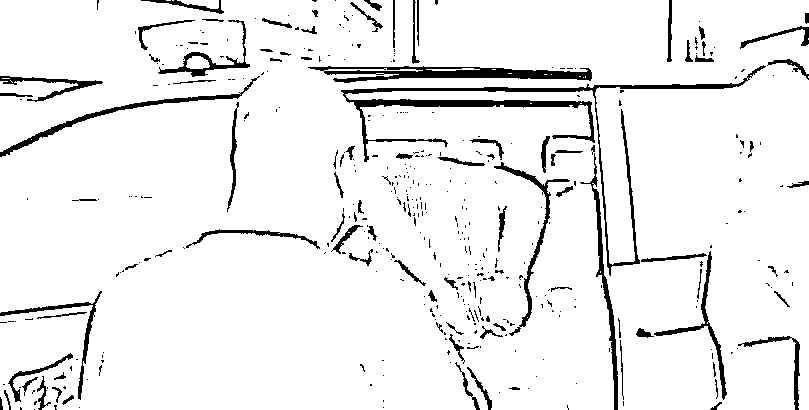
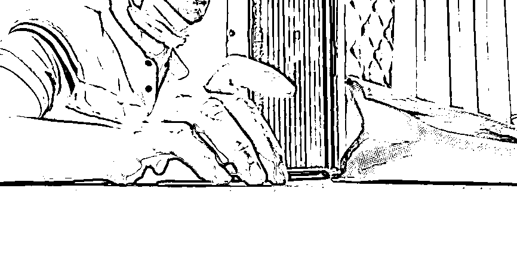
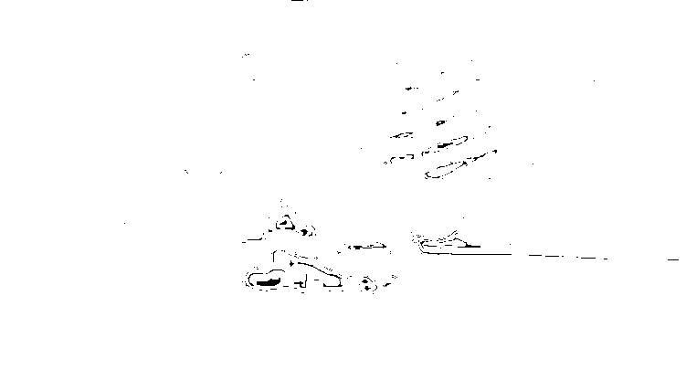

# 鉴藏品、画大饼、骗取鉴定费……21 个收藏品“套路鉴”团伙落网

> 原文：[`mp.weixin.qq.com/s?__biz=MzIyMDYwMTk0Mw==&mid=2247542562&idx=5&sn=a2c47b41dee41fc8033f35afdb182f62&chksm=97cbec1aa0bc650c2a85be0ed0f7cebbff7ac4b6c6df62ff24f580c77aea393927e730aff92e&scene=27#wechat_redirect`](http://mp.weixin.qq.com/s?__biz=MzIyMDYwMTk0Mw==&mid=2247542562&idx=5&sn=a2c47b41dee41fc8033f35afdb182f62&chksm=97cbec1aa0bc650c2a85be0ed0f7cebbff7ac4b6c6df62ff24f580c77aea393927e730aff92e&scene=27#wechat_redirect)

家中的普通收藏品瓷器，到“文物鉴定公司”一问，竟然价值上千万。**多家活跃于北京朝阳、丰台、大兴等区专门骗取事主鉴定费的团伙，被警方一网打尽。**8 月 18 日，北京警方向媒体通报此事，提醒市民防范类似骗局。

[`mp.weixin.qq.com/mp/readtemplate?t=pages/video_player_tmpl&action=mpvideo&auto=0&vid=wxv_2538626270356570112`](https://mp.weixin.qq.com/mp/readtemplate?t=pages/video_player_tmpl&action=mpvideo&auto=0&vid=wxv_2538626270356570112)

**打击**

****21 个“套路鉴”诈骗团伙被打掉****

******290 名嫌疑人落网******

******“您的藏品很‘开门’，一看就价值不菲……”李先生在网上发布了自己的藏品信息，想要卖掉变现，几天后便有一家收藏品鉴定公司通过微信与其联系。通过查看照片，该鉴定公司称，藏品是辽代三彩瓶，价值数千万元，公司可帮助其向博物馆出售，只要李先生将瓷器在此进行“专业”的鉴定确保为真品即可。******

******喜出望外的李先生立即按照工作人员的引导，交纳 2000 元鉴定费，并将瓷器邮寄至该公司鉴定，等待后续安排藏品出售事宜。不成想 5 天后，对方告诉李先生瓷器是假的，不能帮助出售，仅将瓷器寄还给李先生。李先生察觉自己被骗，第一时间向警方求助。******

******像李先生这样的遭遇并不罕见，近期，按照北京市公安局夏季治安打击整治“百日行动”整体部署，市局机动侦查总队紧盯群众身边发生的案件，**通过梳理 110 警情发现：今年以来，全市有多起与收藏品鉴定相关的报警记录。**对此，机动侦查总队高度重视，坚持“什么犯罪突出就重点打击什么犯罪”，立即成立工作专班，迅速开展侦查调查。******

************

******“套路鉴”诈骗团伙嫌疑人被警方抓获******

******北京市公安局机动侦查总队郭警官介绍，通过回访事主、暗访调查和警情分析等大量侦查工作，**警方逐步查清存在于朝阳、丰台、大兴等地的 21 个违法犯罪团伙，他们以注册成立的收藏品鉴定公司为掩护，实施“套路鉴”诈骗的违法犯罪事实，并固定了相关证据。********

******7 月中旬，北京市公安局机动侦查总队会同朝阳、丰台、大兴分局开展专项行动，对收藏品“套路鉴”诈骗犯罪行为进行集中打击，查抄涉案公司 21 家，依法刑事拘留涉案嫌疑人 290 名。******

********揭秘********

**********层层套路画大饼**********

************只为骗取事主鉴定费************

********据工作专班侦查员介绍，受骗事主多为全国各地的古玩爱好者，因急需用钱等情况变卖家中收藏品。很多事主缺乏鉴定、拍卖专业知识，成为主要被骗对象。**涉案公司以合法公司、手续完备等为掩护，对公司“业务员”进行统一培训，并提供话术，为实施诈骗创造条件。**另外，他们通过互联网平台发布商业广告，对外宣称可帮助事主拍卖、联系买家或是公司可直接收购收藏品。********

********“套路鉴”业务员使用话术劝说来访者参与“鉴定”********

********事主在与公司“业务员”互加微信并发送藏品图片后，“业务员”首先会表示该藏品很有市场，类似藏品已拍卖至几十万乃至几百万元。事主仅需要缴纳一定的费用对藏品进行鉴定，公司就会把藏品免费送拍，只从拍卖所得中抽成获利。且公司保证，若藏品鉴定价值高于五万元，鉴定费将退还给事主。********

********被“高回报”迷惑的事主往往不考虑鉴定费这些“小钱”，立即同意进行鉴定。然而，事主藏品经过“鉴定”后，得到的公司反馈结果多是藏品为赝品或价值仅几百元到几千元不等，达不到免费鉴定标准，公司按规定不予退还鉴定费。********

********侦查员介绍，这些涉案公司提供的鉴定结果具有很强的欺骗性。**公司通过网上购买假鉴定师资格证书，出具虚假鉴定报告，恶意压低藏品价格，其鉴定行为无任何相关依据，鉴定结果无任何公信力。**********

************

******被骗事主接受采访******

******案发后，事主多因公司搪塞合同正规而自认吃亏，或因公司退款而不再追究，少数事主因不认同鉴定结果以合同纠纷、经济纠纷等缘由报案，使得相关警情被认定为民事纠纷。**同时，涉案公司通常隐藏在古玩市场周边写字楼内，让普通收藏爱好者难以甄别。********

******此类案件涉案公司通过向事主虚构后期买家和拍卖服务、无视藏品真伪恶意夸大藏品价格，使事主对藏品价值造成错误认知，骗取事主鉴定费用，行为涉嫌诈骗犯罪。******

********延伸********

**********3 家“套路鉴”公司同一背景**********

**********老板承认“首创”这一套路**********

********朝阳公安分局探长李斌介绍，此次收藏品“套路鉴”诈骗犯罪活动集中打击行动中，朝阳分局共打掉涉案公司 13 家，其中臻谷（北京）文物鉴定公司、北京诚鉴文物鉴定有限公司、北京鼎正文物鉴定中心有限公司幕后老板均为盛某某，现已被分局依法刑事拘留。********

**********据盛某某供述，现全市实施新型“套路鉴”诈骗模式的公司其为‘首创’，其他涉案公司均系借鉴其非法经营模式。**吸引客户进行“套路鉴”的话术主要分为三个环节：第一个环节就是通过互联网获取客户信息，由公司“业务员”拉客户。第二个环节是“业务员”通过电话、微信联系客户后，抬高客户手中的藏品价值，让客户以为可以获取高额回报，引诱客户支付鉴定费进行鉴定。一旦支付，客户就已经上套。第三个环节是告知客户藏品为赝品或是藏品为真但恶意压价，以此不退鉴定费，并确保客户不在本公司进行交易。********

******涉案公司对“业务员”均进行了专门的话术培训，**就鉴定公司基本情况、地理位置、收费标准等问题，有详细的说明范本，给鉴定公司营造一个规模很大、非常正规的对外形象，骗取客户信任。********

******针对客户询问收藏品价值，其设置有详细的应答套路，话术中将藏品具体分为陶瓷类、钱币类、青铜类、字画类、玉器类等等，不管客户手中是什么类别的藏品，都有对应的话术进行应对，让客户误认为自己的藏品价值高昂，失去冷静理智的判断。关于鉴定费用收取的问题，则会以鉴定为正品就免费拍免费卖、鉴定价值超过 5 万元会退还鉴定费、收了鉴定费不收宣传费服务费、为确保交易正规鉴定必不可少等各种理由，让客户认为进行鉴定是收藏品交易中理所应当的一步，进而落入圈套，缴纳鉴定费用。******

******此次行动中打掉的北京古往今来文物商店有限公司、北京鼎盛君和文化有限公司、北京古泉文物公司、北京品古文物商店有限公司、北京三确艺术品平谷鉴定有限公司、赏古文物鉴定公司也均采取上述“套路鉴”模式进行诈骗。******

******诈骗套路实际上都是涉案公司对“业务员”培训后，制定话术对客户进行各种忽悠，让客户陷入错误认知，一是误认为自己的藏品真的有高昂价值，能获取高额的利益；二是误认为公司很有实力，值得信赖，从而达到诈骗客户钱财的目的。**案件受害者多为古玩爱好者，该群体有一定的积蓄，而且抱着通过收藏品捡漏并妄图一夜暴富的侥幸心理，犯罪嫌疑人也是抓住了这种侥幸心理，从而诈骗得手。********

********警方提示：**此类案件涉案公司通过向事主虚构后期买家和拍卖服务、无视藏品真伪恶意夸大藏品价格，使事主对藏品价值造成错误认知，骗取事主鉴定费用，行为涉嫌诈骗犯罪。在此提示市民朋友，收藏品买卖务必要冷静，切莫相信高价获利等虚假宣传，一旦发现被骗等情况，请第一时间报警。北京警方将会同相关部门持续打击此类犯罪行为，挤压违法犯罪空间，有力维护人民群众财产安全。******

******来源：北京政法******

************

******欢迎关注灰产圈社群服务号******

************

************