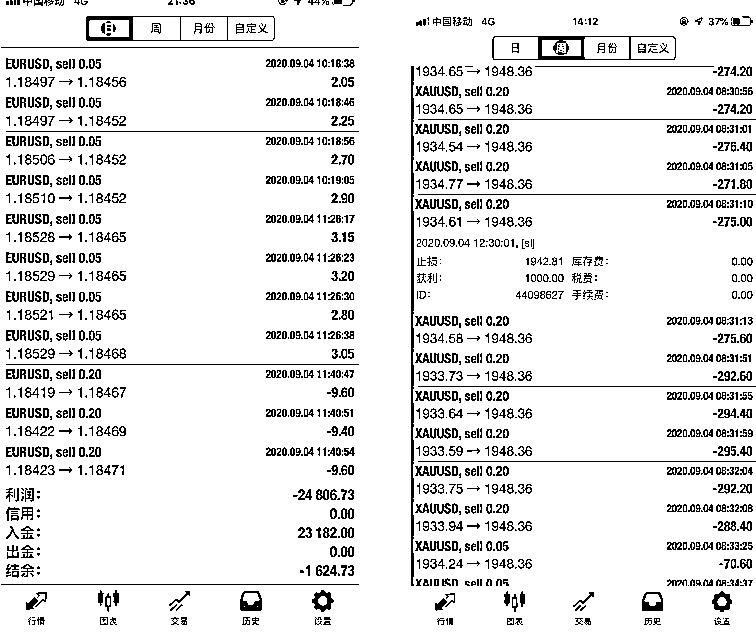

# 被美女骗 600 万后，平头哥肖主任含泪讲述“杀猪盘”经历

> 原文：[`mp.weixin.qq.com/s?__biz=MzIyMDYwMTk0Mw==&mid=2247542562&idx=7&sn=633909772be3d9d17fde56b4e5adc735&chksm=97cbec1aa0bc650ce163c99b2183461bf853fc8ceb51cc604f95f5ee076834b36b2401e097da&scene=27#wechat_redirect`](http://mp.weixin.qq.com/s?__biz=MzIyMDYwMTk0Mw==&mid=2247542562&idx=7&sn=633909772be3d9d17fde56b4e5adc735&chksm=97cbec1aa0bc650ce163c99b2183461bf853fc8ceb51cc604f95f5ee076834b36b2401e097da&scene=27#wechat_redirect)

## 

## 

“可以在你的头上练科目三吗”

“发型有点像我们小区的绿化带”

“打官司的时候，原告被告会不会笑出声啊”……

近期，肖主任凭借着独特的「**四方平头发型」**出圈了，采访他的媒体越来越多，同时被推上热议的，还有**他自称被美女诈骗 600 万的经历**。

△国邦法律服务肖主任平头发型

有网友评论：“有 600 万，说明有点本事，被骗 600 万，说明本事不多。”

大家好奇的点非常多，比如：**为什么留这个发型？600 万是怎么被骗的？为什么会被骗这么多？钱能追回吗？**

向少数人提问，解多数人之困。

我们多方联系找到了肖主任（原名肖洪飞），与他详细聊了聊这段被骗经历，获得了更多受骗细节，希望通过揭秘肖主任被骗 600 万的亲身遭遇提醒大家进一步加强投资风险意识和反诈意识。

## 01/

## 600 万是怎么被骗的？

肖主任称，此次被骗是受美女引诱陷入其精心编织的杀猪盘骗局。

### ▍“养猪”

2015 年，习惯晚睡的肖主任经常晚上 12 点钟下楼买宵夜吃，在上下电梯过程中经常遇到一位穿着性感的美女，肖主任主动出击，慢慢与美女熟识，经常约出去吃烧烤。一番了解下来，肖主任发现美女不仅人美，还很有商业头脑，经济独立。“当时我还是单身，她说自己也是**单身离异状态，并透露在广深一带有房产，身上的存款现金高达数千万**。”肖主任不由得对美女更加欣赏。“我就想着追求她，她后面也慢慢引诱我，**说这些钱都是她通过一些项目挣来的。**”

### ▍“引诱投资外汇平台”

没多久，美女给肖主任分享了自己赚钱的秘诀，并介绍了自己的表弟给他，此后美女退居幕后，留待表弟与肖主任联系。表弟给肖主任推荐了资金盘，说是一种**外汇保证金交易**，收益在短期内，能够达到股票收益的**几十倍甚至上百倍**。偶尔还拿出他表姐（美女）的收益到账的截图给肖主任看，截图显示一笔 500 万，另一笔也是 500 万，加起来就有**一千万**的收入到账。△诱导投资截图表弟是湖南人，这让作为湖南同乡的肖主任感到更加亲切，同时，肖主任看着可观的收益也动了心，信任了解后陆陆续续开始投钱进去。3 年之内，**小到几百几千，大到几万几十万**，肖主任都有尝试。表弟也对肖主任的事特别上心，什么时候行情好，最近又有什么国家哪个总理要选举，有什么利好消息都第一时间通知肖主任，提醒他抓住时机加大投资力度，甚至让肖主任煽动身边有闲散资金的朋友一起来投。肖主任心里对这个平台也怀疑过，投资期间上网查询过该平台和所属公司信息，发现确实存在。在投资的前 3 年里，资金进进出出，肖主任大概估计**约有几十万的投资收益**。因此之后的 2 年，肖主任一有钱，就会加大在该平台上的资金投入。

### ▍“肖主任怀疑，骗子安抚”

在 2019—2020 年的时候，随着自己部分生意的关停，肖主任基本上没有什么资金能够再投入到这个平台上了。这个时候，他隐约发现了网站的问题。“投资到达最顶峰的时候，明显的我能感觉到他们的交易软件经常会卡盘，要么就直接断线，而这种断线会长达半个小时甚至更久，越是行情波动大的时候，越无法交易，或者直接是断网状态，**这就导致我赚了钱了，想平仓，但平不了仓，服务器好了后又一直下跌，那我这个时候不得不止损离场**。”这么搞了几次后，肖主任发现这个问题大有可能是人为的，便找到表弟理论，表弟不承认是服务器或者是平台人为操纵的问题，但考虑到损失，会以「**老客户扶持资金」**的形式给予肖主任一定的赔偿。肖主任的不安情绪就这样被安抚下来，直到有一天接到一通上海警方打来的电话。据肖主任透露，上海警方联系到自己后问他是不是在某平台进行了大量投资，并表示该平台可能涉嫌诈骗.....

### ▍“肖主任清醒，骗子收网”

### 2020 年 7 月，适逢上海警方侦破了 4 起在境内从事非法外汇保证金交易的系列案件，案件新闻被多个媒体报导。△央视财经网报道肖主任上网搜寻发现这种骗局已经被央视曝光，骗局手法与自己投资的平台极为类似，不安之下马上了联系表弟。“他不承认，后面直接就闹翻了，我说我要去报警，你们赶紧把我投资的钱全部返回来给我......"**而这已经于事无补。**表弟把电话挂了，把肖主任的微信电话也拉黑了。

△肖主任被删除好友截图

肖主任又赶紧联系美女表姐，发现**美女表姐也把肖主任的微信电话拉黑了。**到这里，一切都已真相大白，肖主任如梦初醒。“我被骗了！而且我还不知道这些年到底被骗了多少钱，只知道钱进进出出起码有几百万砸在里面了......”肖主任随后报警，警方在 2020 年 10 月初立案调查。**肖主任说：“直到去银行打印流水的时候，我才知道我一共被骗了 600 万。”**△ 银行打印出来肖主任账号的流水单那一天，肖主任打印出来的银行流水，长到可以铺到银行门外。

## 02/

## 杀猪盘+资金盘，5 年被骗 600 万 

### ▍“杀猪盘+资金盘”骗局套路解析

每一个骗局的背后，都有一整个犯罪团伙在集体作案，步步下套。

一般来说，杀猪盘骗局的套路是这样的：诈骗分子通过伪造一个身份，与受害人谈恋爱，然后不经意间透露自己有一个好项目或者工作的常规需求等等，引诱对方把钱汇入博彩等投资网站，最后榨干受害人的钱。

**陷入爱情的盲目的人，被称之为「猪」。整个欺诈过程叫做杀猪，而这套骗术就叫做「杀猪盘」。**

不同于传统杀猪盘通过网恋嘘寒问暖培养感情，肖主任和这位美女是**线下认识**的，还是肖主任主动追的她，不过**诈骗手段却殊途同归**。在肖主任被骗事件中，他先是被美色引诱，相信了美女的单身人设，被美女摸清财务状况后，随即扔给表弟进行资金盘收割。据肖主任透露，现实中这个让他心动不已的单身离异美女，实际上婚姻美满，有老公有小孩。 表弟推荐的这个外汇交易平台，**服务器设置在境外**，据肖主任提供的信息，**交易性质比较多元化：**

## 第一种是托管，选择跟单的形式去同步他们所谓的可控账户、盈利的账户，这些账户赚了钱，选择托管的账户就会赚钱，比例 1 比 1 同步；第二种是指导下单，他们会拉一个群，把投资的客户全部拉到群里面去，当有交易机会的时候有老师就会在群里「喊单」，想要投资的人看到后自己去交易软件上下单；第三种是自由交易，适用于懂交易、有交易经验、也有时间看盘的人，他们可以自己独立在去平台上完成交易。

    △ 个别帐户交易记录而无论是这三种方式哪一种方式，都逃不过被割的命运。因为诈骗分子可以通过后台控制投资人的钱是盈利还是亏损。**“他们想让你亏，就可以让交易不成功产生滑单，让资金缩水；****他们想让你继续投，就能轻松营造上涨态势。****另外，他们还可以随意关闭权限，限制你转出资金。”**                △ 个别帐户交易记录 △帐户后台被关闭截图当然，诈骗团伙深谙长线主义，这样的操作一般不会轻易在前期出现，因为他们要吸引更多资金进来就必须要让进来的人先获利。所以在交易之初，一般会让受害人在平台交易中尝到甜头。肖主任后期复盘也发现：“他们是放长线钓大鱼，前三年资金进进出出让我盈利了大概小几十万，所以后期更加信任加大了投资。”等到受害人投入价值达到顶峰时，他们就收网跑路。那么，最开始让肖主任获利的钱从哪里来的呢？答案是，从后面新涌进平台的人身上来的。这就是著名的**「庞氏骗局」**——项目本身并不获利，**只不过是用新一轮投资者的钱，来支付上一轮投资者的利息****，**从而刺激更多人投钱，投更多的钱，当新一轮投资的钱无法支付利息的时候，诈骗分子卷钱跑路。

## 03/

被骗后的生活

2020 年，被骗之后，肖主任满脑子想的都是怎么把钱追回来。他想请律师专门跟进处理自己被诈骗 600 多万的案子，但听到律师费用需要几十万之后，身无分文的肖主任决定自学法律知识维权，他去到一家律师事务所从事相关法律服务的事情。也因自己案件需要经常出入公检法机关，肖主任发现自己大背头的发型不太招人待见，就产生了一个想改变形象的念头，并创意地想到要剪个凸显体现公平公正的发型。发型引起很多网友关注的同时，也带来了媒体对他经历的关注。肖主任觉得媒体的报道在一定程度上是对他的认可，让他的维权之路更有信心，不管以何种方式让更多人关注，**多一个人知道此种骗局的存在，就少了一种被坑骗的可能，**是一件善事。

## 04/

作为五年被骗 600 万的亲历者，可否给公众一些识别杀猪盘/资金盘诈骗的建议？ **投资不要冲动，****千万不要相信什么投资高收益，一切的高收益都写在刑法里了****。**学法律后我才知道外汇这些东西在国内属于非法经营，属于我们国家明令禁止的。真要投资的话一定要选择合法合规且在自己认知范围内的项目，慎重考察，不要 All in ，拿一小部分资金去尝试一下，这样哪怕这笔资金短时间回不来，哪怕亏损，也不至于影响生活。另外提醒广大网友**，****不要轻信他人**，不管是网络上认识的人还是现实中认识的，真有那么赚钱的事情人家为什么拉你做呢，多多换角度思考一下。

* * *

## 写在最后：

以上，就是我们采访肖主任的全部内容。自创号以来，我们一直非常重视反诈宣传，诈骗手段层出不穷、花样百出，波及范围广，受害者众多，所以我们希望大力的反诈宣传能从源头上降低受害频率。这几年，时不时地就会有一些过于奇葩或者金额较大的诈骗案例冲上热搜。我们看到有些受害者背上了巨额债款，无法回到正常的生活；有的世界观从此崩塌，性情大变不再信任他人；甚至有一些受害者，由于无法接受事实，最终选择结束生命……尤其在“杀猪盘”这样的情感类诈骗中，骗局戳穿后，往往对受害人会造成人财两空的双重打击。诈骗在我们身边，离每个人都很近，希望此次肖主任的事件能够提醒到大家，增强风险防范意识。反诈之路任重道远，我们也希望，**有更多人参与进来，更多人点亮反诈心智，成为一个个照亮黑暗的火炬。**

欢迎关注灰产圈社群服务号

