# 湾湾网红被骗柬埔寨 7 天遭性侵 9 次，被大陆救出后竟先宣扬“台独”

> 原文：[`mp.weixin.qq.com/s?__biz=MzIyMDYwMTk0Mw==&mid=2247542624&idx=3&sn=d210657a4f58ec42531912f50ff29e1b&chksm=97cbec58a0bc654ed86404a21a490e929c12502db2794930acc1090eca8de5d65cea1bc27cec&scene=27#wechat_redirect`](http://mp.weixin.qq.com/s?__biz=MzIyMDYwMTk0Mw==&mid=2247542624&idx=3&sn=d210657a4f58ec42531912f50ff29e1b&chksm=97cbec58a0bc654ed86404a21a490e929c12502db2794930acc1090eca8de5d65cea1bc27cec&scene=27#wechat_redirect)

近日，**台湾人被高薪工作诱惑到柬埔寨诈骗的事迹频传**，且不止柬埔寨，包括老挝、泰国、缅甸、迪拜等国家案例都开始爆出，引起各界关注。尤其下面条引发很大关注的新闻事件，是台岛上除了解放军封岛式实弹演训之外最大的新闻事件。
这个新闻事件，是有一名 24 岁的台女，被诈骗分子骗到了柬埔寨，然后给卖了，还转卖了好多次，期间并遭受性侵。这个台女网名为“皮皮 NGO 顾问”（名字很不一般哦），我们简称她是皮皮吧。这个皮皮呢，在得救返回台岛之后，还愉快的上了台岛的电视节目，对自己的遭遇侃侃而谈。 原来皮皮是个“色情业者”，按我们大陆人的话，是个做皮肉生意的，即是个娼妓。 她高职毕业后没什么工作，在 21 岁时就变成了单身妈妈，独自抚养一个女儿，还有还不完的外债，于是就走上了娼妓之路。 可是目前台岛上疫情挺严重的，她卖皮肉的生意也不好做，算是入不敷出吧。这时呢，她就认识了一个台岛上的经济人“洛洛”。这个经济人就邀请她到柬埔寨去做皮肉生意，说给让她在酒店驻场工作，保证她安全赚钱，还不会扣护照，也不会签约（指卖身协议）。为了让皮皮相信， “洛洛”还给她发来了大陆富二代的照片当证据，声称都已经给她安排好了，大陆富二代的素质都很高，还声称有人出 2.5 万美元包养她。最后，按这个皮皮的，是她找机会上社交网站上发帖子求救，才被救出来，逃回台湾的。 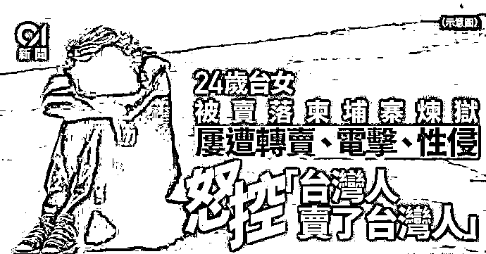
在台岛的电视节目上，这个被诈骗、虐待、性侵的 24 岁台女，怒控“台湾人卖了台湾人”。那么，这就是全部的真相么？ 远不是，后面的故事更精彩。 据知名博主“小凡好摄”近日的帖子，有粉丝告诉他，这个台女皮皮，其实救他的是在柬埔寨的大陆人。结果这个皮皮在被救出送上飞机后，别说感谢了，还立即搞上 TD 了。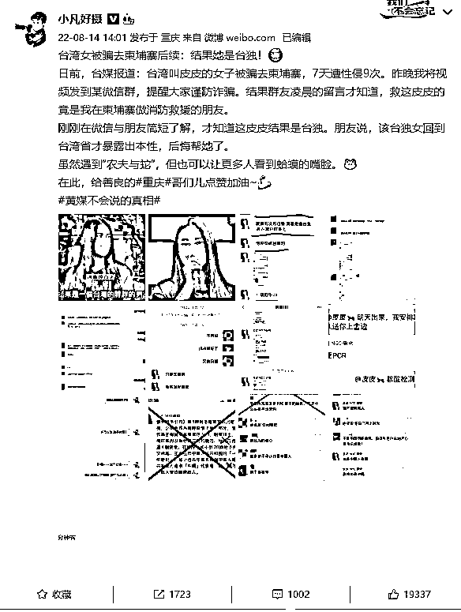博主还贴出了粉丝举报的聊天记录。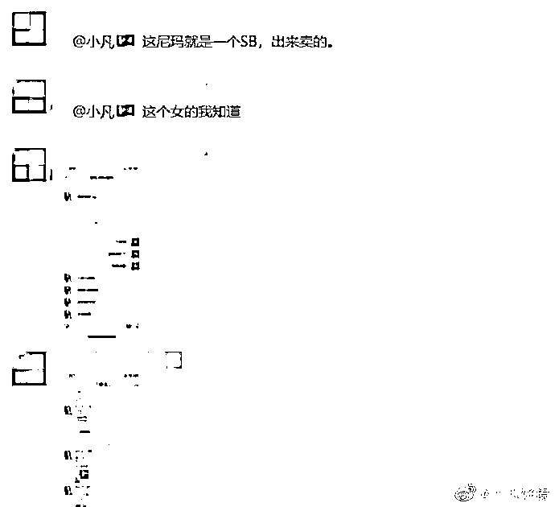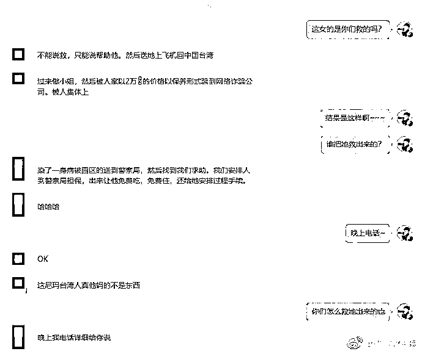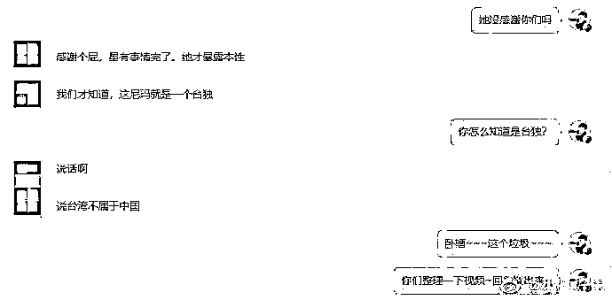还有皮皮接受在柬埔寨大陆人帮助时的聊天记录截屏。比如她发出救助信息时的聊天记录截图 。 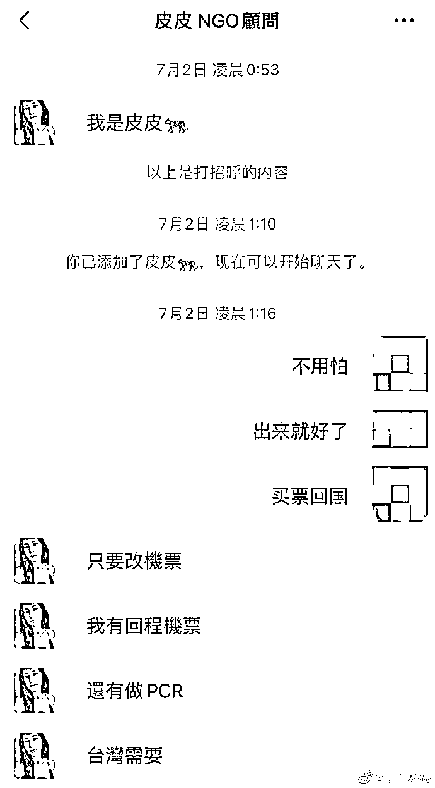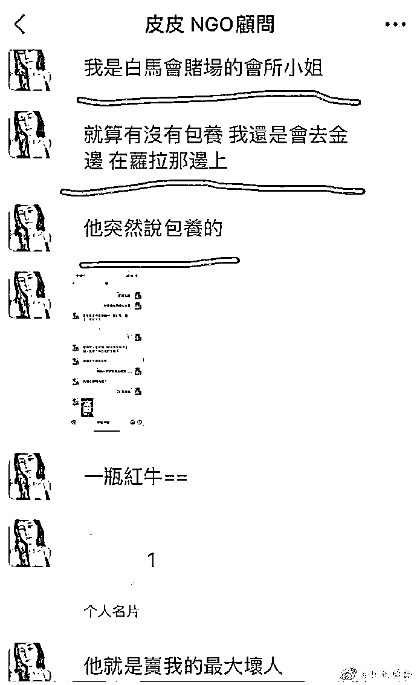还有被救出之后，立即对救她的大陆人散布“台独”言论。 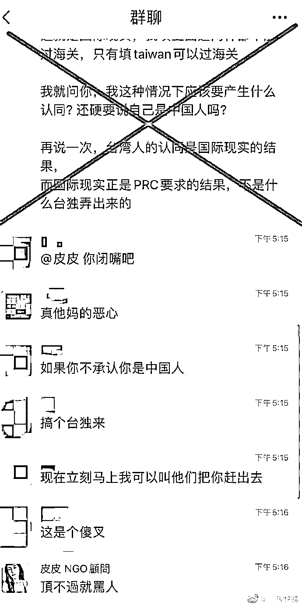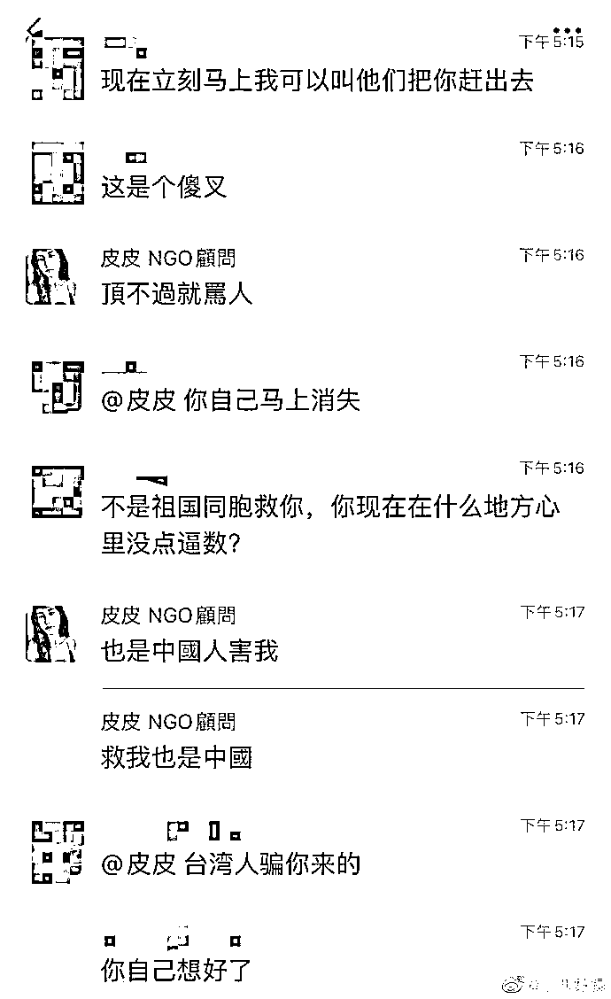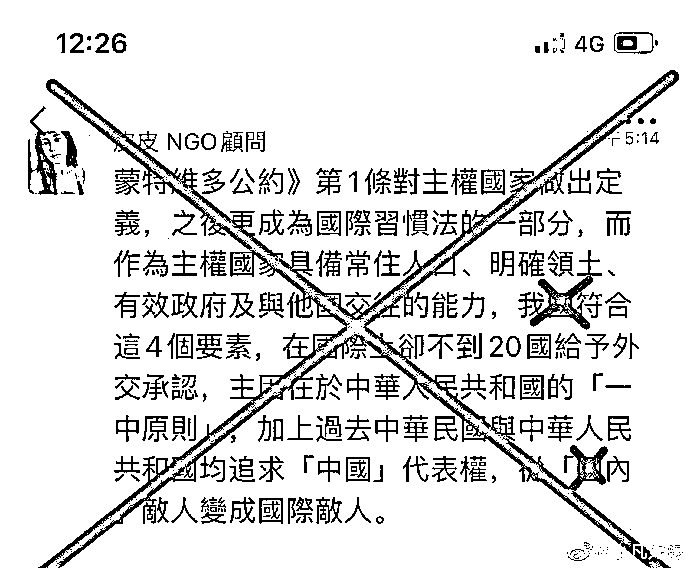难怪这些大陆会说以后再也不救台湾人了。 据台岛自己的统计，目前有超过 5000 名岛民被骗到了柬埔寨搞电信诈骗犯罪，均遭受着囚禁和虐待。而这个被骗到柬埔寨的台湾人，一发现被骗或者一有机会 ，就会冲到我中国大陆驻柬埔寨大使馆内求救。 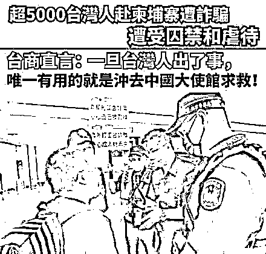因为这是台湾人唯一能得到救助的方式。然而，就**有一名台湾省的 IG 网红因为接外拍工作被卖到柬埔寨去，接着就是一连串的「地狱般处境」，反诈骗组织也感叹透露「**其实都知道她在哪，但我们已经去不了了」所幸该名网红最后在七月底时被救出，但过程可以说是相当艰辛。全球反诈骗组织成员 SAMMY 日前上节目时表示，一位台湾的网红以为单纯只是接到海外的外拍工作，没想到一过去就遭到软禁，对方也是不客气地使用暴力直接拿走她的护照，短时间内不只被转卖好几次，**甚至在短短一星期内就被侵犯身体高达 9 次，直到她全身是血了才暂停性侵。**之后甚至**被强拍裸照，诈骗集团给该位网红两条路走，第一条就是做诈骗，第二条就是去做性交易，如果不愿意配合的话就电击、踹头等等，整个过程可以完全惨不忍睹**。而该网美有透过 IG 向 YouTuber「好棒 Bump」求救，GASO 接到通知后也欲立即展开行动，无奈当地警方不配合。SAMMY 表示，且园区内都有武装保全，其实随意进入也等于只是「进去送头」，这让 SAMMY 也无奈的说「当时其实我们都知道她在哪里，但我们不能去了」所幸后来经过多方协助，由上面长官派军警才把人救出，该名网红于 7 月底平安返回台湾。而事实上，近日海外诈骗事件频传，案例也不断增加，反诈骗组织也在脸书多次呼吁「**各位民众现阶段只要记住一个原则就够，那就是不管什么工作机会，只要在缅甸、泰国、柬埔寨、老挝、迪拜，不要去就对了！救出来的人远比受困的人少，预防胜于治疗！**」对于频传台湾省民众被高薪诱骗到柬埔寨，落地后惨沦“猪仔”被囚禁、凌虐甚至性侵，警方为此在机场加派人力劝阻。
对此，前**“最胸国文老师”F 奶网红 Q 塔（Queenta）表示，她近日看到许多人在说不要检讨受害者，但去柬浦寨的人“是自己贪又笨，愿者上钩，我没那么大爱，执意要去的人就当作达尔文进化论，不要妨碍天择。”**Q 塔表示，希望大家不要无限上纲“不要检讨受害者”这句话，这句话通常用在女生穿得少被检讨，因为女生穿得少不是你犯罪的理由，但去柬埔寨的人是自己贪又笨，可以说是愿者上钩，不依循正轨赚钱，也不掂掂自己几斤几两重，因为个人的愚笨，而造成家人和社会的负担，被拖累的人才是真正的受害者！**Q 塔认为，在机场苦劝年轻人的警察，才让人感到他们真的辛苦。**网友看完纷纷留言：“不听警察苦劝的真不值得同情…”“Q 塔真的是一针见血！”**“结果进化的都是诈骗集团…”**“有些是被朋友骗去，这我还会同情…”“没错，一个成年人连这么基本的东西都不会判断，加上自己贪，凭什么要全世界人都要同情你们，请为自己的言行负责，别好像都别人欠你们一样。”**泰台联手救下赴柬埔寨诈骗受害者，还有人不愿被救，坚持返柬。**民众至柬埔寨打工遭诈骗被囚案频传，台湾省驻泰代表处今天接获泰国政府通报，有 12 名中国台湾籍民众自柬埔寨入境泰国曼谷，其中有 3 名是在向警察机关报案遭人口贩运的被害人，刑事局立即透过外事管理部门协请泰国政府跨国救援，晚上接回 9 人，另有 3 人不愿返台，表达想回柬国金边，警方怀疑是人蛇集团成员。 

[`mp.weixin.qq.com/mp/readtemplate?t=pages/video_player_tmpl&action=mpvideo&auto=0&vid=wxv_2532608317907517442`](https://mp.weixin.qq.com/mp/readtemplate?t=pages/video_player_tmpl&action=mpvideo&auto=0&vid=wxv_2532608317907517442)

经调查后，12 人中初步人口贩运鉴定被害人有 9 名（6 男 3 女）。泰国政府与驻泰代表处随即启动急难救助及人口贩运被害人保护机制，安排 9 人返台，9 名初步人口贩运鉴定被害人于晚间 10 时搭乘中华航空 CI-836 班机抵达桃园国际机场。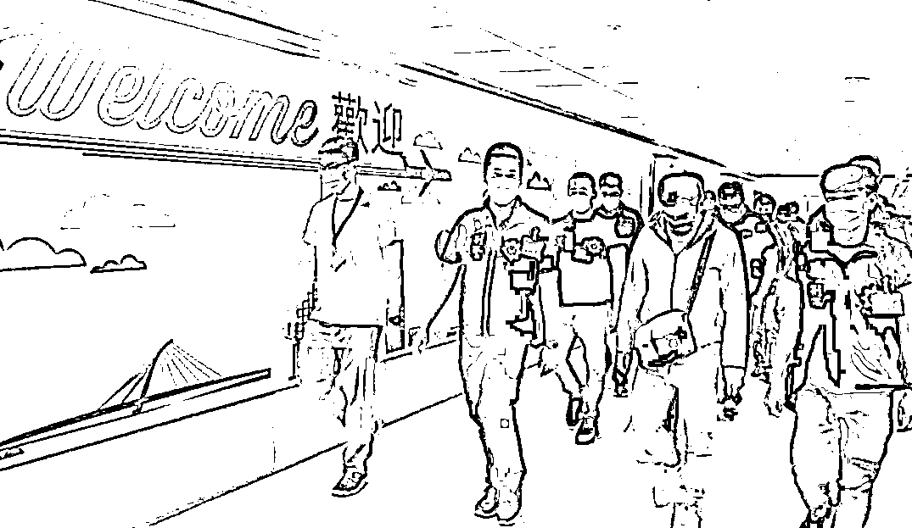刑事局表示，国际科接获通报后，初步**了解 12 人上月飞往柬埔寨，其中 3 人曾报案或求助，这批人被转卖缅甸，途中经泰国被拦下。**刑事局派员赴桃园机场准备接回 9 人，将带往航空警察局刑警大队侦询后，请示桃园地检署处置；**另 3 人不愿返台，表达想回柬国金边，警方怀疑是人蛇集团成员。** 结尾说几句小编自己的感悟，因为很多人都是自愿来到柬埔寨做诈骗，我们也帮助了不少求助的人，不管是哪里人，我们都会提供人道主义帮助，包括一些客死他乡的同胞，我们也会尽到临终关怀。 
8 月 6 日全球反诈骗组织 GASO 无预警宣布，即日起，将拒绝救援前往柬埔寨的中国台湾人及马来西亚人，原因曝光也让网友们纷纷留言力挺，感谢。 
GASO 宣布的链接，**都是“白眼狼”！全球反诈骗组织痛诉：再也不救中国台湾人，救 60 人没有一声感谢**
我们上个月也救助了一位台湾女同胞，没想到却上演了一场“农夫与蛇”，该女子的做法让柬埔寨帮助过她的爱心同胞愤慨不已，但是，这个事件确实就是个案，请大家也不必放在心上，因为人跟人不同，有的人是白眼狼，帮助了却不懂感恩，而有的极个别的人，为了自己一己私利还去抹黑攻击帮助过她的人，这样的人，比蛇蝎更毒，我们不会去回应，因为对于蛇蝎一类的人，她不配得到任何回应，公道自在人心，这几天增加了很多台湾省粉丝，她们都纷纷留言支持，再此，我们表示感谢，谢谢这些台湾粉丝的大力支持，谢谢。
**有台湾省粉丝私信问道，以后 你们还会帮助台湾省求助的受害人吗？**我们的回答，是的，还会帮助

但是也会严格考核，如果是从事正当行业的被骗来的受害人，如果确实值得帮助的人，我们依旧还给提供必要的帮助，但是对于那种忘恩负义的，主动来做诈骗的，来卖淫求包养的，对于这种白眼狼，就远离吧。

来源：大 R 说安全

欢迎关注灰产圈社群服务号

