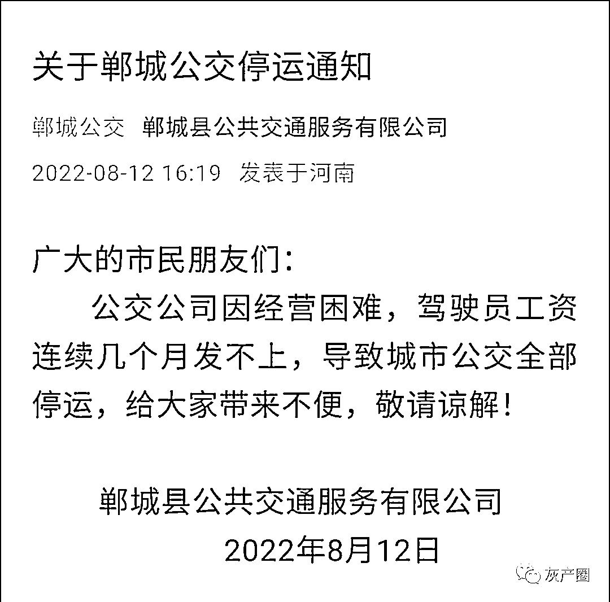

# 查了下这个公交公司的底细，难怪公交会停运

> 原文：[`mp.weixin.qq.com/s?__biz=MzIyMDYwMTk0Mw==&mid=2247542624&idx=4&sn=c9cc62c30755bef8d4dde6a2865d954b&chksm=97cbec58a0bc654ec062d6d457955cce2a5a810c23b5b24a7fa8545cdebf5a42cb3ef78d388a&scene=27#wechat_redirect`](http://mp.weixin.qq.com/s?__biz=MzIyMDYwMTk0Mw==&mid=2247542624&idx=4&sn=c9cc62c30755bef8d4dde6a2865d954b&chksm=97cbec58a0bc654ec062d6d457955cce2a5a810c23b5b24a7fa8545cdebf5a42cb3ef78d388a&scene=27#wechat_redirect)

8 月 12 日，河南周口市郸城县公交公司在官方微信公众号发布通告称，因经营困难，导致城市公交全部停运。

根据微信公众号的实名认证信息，查到了认证主体：郸城县公共交通服务有限公司，统一社会信用代码为：91411625749236269R。

根据统一社会信用代码在爱企查上乍一看， 该公交公司属于小微企业，成立于 1998 年 4 月，注册资本 100 万，股东俩人巴卫东和刘洪梅分别持股 60%和 40%，彻彻底底的民营。

而继续查看了变更记录，就在 2022 年 8 月初，集中变更了多项：

*   巴卫东独资变为加入了刘洪梅

*   法定代表人由巴卫东变为了刘洪梅

*   自然人独资变为自然人投资控股

*   **注册资本由 5000 万降至 100 万（下降了 98%）** 

这里多提一句，自然人独资变为自然人投资控股，绝不是表面上仅仅增加了一个人而已，而是以此规避了对公司债务承担连带责任。参见《中华人民共和国公司法》第六十三条：“ 【一人公司的债务承担】一人有限责任公司的股东不能证明公司财产独立于股东自己的财产的，应当对公司债务承担连带责任。”

在 boss 直聘上还能看到原先的工商信息，没有更新。 

此外，从爱企查上还查到了该公交公司与当地一广告公司的广告合同纠纷判决。该公交公司让广告公司做个广告后非但想“白嫖”，还想反诉广告公司，好在河南当地法院法官英明神武，判决公交公司败诉。

可叹，熟悉的操作，老赖们逃债都是这种惯用伎俩，换法人、降注册资本、独资变控股、择机停业。

众所周知，公共交通是满足人民群众基本出行需求的社会公益性事业，与人民群众生产生活息息相关，是政府应当提供的基本公共服务和重大民生工程。结果在河南周口市郸城县，却交给了一家如此不靠谱的民营企业长达 20 余年。 

在郸城县人民政府官网以“公共交通”为关键词搜索，还搜到了《交通运输部发布城市公共汽车和电车客运管理规定》。 

其中第一条便是：为规范城市公共汽车和电车客运活动，保障运营安全，提高服务质量，促进城市公共汽车和电车客运事业健康有序发展，依据《国务院关于城市优先发展公共交通的指导意见》（国发〔2012〕64 号），制定本规定。

“优先发展公共交通”，就这么发展？发展成这样，谁的责任？

郸城县每年在公交上投入多少？发给公交司机的工资奖金占比又是多少？ 

不能因为舆论压力暂时恢复了，就算过去了，否则还是埋着一颗雷。

来源：实测

欢迎关注灰产圈社群服务号

