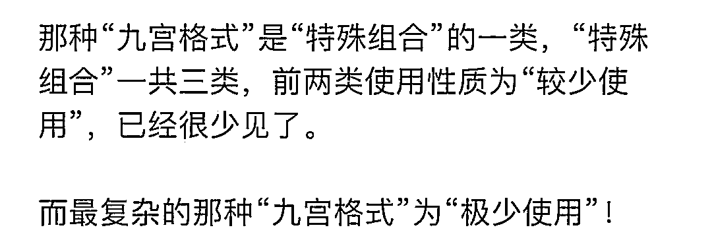

# 新国标红绿灯被骂出翔，设计者十分钟被喷到下播！但好像是带节奏了…

> 原文：[`mp.weixin.qq.com/s?__biz=MzIyMDYwMTk0Mw==&mid=2247542624&idx=6&sn=d9a3e79d7df75e705709a3f0c965fb7d&chksm=97cbec58a0bc654ea49c7c5e5587ba0c327814d2333502a6c7861a79cf957bab17113fb2cda0&scene=27#wechat_redirect`](http://mp.weixin.qq.com/s?__biz=MzIyMDYwMTk0Mw==&mid=2247542624&idx=6&sn=d9a3e79d7df75e705709a3f0c965fb7d&chksm=97cbec58a0bc654ea49c7c5e5587ba0c327814d2333502a6c7861a79cf957bab17113fb2cda0&scene=27#wechat_redirect)

最近，大家忽然发现 

全国各地开始慢慢调试起

**新版的红绿灯**

****就问有多少人第一眼就看懂了？？****

****************

****上了热搜的红绿灯****

****就是下图所示这个“九宫格”****

****不少网友吐槽过于复杂****

********

********

****真的很难看懂啊？？？？****

****特别容易造成误闯红灯的行为****

********

****感觉在红绿灯面前迷失了自己**** 

****到底是直行还是啥****

****为啥亮了 3 个灯？？****

****能让全国网友异口同声骂的事不容易遇到一件…****

********

******乍一看，真的分不清啊…******

****因为关系到行车安全和记分****

****所以大家都很关心了****

****************

****网络上大家的评价也是“一边倒”****

****点赞最高的一条留言是****

******吃饱了撑的，简单的东西复杂化******

****************

****新版红绿灯的设计者孙正良****

****昨天被人冒用身份开了直播****

****冒用者跟大家详细解读一下****

****新版红绿灯的规则****

********

****结果冒用孙正良身份者直播不到 10 分钟****

****就被网友们**“喷”**下播了。。。****

********

****这个新版红绿灯为什么惹众怒呢？****

********

****因为就连驾驶水平水平和熟练度****

****远高于一般人的运营车辆司机****

****都要打印个图表了，一般人咋办？****

********

****况且这种东西就是要快速做出反应的**** 

****等查看半天图表不得浪费很长时间****

****感觉交通只会更拥堵吧…笑哭了****

******一眼望去，都是灯******

************

******各地的司机也是各种懵逼******

******右转灯熄灭，是灯坏了吗？******

******那我到底能不能右转？******

******这一犹豫不知道该怎么走******

******后面车就开始狂按喇叭******

************

******而且红绿灯没有读秒倒计时很不便啊******

******特别是那些大型的十字路口******

******以前 120 秒倒计时，等多久大家心里有底******

******现在倒好，如果取消读秒倒计时******

******大家到时候就像盲猜一样，抓瞎？******

************

********新版红绿灯规则一览********

****撇开网上的议论，我们来看一下****

****新国标红绿灯的具体内容吧****

********

****新版红绿灯采用了九宫格的形式****

****九个灯，八种组合，内涵丰富，具体如下：****

******第一种：只有直行是红灯，左转和右转箭头灯都不亮，表示只允许右转******

****很多老司机在这种组合信号灯面前最容易中招，会以为可以左转。****

********

******第二种：左右两边无，中间亮绿灯表示三个方向均可通行******

******这个也会导致左转的司机很懵逼。。。******

************

********第三种：三列全红，所有通道禁止通行********

****这个最好理解，也最好记。****

********

******第四种：左右两边亮红灯，中间亮绿灯，表示只允许直行******

****这个也很直观，不容易弄错。**** 

********

******第五种：左边亮绿灯，中间和右边亮红灯，表示只允许左转******

******这个同样很好理解啦！******

************

********第六种：左边、中间亮红灯，右边无灯，表示只允许右转********

******记住右转无灯是允许转弯的。******

************

********第七种：左边亮红灯，中间亮绿灯，右边无灯，表示可直行、可右转，禁止左转。********

****这个需要记住右边没亮灯是可以行驶的。****

********

******第八种：左边无灯，中间亮绿灯，右边亮红灯，表示可左转、可直行，但禁止右转******

******不见右红可转，见右红绝对不能转，懵逼的是，左转信号时亮时不亮，还得看直行的嘴脸行事，这就很懵了。******

************

******而黄灯也有了明确定义******

******这大概是新红绿灯最好评的地方******

********黄灯亮起的瞬间********

********看车辆的前轮是否已经过停车线********

************

******一条条看下来真的觉得******

******新版的红绿灯跟老版******

******比起来真的 **复 杂 很 多********

********

****但困难也是可以总结规律的****

****下面三张图就比较容易理解一点****

****向上滑动阅览****

******1.直行车道，只要绿灯亮就可以行驶，反之则不能行驶******

************

********2.左转绿灯亮起的时候，或者左转没有灯且中间绿灯亮起的时候，左转车辆可以行驶，反之不能行驶。********

************

********3.右转车辆除了红灯时不能行驶，其他时刻皆可。********

************

******这张图建议车主们收藏一哈****** 

************

********怎么又辟谣了？********

****但随后我们又看到了微博辟谣****

****说新版红绿灯挨骂****

****都是因为有各路 yxh 带节奏****

********

****先行的信号灯已经实行了六年了****

****而信号灯的排布从 2006 年开始****

****没有明显的变化****

****************

****所谓的取消计时****

****也是编造出来的假消息****

********

****总结一下就是这个“九宫格红绿灯”****

****不是什么新的，也不是取代所有的红绿灯****

******它只是一种补充形式******

********而且只在较少情况下使用********

************

******更没有什么要全国更换******

******“新国标红绿灯”的通知…******

******好家伙啊******

************

******至于那些看起来令人迷惑的图片******

******也是营销号为了博眼球******

******贴出的红绿灯故障图******

************

******并且复杂的九宫格版红绿灯******

******只是新国标中补充的一版******

******而这种红绿灯极少使用******

************

******尽管极少使用，但还是有可能遇到******

******经过这一波对**新国标红绿灯的科普******** 

****大家以后遇到也减少了****

****一脸懵停在马路上不敢走的可能了****

********

****所以说不管怎么样****

****某种意义上这波争议是好事****

****希望大家都能出行顺利，一路平安**** 

************来源：不惑先生，魔都囡************

****欢迎关注灰产圈社群服务号****

********

********