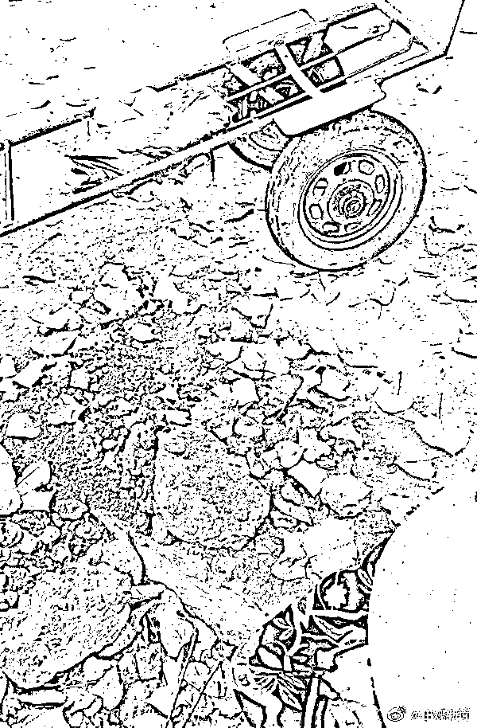

# 女子投资百万种南瓜，遭老人组团偷窃，“被抓就以死相威胁”...当地多部门回应

> 原文：[`mp.weixin.qq.com/s?__biz=MzIyMDYwMTk0Mw==&mid=2247542677&idx=3&sn=914b837ca44cae88a559f0c79b0fbcd8&chksm=97cbecada0bc65bb58b5f77bc75d5eefa909426248a18db7b813e445b972d8b3c419608fbf03&scene=27#wechat_redirect`](http://mp.weixin.qq.com/s?__biz=MzIyMDYwMTk0Mw==&mid=2247542677&idx=3&sn=914b837ca44cae88a559f0c79b0fbcd8&chksm=97cbecada0bc65bb58b5f77bc75d5eefa909426248a18db7b813e445b972d8b3c419608fbf03&scene=27#wechat_redirect)

近日，湖北武汉，女子投资百万元种千亩南瓜遭村民频繁偷窃引发关注。当事人余女士称，偷南瓜的多为老人，他们拿蛇皮袋装瓜，**被抓后还称身体有病装可怜**。8 月 22 日，余女士再发视频称，在与村委协商期间，又有村民将地里的南瓜砍烂。

23 日，新洲区潘塘街办工作人员告诉红星新闻记者，已派人去地里监管，有关部门正在处理，“（在村里）宣传一下，让别人不要去偷。”

24 日上午，新洲区潘塘派出所工作人员向正观新闻记者表示，“**这件事我们和政府部门都正在依法处理中**。”

[`v.qq.com/iframe/preview.html?width=500&height=375&auto=0&vid=s3352uqcqxf`](https://v.qq.com/iframe/preview.html?width=500&height=375&auto=0&vid=s3352uqcqxf)

**女子投百万元种千亩南瓜**

**被附近老人组团偷窃** 

8 月 20 日 20 时许，一则短视频在网络上发布，画面中，民警指着地上，询问一个老汉：“这是不是你偷的？”听到这话，老汉一个劲儿摇头。

即便地上已经散落着几个大小不一的南瓜和编织袋，老汉仍不服气，拒绝配合民警工作。一旁的视频拍摄者余女士气愤地说：“你看，每个来偷瓜的人都道德绑架我，**明明是自己来偷东西的，仗着年龄大**……”余女士表示，她没有一点办法，这些人被抓到了就以死相威胁。

当日 23 时许，余女士更新了后续，她站在公安局门口，一边流泪，一边倾诉自己的无奈，“我每天早上天没亮就起来守瓜，我们这边婆婆爹爹不懂法，法律也制裁不了他们，（因为他们）年龄大。”余女士表示，**自己是“95 后”，还在创业阶段，为承包这千亩瓜田投资了一百多万，目前还欠着 60 多万的银行贷款**。因为偷瓜的事，每天一睁眼就要跟警方打交道。 

此后，余女士先后发布了一系列视频，记录前来偷瓜的老人。这些老人有徒手抱的、拿麻袋装的、用板车拖的，但都有个共同点——在被抓到后，**会自称有高血压或心脏病，或者以死相威胁**。她对此束手无策，“设围栏根本不实际，我估计再投资 100 多万就只够设围栏，还不一定能够装下去。”

**余女士：当地派人调解后**

**南瓜又被老人砍烂**

无奈之下，余女士雇佣了工人去摘南瓜，她表示，如果不这样做，这些瓜迟早会被当地的老人偷完。22 日晚，余女士发视频称，当日市政府派人过来调解，并磋商解决方案，**本以为老人会有所收敛，没想到在村委会协商期间，老人又组团将地里的南瓜砍烂**。

至于网友建议的装监控、开直播抓偷窃者等办法，余女士觉得因为种植面积过大无法实施。“今年旱灾又减产，已经没有资金去投入了。”

在接受时间视频采访时，事发地所在的熊店村村书记回应称，已提醒承包商树立警示牌，村委也可以配合处理，“如果瓜再被偷可报案报警，村民偷南瓜是不对的”。

23 日下午，正观新闻记者致电熊店村所在地潘塘街道和武汉市新洲区区委宣传部，工作人员称，该事件正在处理当中，但并未透露具体进度和细节。

24 日上午，记者联系到熊店村一位村民，在被询问到此事是否因个人矛盾或土地纠纷而起时，村民称：“没有个人矛盾和土地纠纷，**是附近老人去拿她的瓜拿多了点，然后被她发出去曝光**。”

同日，潘塘派出所工作人员向记者表示：“这件事我们和政府部门都正在依法处理中。”

**有关高龄盗窃**

**法律是如何规定的？**

那么，对于高龄盗窃者，法律是怎么规定的？

北京市华鹏律师事务所的高级合伙人律师刘春城称，法律中确实存在对高龄老人的保护条款，例如《中华人民共和国治安管理处罚法》（2012 年修正本）中第二十一条，若违反治安管理行为人年龄达七十周岁以上，依照该法应当给予行政拘留处罚的，不执行行政拘留处罚。

但是，如果盗窃价值 2000 元以上（各地可能金额有出入）或者二年内盗窃三次以上的，应当认定为“多次盗窃”，多次盗窃不论总金额，根据《刑法》第二百六十四条的规定，一样可以构成盗窃罪，追究刑事责任。当然在判决时因为年龄原因，特别是 75 周岁以上的，根据《刑法》第十七条之一：“已满七十五周岁的人故意犯罪的，可以从轻或者减轻处罚；过失犯罪的，应当从轻或者减轻处罚。”

“对于高龄老人犯罪，很有可能不予起诉或者判处缓刑，但是会留有案底，影响其儿孙辈参军、参公。”刘春城表示。 

来源:每日经济新闻，北京青年报，正观新闻，红星新闻

欢迎关注灰产圈社群服务号

