# 将「粉丝」升级为「信徒」，红三代为何堕落成诈骗犯？

> 原文：[`mp.weixin.qq.com/s?__biz=MzIyMDYwMTk0Mw==&mid=2247542677&idx=4&sn=18bc6dd24859170fdd746f0fa0832ad8&chksm=97cbecada0bc65bbd6c3e5c9351e2fb69ea23a1304dd1fda1c543c004fbb74b5bf5d42d65010&scene=27#wechat_redirect`](http://mp.weixin.qq.com/s?__biz=MzIyMDYwMTk0Mw==&mid=2247542677&idx=4&sn=18bc6dd24859170fdd746f0fa0832ad8&chksm=97cbecada0bc65bbd6c3e5c9351e2fb69ea23a1304dd1fda1c543c004fbb74b5bf5d42d65010&scene=27#wechat_redirect)

在美版知乎 Quora 上有一个有意思的提问，有人问“世界上最大的骗局是什么？”

底下一位用户声嘶力竭地回答道： 

宗教。 

宗教。 

**宗教！！** 

**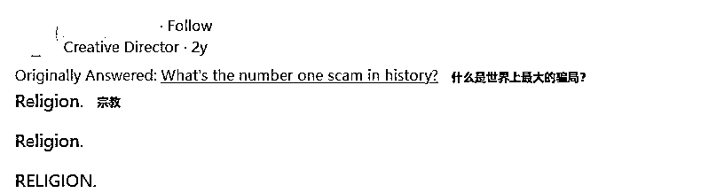**

老实说，世界上的骗子有很多。 

但能够将骗局上升到宗教的程度，并以此狂卷“教徒”**20 亿元**的恐怕不多。

如果再加上在卷款逃到国外之后，还能够转身大骂粉丝“太蠢”，并且将骗术美化成所谓“智慧”的骗子，恐怕就只有他这一个。

他就是翟山鹰。 

****

**01**

**根正苗红**

**与许多出身悲惨，为生活所迫，最终不得不沦落为骗子的人不同。**

**翟山鹰的身世不仅很好，甚至称得上是很“红”，说句根正苗红真的一点都不夸张，这一点从他的名字就能看出。**

**翟山鹰的原名叫做翟红鹰，1970 年出生于一个红色革命家庭。**

**其爷爷翟良超 1919 年出生于河南邵原镇西街，抗日战争爆发后，年仅 19 岁的翟良超主动加入了八路军游击队，参加过抗日战斗，做过地下工作，杀过汉奸，还率兵解放过县城。**

**由于表现过于突出，翟良超还被组织推荐上了设立在延安的“中国抗日军政大学”。**

****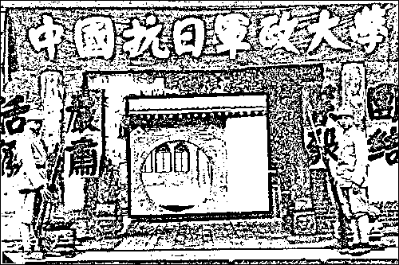****

**这有多牛逼就不用多说了吧**

**不仅爷爷出类拔萃，其父亲翟明战也非等闲之辈。** 

**翟明战 1956 年应征入伍，曾在中国空军服役，一路做到了正团级参谋的级别。**

**在 29 年的军旅生涯中，翟明战先后被评为五好战士、技术能手、还荣立过集体三等功一次；1977 年受空军司令部两次通令嘉奖；1981 年被评为学雷锋先进个人。**

**总结一下父亲翟明战的一生，虽算不上青出于蓝，但至少没给爷爷翟良超丢脸。**

****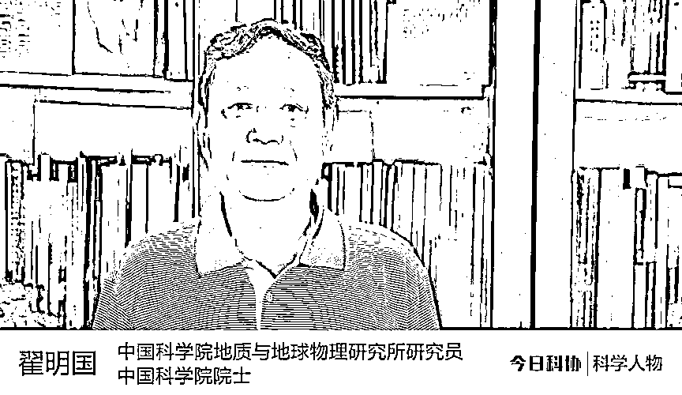****

**叔叔翟明国也很出众，身份为院士**

**然而正如《孟子》所言：君子之泽，五世而斩。** 

**翟家光辉的红色传统，传到翟山鹰这一代时，变味儿了。**

****02****

****商海沉浮****

**与祖辈的勤勉踏实不同，翟山鹰此人相当浮躁，但又喜欢将自己伪装得很“高深”。**

****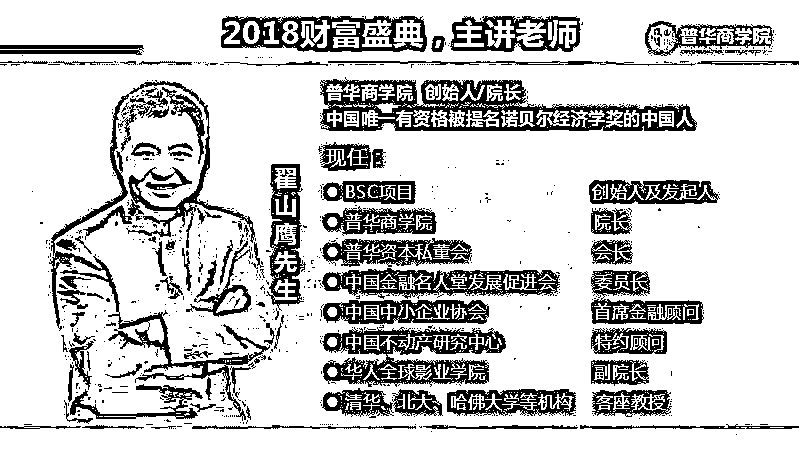****

**他给自己的头衔比龙妈还多**

**在能人辈出的家族当中，翟山鹰实在算不上聪明，叔叔翟明国少年时曾被保送北大，而他几番努力也只考上了个北京纺织工学院。**

**所谓学识不够，那就靠胆量来凑，不太聪明的翟山鹰却颇有一股子天不怕地不怕的胆气。**

**1990 年，还在上大学的翟山鹰就大胆搞起了房地产，他选择在广西北海炒房，**两年时间就赚了 200 多万，成为第一批吃上螃蟹的人。****

****在房市沉浮几年后，1995 年翟山鹰又回到了北京，并先后在中国航天科技集团、建银国际（控股）等国企任职。****

****然而一板一眼的国企生活很快让翟山鹰感到厌烦，他觉得上班赚钱太慢，不如自己开公司挣大钱来得快。****

********

****多番评估后，翟山鹰将骗啊不对，赚钱的眼光投向了培训行业。**** 

****他成立的公司大伙或许没了解过但肯定听过，那就是赫赫有名的——普华商业集团，其名下的「普华商学院」，称之为金融培训行业的毒瘤也不为过。****

************

****名为金融培训，实际上就是割韭菜****

****冯仔不才，区区学过几年金融，他们的课程在我看来与其说是揭露经济学客观规律，不如说是热血鸡汤、心理安慰剂。****

****属于那种有用，但用处不多的“知识”，就像是饿了叫你去吃饭，你说错吧也没错，你说对吧，这样的东西真不值得付费学习。**** 

****扯远了，咱们说回翟山鹰。****

****前面说到过，翟山鹰此人非常喜欢装高深，这一点在他步入培训行业后越发明显。**** 

****为了扩大宣传，他自封普华商学院的金牌导师，还给自己加冕了一系列头衔：**国学大学、自然禅传人、金融界的良心、清华大学/北京大学等知名高校客座教授、中国唯一有资格提名诺贝尔经济学奖的中国人……******

********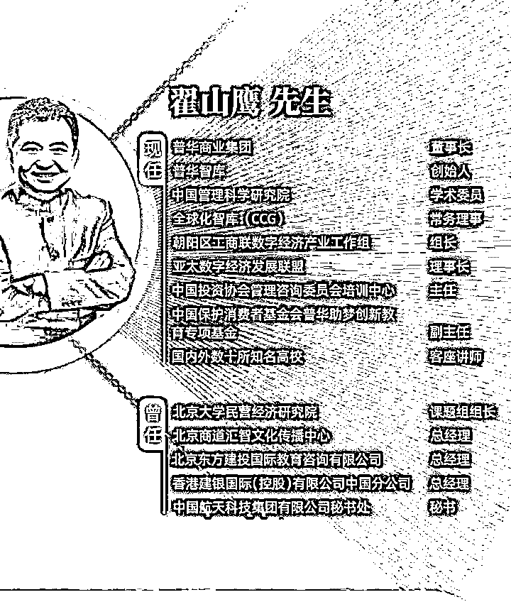********

******我简历都不敢这么编******

******当然，空有一身头衔肯定是不够的，为了进一步制造话题，翟山鹰开始发表大量颇具噱头的言论，像是：******

******“盎撒人和犹太人的资本，正在收割世界”******

******“中国是世界上最强的国家，美国即将崩溃”******

******“金融骗局揭秘，跟着我赚大钱”等等。******

********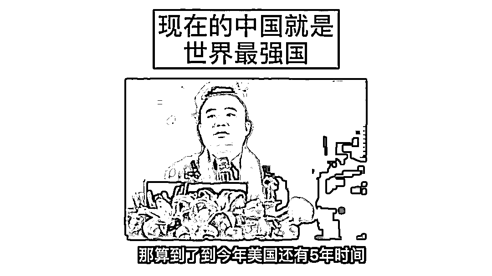********

******将一个个吸睛的话题抛出后，翟山鹰当真吸引到了一大批认可这种观念的受众，甚至一度被其粉丝称之为“翟神”。******

******很快，翟山鹰也意识到“金融+防骗”是套不错的忽悠组合，趁着这阵东风，他赶紧让公司给自己注册了无数个账号，疯狂发布自己的各种“演讲”视频，卖课卖产品。****** 

********巅峰时刻，其全网粉丝数达到上千万。********

**********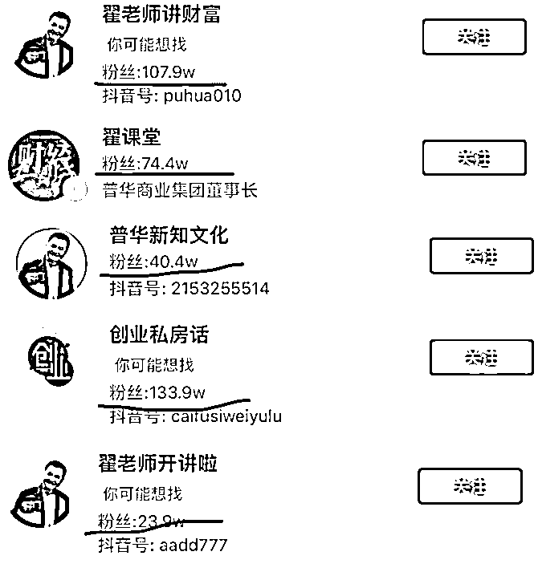**********

********各种马甲********

********为了尽快坐实自己的人设，“翟神”甚至在百忙之中抽空出了自己的书，书名就叫做《金融防骗 33 天》。********

********副标题为：给你的钱袋子加把锁。********

**********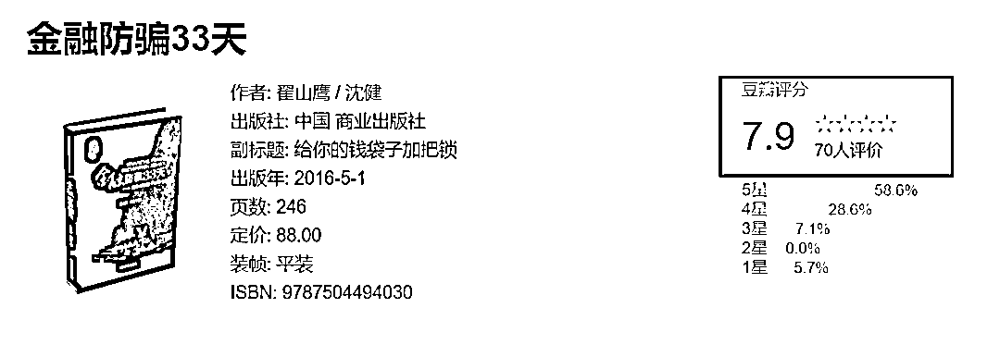**********

********潜台词可能是“钥匙只在我手上”********

********于是，近年来最魔幻的现象发生了，堪称现实版的「耗子给猫当伴娘」：******** 

**********一代老骗，从未上过金融学课的大忽悠，竟然靠着卖课程教人防骗，成为了人们口中的——「金融防骗大师」。**********

********让人不得不感叹现实往往比电视剧还要魔幻。******** 

**********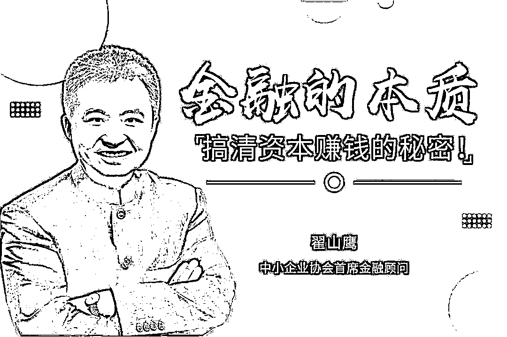**********

********这也给了学金融的同学一记响亮的巴掌********

********通过培训机构疯狂卖课，翟山鹰在短短几年内敛财不知凡几。********

********然而让人意想不到的是，他在这个过程中收获的最大财富还并不仅仅是名义上的“钱”，而是培养了一批忠实的“信徒”。******** 

********这批信徒也将成为世界上最好的韭菜，正所谓：********

**********韭菜都准备好了，还愁没有镰刀吗？**********

**********03**********

**********镰刀落下**********

********2017 年，经过「普华商学院」多年的反复测试，在确认其学员没有任何金融学“知识”，甚至连常识都不太多之后，收割韭菜的镰刀终于落下。********

********这一年，翟山鹰推出了一样名叫“宝石魔盒”的神秘东西，其官方是这么介绍这款产品的：********

> ********宝石魔盒 BS-BOX 是一款基于区块链技术打造的硬件盒子，由 BSC 计划商业联盟定制并发行，通过接驳联网计算机工作生成宝石积分（数字易物凭证），积分可交易变现，也可兑换商业联盟商品和服务，可流通，可储存，可交易，可增值，财富增值不可限量。********

********简单来说，宝石魔盒类似一种虚拟货币，你把现金换成宝石魔盒，就可以在他们的商城交易，而且如果它升值了，你也可以获得收益。********

********虽然理念设计得不错，但是 17 年恰逢各类虚拟货币发行的高峰期，在一众「超级忽悠」中，这种「大忽悠」就稍显普通了，宝石魔盒也就一直也不太出圈，不温不火。********

********到了 2019 年，翟山鹰又经过两年的苦心琢磨，终于想出了一个他一生中最大的忽悠——**BSC 云盒。**********

**********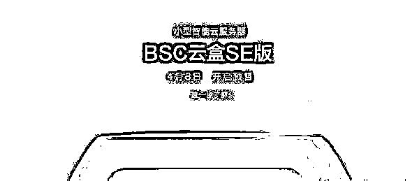**********

********为啥叫 BSC 呢？宝石 BaoShi，首字母就是 BS 了。******** 

********当然 BSC 云盒和之前的宝石魔盒还是有些不同的，不同之处在于它主卖硬件，其理念是：********

**********购买云盒相当于在大数据高速路上购买了一段股权，以后所有途经该路段的“数据流”你都理所应当地收取过路费，一次投入，永久收益。**********

********怎么个收益法呢？******** 

********据“翟神”所说：**一年翻 10 倍，两年 100 倍，**不成问题。********

********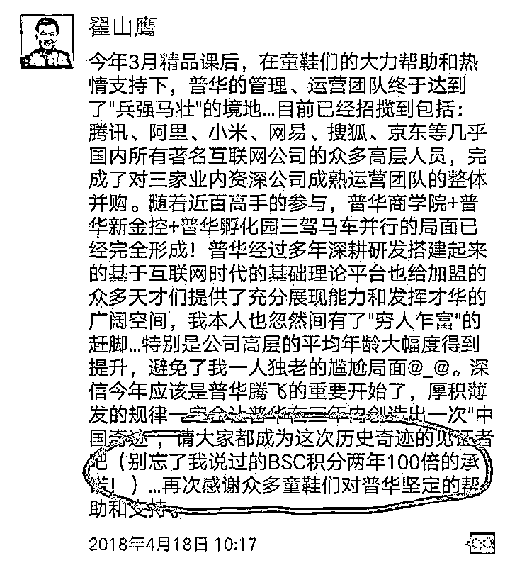********

******说实话，这种牛逼就算是[查尔斯·庞兹](http://mp.weixin.qq.com/s?__biz=MzU4MDYyMTg4NA==&mid=2247501022&idx=1&sn=be56f48f943775bf8434683b35cdc7f6&chksm=fd56878dca210e9bbf3d2bef9875778656c6a218edf99e5bba8b9a1a01fe9cf16441a9dae562&scene=21#wechat_redirect)在世都不敢这么吹，但是“翟神”人家就敢这么吹。******

******收益都吹到这么高了，那产品的售价自然也不会低。******

******其官方数据显示：**一台 BSC 云盒全功能版本的售价在 8.8 万，SE 版本的售价也要 4.4 万元。********

**********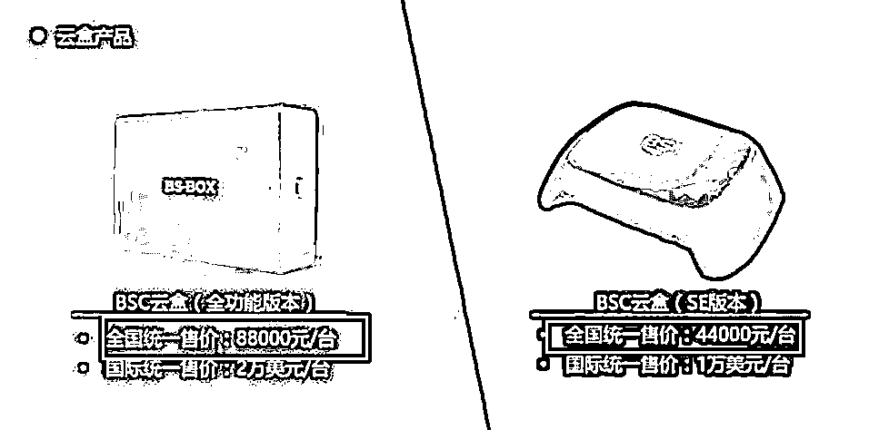**********

********面对如此高昂的售价，“翟神”的忠实信徒们非但没有退缩，反而觉得是“老师”带着大伙发家致富来了。********

********大批粉丝疯狂出手，一举买了数万台，短时间内就给翟山鹰带来了数十亿元的收益。********

**********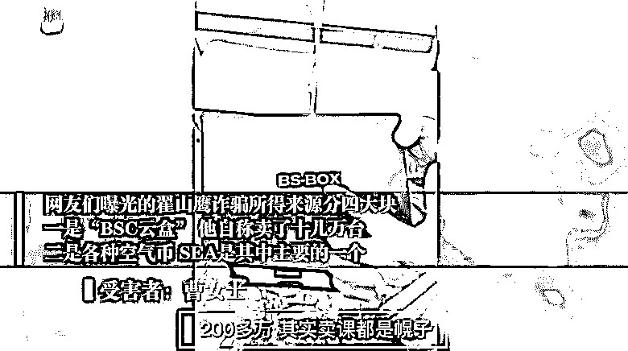**********

********那么，在自己赚得盆满钵满之后，翟山鹰有没有如约带着粉丝一起赚钱呢？******** 

********当然没有，因为这个 BSC 云盒从一开始就是一场彻头彻尾的骗局。********

********有人拆开这个所谓“高科技”云盒后发现，盒子里面其实就是一块电路板上面加上几块小芯片和存储卡，单个的成本怎么都不可能超过 100 元。********

********更夸张的是，由于盒子太轻怕唬不住人，他们还不得不在盒子顶上钉入了一块大铁板来增加重量…********

**********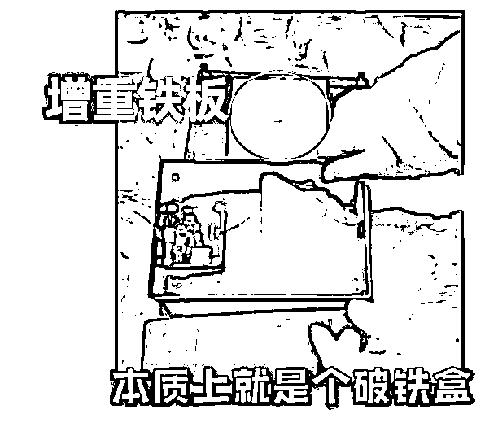**********

********如此简陋的产品自然无法一直欺瞒众人，2021 年，经过长时间发酵的 BSC 云盒诈骗终于藏不住了。********

********2 月，职业打假人王海在接受了受害人的爆料后，将翟山鹰多年布局的 BSC 云盒骗局大白于天下。********

**********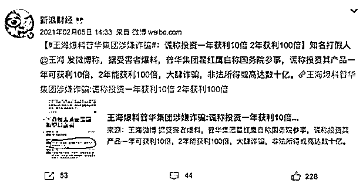**********

********然而，直到这个时候，翟山鹰的人设依然没有崩，互联网上依然有大量他的拥趸在为其辩护。********

**********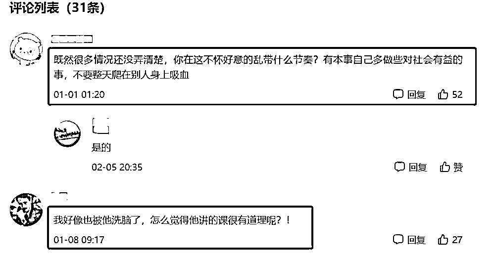**********

********只是，这些坚定的信徒可能还不知道，他们的“翟神”此时早已肉身跑路，举家迁往他口中随时会崩溃的美国了。********

**********04**********

**********忠实信徒‍‍‍‍‍‍‍‍‍‍‍‍‍‍‍‍‍‍‍‍‍‍‍‍‍‍‍‍**********

********翟山鹰消失了一年多，直到最开始讲到的回踩粉丝视频发布时才再次出现。********

**********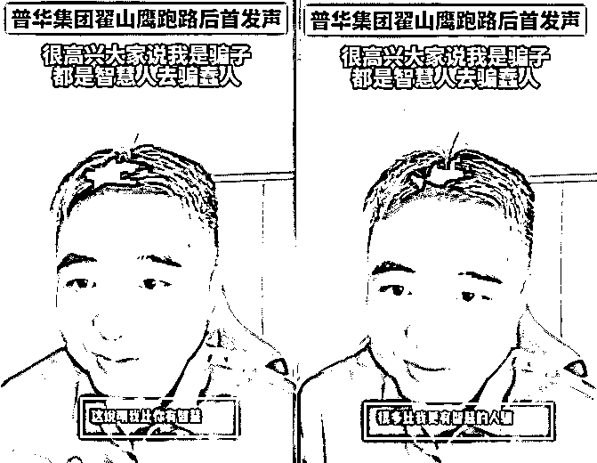**********

********在他消失的一年中，互联网上关于其诈骗的爆料越来越多，数量多到本文都无法全部提及。********

********神奇的是，即使面对如此多的爆料、如此确凿的证据，甚至本人都肉身跑路的情况下，依然有人对他表现出极度的认同。******** 

**********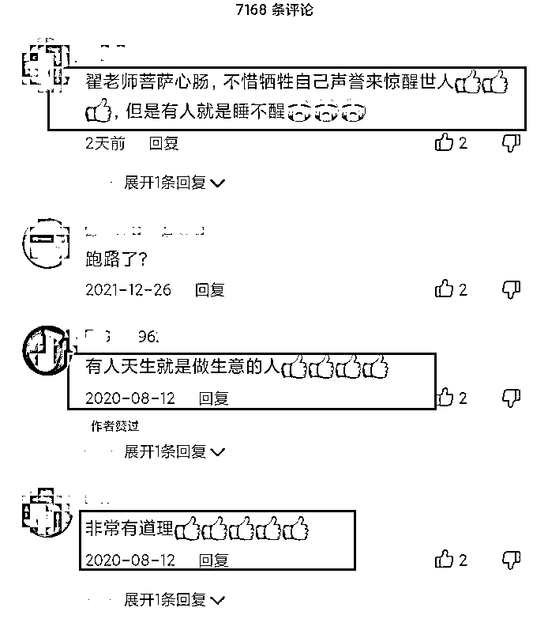**********

********这份认同甚至已经超出了粉丝的程度，可以被称之为信徒了。******** 

********正如全文最开始所提到的，**最大的诈骗局或许就是宗教，最有效的诈骗方法或许就是信仰。**********

******来源：黑白呸******

************

******欢迎关注灰产圈社群服务号******

************

************