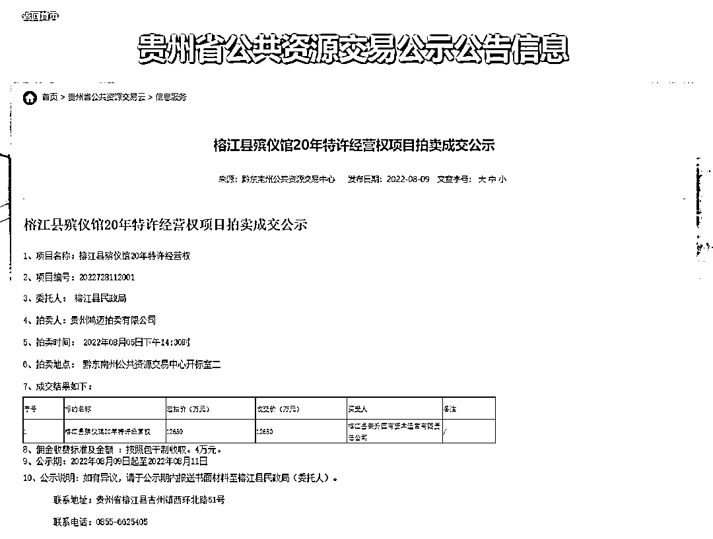
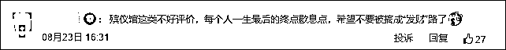

# "死不起？"贵州榕江回应"拍卖殡仪馆 20 年特许经营权"

> 原文：[`mp.weixin.qq.com/s?__biz=MzIyMDYwMTk0Mw==&mid=2247542677&idx=5&sn=b488f2722dbb0f3ba374af9843487fd5&chksm=97cbecada0bc65bb8ecdbc697c02e33d6e5c0254ace809d874e39606d45201eda1474d5a93df&scene=27#wechat_redirect`](http://mp.weixin.qq.com/s?__biz=MzIyMDYwMTk0Mw==&mid=2247542677&idx=5&sn=b488f2722dbb0f3ba374af9843487fd5&chksm=97cbecada0bc65bb8ecdbc697c02e33d6e5c0254ace809d874e39606d45201eda1474d5a93df&scene=27#wechat_redirect)

[`v.qq.com/iframe/preview.html?width=500&height=375&auto=0&vid=e3347muiglw`](https://v.qq.com/iframe/preview.html?width=500&height=375&auto=0&vid=e3347muiglw)

继四川阆中将“175 家单位未来 30 年食堂食材配送特许经营权”进行拍卖后，近日，贵州榕江县拍卖该县殡仪馆特许经营权的消息被公开，引发不少人对该县丧葬费用涨价的担忧，甚至有网友称，“现在人都死不起了”。

微信公众号“榕江政务公开”8 月 23 日消息，榕江县民政局就该县“殡仪馆特许经营权拍卖”一事进行说明：

榕江县殡仪馆（无火化设施）于 2017 年 12 月启用，当前仅能提供遗体接运、吊唁厅租用等基本服务。为进一步建设完善殡仪馆配套服务设施，更好满足人民群众对殡葬服务的需要。我县按照法定程序对榕江县殡仪馆 20 年特许经营权进行了公开拍卖，由中标主体进行规范管理运营和提升服务水平。经营主体将在殡葬基本服务基础上，针对有需求的群众，提供公墓和专业且多元的殡葬延伸服务、治丧期间生活服务供群众选择。相关收费标准将严格执行《贵州省殡葬收费管理办法（试行）》，并向社会公布，接受社会各界的广泛监督。

下一步，我县将切实加强对殡仪馆运营的监管，严格落实殡葬政策，促进殡葬事业健康发展。

在此，感谢网友对榕江县经济社会发展的关心。

此前，贵州省公共资源交易公示公告信息网站 8 月 9 日公布《贵州省公共资源交易公示公告信息》，其中显示，2022 年 08 月 05 日下午 14:30 时，在黔东南州公共资源交易中心开标室二对榕江县殡仪馆**20 年特许经营权**（项目编号：20227281120013）进行拍卖，委托人为榕江县民政局，拍卖人为贵州鸿迈拍卖有限公司。

**此项交易起拍价 12680 万元，并以 12680 万元成交，买受人为榕江县荣升国有资本运营有限责任公司。**

交易公示期为 2022 年 08 月 09 日起至 2022 年 08 月 11 日，目前公示期已过。

拍卖成交公示

拍卖殡仪馆特许经营权的消息一出，许多网友表示担忧，“（据成交价计算）相当于每年六百多万，加上其他成本，经营还要赚钱，对于一个县城来说，提升服务的同时价格也许将上涨”，“殡仪馆是每个人最后的终点，希望不要被搞成‘发财路’”，“现在人都死不起了”。

据榕江县政府网站介绍，榕江县位于贵州省东南部，黔东南苗族侗族自治州南部，地跨珠江和长江流域，位于湘黔桂三省结合部中心地带。全县国土总面积 3316 平方公里，总人口 37.9 万。榕江县曾经是国家扶贫开发工作重点县，2014 年全县贫困发生率为 35.54%。2020 年底，整县实现脱贫摘帽，现为国家乡村振兴重点帮扶县。

贵州榕江县位置示意，图源：百度地图

据榕江县统计局数据，2021 年该县地区生产总值 89.9 亿元，比上年增长 6.2%，两年平均增长 5.6%。其中，第一产业增加值 23.01 亿元，比上年增长 7.1%；第二产业增加值 17.28 亿元，比上年增长 8.4%；第三产业增加值 49.61 亿元，比上年增长 5%。第一产业增加值占地区生产总值比重为 25.6%，第二产业增加值比重为 19.2%，第三产业增加值比重为 55.2%。全年人均地区生产总值 30338 元，比上年增长 6.7%。该县 2021 年全年建筑业总产值 9.05 亿元，同比增长 17.1%。**该县商品房销售面积 224459 平方米，同比下降 51.2%。**

榕江县第七次全国人口普查公报显示，榕江县常住人口 297572 人。全县常住人口中，0-14 岁人口为 78226 人，占 26.29%；15-59 岁人口为 174982 人，占 58.80%；60 岁及以上人口为 44364 人，占 14.91%，其中 65 岁及以上人口为 32661 人，占 10.98%。与 2010 年第六次全国人口普查相比，0-14 岁人口的比重上升 0.14 个百分点，15-59 岁人口的比重下降 2.86 个百分点，**60 岁及以上人口的比重上升 2.72 个百分点，65 岁及以上人口的比重上升 2.58 个百分点。**

榕江县七普数据中的常住人口年龄构成

财政总收入方面，该县财政总收入为 2021 年 5.6 亿元，同比增长 6.3%。其中，一般预算收入 2.8 亿元，同比增长 8.1%。财政支出方面，一般公共预算支出 29.3 亿元，同比下降 29.4%。

2022 年上半年，根据县（市）生产总值统一核算结果，全县实现地区生产总值 41.19 亿元，比上年同期增长 4.6%。其中，第一产业增加值 7.0 亿元，同比增长 5.5%；第二产业增加值 9.6 亿元，同比增长 7.5%；第三产业增加值 24.6 亿元，同比增长 3.3%。

榕江县拍卖殡仪馆特许经营权之前，另有一地也因拍卖公共资源引发热议。四川南充市公共资源交易网阆中分网于 7 月 7 日发布了一则拍卖公告。拍卖标的物为：阆中市公办学校、行政机关、事业单位、国资公司的食堂食材统一配送服务未来 30 年特许经营权。起拍价 1.8 亿元，竞买保证金 2 万元。7 月 16 日，据四川南充市公共资源交易网阆中分网最新消息，“因拍卖标的范围和期限调整”，该拍卖已终止。

来源：观察者网

欢迎关注灰产圈社群服务号

