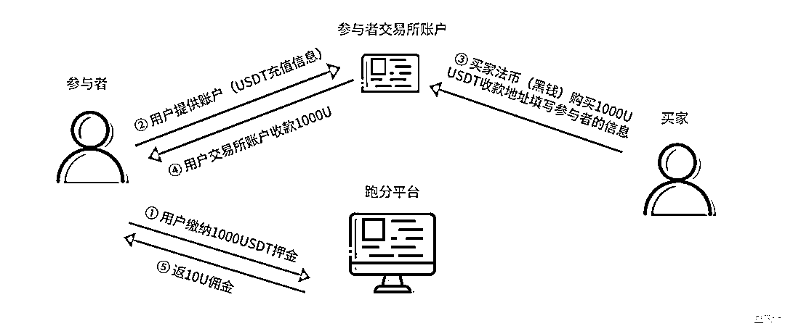

# 公安部：利用 USDT 跑分洗钱危害最为严重

> 原文：[`mp.weixin.qq.com/s?__biz=MzIyMDYwMTk0Mw==&mid=2247542677&idx=6&sn=e81ef16ccf627046fe6e12efec46e4bc&chksm=97cbecada0bc65bb5bc327e384ba6b9a47bb89ce467cc0bf4369c30fcaeb991c589eb99aeba3&scene=27#wechat_redirect`](http://mp.weixin.qq.com/s?__biz=MzIyMDYwMTk0Mw==&mid=2247542677&idx=6&sn=e81ef16ccf627046fe6e12efec46e4bc&chksm=97cbecada0bc65bb5bc327e384ba6b9a47bb89ce467cc0bf4369c30fcaeb991c589eb99aeba3&scene=27#wechat_redirect)

2022 年 4 月 14 日，公安部刑事侦查局局长刘忠义在国新办新闻发布会上表示，随着互联网金融的迅猛发展，诈骗分子利用三方四方支付、跑分平台、数字货币、贸易对冲等多种方式，不断改变转账洗钱手法，转账速度快、隐蔽性强，给公安机关追缴赃款工作带来很大困难。传统的三方支付、对公账户洗钱占比已减少，**大量利用跑分平台+虚拟货币洗钱，尤其是利用 USDT（泰达币）危害最为严重。**

****鉴于国内利用虚拟货币跑分的洗钱犯罪活动占比不断增长，今天就来展开来给大家分享下犯罪分子具体是如何通过虚拟货币跑分（主要是 USDT 跑分）洗钱的。****

****

****

****USDT 跑分洗钱发展历程****

**2020 年，惠州警方侦破全国首例利用 USDT 跑分为违法犯罪活动提供网络支付服务案件，下面我们就来看看 USDT 跑分洗钱的前世今生。**

****①什么是跑分？****

**“跑分”原本是一个计算机专有名词，指通过相关软件对电脑或者手机进行测试以评价其性能，跑分越高性能越好。****而现在已经演变成一种“洗钱”手法，即利用自己的银行卡、pos 机、微信/支付宝收款二维码以及虚拟货币账号等账户为别人代收款，再转到指定账户，从中赚取佣金的不法行为。******

****跑分平台常见服务于网络赌博、电信网络诈骗、网络色情网站等，为这些上游非法活动洗钱，已形成黑灰产业链。****

******②跑分平台缘何兴起？******

****初期的灰黑产支付，主要通过个人转账、电话充值卡、租用商户收款账户完成。****

****2016 年，人民银行下发《非银行支付机构风险专项整治工作实施方案》、《关于加强支付结算管理防范电信网络新型违法犯罪有关事项的通知》等文件，文件明确指出，支付行业不得直接或变相为赌博、色情、非法外汇、贵金属、虚拟币等非法交易提供服务。****

******自此**一些黑灰产的钱难以再通过原来的银行第二方支付、支付宝/微信等第三方支付平台等通道出去，非法第四方支付平台（诸如“跑分”平台）产业链由此兴起。********

****************

****因为正常的支付通道被堵，黑灰产对跑分平台的依赖性变得极强，愿意支付高额佣金。而建设跑分平台的门槛极低，一周左右就可上线投入使用。犯罪成本极低，利益又极高，所以跑分平台快速兴起。****

********③虚拟货币跑分逐渐盛行********

******起初，跑分平台主要以微信、支付宝、银行收款码为主**，2019 年，微信、支付宝就意识到大量的黑色产业链利用“跑分”来躲避监管。2019 年 2 月微信就发布了《关于打击“微信跑分”违法违规活动的公告》，公告称将严打“微信跑分”违法违规活动，情节严重的，将移交司法机关。2019 年 3 月底，央行也发布《关于进一步加强支付结算管理防范电信网络新型违法犯罪有关事项的通知》，严查利用租用商户账户，POS 机终端等规避监管。****

******随着国内监管加强再配上断卡行动等，利用微信、支付宝、银行收款码跑分容易触发各个渠道的风控规则，遭到重点打击，于是跑分****洗钱平台把目光投向了虚拟货币**。从 2019 年下半年开始虚拟货币，尤其是 USDT 跑分平台逐渐兴起。****

************

********某 USDT 跑分系统********

************ 

********USDT 跑分常见操作流程********

********利用虚拟货币进行跑分，是因为虚拟货币自身的匿名性、去中心化、交易便捷、全球流通等特性，易于隐藏交易、躲避监管。****而 USDT（泰达币）作为一种锚定美元的稳定币，价值比较稳定，因此成为虚拟货币跑分平台的首****选。********

********USTD 跑分跟微信、支付宝等跑分洗钱一样，常见的操作分为以下三个阶段：********

**********①USDT 跑分平台搭建**********

********首先，洗钱者非法搭建一个 USDT 跑分平台，吸引正常用户注册，跑分平台就跟上游赌博等洗钱需求方对接，为其提供资金支付通道服务。********

****************

********在网上可以搜索到大量 USDT 跑分平台搭建信息********

**********②推广运营，找寻洗钱需求方以及招募 USDT 跑分参与者**********

********平台搭建好后，跑分平台就会在论坛、贴吧、QQ 群、微信群、各种网站、线下渠道等发布广告，一方面找寻赌博、诈骗等有非法资金想要洗白的洗钱需求方；另一方面通过“高收益”、“低风险”、“来钱快”、“轻松赚钱”、“不需要成本”等噱头的兼职广告宣传招募跑分参与者。********

**********③USDT 跑分洗钱**********

********跑分参与者需要在交易所注册实名账户，然后把账户地址提交给跑分平台，并向平台缴纳一定数量 USDT 作为押金，然后就可以抢单跑分了。跑分平台将跑分需求发布在平台，平台会员抢单后，按照指令将赌资转至指定账户。********

****************

********USDT 跑分模式********

****************

**********参与 USDT 跑分的风险**********

**********①可能涉嫌刑事犯罪**********

********实际上，可能部分 USDT 跑分参与者并不知道参与跑分其实就是在协助洗钱，而这种行为很可能涉嫌刑事犯罪，当然也有不少人知道这触犯了相关法律还明知故犯。我国《刑法》规定，为洗钱行为“提供资金账户”将构成刑事犯罪，最高刑罚将处五年以上十年以下有期徒刑，并处洗钱数额百分之五以上百分之二十以下罚金。********

**********跑分参与者可能涉及的罪名有**：帮助信息网络犯罪活动罪，掩饰隐瞒犯罪所得、犯罪所得收益罪，洗钱罪等。********

**********跑分平台可能涉及的罪名有**：开设赌场罪、非法经营罪、洗钱罪、帮助信息网络犯罪活动罪等。********

**********②可能陷入资金盘等骗局，被割韭菜**********

********USDT 跑分平台真假难辨，因为高收益等诱惑参与 USDT 跑分还极容易陷入资金盘、杀猪盘等骗局，被割韭菜，具体骗局有：********

**********⚠ 资金盘骗局**********

********据某个 USDT 跑分平台系统开发人员透露，他们给某些客户开发的 USDT 跑分平台实际上是资金盘平台，不是真跑分。系统支持 USDT 出入金，玩家入场需要缴纳 USDT 押金，但所谓的跑分却并不存在。“跑分”就是把押金返回去，每次返多少钱、返几次、多久返一次，而这些后台都可以操控。********

********“如果玩家发现，自己收到的 USDT 总是来自几个固定的地址，甚至所谓的 USDT 转账只能在平台自己的 APP 上才能查到，那他遇到的一定是资金盘。”********

**********⚠“杀猪盘”骗局**********

********区别于上述资金盘依靠规则实施的骗局，USDT 跑分“杀猪盘”中，骗局实施者会以“客服”等身份，与玩家接触，获取玩家信任，并为每个玩家定制专属的套路，例如：先给玩家一些获利甜头，吸引玩家不断加码投资，引导玩家入坑。当玩家加大投资后，就卷走所有资产。********

**********⚠ 平台卷款跑路**********

********参与 USDT 跑分必须先要在跑分平台充值一定金额的 USDT 保证金，如果参与人数众多，极容易形成数额巨大的资金池。如果平台人员禁不住诱惑，极容易卷款跑路。********

********而因为 USDT 等虚拟货币难以追踪等特性，一旦被骗，无法进行资金冻结，追回难度大，损失难以挽回。********

****************

********以上就是本次关于 USDT 跑分洗钱的分享。********

********参与 USDT“跑分”实质就是在帮助诈骗、赌博等违法犯罪团伙进行“洗钱”，可能涉嫌刑事犯罪，参与者需要承担刑事法律责任。目前国内也加强了相关犯罪活动的打击力度。********

********同时，广大民众要警惕“跑分”陷阱，不要轻易被所谓的高额回报所诱惑，更不要出租、自己的身份信息、支付账号，不要帮人代买虚拟货币等，以免沦为犯罪分子违法犯罪的帮凶。********

********来源：七星实验室********

****************

********欢迎关注灰产圈社群服务号********

****************

****************