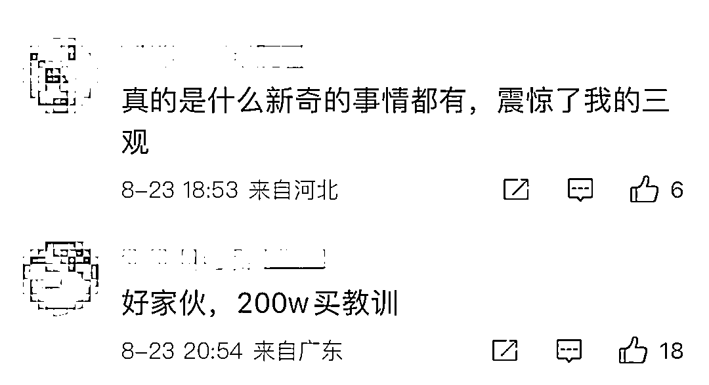

# 男子明知是骗子仍转账 40 万，还要再转账 150 万！网友：贫穷限制了我的想象

> 原文：[`mp.weixin.qq.com/s?__biz=MzIyMDYwMTk0Mw==&mid=2247542677&idx=7&sn=764969d4d033a015cd4d046991776d43&chksm=97cbecada0bc65bb0c06671c402f7967d943f05b4fd57acab3c0eb76f4aef150eb765e1400ac&scene=27#wechat_redirect`](http://mp.weixin.qq.com/s?__biz=MzIyMDYwMTk0Mw==&mid=2247542677&idx=7&sn=764969d4d033a015cd4d046991776d43&chksm=97cbecada0bc65bb0c06671c402f7967d943f05b4fd57acab3c0eb76f4aef150eb765e1400ac&scene=27#wechat_redirect)

**男子明知是对方骗子仍转账 40 多万？**

昨天这个话题冲上了微博热搜，

这背后的原因，引发网友热议。

“我知道这是诈骗”

**“我已经转了 40 多万”**

“如果不是你们劝阻，

我本想继续转钱给骗子”

**“当是用钱给老婆买一个清醒，**

**买一个教训”**

**男子对民警说道。** 

男子 3 次拒接劝阻电话：我知道对方是骗子

近日，广东中山市反诈中心接到线索，火炬开发区 Z 先生（化名）疑似被网络投资诈骗。民警第一时间通过反诈专线进行电话劝阻，但连拨三个电话都被 Z 先生挂断。

经过多次分析研判发现，**Z 先生被骗指数极高，**民警必须上门当面劝阻。8 月 3 日晚 8 时许，火炬公安通过多方努力，最终在火炬开发区某小区找到了 Z 先生。

见到上门劝阻的警员，**Z 先生并不愿意配合，声称“自己没有被骗”，让警员赶紧去巡逻，不要在他身上浪费时间。**无奈，**警员们只能在门口大声劝 Z 先生不要转账给骗子。**

**即便如此，民警仍然不放弃对 Z 先生的劝阻。**

**反诈民警表示：“根据我们的分析研判和以往工作经验，**Z 先生应该是被诈骗了，可 Z 先生却说没有被骗，应该是有什么隐情，又或者遭到了威胁……”****

****带着种种疑问，8 月 4 日上午 8 时许，社区民警赶在 Z 先生出门上班前再次找到了 Z 先生。民警先是解说了诈骗的各种套路，还列举了身边的真实案例，让 Z 先生不要上当受骗。****

****经过一个多小时的反复耐心劝说，Z 先生最终放下了心里的防备和负担，直言：**“我知道对方就是骗子”。******

************

******明知是骗子却还要转账？******

******Z 先生说：“其实是我远在国外的妻子被人以网络投资的方式进行诈骗，**但妻子已沉迷其中，亲友多次劝说无果，无奈之下，昨天给骗子转了 40 多万元。”********

********************************

********知道被诈骗的不是 Z 先生本人之后，民警持续劝说 Z 先生，一方面，让 Z 先生不要再转钱给骗子，另一方面，**让 Z 先生持续与妻子的沟通联系，让妻子立刻删除平台，减少损失。**********

********原来，Z 先生妻子李女士长期在国外居住，今年 4 月以来在一个名为*Serve（*金融服务）APP 上购买比特币进行投资，投资收益可达 10%以上，而且多赚少亏。********

********刚开始李女士也是抱着试一试的心态在平台上投资，果然收益不错，而且也顺利从平台上套现，手续简单便捷。7 月份以来，李女士开始在平台上大额投资，**但当李女士想从平台套现时，却被告知要缴纳约近 200 万元的税金，否则无法拿回本金，**骗子还声称**“如不及时缴纳，将会遭到无法预知的报复……”**********

********得知情况后的 Z 先生费尽心思想让妻子李女士认清骗子的真面目，并安心照顾孩子，奈何李女士对亲友的劝阻充耳不闻。爱妻心切的 Z 先生只能按照妻子的要求将钱转入骗子提供的账户。********

********Z 先生说：“**就当是破财消灾吧，本来打算继续转 150 万元的，你们就上门来了……**你们说了这么多，我会好好和老婆沟通，让他尽快向当地警方报警，我不会再给骗子转钱了。”********

******反诈中心提醒******

******对于引导在网上玩彩票、投资、理财之类，先给尝甜头再引导继续投入的，必是骗子无疑。“天上不会掉馅饼”，所谓“低成本、高回报”往往都是骗子的幌子，一定不要贪图利益，赚钱还是要脚踏实地。如不慎被骗或遇可疑情形，请注意保存证据，立即拨打 110 报警。******

******网友：贫穷限制了我的想象******************************************

******来源：杭州网综合中山市反诈中心，新浪微博，红网******

************

******欢迎关注灰产圈社群服务号******

************

************