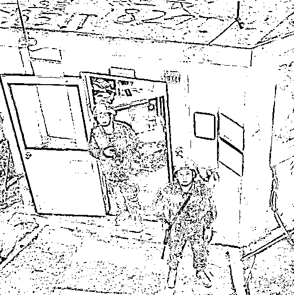
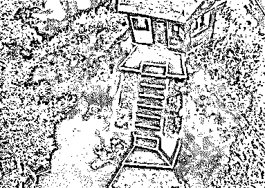
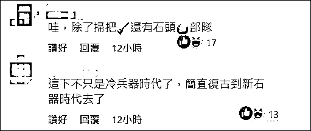
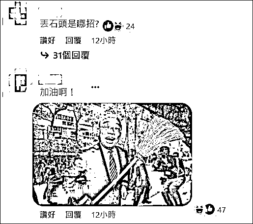
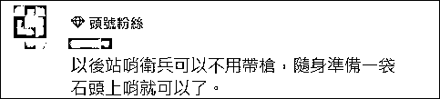

# "台湾这是回到石器时代了？"

> 原文：[`mp.weixin.qq.com/s?__biz=MzIyMDYwMTk0Mw==&mid=2247542745&idx=3&sn=12a2b79493d00156cac9c144046a1b2b&chksm=97cbece1a0bc65f75d22914bf9598ed8d9c027579132c0e6c37f40b87d773c85662f573bf572&scene=27#wechat_redirect`](http://mp.weixin.qq.com/s?__biz=MzIyMDYwMTk0Mw==&mid=2247542745&idx=3&sn=12a2b79493d00156cac9c144046a1b2b&chksm=97cbece1a0bc65f75d22914bf9598ed8d9c027579132c0e6c37f40b87d773c85662f573bf572&scene=27#wechat_redirect)

据联合新闻网报道，昨天（24 日），一段大陆无人机拍摄到台湾“金门防卫司令部”岗哨的视频在两岸社交媒体上引发关注后，当日，台军承认此事为真。在此前的视频中，有台方军人朝空中扔石头以驱离无人机，台军称，这是营区军人“自发性”用石头丢掷、扰乱，无人机随即飞离。其还宣称，相关视频是大陆对台湾的“认知作战”。

该回应在岛内社交媒体上引发群嘲，有网民调侃，“原来我们的武器除了扫把，还有石头”“都说现在是冷兵器时代，台湾这是回到石器时代了”，还有网民质疑，“能不能不要什么都推给认知作战？”

据中时新闻网报道，本月初，大陆军演期间，外界曾传出有无人机飞越金门、马祖上空。24 日，一段在微博上流传的高清视频显示，一架无人机飞越金门县烈屿岗哨，台方两名军人的面孔及表情清晰可见；还有另一段影片拍到有军人朝空中丢掷石头，企图驱赶无人机。

昨天上午，“金门防卫指挥部”证实照片为真，并称守备队 8 月 16 日 18 时许发现该无人机，但强调这架无人机当日是在高空以长距变焦镜头拍摄金门大胆防区，经台湾军队示警驱离后飞离。

<mpvideosnap class="js_uneditable custom_select_card channels_iframe videosnap_video_iframe" data-pluginname="videosnap" data-id="export/UzFfAgtgekIEAQAAAAAAuUkYM6ULTgAAAAstQy6ubaLX4KHWvLEZgBPE0aMED2AwI9GCzNPgMIuIqEfsTvcGlPKChP_jwSax" data-url="https://findermp.video.qq.com/251/20304/stodownload?encfilekey=rjD5jyTuFrIpZ2ibE8T7YmwgiahniaXswqzkBZFkhiawxkxu5icMa0Rld108vvCKBuVSLoiaScVSNOlibVWkrvqjchZP73Zk8aNQH0TXaCUT7jNhf8cMWm1Jxv8SA&amp;adaptivelytrans=0&amp;bizid=1023&amp;dotrans=0&amp;hy=SH&amp;idx=1&amp;m=&amp;scene=0&amp;token=x5Y29zUxcibD1ic0QMZ1vnsBklKazQxHvET7CsB9la5bNVSOlH9s0cG4OlBgAuAiap42dNu9mFwyx4" data-headimgurl="http://wx.qlogo.cn/finderhead/ibq4aVwOt6HNqrr8OD3sCviaytF3B8TqCwHicxsuIanAJo/0" data-username="v2_060000231003b20faec8c6e48a1acbd3ce04ef33b077a1e41d0d3794ed88ea537878dbe65910@finder" data-nickname="灰产圈+" data-desc="无人机拍到了金门岗哨的照片，两个台军一脸懵地看着无人机，最后，试图用石头打落我们的无人机。。@灰产圈+ " data-nonceid="17123260374038209037" data-type="video" data-width="1904" data-height="1080"></mpvideosnap>

昨晚，该部门再次回应此事，称二胆岛于 16 日下午发现“民用”无人机，期间值勤军人均有高度警觉，并采取辨识、应处、通报等处置程序；周边休息官兵则自发性以石头丢掷、扰乱，该架无人机随即飞离。其称，外岛军人秉持“备战不求战”原则，更以“不升高冲突、不引发争端”的态度加强戒备，坚守岗位，随时应变处置各项突发状况。

“金门防卫指挥部”还趁机将矛头对准大陆，称解放军无人机除了要测试台湾的应变行为之外，同时借由剪辑片段制造错假讯息，散布于网络社群，再结合网军行动，企图达到分化、诋毁台军的目的，是“认知作战”的一部分。其喊话岛内民众，不要受大陆对台湾“认知作战”的影响。

对于该部门的说法，岛内部门并不买账，“扔石头是什么招数？”“所谓的‘备战’就是扔石头？”“台湾又有了石头队？”

“想知道石头花了多少军费？”

而“金门防卫指挥部”在回应中所说“认知作战”“假消息”“网军”，实质上正是多年来民进党被台媒以及台湾民众所诟病的地方。有台媒曾撰文指出，“认知作战”4 个字，经常见诸于岛内新闻媒体，因为它是民进党政府官员常常挂在嘴边的词汇，而且几乎到了随处可用、信手捻来的地步。

对民进党来说，政治上也没有解决不了的错，如果推给大陆不够，那就在大陆后面加 3 个字：假讯息。“大陆+假讯息”，仿佛已成蔡当局的金钟罩、铁布衫，停水、停电怪大陆，之前陈时中违反防疫规则聚会唱歌不戴口罩也能，民进党也能推到大陆身上。

在“金门防卫指挥部”再次将无人机一事说成是“认知作战”后，有岛内网民嘲讽，“能不能别什么都推给认知作战？”

来源：观察者网

欢迎关注灰产圈社群服务号

