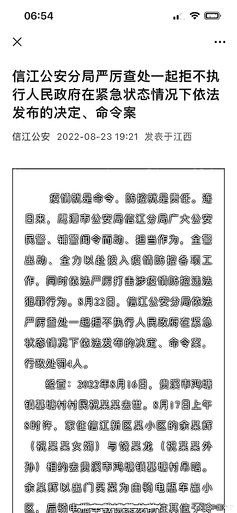
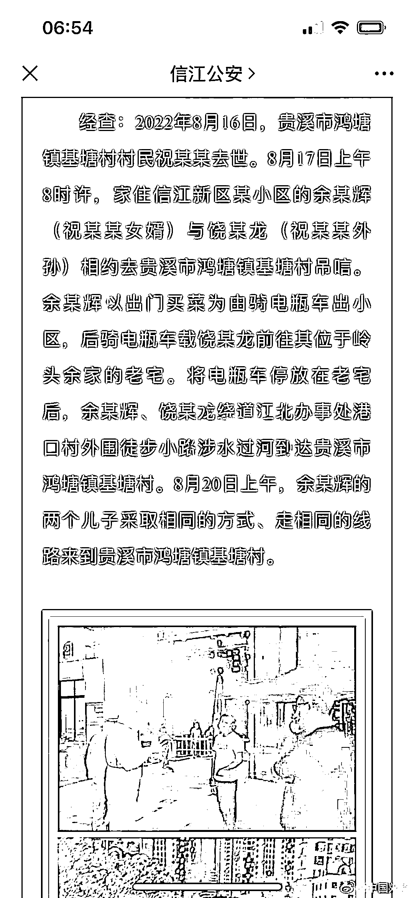
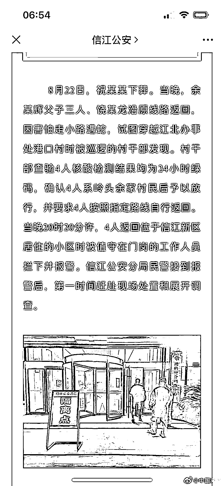
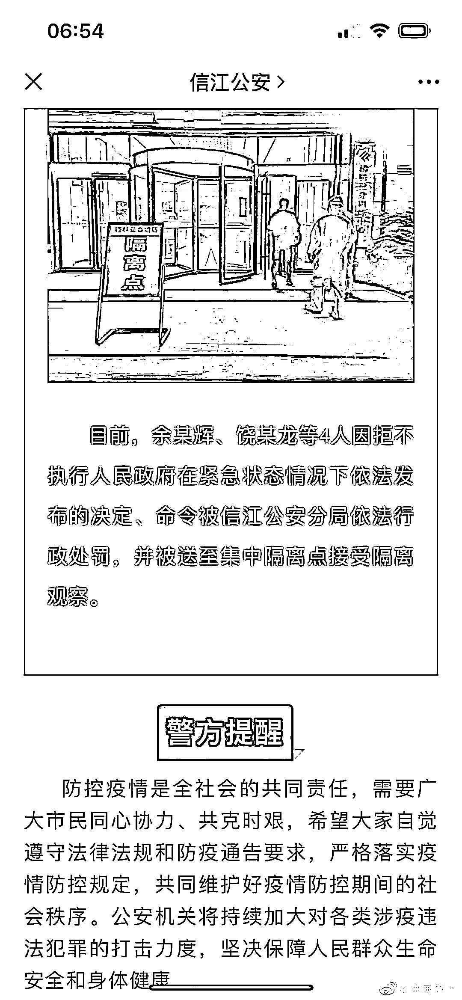
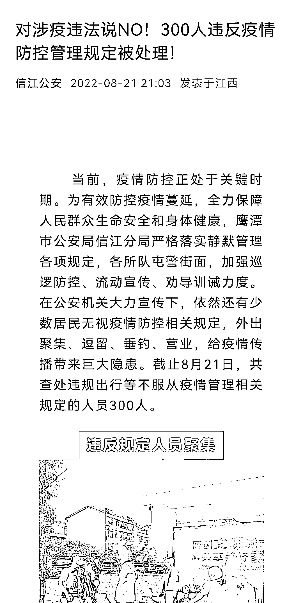
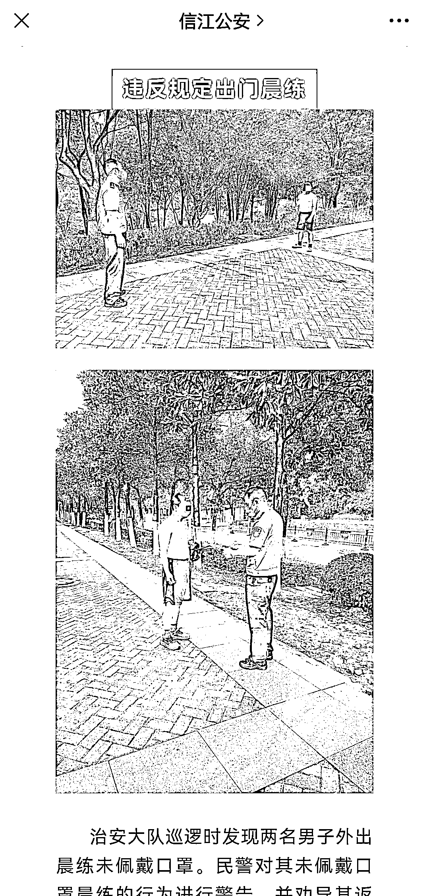

# 江西一家四口因“恶意奔丧”被处罚：孝悌礼仪也违法了？

> 原文：[`mp.weixin.qq.com/s?__biz=MzIyMDYwMTk0Mw==&mid=2247542745&idx=4&sn=b09cb439b64517808be15641583fce4d&chksm=97cbece1a0bc65f7124578d98212c3a933e9030de9b2f12cd1d62e32405a05a03b54b116f4d4&scene=27#wechat_redirect`](http://mp.weixin.qq.com/s?__biz=MzIyMDYwMTk0Mw==&mid=2247542745&idx=4&sn=b09cb439b64517808be15641583fce4d&chksm=97cbece1a0bc65f7124578d98212c3a933e9030de9b2f12cd1d62e32405a05a03b54b116f4d4&scene=27#wechat_redirect)

自奥密克戎以来，各地大量的封控、静默、静态管理之下，数以万计的普通人的生活，被迫按下了暂停键。

但与此同时，大量的底层老百姓，他们需要吃饭，需要看病，需要看望亲人，需要赚点小钱补贴家用，需要担心庄稼会不会烂在地里。

也由此，出现了“恶意返乡”“恶意吃饭”“恶意看病”“恶意务工”“恶意卖黄瓜”等一系列令人匪夷所思的事情。

8 月 23 日，江西省鹰潭市公安局信江分局通报了一起“恶意奔丧”的事件，同样令人感到匪夷所思。

|  |  |

根据警方通报：2022 年 8 月 16 日，贵溪市鸿塘镇一名村民去世；第二天上午，去世村民的女婿余某辉带上老人的外孙，一起去吊唁。

在出小区时，余某辉谎称“出门买菜”，骑上电瓶车走了，后来接上了老人外孙。

警方通报的叙述很平淡，但不难看出两人奔丧的“艰难”：他们将电瓶车停在老宅后，从一个村子外围**绕道**，从小路**徒步**，**涉水过河**，最终抵达了鸿塘镇。

8 月 20 日上午，余某辉的两个儿子，用同样的方式、走相同的路线，前去奔丧。

8 月 22 日，老人下葬后，一家四口往回走。途中被某个村的村干部发现，经过查验，**4 人的核酸检测结果都是 24 小时绿码**，被放行。

但在回小区时，被门岗工作人员拦下并报警。

|  |  |

警方在通报中称，这一家四口，因**“拒不执行人民政府紧急状态情况下依法发布的决定、命令”**，被行政处罚，并被送往集中隔离点接受隔离观察。

这份通报的开头第一句话就是，**“疫情就是命令，防控就是责任”**，警方的威严，在铿锵的字句中显露无疑。

但是，你们这样做真的好吗？广大的网友显然并不买账。

数千年以来，谁又听说过“恶意奔丧”的事情呢？

有网友指出，用“买菜”的理由可以出门，但“吊唁”却不行，**到底是什么机械性的防疫政策，将普普通通的老百姓，逼到撒谎、绕路、徒步过河去奔丧的程度？**

还有网友指出，吊唁长辈，事出有因、情有可原，并且 4 人均持有 24 小时核酸绿码，并未造成疫情蔓延，完全可以教育为主，为什么非要处罚呢？

什么时候，中华文明传承的孝悌礼仪也违法了呢？

|  |  |

而在信江公安 8 月 21 日发布的《对涉疫违法说 NO！300 人违反疫情防控管理规定被处理！》一文中，可以看到：

**共有 300 人因“不服从疫情管理相关规定”被处理。**

这些人员被处理的理由，包括“违反规定人员聚集”“违反规定开门营业”“违反规定出入小区”“违反规定施工作业”“违反规定街面摆摊”“违反规定出门晨练”“违反规定外出垂钓”……

连晨练和垂钓都违法了，细品吧。 

如此大规模地处理普通老百姓，令人实在忍不住发问：这一届老百姓的“恶意”，是不是太多了？

来源：陆火 Media，宾曰语云  作者：陆火 

欢迎关注灰产圈社群服务号

