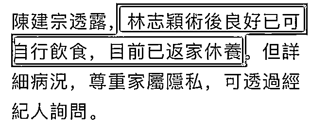
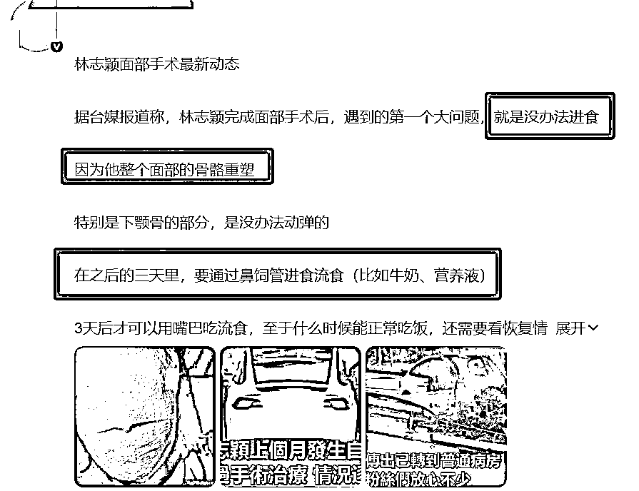
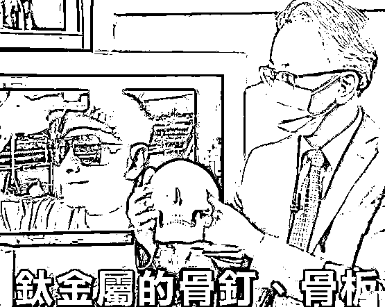
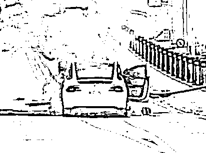
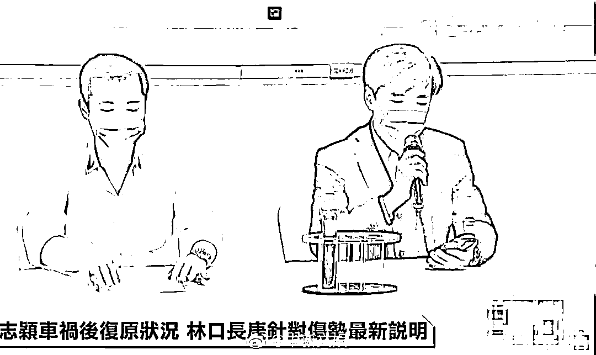
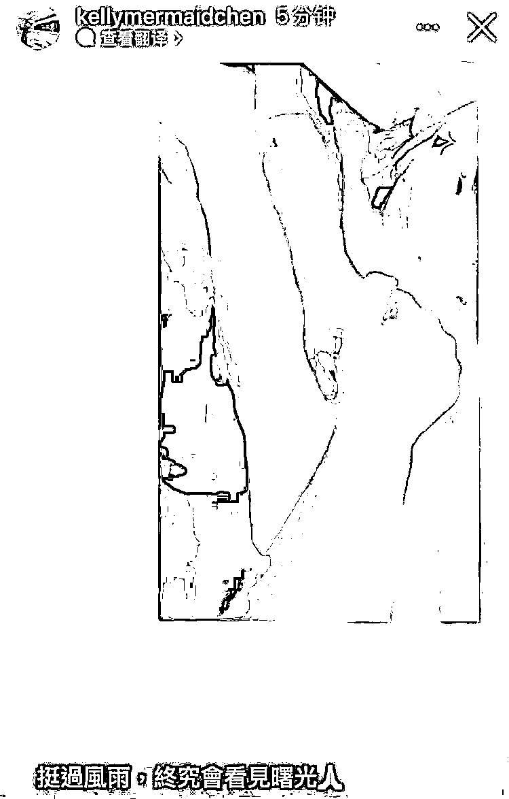

# 林志颖被曝进食困难，情况“不容乐观”？院方回应：假的！

> 原文：[`mp.weixin.qq.com/s?__biz=MzIyMDYwMTk0Mw==&mid=2247542745&idx=7&sn=7d2b2c57bb96b4dabe559d0b66ea37a8&chksm=97cbece1a0bc65f703a66285f2b76ef8b2ee181ad2aec1c7582cb4a8732a0785a8d1ae0b6b40&scene=27#wechat_redirect`](http://mp.weixin.qq.com/s?__biz=MzIyMDYwMTk0Mw==&mid=2247542745&idx=7&sn=7d2b2c57bb96b4dabe559d0b66ea37a8&chksm=97cbece1a0bc65f703a66285f2b76ef8b2ee181ad2aec1c7582cb4a8732a0785a8d1ae0b6b40&scene=27#wechat_redirect)

一直跟进的“林志颖特斯拉车祸”事件，最近又有新情况了！

据了解，林志颖所在医院的院长接受媒体采访时表示： 

**“林志颖术后恢复情况良好，已经回家休养。”**  

图片来源：@快科技

对于林志颖之前做过的面部修复手术，院长也做了一番解释：

“大部分此类手术都趋向于‘一次性’，**也就是手术可以一次到位，**只不过根据林志颖的个人情况，需要在花费时间与次数上略作调整。” 

哎？可是前一阵子，明明还有媒体报道林志颖情况不容乐观鸭……

当时爆料称林志颖因整个面部骨骼都重塑过了，尤其是下颚骨部分不能动弹，所以**无法进食**。

媒体还称，在之后的三天时间内，林志颖都**只能通过鼻饲管进食**，而且只能是牛奶、营养液类的流食。

图片来源：@快科技

虽然这些媒体的爆料并没有得到林志颖家人的证实，但是不少专业人士表示，还是有一定可信度的。

专业人士在电视上讲解

图片来源：@快科技

对此，院长也进行了辟谣： 

**“一些媒体报道称林志颖恢复艰难，术后无法进食等情况，均为不实消息！”**

图片来源：@快科技

讲到这，就再给大家简单梳理一下“林志颖特斯拉车祸”事件的完整经过。

7 月 22 日，林志颖因驾驶时，未注意车前情况，撞上了汽机车分隔岛，随即车辆燃起了大火。不过，好在林志颖父子被路人即时救出，并送往了医院。[**（详情请戳蓝字查看）**。](http://mp.weixin.qq.com/s?__biz=MzIyMDYwMTk0Mw==&mid=2247540651&idx=3&sn=5cc5c789f6f9c15adb76c57411d33588&chksm=97cb9493a0bc1d851e72e6f194a4cfc517b7ea2a458b0106ff0f5d38f3b1678c56e3162be6b7&scene=21#wechat_redirect)

  

图片来源：@澎湃新闻

7 月 25 日，林志颖经纪人及家属召开发布会，称林志颖情况逐渐好转，目前已经恢复意识[**（详情请戳蓝字查看）**。](http://mp.weixin.qq.com/s?__biz=MzIyMDYwMTk0Mw==&mid=2247540713&idx=2&sn=a10d6b30083a6716acc44aa74150c235&chksm=97cb94d1a0bc1dc7ca64a18bb48c8d72bb9677fa4d332487bdda9bca0576c4c3c902ca30fa6f&scene=21#wechat_redirect) 

  

图片来源：@中新文娱

8 月 17 日，林志颖车祸后近照首曝，同时有报道称林志颖已经做完钛合金固定手臂骨和第二阶段的颜面手术，正在努力恢复中[**（详情请戳蓝字查看）**](http://mp.weixin.qq.com/s?__biz=MzIyMDYwMTk0Mw==&mid=2247542492&idx=3&sn=ce83b70adc6eedf531ef7d06c896ab8e&chksm=97cbede4a0bc64f27efe3e9e3fd4c01d56f19b90900c1b8ee066da8bc11268064af88f65474e&scene=21#wechat_redirect)。

林志颖妻子在社交平台上发布近照

图片来源：@中国网娱乐

话说回来，虽然距离事发已经过去了一个多月，但是目前特斯拉方面仍未公开回应……

嗐，也只能祝林志颖早日康复吧！

部分文字、图片来源： 

快科技 院方：林志颖术后良好 已返回家中休养！特斯拉仍未发声

快科技 车祸已 1 个月！林志颖近况曝光：进食困难 需靠鼻饲

来源：躺倒鸭

欢迎关注灰产圈社群服务号

