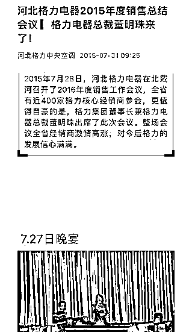

# 不干格力了，做飞利浦？董明珠“老战友”徐自发与格力产生矛盾，背后怎么回事？

> 原文：[`mp.weixin.qq.com/s?__biz=MzIyMDYwMTk0Mw==&mid=2247542745&idx=8&sn=0f7d3d95cd14649926b6f40baf214967&chksm=97cbece1a0bc65f727fa63367cf1f0c3f79d35e946eb2ff45a7eb5bf639f155ea8f5f7ee3d4c&scene=27#wechat_redirect`](http://mp.weixin.qq.com/s?__biz=MzIyMDYwMTk0Mw==&mid=2247542745&idx=8&sn=0f7d3d95cd14649926b6f40baf214967&chksm=97cbece1a0bc65f727fa63367cf1f0c3f79d35e946eb2ff45a7eb5bf639f155ea8f5f7ee3d4c&scene=27#wechat_redirect)

近日，格力电器被曝出珠海总部已经停止向河北格力经销商供货的消息。目前，消息仍在发酵，不过，格力电器方面并未对外作出更多回应，而《每日经济新闻》记者从相关渠道了解到，徐自发方面也不愿意将事情继续放大和发酵。

徐自发何许人也？在过去的很多年中，徐自发一直掌管着格力电器在河北的经销商网络，是格力在河北地区的总经销商，也是格力电器在全国范围内举足轻重的经销商之一。2007 年，格力电器引进经销商公司作为战略股东，徐自发也间接成为格力电器的股东。2015 年，徐自发进入格力电器董事会担任董事，2017 年辞职。

8 月 24 日，一位资深业内人士接受记者电话采访时表示，徐自发与董明珠的分歧是在格力电器推进渠道改革过程中发生的，“都是强势人，各执己见。”

**徐自发与格力电器“甜蜜”十多年**

徐自发或在 2002 年前后成为格力电器的经销商，因为在这一年，河北新兴格力电器销售有限公司（以下简称河北新兴格力）成立。

有熟悉徐自发的业内人士告诉记者，其实在做格力空调之前，徐自发也代理过其他品牌。选择代理经销格力品牌后，徐自发将格力空调在河北市场做大做强。

2007 年，徐自发成立河北格力电器营销有限公司（以下简称河北格力）。当年，格力集团履行股改承诺，通过股权转让引进战略投资者，由 10 家重要区域经销商组成的京海互联网科技发展有限公司（以下简称京海互联）被引入成为格力电器的股东（如下图）。启信宝显示，河北格力这些年都是京海互联诸股东中持股比例最高的一家，由此也可窥见徐自发的分量。

图片来源：公告截图

2011 年，格力电器还曾耗资 1894.01 万元，从河北新兴格力手中收购了石家庄海珠电器有限公司 100%股权。

《每日经济新闻》记者了解到，郭书战、张军督与徐自发都是格力电器经销商体系中的“红人”。但外界也关注到徐自发，还是 2015 年的事。

2015 年 5 月，经京海互联提名，徐自发被推举成为格力电器非独立董事候选人。之后成功获任。在这一年，徐自发与董明珠的距离再次拉近。

在“河北格力中央空调”公众号上，2015 年 7 月的一篇文章写下：董明珠出席了河北格力电器在北戴河举行的 2016 年度销售工作会议，该会议有全省近 400 家核心经销商参与。徐自发在会上发表讲话：“我们不能说这一生都卖给了格力，但在座的，你们这一生的生存都是格力给你创造的。大家想想一个品牌把你一个人，一个公司，一个家庭，一个家族都带动起来了，大家现在做大做强了，但也不要有懒惰的思想，必须顶着压力，把这个品牌做好。”

图片来源：公众号文章截图

2016 年 11 月，徐自发与其配偶韩凤兰、儿子徐伟在同一日增持了格力电器的股票。

时间来到 2017 年 7 月，徐自发由于违规短线交易格力电器股票收到监管机构出具的警示函。不久后的 2017 年 10 月，徐自发申请辞去上市公司董事职务。

记者还注意到，2017 年，河北格力发生一项工商变更，徐自发退出河北格力的高管名单，卸任法定代表人。2018 年其儿子徐伟通过间接持股成为河北格力的新实控人，此举颇有“子承父业”之意。

据格力电器公告，2015 年、2016 年，徐自发担任总经理的河北盛世欣兴格力贸易有限公司（以下简称河北盛世欣兴）对格力电器的采购金额分别是 26.71 亿元、24.3 亿元。

8 月 24 日，家电行业分析师刘步尘在接受《每日经济新闻》记者电话采访时表示，徐自发对格力电器传统销售模式的搭建有重要贡献，他自己也从中获益。

从格力电器董事会辞职时，徐自发与格力电器及董明珠的分歧并没发生。“河北格力”透露，徐自发在 2019 年 8 月举行的河北格力经销商峰会上还说道，格力是负责任的大品牌，对经销商的利润负责任，经销商应该坚定信念、坚定信心、相信格力。

图片来源：公众号文章截图

**产生分歧后，徐自发做了什么？**

一位资深行业人士称，徐自发与格力电器及董明珠的分歧是在格力电器进行渠道变革中产生的。“这是格力电器渠道变革过程中必然会发生的事情，不发生在徐自发身上，也会发生在其他经销商身上。事件是偶然的，但有分歧是必然的。这个事情没有谁对谁错。”

他认为，过去董明珠打造的厂家与经销商紧密捆绑的渠道模式，适合了当时的市场环境。特别是当时国美、苏宁等大连锁强势抢夺传统渠道的背景下，这种模式是非常有优势的。但进入互联网时代后，格力电器必须要转型。但同时，传统线下经销商也认为自己要生存，他们的利润在格力电器推进渠道变革中被削减。空调的前置销售（精装房前置销售）也分流掉一部分传统经销商的销售。传统经销商日子不好过，只能另谋他路。“刚好有个飞利浦空调的机会，徐自发可以自己来操作”、“（董明珠和徐自发）都是强势人，各执己见，达成一致的难度比较大。”

据第一财经，承载飞利浦空调中国运营业务的南京智浦供应链管理有限公司背后的核心投资者是徐自发。今年 8 月 9 日飞利浦空调在杭州举行的新品发布会上，徐自发是以股东代表身份出席。

另据财联社报道，8 月 20 日，徐自发在河北石家庄的一家五星级酒店举行宴会，宴请当地经销商。这场宴会上，徐自发还进一步要求经销商“如果有货（格力空调）就尽快卖掉清掉。”他也是在这场宴会上表示，不做格力了。

前述资深行业人士告诉《每日经济新闻》记者，其实徐自发本人不想让他与格力电器有分歧的消息发酵。但“在那种场合（宴会），他要号召经销商跟着他干，要振臂一呼”。

启信宝显示，截至目前，徐自发还是京海互联的董事，河北格力也还持有京海互联 28%股权。河北格力的实控人目前仍是徐伟。河北新兴格力的法定代表人依然是徐自发。河北新兴格力曾控制着 36 家格力专营店和维修站，但目前只有几家处于存续状态，其余均相继注销。

徐自发担任法定代表人的还包括北京明珠新兴格力空调销售有限公司（以下简称明珠新兴格力）。

图片来源：每经记者 朱万平 摄（资料图）

8 月 23 日，记者就格力电器停止供货联系上河北格力与河北新兴格力。河北格力的工作人员电话中表示：“不太清楚”，“公司正常运营，该怎么办怎么办，没有收到（停止供货）的消息。”

“反正我暂时不知道。”河北新兴格力工作人员也在电话中表示，公司正常经营中。记者还致电了河北石家庄一家格力门店，相关人员也表示，门店正常经营，没有收到网传消息。

8 月 24 日，记者也尝试通过飞利浦空调与徐自发取得联系，但未果。记者也向飞利浦空调方面发去对徐自发的采访提纲，不过截至发稿未收到回复。格力电器方面也对这一经销商“反目”事件未有回应。

来源：每日经济新闻  nbdnews  

欢迎关注灰产圈社群服务号

