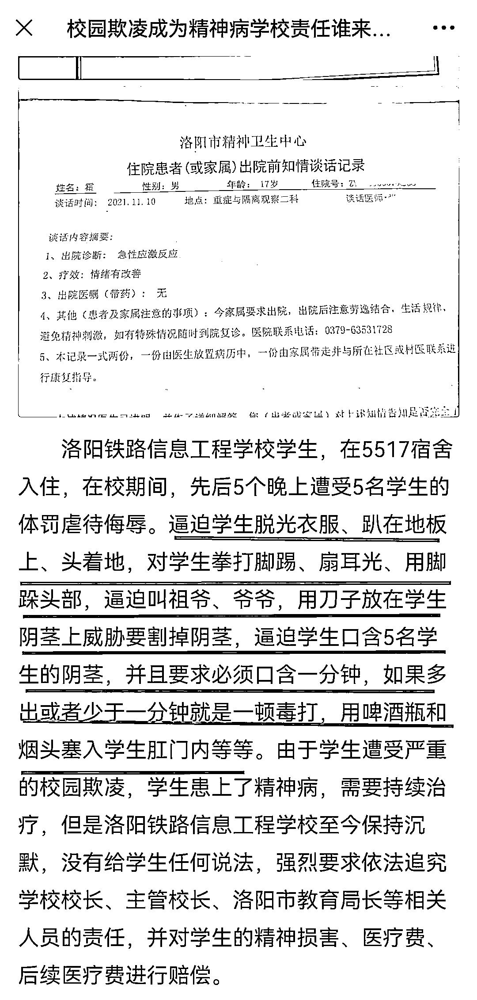
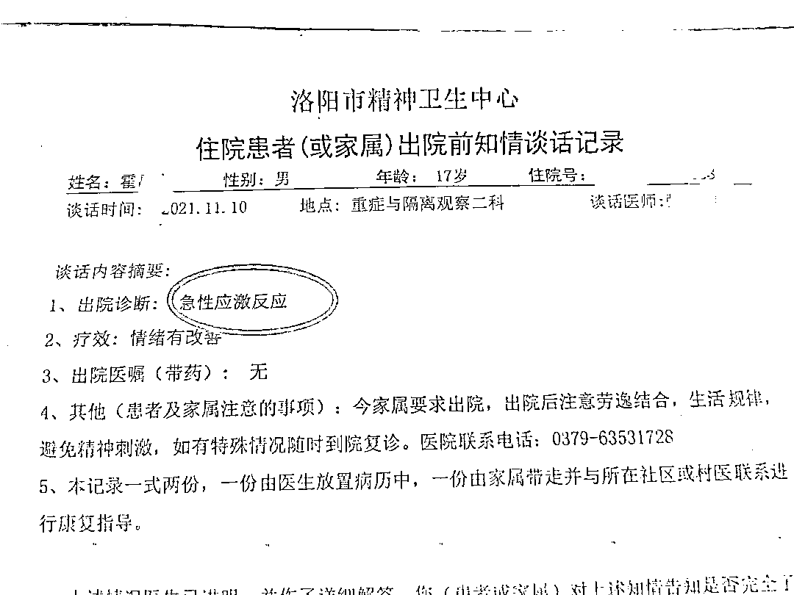
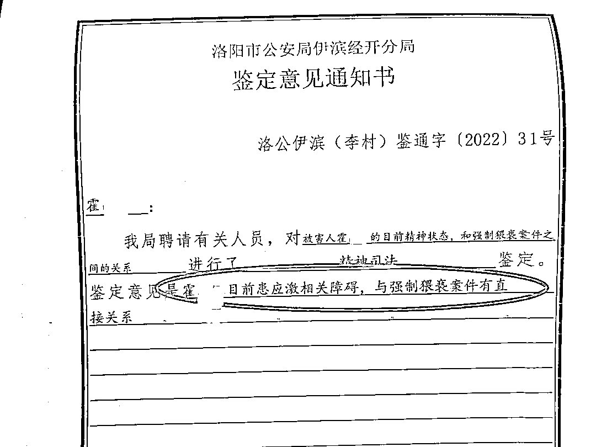
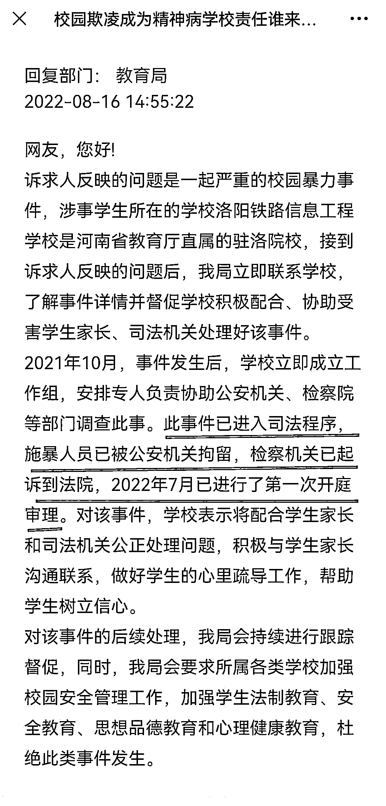

# 丧心病狂！洛阳 17 岁学生遭五名男生虐待侮辱、逼迫口 J、肛门被施暴者塞入啤酒瓶 受害学生已患上精神疾病

> 原文：[`mp.weixin.qq.com/s?__biz=MzIyMDYwMTk0Mw==&mid=2247542791&idx=1&sn=830f375fa4bcad0e18d3334cc881c5b7&chksm=97cbe33fa0bc6a297ba2f77f5f9ebdf1e82c2800c2e41742965c246b17b4b8cb8b94ccd49fe6&scene=27#wechat_redirect`](http://mp.weixin.qq.com/s?__biz=MzIyMDYwMTk0Mw==&mid=2247542791&idx=1&sn=830f375fa4bcad0e18d3334cc881c5b7&chksm=97cbe33fa0bc6a297ba2f77f5f9ebdf1e82c2800c2e41742965c246b17b4b8cb8b94ccd49fe6&scene=27#wechat_redirect)

8 月 25 日，陆火 Media 获悉，近日，有网友在“掌上洛阳”问政平台发帖称： 

洛阳铁路信息工程学校 17 岁学生霍某某，在学校住宿期间，先后 5 个晚上，遭到 5 名学生的体罚、虐待、侮辱，其中的情节简直丧心病狂……

相关网帖称，霍某某**被逼迫脱光衣物、趴在地板上、头着地，并遭到拳打脚踢、扇耳光、用脚踩头部；**

**5 名施暴男生还逼迫霍某某叫他们“祖爷”“爷爷”，用刀子放在霍某某的生殖器上，威胁要割掉霍某某的生殖器……**

更为恶劣的是，**5 名男生还逼迫霍某某口含他们的生殖器，并且要求必须口含一分钟，“如果多出或者少于一分钟，就是一顿毒打”；** 

他们还将啤酒瓶、烟头，塞入受害男生的肛门内。

相关网帖称，霍某某遭受严重的校园欺凌后，患上了精神疾病，需要持续治疗；网帖中还附上了相关的证据材料。

洛阳市精神卫生中心出具的相关材料显示，霍某某被诊断为**“急性应激反应”**。

洛阳市公安局伊滨经开分局 2022 年 4 月出具的《鉴定意见通知书》显示，**霍某某目前患应激相关障碍，与强制猥亵案件有直接关系。**

在网帖中，发帖人提出，洛阳铁路信息工程学校至今保持沉默，没有给受害学生任何说法，强烈要求依法追究学校校长、主管校长、洛阳市教育局长等相关人员的责任，并对受害学生的精神损害、医疗费、后续医疗费进行赔偿。 

对此，洛阳市教育局回应称：

诉求人反映的问题，是一起严重的校园暴力事件，涉事学生所在的学校洛阳铁路信息工程学校是河南省教育厅直属的驻洛院校；

接到诉求人反映的问题后，该局立即联系学校，了解事件详情并督促学校积极配合、协助受害学生家长、司法机关处理好该事件。

2021 年 10 月，事件发生后，学校立即成立工作组，安排专人负责协助公安机关、检察院等部门调查此事。

**此事件已进入司法程序，施暴人员已被公安机关拘留，检察机关已起诉到法院，2022 年 7 月已进行了第一次开庭审理。** 

对该事件，学校表示将配合学生家长和司法机关公正处理问题，积极与学生家长沟通联系，做好学生的心里疏导工作，帮助学生树立信心。

对该事件的后续处理，该局会持续进行跟踪督促，同时，该局会要求所属各类学校加强校园安全管理工作，加强学生法制教育、安全教育、思想品德教育和心理健康教育，杜绝此类事件发生。

公开资料显示，洛阳铁路信息工程学校创建于 1973 年，是河南省教育厅直属、以轨道交通类为主的国家级重点中等专业学校。

来源：陆火 Media， 宾曰语云  作者：陆火 

欢迎关注灰产圈社群服务号

