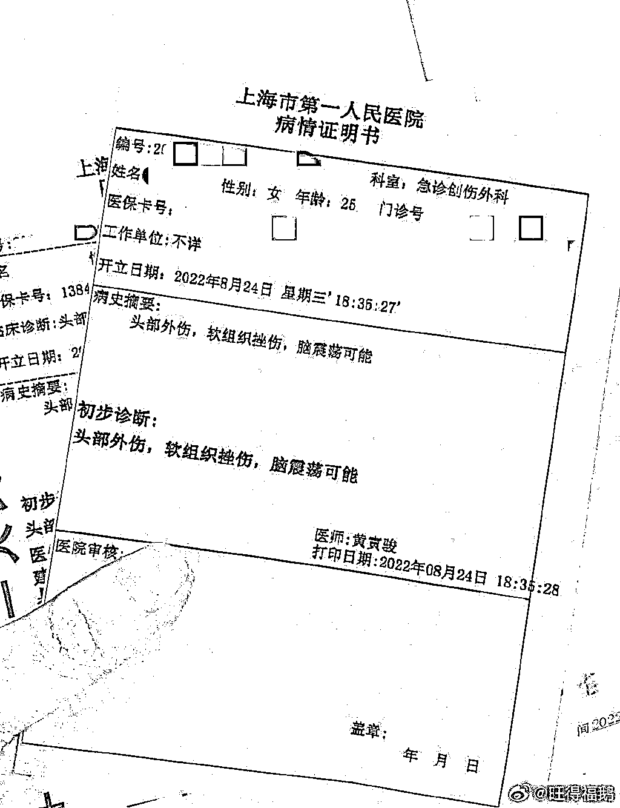
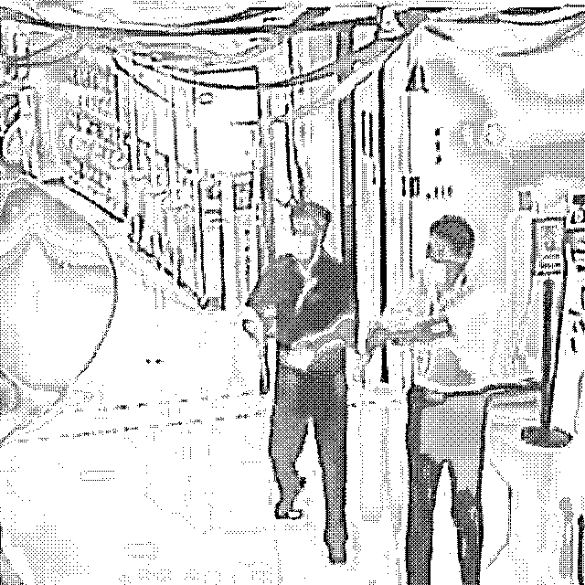
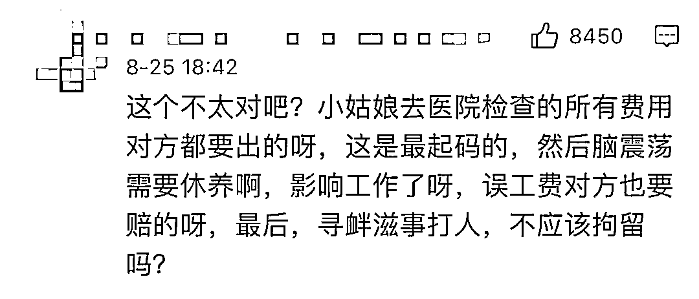
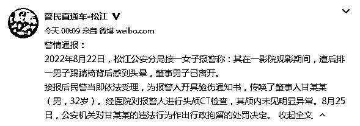
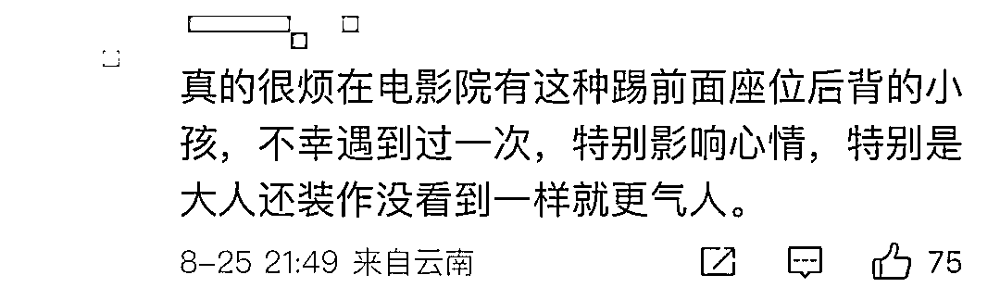
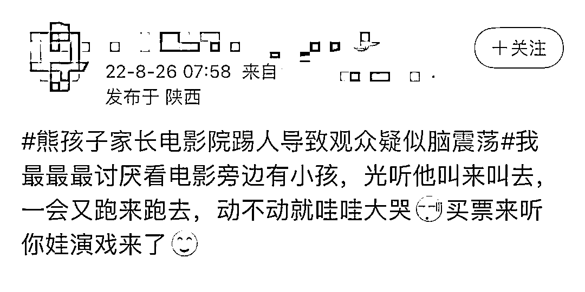
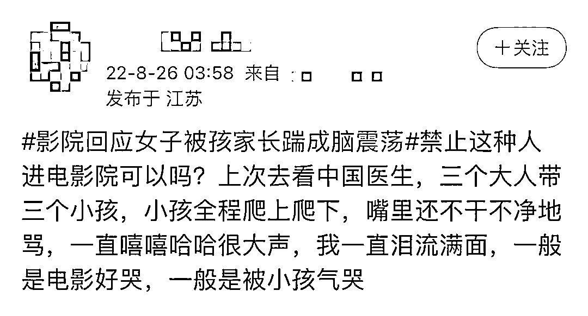

# 看电影把前座观众踹成脑震荡，“熊家长”太无理！

> 原文：[`mp.weixin.qq.com/s?__biz=MzIyMDYwMTk0Mw==&mid=2247542791&idx=7&sn=93a2c2a4276e146cb16e4968ece7883c&chksm=97cbe33fa0bc6a2973d128d01a6d201616be678e74b2dbd127e4665b675ed254f9414193c2ac&scene=27#wechat_redirect`](http://mp.weixin.qq.com/s?__biz=MzIyMDYwMTk0Mw==&mid=2247542791&idx=7&sn=93a2c2a4276e146cb16e4968ece7883c&chksm=97cbe33fa0bc6a2973d128d01a6d201616be678e74b2dbd127e4665b675ed254f9414193c2ac&scene=27#wechat_redirect)

近日，一女子发微博控诉，

自己在影院观影时， 

后排小孩一直在踢自己的椅背，

**女子起身制止，无果，**

**小孩父亲却怒了，**

**用力踹向了女子靠背，** 

导致女子当场“眼冒金星”。 

回家后，女子仍感不适， 

出现了暂时性昏迷，

**经医院检查，** 

**女子“头部外伤，软组织挫伤，**

**存在轻微脑震荡可能”。**

女子称，自己试图与男子沟通， 

**对方不仅没有愧疚之意，** 

**还对其发出人身威胁。**

监控视频显示，

出影厅后，

**当着影院工作人员的面，**

**该男子仍旧怒气冲冲，**

**“信不信我一巴掌打死你？”**

一番冲突过后，

携妻儿扬长而去。

养不教，父之过，

亲自动手，错上加错。

**警方：已将该男子行政拘留**

事发后， 

女子当即选择了报警，

做完笔录，又去验了伤， 

没想到第二天来到警察局沟通，

该男子气焰还是那么嚣张，

**不承认自己踹了椅子，**

**并称“只出 200”。**

这般态度， 

让网友都“看不懂”了。

明明有监控作证， 

**男子却对自己的所作所为矢口否认，**

女子当即拒绝接受调解， 

并重申了自己的诉求：

**让男子赔礼道歉，** 

**并承受应有的处罚。**

8 月 25 日，警方发布公告，

**已对肇事人甘某某，**

**作出行政拘留的处罚决定。**

**“熊家长”比“熊孩子”讨厌多了**

**“熊孩子”大闹电影院，**

**已经不是什么新鲜事了，**

踢椅背、吵闹、到处乱跑...... 

几乎每个人，

都遇到过这种不文明现象，

在这条新闻下， 

许多网友都忍不住“倒苦水”， 

倾诉自己的遭遇。

这些愤怒， 

**多半来自于家长的不闻不问，**

一句“小孩能有多大力气”，

就试图轻描淡写地掩盖不文明行为。

“熊家庭”的不文明观影行为，

由司法机关介入，

也不是第一次了。

2021 年 5 月 1 日，广东东莞，

**影厅银幕被“熊孩子”推踢损坏，**

工作人员报了警；

同月，河南洛阳，

银幕被熊孩子拍打损坏，

孩子的监护人坚称，

**“影院未提醒银幕不可触摸拍打，**

**孩子身心受到影响”，**

**拒绝赔偿。**

**小孩做错在先，**

**家长还“火上浇油”，**

这样的教育方式令人担忧。

**看电影遇到熊孩子，**

**该咋办？**

星轶 STARX 影剧院经理凤维强告诉记者，

观众若遇到这种情况， 

**可以寻求影院工作人员的帮助。**

从事法律工作的魏先生也表示，

**建议影院制定“观影公约”，** 

**并摆放在入口处，告知观众，** 

**要求家长对孩子的行为负责。** 

同时，也建议影院**加强巡视工作，**

防止更多类似事件发生。 

对于年龄尚幼的小孩来说， 

一堂课 40 分钟，

他们都坐不住，

更何况动辄一两个小时的电影。

**家长带娃，** 

**应当选择适合孩子看的影片，** 

**观影过程中，**

**更要以身作则，言传身教。**

这个时候说“别跟孩子计较”， 

才是害了孩子。

看电影的时候， 

你遇到过什么不文明的现象？

评论区说说↓↓↓

来源：央视网综合上观新闻、中国新闻周刊、极目新闻、北京青年报、上游新闻

欢迎关注灰产圈社群服务号

