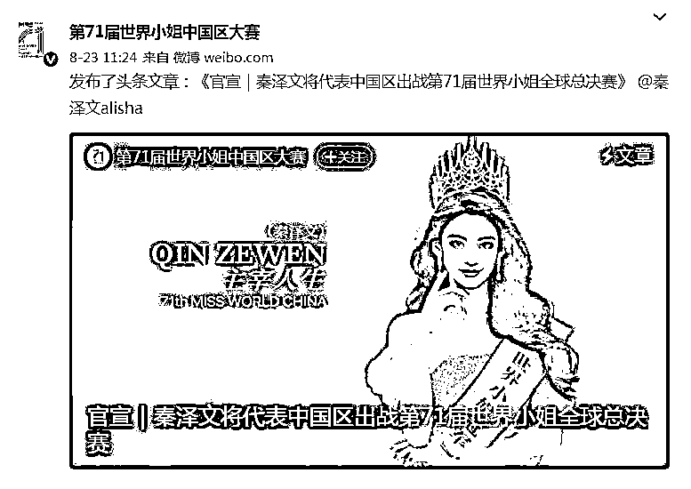
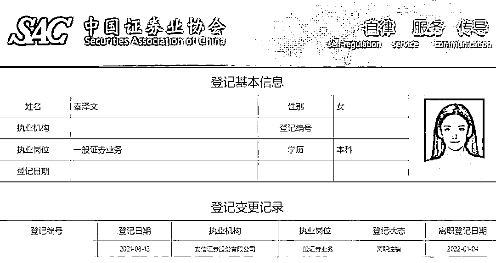
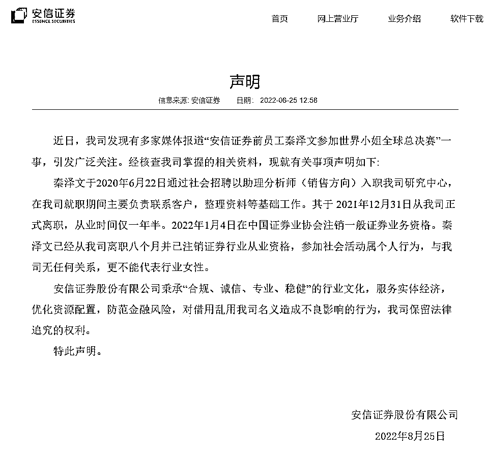
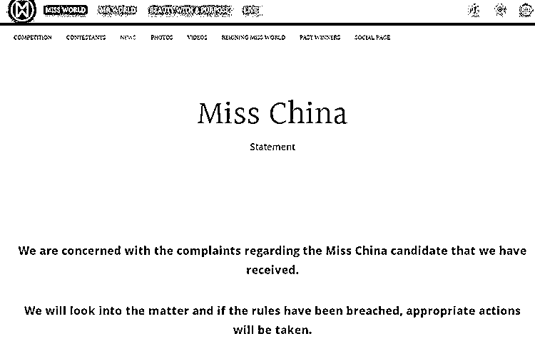
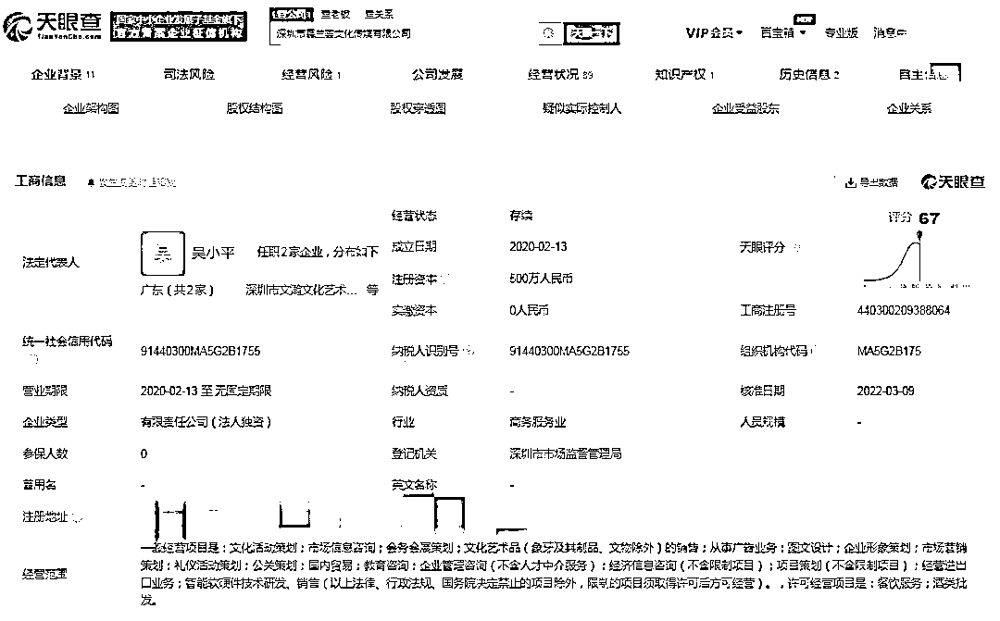
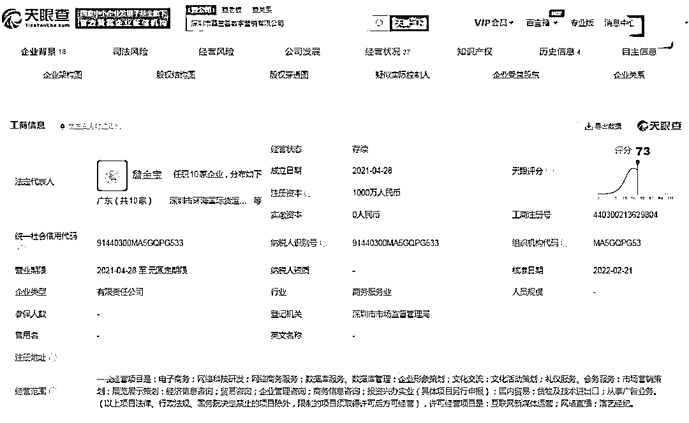

# 陷入造假争议的“美女分析师”啥来头？谁在办选美赛？

> 原文：[`mp.weixin.qq.com/s?__biz=MzIyMDYwMTk0Mw==&mid=2247542791&idx=8&sn=4984df1ea2b67ec11353c6e7ad83d045&chksm=97cbe33fa0bc6a2915f5374c7ee7c45eaa5b35074d2135be9db24e552abfb372e4df8f3de58b&scene=27#wechat_redirect`](http://mp.weixin.qq.com/s?__biz=MzIyMDYwMTk0Mw==&mid=2247542791&idx=8&sn=4984df1ea2b67ec11353c6e7ad83d045&chksm=97cbe33fa0bc6a2915f5374c7ee7c45eaa5b35074d2135be9db24e552abfb372e4df8f3de58b&scene=27#wechat_redirect)

近日，“第 71 届世界小姐中国区大赛”微博发文称，秦泽文将代表中国区出战第 71 届世界小姐全球总决赛。不过，文章中关于秦泽文过往经历的介绍，引起了网友关于秦泽文“是否学历造假”、“参赛资格是否合规”等话题的讨论。

“分析师”、“选美小姐”……秦泽文究竟是谁？中国区大赛背后是谁在主办？

截图自微博

**学历争议：本科还是硕士？** 

**“第 71 届世界小姐中国区大赛”微博 8 月 23 日发布的文章称，秦泽文出生于 1997 年，自幼学习各项才艺的秦泽文擅长舞蹈、钢琴、京剧，曾荣获华东地区拉丁舞锦标赛金牌。**

**该文章还称，在学业上，秦泽文敢于突破自己，从计算机工程专业跨行攻读金融专业的硕士学位。在工作上，秦泽文亦先后加入甲骨文、普华永道知名企业实习，并在安信证券担任分析师，团队数年是新财富最佳分析师计算机行业第一名。在生活上，秦泽文十分热爱公益事业，将蕴含着“正能量”的善意内化为自己的生活习惯。**

**不过矛盾的是，据多家媒体报道，秦泽文在中国证券业协会网站登记的基本信息显示，其学历为本科。**

**8 月 25 日，中新财经尝试通过该网站查询秦泽文的登记信息，但已经显示：查询无数据。**

****

**图自媒体报道**

****资质争议：是否是分析师？****

****据媒体报道，中国证券业协会网站公示的登记信息还显示，秦泽文曾供职于安信证券，登记时间为 2021 年 8 月 12 日至 2022 年 1 月 4 日，共 4 个多月。但秦泽文的执业岗位为“一般证券业务”，并未取得分析师资质。****

****安信证券 8 月 25 日发布声明称，经核查公司掌握的相关资料，秦泽文于 2020 年 6 月 22 日通过社会招聘以助理分析师(销售方向)入职公司研究中心，就职期间主要负责联系客户，整理资料等基础工作。其于 2021 年 12 月 31 日正式离职，从业时间仅一年半。2022 年 1 月 4 日在中国证券业协会注销一般证券业务资格。秦泽文已经从公司离职八个月并已注销证券行业从业资格，参加社会活动属个人行为，与公司无任何关系，更不能代表行业女性。****

****安信证券还称，对借用乱用公司名义造成不良影响的行为，安信证券保留法律追究的权利。****

********

****图自安信证券网站****

******资格争议：未进前三递补？******

******在官宣秦泽文参赛前，“第 71 届世界小姐中国区大赛”微博曾在 8 月 14 日发布通告称，近段时间，第 71 届世界小姐中国区组委会收到针对原第 71 届世界小姐中国区总冠军阮玥的举报信。经调查发现，总冠军阮玥存在违反世界小姐“促进世界和平、树立杰出妇女榜样”宗旨的系列不当行为，经过组委会委员表决，决定取消阮玥选手在第 71 届世界小姐中国区赛事中所取得的全部荣誉，禁止其使用比赛的任何头衔。******

******而“第 71 届世界小姐大赛”公众号在 2021 年 11 月 16 日发布的文章显示，该届世界小姐大赛中国区总冠军为阮玥，亚军为唐苏苏，季军为胡可瑜。******

******该文章中还出现了东部、西部、南部、北部、中部五个赛区的冠、亚、季军的名字，但并未出现秦泽文的名字。******

******那么，秦泽文是如何获得资格代表中国区出战全球总决赛的？这也成为争议之一。******

********经历争议：两次修改资料？********

******据证券时报报道，“第 71 届世界小姐中国区大赛”官方曾两次修改文章，第一次删去了秦泽文“民生证券分析师”的经历，第二次则删去了“硕士学历”的信息。******

******在第一个版本中，除了安信证券的从业经历，还提到秦泽文曾在“民生证券担任分析师”。不过据证券时报报道，秦泽文并未加盟过民生证券，其当时所写的民生证券从业经历或为实习经历。******

******在第二个版本中，官方这样介绍：秦泽文出生于 1997 年 7 月，身高 173 厘米，硕士学历。同时文章还提到：在学业上，秦泽文也敢于突破自己，从计算机工程专业跨行攻读金融专业的硕士学位。******

******而在 23 日的第三个版本中，官方将“硕士学历”的信息删去，新增了体重等信息。仍保留了“在学业上，她也敢于突破自己，从计算机工程专业跨行攻读金融专业的硕士学位”。******

********世界小姐官方回应********

******世界小姐官网 8 月 24 日发布声明称，对收到的有关世界小姐中国区候选人的投诉表示关注，并将调查此事，如果违反规定，将采取适当行动。******

************

******图自世界小姐网站******

********是谁在主办中国区大赛？******** 

******“第 71 届世界小姐大赛”公众号发布的文章显示，第 71 届世界小姐中国区主席为詹金宝，主办方为深圳市慕兰荟文化传媒有限公司和深圳市慕兰荟数字营销有限公司。******

******国家企业信用信息公示系统显示，深圳市慕兰荟文化传媒有限公司成立于 2020 年 2 月 13 日，法定代表人为吴小平，注册资本 500 万元。因通过登记的住所或经营场所无法联系，该公司于 2022 年 2 月 9 日，被深圳市市场和质量监督管理委员会南山局列入经营异常名录。******

******另外，天眼查显示，该公司实缴资本 0 元，参保人数为 0。******

************

******图自天眼查网站******

************

******图自天眼查网站******

******而深圳市慕兰荟数字营销有限公司成立于 2021 年 4 月 28 日，法定代表人为詹金宝，注册资本 1000 万元。******

******天眼查显示，该公司实缴资本 0 元，也曾在 2022 年 2 月 9 日因登记的住所或经营场所无法联系而被列入企业经营异常名录。2022 年 2 月 21 日该公司办理住所（经营场所）变更登记，被移出经营异常目录。******

******来源：中国新闻网，澎湃新闻******

************

******欢迎关注灰产圈社群服务号******

************

************