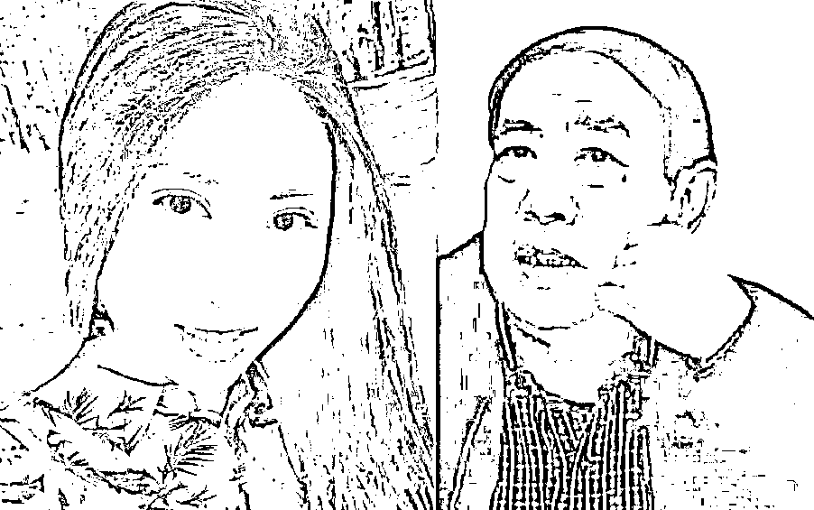

# 贾浅浅高考 200 多分，却上 211（她的诗曝光，震惊了网友）

> 原文：[`mp.weixin.qq.com/s?__biz=MzIyMDYwMTk0Mw==&mid=2247542844&idx=1&sn=01887b794b4ec74a3abe16daf31cdd1c&chksm=97cbe304a0bc6a12ecf89d4eeb70ff29ebb15140970c966e8289958a33b6e4be8d330c189ef0&scene=27#wechat_redirect`](http://mp.weixin.qq.com/s?__biz=MzIyMDYwMTk0Mw==&mid=2247542844&idx=1&sn=01887b794b4ec74a3abe16daf31cdd1c&chksm=97cbe304a0bc6a12ecf89d4eeb70ff29ebb15140970c966e8289958a33b6e4be8d330c189ef0&scene=27#wechat_redirect)

**贾浅浅高考 200 多分，却上 211，还当了教授** 

“现在什么屎尿文学都能进作协了？”

近日，中国作协公布会员拟发展名单，其中贾平凹的女儿贾浅浅赫然在列，引得一众网友吐槽。

 
单听贾浅浅的名字，可能很多人都得说“这是谁？没听过啊”，但是对她的父亲贾平凹就很熟悉了。

靠着自己以及父亲的努力，贾浅浅顺利地成为了当代作家、诗人，甚至还成为了某某学院副教授、某某作协副主席。

 
原以为有如此多的荣誉在身，又有贾平凹如此优秀的父亲，贾浅浅的作品不能说“长江后浪推前浪”，也会被大众所推崇。

 
但是当网友看到贾浅浅的“诗”时，竟异口同声地表示“重口味”、“实在不敢恭维”、“这是什么屎尿文学”……

确实，打眼一看，除却屎尿，就是情色，总之，俗不可耐。

这不禁让人回想起贾平凹听见自家女儿要出诗集时，着急忙慌阻拦的样子：“写诗我不反对，但是得先过好日子，做好人，不要把生活诗化了。”

贾平凹的意思显而易见：人生在世，首先得做好人，其次才是“写诗”；不要把生活诗化，也不能把诗生活化。

但是如今看来，贾平凹说得还是太隐晦，贾浅浅并未意会到父亲的意思，一头扎进了诗词的海洋里，沉浸其中，怡然自得。 当然，也有支持贾浅浅的人，直言贾浅浅的艺术作品本就不是给普通老百姓看的，要有一定的艺术修养，才能看得懂，看似粗鄙的文字背后是深厚的文学道理。

中国作协也说了，文学理应雅俗共赏，既要有“阳春白雪”也得有“下里巴人”。

其实客观来说，贾浅浅自娱自乐写写诗，抒发一下自己的情感没有什么，网友虽有批判，但不至于抵制。

可是她的名字竟然出现在了 2022 年中国作协拟发展名单上，这就很耐人寻味了。

发展到这地步，已经不是“什么屎尿文学都能入作协”的事儿了，而是现在作协都兴起“世袭”了？仅仅因为她是贾平凹的女儿，就能如此轻易地进作协？

虽说百度百科上她是某某名校毕业生，是某某学院教授，是某某作协副主席，但是据有心网友爆料，贾浅浅的高考分数不过 250 分，别说是名校了，能进个普通专科就不错了；

贾浅浅高考 250 分，却能考上 211，还能当上教授，主要工作是研究她爹！

这个贾浅浅，1998 年参加高考，有人扒出了她的高考分数，250 分！就是凭借这样的成绩，她考入了 211 大学--西北大学！当年这个学校的录取分数线，这贾浅浅的高考分数，就是再乘以 2，都难以录取，而且当时也没有什么特长招生，神奇的是，她就是考上了！

更神奇的是，她后来还进入了陕西师范大学读硕士研究生，毕业之后，又到了西安建筑科技大学，当上了大学老师，她的研究方向，就是研究她爹！我不是骂人，就是研究她爹贾平凹的作品，到了 2018 年，她又回到了西北大学任教。

看看，高考 250，但就是这么牛，国内大学任她遨游，就这样的成绩，这样的水平，居然当上了老师、教授，这不是扯吗？这样的老师，能教出来什么样的学生？很多学生费尽千辛万苦，考出了好成绩，进入到 211 大学，结果她的老师居然没有他们的水平高，这不是误人子弟吗？

再说，她爹有什么好研究的？还教别人研究她爹，这算什么呀！

不过话说回来，这一切，还都是因为她爹，毕竟那是作协副主席，到哪里都得给个面子不是？正所谓，一人得道，鸡犬升天！对于作协让她加入，也很正常，毕竟都是自己人。

所以，别指望作协能做出什么改变，我们的质疑，根本就不起什么作用，不过让他们父女出出名，还是可以的。他们父女，也算是中国文坛的奇葩了！ 

另外，贾浅浅的论文作品全部都是围绕着自己的父亲贾平凹来写的，抛去父亲的荣光，她真正的作品还剩几何？

甚至就连央媒都看不下去了，站出来发声：文学不应该世袭！

至此，贾浅浅和中国作协都被推到了风口浪尖上，历经网络“风风雨雨”，中国作协也挺不住了，只好现身发声：都是按流程进行的，并非最终名单。

但是最终结果如何，我们还不得而知。

或许，我们平凡人终究是看不懂那些诗人的所谓大作，所谓精神内核吧，但是如果一个作品不能被广大群众所接受，那它的存在的意义又在哪里呢？

我们来看看贾浅浅的诗歌吧，引起质疑争论是有原因的，特别是这几首，内涵真的有点丰富，建议将作品标注：少儿不宜。

一、《黄瓜，不仅仅是吃的》

原文：

寂寞的时候

黄瓜

无疑是全天下最好的。

我们从小就知道黄瓜是用来吃的，尤其是黄瓜用来泡酸后特别好吃，又或者是黄瓜炒肉也很好，再后来就是把黄瓜切片用来当面膜使用。

对于说寂寞时候的用法，是否太有内涵了？通常来说，作诗有即兴的，有深刻体会的才能写出好诗，固然有文学根底，没有丰富的生活体验很难作出真情流露的作品。

当然，这也不是一般读者能悟透的。

二、《雪天》

原文：

我们一起去尿尿。

你，尿了一条线。

我，尿了一个坑。

在漫天飞雪之季，我们可以想象得到，内心也充满了雪花纷飞的景象，多美啊！

但是，看了这首诗，读了几遍，总感觉看到的不是美，而是低俗到极点，非要拿“尿”这点事来说明是《雪天》吗？

看来这一点，我们普通人也难以衡量什么叫做新诗。

三、《真香啊》

原文：

上午同事们一起把饭吃

一个同事当众抠鼻屎

她喊了声“不要擦拭”

另一个同事见状

抢上前去抓过那同事的手指

一边舔还一边说

真香啊！你的鼻屎

大家有没有觉得这是“毒教材”？在家里有时看到小孩也是这个动作，说了几次说不要吃，但还是偷偷来，是不是受了该诗影响呢？

我们都知道，这“鼻屎”是污垢肮脏的，为什么要抢，为什么还“真香啊！”？用意何在？

这就是我们不懂的新文学吗？

四、《日记独白》

原文：

迎面走来一对男女

手挽着手

女的甜蜜地把头靠在那男人肩上

但是裙底下

两腿间流出来的东西

和那男人的气味

深深地混淆在一起。

我们从小学开始，老师一般就有教写日记，并且坚持每天写，把一天遇到的人和事都记录下来，不仅可以练习写作，也可以在生活中学习，从而提高自己的人生修养和能力。

五、《z 小姐和 z 先生》

原文：

他们彼此利用黑暗侵蚀白昼的光芒

z 先生病倒了，她抱着一岁多的孩子

望着病床上唇色乌青的那个称作丈夫的人

是的，他们已经很久没有那个了！

z 是同一个字母拼音还是同一个姓，也只有作者才知道，夫妻之间因为照顾一岁多的小孩，丈夫累倒了，妻子为何还有那种“想法”？

抱着一岁多的孩子、那个称作为丈夫的人、病床上，所有这些只为表达很久没有？太有内涵了！

六、《告诉你》

原文：

我唯一的土地

就是我的身体

你要来就来吧

它只长花朵，种不出庄稼。

诗人内心的每一个念头，似乎都充满了诗情画意，有点似醉非醉的感觉，说了，好像又没说，时而直接了当，时而约隐约现，总之，一切用意尽在字里行间。 

七、《希望》

原文：

我已经没有欲望

再驻足观望

去他妈的

我摇晃得更厉害

在不知要走到何处的路上

我向老天，竖起了中指。

这是一种发泄，奔放，甚至用了老外的方式指向了老天，简单、通俗表达了自己，但使用摇晃似乎有点内涵。

贾浅浅（中）

看了贾浅浅这几首诗，我们也不得不否认她的胆量，作为一个当代女“诗人”，父辈是著名作家，文学应该从小就接触，心里是肯定有着一般人没有的墨水，懂得应该不比一般人少。

诗句采用直白、通俗易懂的语句，没有深奥难测之词，让人一看就懂，但是，有些确实不雅，真有点少儿不宜在其中。

也正因为如此，网友们纷纷表示质疑，甚至怕教坏了青年小朋友，建议定其为少儿不宜，或者只是个人即兴发挥，但也不能当作是一种文学吧？  

来源：和美之音

欢迎关注灰产圈社群服务号

