# 刷爆全网的图是 P 的，制作者致歉！

> 原文：[`mp.weixin.qq.com/s?__biz=MzIyMDYwMTk0Mw==&mid=2247542844&idx=3&sn=3b7bc8cf1e7815b256eff0419e1be70e&chksm=97cbe304a0bc6a12d87d2986f2b3b78f9d6af5752d2b8f05e86ddae59aadd373abf4eca30d4c&scene=27#wechat_redirect`](http://mp.weixin.qq.com/s?__biz=MzIyMDYwMTk0Mw==&mid=2247542844&idx=3&sn=3b7bc8cf1e7815b256eff0419e1be70e&chksm=97cbe304a0bc6a12d87d2986f2b3b78f9d6af5752d2b8f05e86ddae59aadd373abf4eca30d4c&scene=27#wechat_redirect)

## 

## 

## 

“胜利啦！”8 月 25 日深夜，重庆缙云山上，欢呼声此起彼伏。至此，燃烧了 5 天的山火终于败了。火情当前，救援力量不断汇聚，一批“摩托骑士”尤为引人关注。

<mpvideosnap class="js_uneditable custom_select_card channels_iframe videosnap_video_iframe" data-pluginname="videosnap" data-id="export/UzFfAgtgekIEAQAAAAAAmakr5wqxXQAAAAstQy6ubaLX4KHWvLEZgBPE3KMofDUZF9KCzNPgMIsTQSzQFBNqSxns7kTfzBhx" data-url="https://findermp.video.qq.com/251/20304/stodownload?encfilekey=rjD5jyTuFrIpZ2ibE8T7YmwgiahniaXswqz7ra3ZOu8TcW7BJNeJU6eJ6sbiaLPnwicia5ib6nU5dWyDPGTKtjfdE5AgyT8RukfTdAKMkwP1q9aZdExLcM2Iic4Eibg&amp;adaptivelytrans=0&amp;bizid=1023&amp;dotrans=0&amp;hy=SH&amp;idx=1&amp;m=&amp;scene=0&amp;token=AxricY7RBHdXHqh4ibHfx2FvqiaddbKZicvlQs130iafjmMricFncqgayTzbju1Qnpl0wcHlawF3zAye8" data-headimgurl="http://wx.qlogo.cn/finderhead/ibq4aVwOt6HNqrr8OD3sCviaytF3B8TqCwHicxsuIanAJo/0" data-username="v2_060000231003b20faec8c6e48a1acbd3ce04ef33b077a1e41d0d3794ed88ea537878dbe65910@finder" data-nickname="灰产圈+" data-desc="重庆崽好样的#山火#重庆山火#灭火英雄@灰产圈+ " data-nonceid="4014718073462799586" data-type="video" data-width="1080" data-height="1456"></mpvideosnap>

近日，一张重庆山火中“穿越火线”的摩托车图片被热传。 

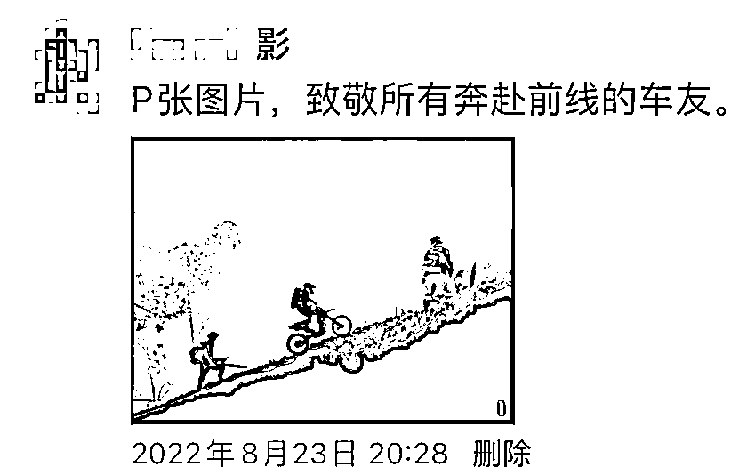

然而，这张图片并非真实的现场图片，而是经软件后期合成。制作者小影说，她在发布这张图片时，曾说明系后期制作，但在后续的传播中，这一点却被忽略了，且传播速度超出了她的想象。

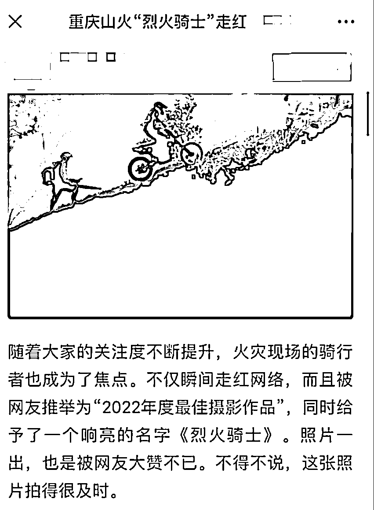

小影合成的图片被一些网友当作摄影作品

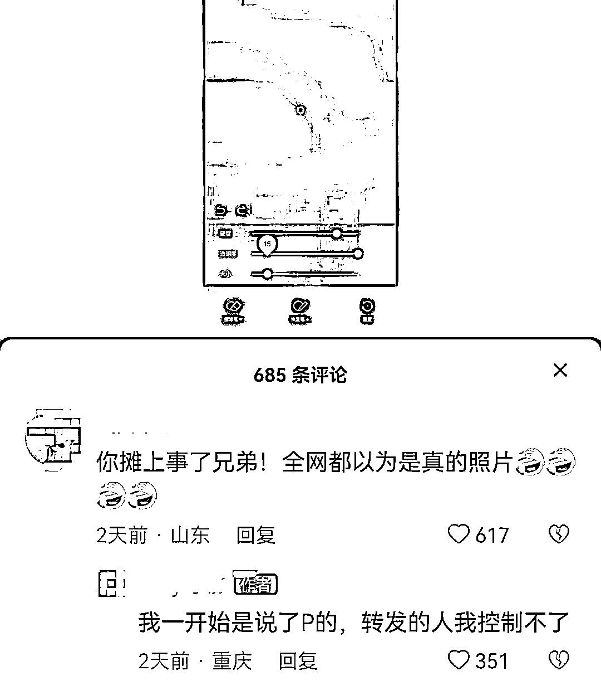

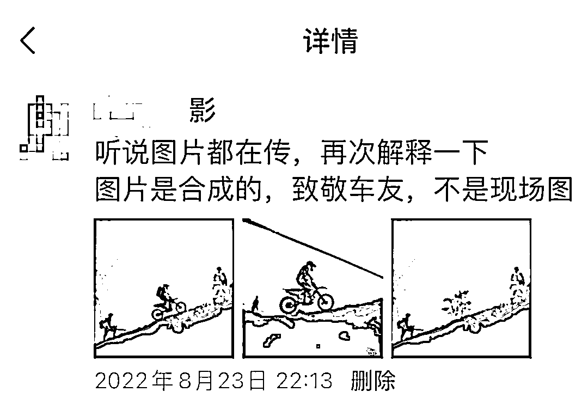

目前，制作者小影已发文致歉：

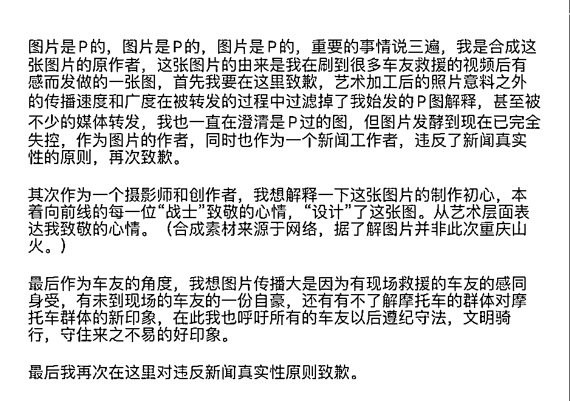

她表示，制作这张图片的初衷只是想通过艺术的方式为“前线”的车友打气，纪念“摩托车”在此次山火救援中起到的作用。

**网友：图片很正能量，不需要道歉**

**更多报道：** 

今日

北碚“8·21”火场前线指挥部消息

8 月 26 日 8 时 30 分

经各方救援力量奋力扑救

**重庆北碚区与璧山区交界火场明火全部扑灭**

参战队伍正在组织纵深清理

灭火后 72 小时坚守巡查工作有序开展

继续严格执行森林防火封山令

目前，涉火区域生活秩序正逐步恢复

起火具体原因和过火面积正在调查中

据媒体报道，对于北碚山火还没完全扑灭的原因，据现场参与灭火的云南省森林消防总队消防人员的观察和分析，**首先是当地气温非常高，最高气温达 42 摄氏度，火线边上温度可能达到 60 摄氏度左右。其次，山形地势特别复杂，风力非常不稳定，导致每次扑灭后，因为多种客观因素，容易产生新的火场。**

<mpvideosnap class="js_uneditable custom_select_card channels_iframe videosnap_video_iframe" data-pluginname="videosnap" data-id="export/UzFfAgtgekIEAQAAAAAAb90G4vOgNQAAAAstQy6ubaLX4KHWvLEZgBPE0KMwVEIaFNKCzNPgMIvYYKE1bACK9ppVZ3Oe5NsX" data-url="https://findermp.video.qq.com/251/20304/stodownload?encfilekey=S7s6ianIic0ia4PicKJSfB8EjyjpQibPUAXolDAba2pCzF0Jz61Byn56zmJuVRIecmZxum8hIIJFLnCehJiboDYPRv6HPT40ibiatrYXADuSVonvqeuMbxztXzpw7w&amp;adaptivelytrans=0&amp;bizid=1023&amp;dotrans=0&amp;hy=SH&amp;idx=1&amp;m=&amp;scene=0&amp;token=x5Y29zUxcibCr1o6fwm7FDBVOH68ExXwFmuxFbuImkXkPpNxm2xCeRsOFQ4wZu7ypLYuwlks2ZEo" data-headimgurl="http://wx.qlogo.cn/finderhead/ibq4aVwOt6HNqrr8OD3sCviaytF3B8TqCwHicxsuIanAJo/0" data-username="v2_060000231003b20faec8c6e48a1acbd3ce04ef33b077a1e41d0d3794ed88ea537878dbe65910@finder" data-nickname="灰产圈+" data-desc="那里本没有路
是无数志愿者的脚步
那路本没有灯
是无数志愿者的头灯
照亮了重庆儿女用身躯     
铸造的防火长城
8 月 25 日 23 时，经过各方救援力量奋力扑救，重庆市北碚区歇马街道山火明火已有效封控。#重庆山火#山火#灭火@灰产圈+ " data-nonceid="2408001872508913134" data-type="video" data-width="856" data-height="480"></mpvideosnap>

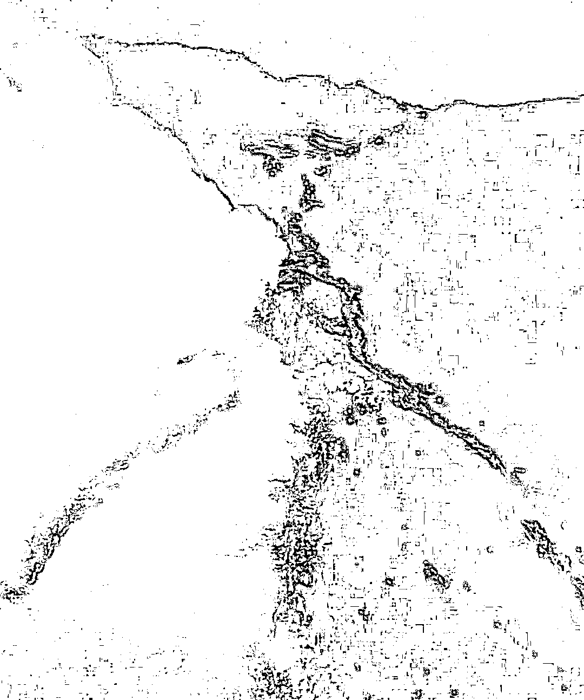

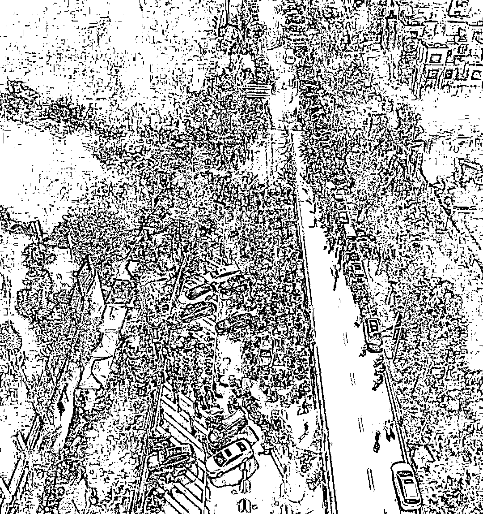

图自@摄影周瑄

纵然山火无情，人亦无惧，重庆山火中涌现的一个个平民英雄感动了无数网友。

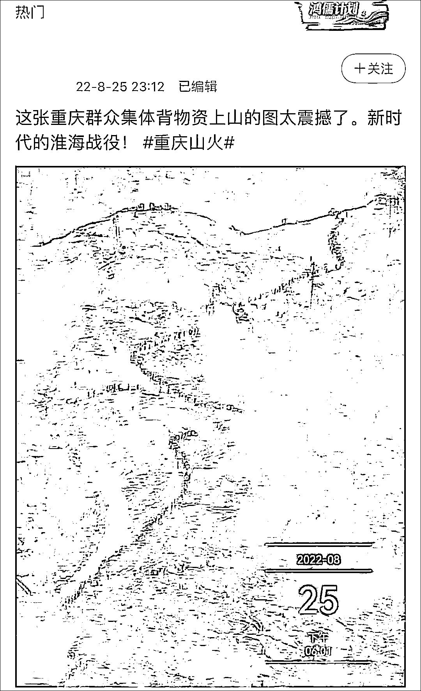

除了前方抗击山火的战士，在后方，人民群众心疼前方战士，自觉为战士们送水送粮，尽可能尽上自己的一份力。

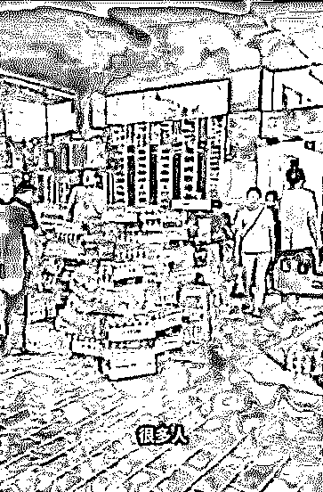

<mpvideosnap class="js_uneditable custom_select_card channels_iframe videosnap_video_iframe" data-pluginname="videosnap" data-id="export/UzFfAgtgekIEAQAAAAAAoqMTtkDZSAAAAAstQy6ubaLX4KHWvLEZgBPElaMgKkEREdKCzNPgMIt3kWsnIUNby9QJoTAADRGG" data-url="https://findermp.video.qq.com/251/20304/stodownload?encfilekey=rjD5jyTuFrIpZ2ibE8T7YmwgiahniaXswqz5AFTHuKBL8riahIT8z9pwMVADU0QxicemXQIctcJ8fMyBGAgwoibAuSWbqszRV2e61O0Z8uvuOEnJxjia7llrYs2KA&amp;adaptivelytrans=0&amp;bizid=1023&amp;dotrans=0&amp;hy=SH&amp;idx=1&amp;m=&amp;scene=0&amp;token=AxricY7RBHdXHqh4ibHfx2FjeGOZuD6pyOg6Rq3SUyxBok4Z9mLH7vWQ9CkvSfPib7nBqHIff7BvOk" data-headimgurl="http://wx.qlogo.cn/finderhead/ibq4aVwOt6HNqrr8OD3sCviaytF3B8TqCwHicxsuIanAJo/0" data-username="v2_060000231003b20faec8c6e48a1acbd3ce04ef33b077a1e41d0d3794ed88ea537878dbe65910@finder" data-nickname="灰产圈+" data-desc="灭山火的人民战争！#山火#重庆山火@灰产圈+ " data-nonceid="8542420461970697177" data-type="video" data-width="544" data-height="960"></mpvideosnap>

截至 8 月 25 日 19 时，巴南区、万州区、黔江区、潼南区、大足区与铜梁区交界火场、丰都县、云阳县明火已相继扑灭，无人员伤亡，未造成重要设施损毁。

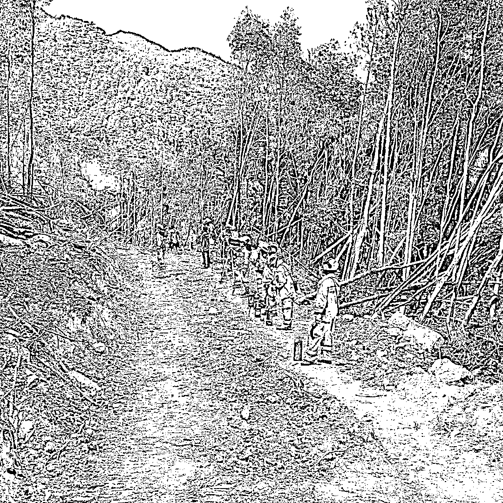

北碚区综合救援队正在砍隔离带 图源：微信公号“重庆应急发布”

消息称，8 月 23 日 19 时许，重庆长寿区万顺镇垭口村曾家沟突发山火。市、区两级迅速启动应急预案，组织应急力量紧急扑救。**截至目前，火场明火已全部扑灭，无人员伤亡。**

8 月 25 日上午，重庆市应急局又协调云南大理、普洱消防救援队伍和武警重庆总队第一值勤支队官兵 600 余人增援长寿山火扑救，两架直升飞机参与集中灭火。志愿者和周边村民、热心市民积极捐助物资、运送物资，协助疏散交通，为扑灭山火提供了有力保障。

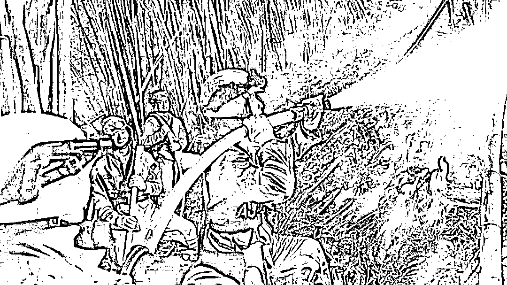

24 日 20 时，云南再增援 432 人奔赴重庆扑救森林火灾 图片由云南省森林消防总队提供

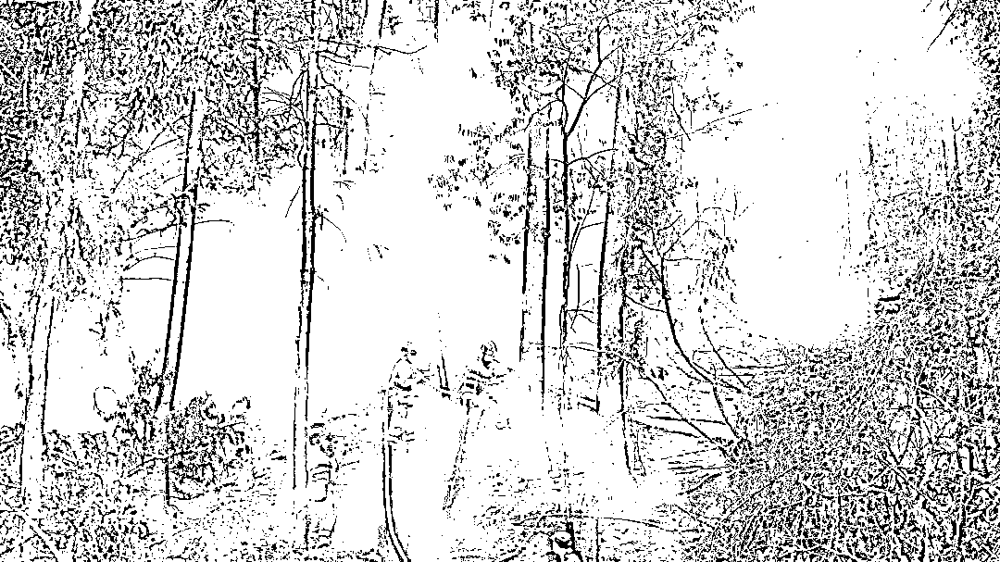

<mpvideosnap class="js_uneditable custom_select_card channels_iframe videosnap_video_iframe" data-pluginname="videosnap" data-id="export/UzFfAgtgekIEAQAAAAAA_l4msqFvAAAAAAstQy6ubaLX4KHWvLEZgBPE6qMQLUA3FNKCzNPgMIuwLDddOXL5eRr0v42LHUek" data-url="https://findermp.video.qq.com/251/20304/stodownload?encfilekey=rjD5jyTuFrIpZ2ibE8T7YmwgiahniaXswqznzzbezKTlECQDFSOQrjtBLQtJKINX7LNwJECRdBEM2VQ651AaIlf3xQpa4apXvlZwc58N5J1OicDaolrZy3icbLQ&amp;adaptivelytrans=0&amp;bizid=1023&amp;dotrans=0&amp;hy=SH&amp;idx=1&amp;m=&amp;scene=0&amp;token=AxricY7RBHdXHqh4ibHfx2Fs0mZk9bSP7jffza4Ij1CoqulgZy0h7NHwdQ6F8QyKozj686eha8Zo4" data-headimgurl="http://wx.qlogo.cn/finderhead/ibq4aVwOt6HNqrr8OD3sCviaytF3B8TqCwHicxsuIanAJo/0" data-username="v2_060000231003b20faec8c6e48a1acbd3ce04ef33b077a1e41d0d3794ed88ea537878dbe65910@finder" data-nickname="灰产圈+" data-desc="如果此时还没睡，请您能点开这条视频，听听我们胜利的声音！
山下的万家灯火，一定能听到他们声嘶力竭的欢呼：“北碚雄起！我们赢了！胜利了！”#重庆山火#山火#灭火@灰产圈+ " data-nonceid="1129942729626684833" data-type="video" data-width="1920" data-height="1080"></mpvideosnap>

北碚区，森林消防队员在灭火 图源：微信公号“重庆应急发布”

****从“火焰蓝”到“橄榄绿”****

****从摩托大军到热心商户****

****一场场蹈火出征****

****一次次爱心接力****

****一趟趟运送救援物资****

****这一道道微光****

****汇聚起感动整座城市的温暖和力量****

****这些人，固若长城****

****这座城，气节铮铮****

****致敬每一位灭火英雄！****

**来源：潇湘晨报 ，中国青年报，红星新闻，北碚发布，@摄影周瑄，环球时报，上游新闻，人民日报**

****

**欢迎关注灰产圈社群服务号**

****

****