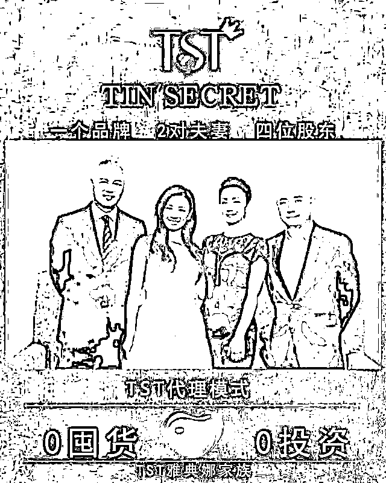
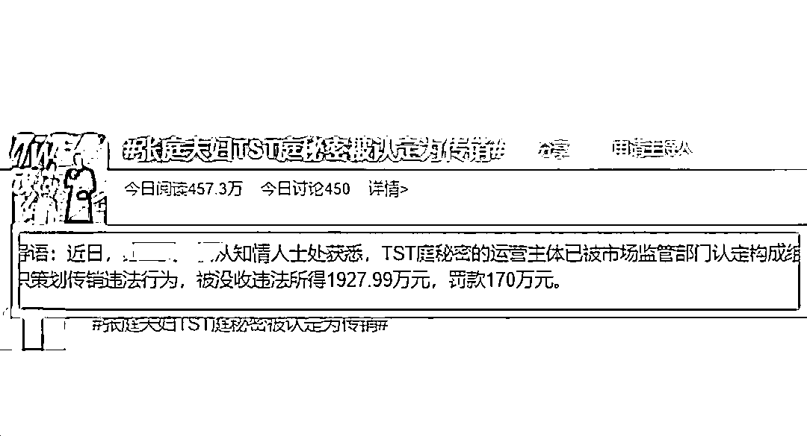
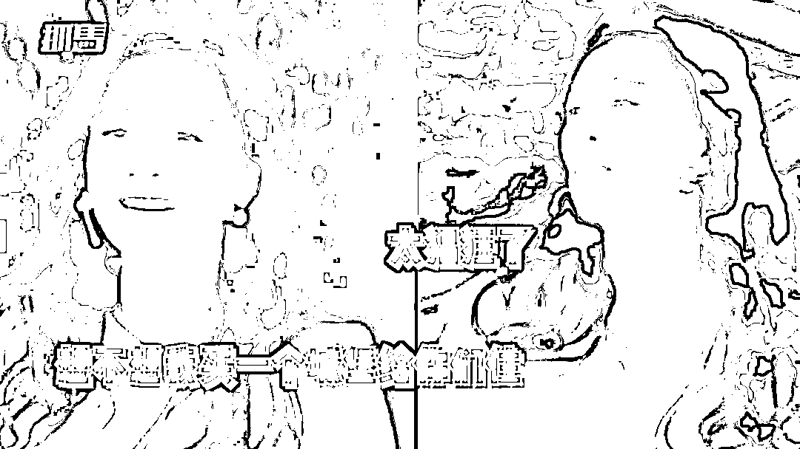
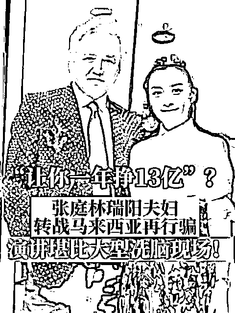
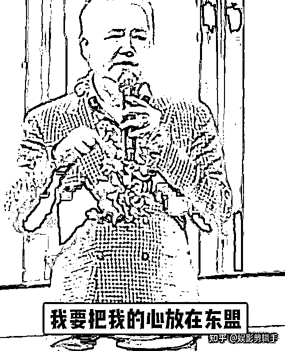
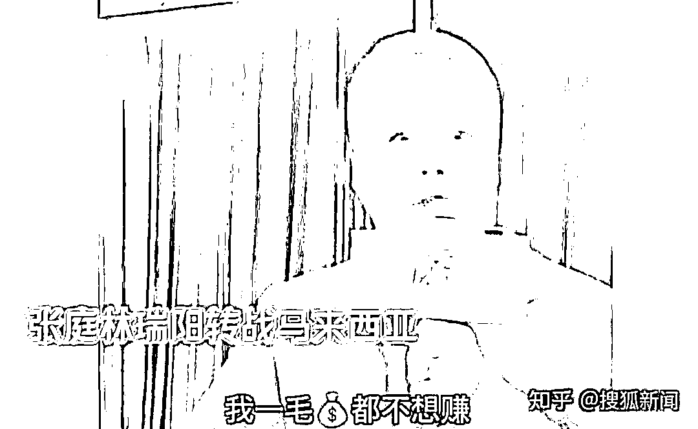
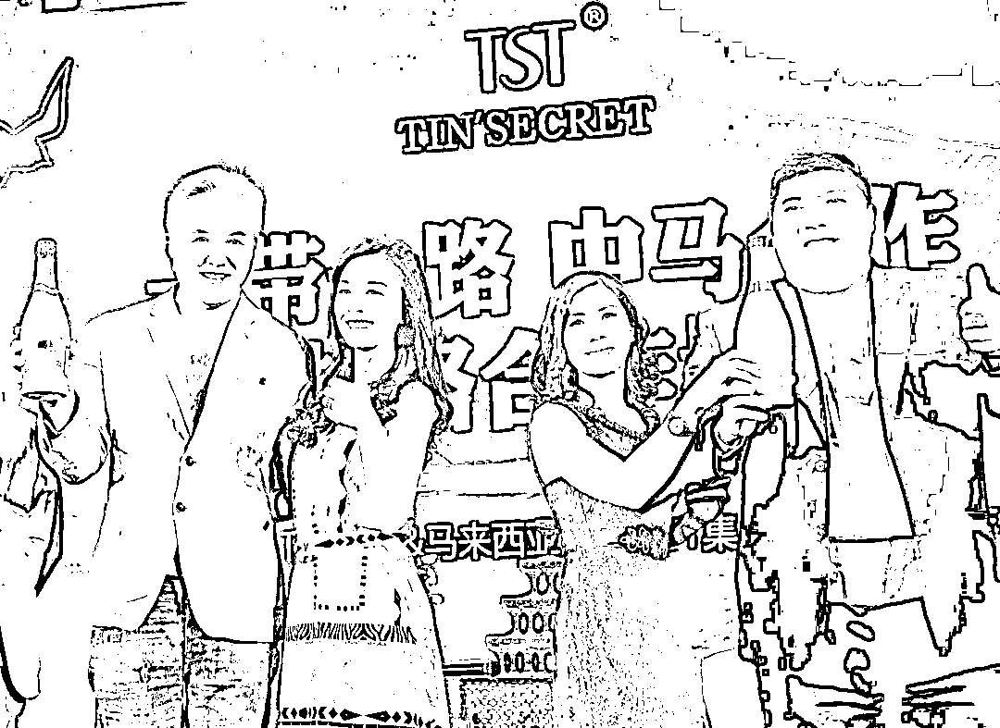
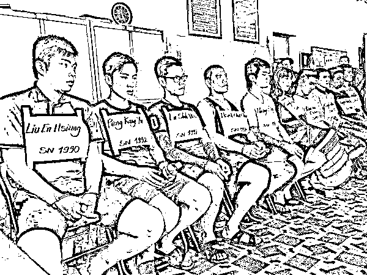

# 张庭林瑞阳跑路！转战马来西亚，豪言让人赚 13 个亿！

> 原文：[`mp.weixin.qq.com/s?__biz=MzIyMDYwMTk0Mw==&mid=2247542844&idx=4&sn=0ff2b1fb79b8b0695e03878cac0dbcd6&chksm=97cbe304a0bc6a12bbcdd4f485a0f6199eeab06c3ee091acdafef00f449b81ceb4bf27c54ca6&scene=27#wechat_redirect`](http://mp.weixin.qq.com/s?__biz=MzIyMDYwMTk0Mw==&mid=2247542844&idx=4&sn=0ff2b1fb79b8b0695e03878cac0dbcd6&chksm=97cbe304a0bc6a12bbcdd4f485a0f6199eeab06c3ee091acdafef00f449b81ceb4bf27c54ca6&scene=27#wechat_redirect)

大家好，我是无相君。

一直以来，台湾省就以出产诈骗犯，赫赫有名，而大陆的传销组织也是“声名在外”。 

**你有没有想过，如果把传销和诈骗结合起来，会产生怎样的割韭反应？**

今年年初，台湾明星张庭、林瑞阳夫妻被有关部门联合调查，认定他们的营销公司“达尔威”（TST）在发展加盟商的手段上，构成了组织策划传销违法行为，并依法没收违法所得 1927.99 万元，罚款 170 万元。

很多 TST 的加盟商表示，自从加入这个组织后，家里的货越囤越多，却卖不出去，但为了完成每个月 10 万元的销售额，只能自己借钱凑业绩，最后不仅一分钱没赚到，还欠了一屁股的债。 

而 TST 还不断地画大饼，总是说公司未来会上市，然后让大家都成为原始股东，还能接触到林瑞阳和张庭夫妇本人…… 

**TST 被认定为传销后，张庭夫妇公司名下 96 套房产被查封，公司被法院查封、冻结价值约人民币 94.96 万元的财产。**

知情者透露，这个案件所涉金额非常巨大，可能超过 100 亿。

 

这时候，可能很多人以为，这两人一定会尝尝牢饭的滋味。

**但是，张庭、林瑞阳在国内人脉和公司的组织架构，都极其复杂。**

公开资料显示，徐峥夫妇都曾被他们拉下过水，并为其产品代言。

而他们的公司架构更是层层嵌套，天眼查 App 显示，张庭（张淑琴）在中国内地有 92 家关联公司，其中 79 家为存续状态。

这些企业涉及生物科技、房地产、咨询、贸易、投资等行业，分布甚广。和案情有关联的公司都是一些子公司，他们都不是法人，所以很容易撇清关系。

所以在被有关部门披露后，TST 的官方也是表示： 

> “上海达尔威贸易有限公司是一家合法经营的公司，自成立以来始终遵从政府指导，坚持合法经营，依法纳税。非常感谢石家庄市裕华区市场监督管理局指导我司排查风险，目前公司运营一切正常，我司将积极配合相关部门工作。”

也就是说，张庭夫妇拒不承认自己有问题。

再加上他们是台湾籍贯的原因，人也迅速离开了大陆，所以现在案件陷入了僵局。

现在，有消息称林瑞阳已经跑到马来西亚，准备重操旧业，继续复制他们在中国的割韭模式。

8 月中旬，林瑞阳在马来西亚展开了一个叫《爱，有你才完美》巡演。 

他在现场激情高昂，高呼，“我复活了！”

然后对台下的华人讲述自己发家致富的励志故事，并鼓励马来西亚的创业者，积极加入他们的团队。

> “你们为什么没办法做到一年挣 13 亿，因为你只在马来西亚，在这里大哥跟你们说，我错了。我要把我的心放在东盟，马来西亚是我东盟的第一站，我在马来西亚成立了东盟第一家分公司，我要更加的爱你们。”

据悉，当天会场热闹非凡，林瑞阳被很多华人包围，其中大部分是女性，献花、合照，俨然粉丝见面会。 

林瑞阳称，自己十分感动，并表明自己“一分钱都不想多赚”，只想得到“家人们”对他的支持。

这样的画面，几乎和他们在大陆搞加盟商见面会的模式一模一样。

**画大饼+吹牛皮+忽悠别人加盟。**

如今，他们已经在大陆含泪赚（骗）了几十亿，在被有关部门掌握情况后，躲回了台湾省。

眼瞅着大陆市场不能再继续下去了，就开始打起了东盟牌。

东盟包含着马来西亚、印度尼西亚、柬埔寨等国家，总人口高达 6.7 亿人，又是一个巨大的市场。

很多人不知道，这些年随着科技的发展，传统的电信诈骗和传销组织，已经学会了更高级的包装方式。 

**诈骗产业已经开始体系化、公司化和常态化。**

比如 TST 的加盟商曾表示，“公司”会给他们发放手册，照着手册做就可以发展下线，在朋友圈带货。

互联网不仅促进了交易的效率，也促进了诈骗、传销的效率。

再加上明星自带的流量光环，效率直接起飞。

张庭、林瑞阳在中国发展业务的时候，利用互联网大量发布招募广告，短短几年，加盟商数量惊人。

这些年，零工经济的趋势助长了诈骗产业的发展，根据预测，2023 年全球将有超过 7800 万人从事零工经济——几乎是 2018 年 4300 万人的翻倍。 

疫情之后，这一数据很可能比之前的预测更高。

**因为疫情之下，很多人的日子并不好过，比如旅游业、航空业的从业者。很多人更是走到无力偿还贷款的境地。**

对其中的一些人来说，凡是还能抓住的稻草，凡是看起来还能够赚钱的机会，都想放手一搏。

好在随着中国对诈骗、传销渠道的打击，张庭们只能去寻求蒙骗海外华人市场。

但是，这并不意味着我们就可以松口气。

要知道，台湾地区的骗子最“钟意”的还是大陆同胞。

比起海外市场，大陆的老百姓更容易被集中收割。

有人问，为什么不能要求台湾当局把他们遣送过来接受调查？ 

这里不得不提到台湾当局对诈骗犯的纵容了。

2016 年，大陆警方曾在境外抓到了一批台湾地区的诈骗犯，直接押回大陆。

**当时，这起诈骗案的主犯被判处了 15 年有期徒刑，其余从犯也都判了 10 年左右。**

**但想不到，为了面子，台湾当局竟然想要回这些诈骗犯，有关方面还厚颜无耻地向大陆抗议。** 

这些年，台湾司法领域对于这些诈骗犯更是“高高举起，轻轻放下”，有调查显示，对岸的诈骗犯，往往被关个一年半载就放出来了。

所以，要想调查这对明星夫妻，我们确实面临不少困难，想惩罚他们，更是长路漫漫。

来源：无相财经

欢迎关注灰产圈社群服务号

