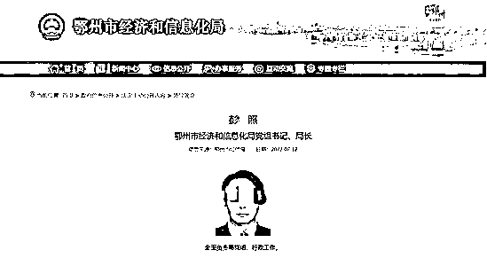
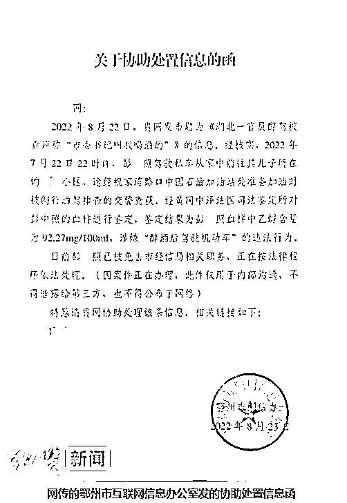
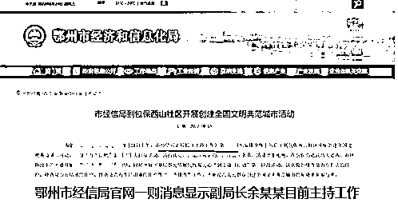
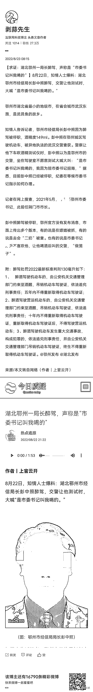
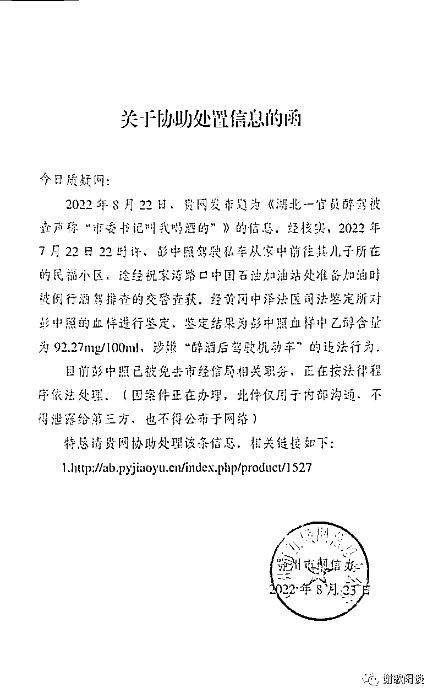
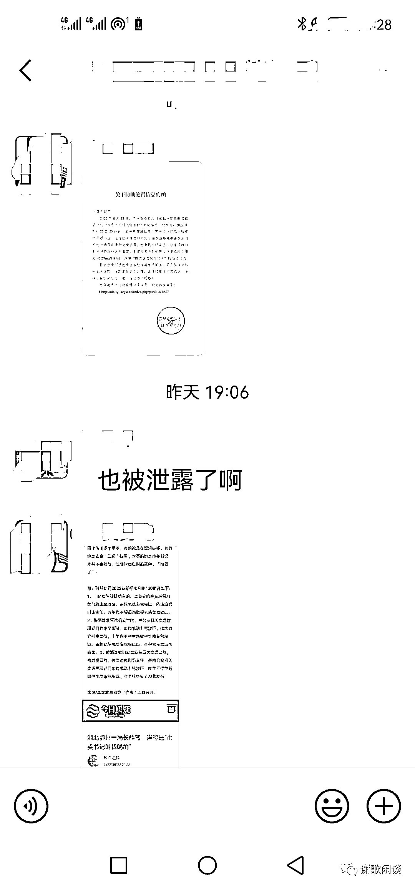
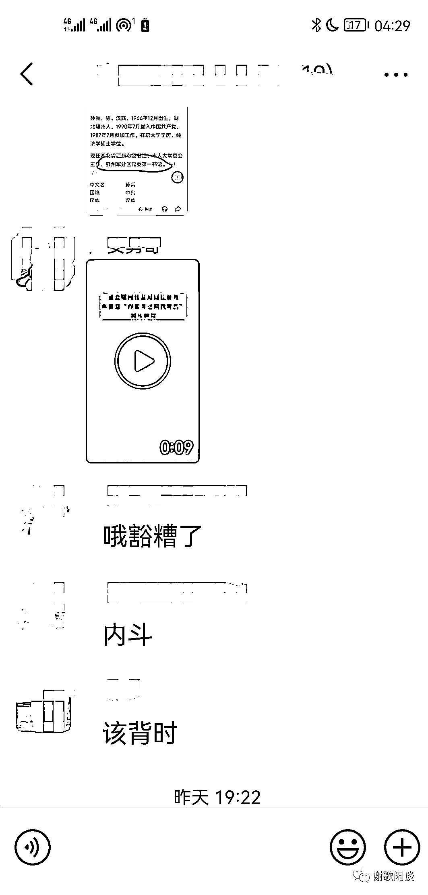
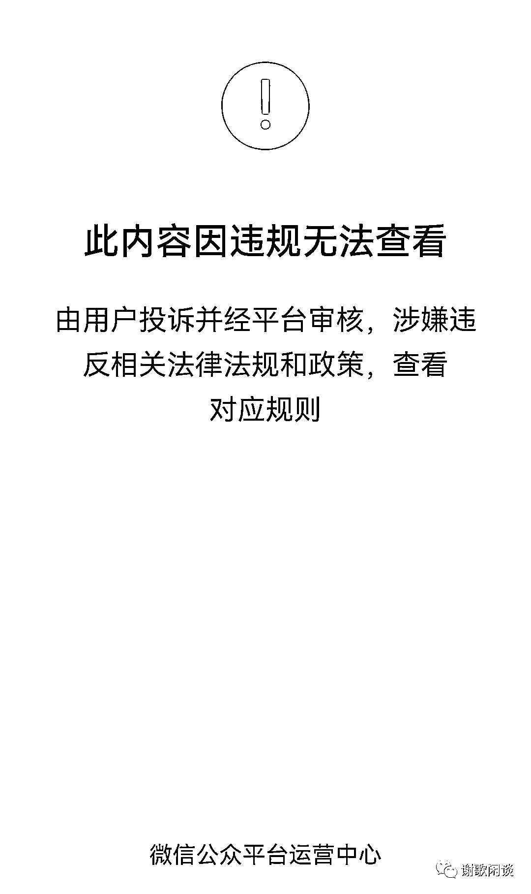
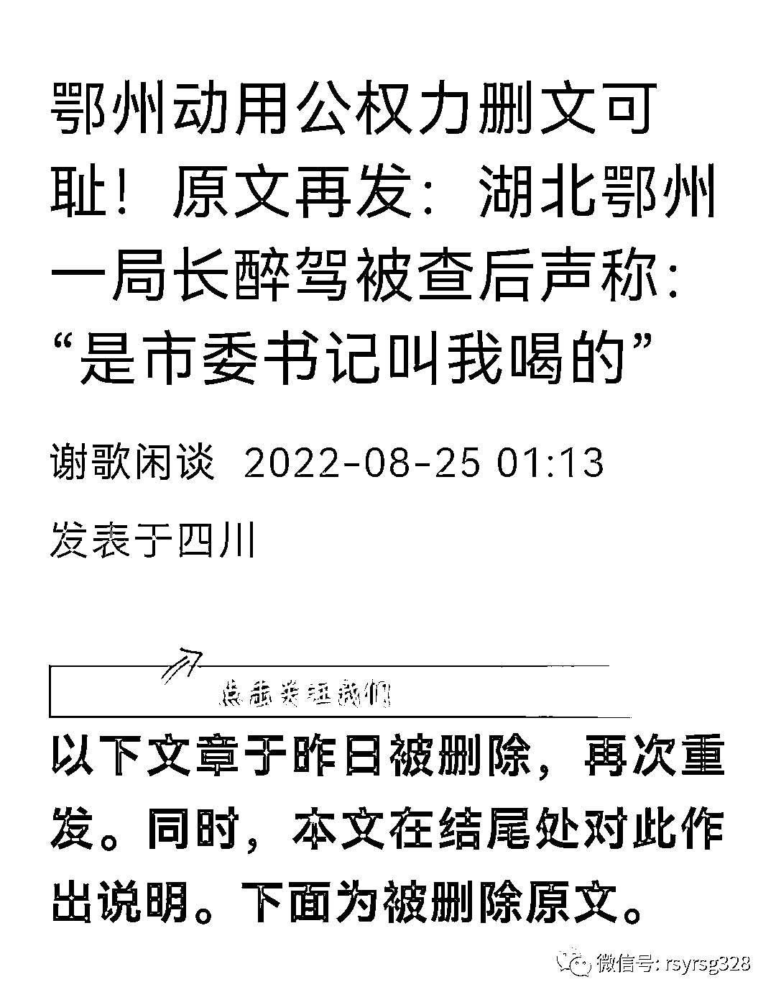

# 还是没能捂住！局长醉驾被查后喊“是书记叫我喝的” 在网友爆料多日后发酵！

> 原文：[`mp.weixin.qq.com/s?__biz=MzIyMDYwMTk0Mw==&mid=2247542844&idx=5&sn=c6b27dbd55fe89bfcb5dba8ad05ac682&chksm=97cbe304a0bc6a124b4ca71abfd6f479e08c5a66686382d9c259fe3a26b4af7a37533e65462d&scene=27#wechat_redirect`](http://mp.weixin.qq.com/s?__biz=MzIyMDYwMTk0Mw==&mid=2247542844&idx=5&sn=c6b27dbd55fe89bfcb5dba8ad05ac682&chksm=97cbe304a0bc6a124b4ca71abfd6f479e08c5a66686382d9c259fe3a26b4af7a37533e65462d&scene=27#wechat_redirect)

近日，网传湖北省鄂州市经济和信息化局（以下简称鄂州市经信局）局长彭某照在鄂州市鄂城区驾驶机动车被异地执法的武汉交警查获。**警察让其下车吹酒精测试仪时，彭某照以为是鄂州市的交警，坐在驾驶室不愿意测试，大喊大叫“是市委书记叫我喝的，我因为陪市委书记招商。”**

在网上还出现了一张“关于协助处置信息的函”相片，落款公章为“鄂州市互联网信息办公室”。该函中称，2022 年 7 月 22 日 22 时许，彭某照驾驶私车从家中前往其儿子所在的小区，途经祝家湾路口中国石油加油站处准备加油时被例行酒驾排查的交警查获，经黄冈中泽法医司法鉴定所对彭某照的血样进行鉴定，鉴定结果为彭某照血样中乙醇含量为 92.27mg/100ml，涉嫌“酒后驾驶机动车”的违法行为。**目前，彭某照已被免去市经信局相关职务，正在按法律程序依法处理。**

****

**根据鄂州市经信局官网显示，彭某照为鄂州市经信局党组书记、局长、一级调研员，在担任鄂州市经信局党委书记、局长前曾担任鄂州市委副秘书长、鄂州市招商局局长、鄂州市发展和改革委员会主任等职务。2022 年 2 月 26 日鄂州市第九届人民代表大会常务委员会第一次会议通过任命彭某照为鄂州市经信局局长。**

**公开报道显示，彭某照最近一次公开露面是在 2022 年 7 月 27 日，身份还是鄂州市经信局局长，也就是 7 月 22 日彭某照醉驾被查后 5 天，依然在正常工作。当日，彭某照参加了鄂州市召开的“工业重点企业营商环境月度恳谈会”。当地媒体报道，会上，彭某照还回应了企业负责人提出的建议。8 月 24 日，燕赵都市报纵览新闻记者注意到鄂州市经信局官网发布的一则“市经信局到包保西山社区开展创建全国文明典范城市活动”的消息中，市经信局副局长余某某加了备注为“主持工作”。但在发稿前，燕赵都市报纵览新闻记者发现，该消息中余某某备注的“主持工作”四字被删除。**

****

**8 月 25 日上午，燕赵都市报纵览新闻记者联系了鄂州市经信局，针对网传内容进行求证，该局一名负责人称，目前彭某照并没有被免职，只是停职检查，等待处理，具体情况局里一概不知，正在等待市里的最终结果，至于是免职还是继续工作（现在）还不知道。对于网传的消息，该负责人称是由市里网信部门在处理、澄清，局里人员只是做好本职工作，一概不管。因为当事人（彭某照）没有跟他们任何人透露过事情的经过，所以当时（彭某照）喝了多少、酒精度多少（局里）一概不清楚。目前，根据市委组织部安排，局里的工作是由一名副局长主持。网传的彭某照被查喊“是市委书记叫我喝的”说法，上述负责人称是谣言，是不怀好意的造谣，对鄂州市政治生态影响很坏。**

****记者也分别联系了鄂州市委组织部、鄂州市纪委，得到的答复都是此事“正在走程序”，其他情况一概不予透露。**鄂州市委宣传部新闻科接电话的工作人员则表示，宣传部目前没有收到任何消息，不对外发布。**

**事实上，这件事已经被网友爆料多日。**

**8 月 22 日，知情人士爆料：湖北鄂州市经信局长彭某醉驾，交警让他测试时，大喊“是市委书记叫我喝的。”**

**** 

**后来这篇文章被删除。但，网络是有记忆的，这条消息被眼尖的网友截图了。**

**随后，微信群里有一段视频传出↓↓↓**

 **[`mp.weixin.qq.com/mp/readtemplate?t=pages/video_player_tmpl&action=mpvideo&auto=0&vid=wxv_2545018764858294273`](https://mp.weixin.qq.com/mp/readtemplate?t=pages/video_player_tmpl&action=mpvideo&auto=0&vid=wxv_2545018764858294273)** 

**此后，又有一份“关于协助处置信息的函”流出。函中称，目前，彭某照已被免去市经信局相关职务。落款公章显示为鄂州市互联网信息办公室。**

****

**这份“关于协助处置信息的函”显示，有“因案件正在办理，此件仅用于内部沟通，不得泄露给第三方，也不得公布于网络”等信息。**

****网友热议：****

****(想不到还是）也被泄露了啊！****

********

********

****交警执法路查酒驾才不会管是谁叫你喝的酒呢！****

****酒驾被查，大喊“是市委书记叫我喝的”，这不明显在给书记“挖坑”么？还是显得有点不厚道哦！网友评论说，就算是领导“叫我喝的”，也不能理由，更不能成为逃避处罚的“遮阳伞”，说穿了，还是“官本位”的权利在作怪。由此可见，这位局长眼里根本就没有“领导”。****

****搜索发现，这位彭局长被处罚一事，除流出的这份“关于协助处置信息的函”之外，截止目前，尚未见有鄂州方面的官方通报。不过，被网友截图的文章显示：“目前，彭某照已经被停职，纪委在等候市委书记指示如何办理”。****

****后来，多篇公众号文章被“用户投诉”掉了。****

********

****鄂州为什么害怕舆情发酵升级？****

****因为，网信办不小心发出的那份“关于协助处置信息的函”被流出。“信函”显示：“因案件正在办理，此件仅用于内部沟通，不得泄露给第三方，也不得公布于网络”。可是结果呢，也不尽人意，他们所相信的人保密性不强。倘若这份信函是假就应当辟谣，可是，自 8 月 22 日事发至今，几天过去了，未见有相关通报出现，原因只有一个，那就是：心虚。因为鄂州网信办没有这个底气，彭某照醉驾是事实。****

****在网络舆情处置过程中，所有的技巧都是辅助手段，而删文则是败笔中的败笔，因为，再好的舆情应对都离不开正面回应质疑，公布事实真相。****

********

****来源：燕赵都市报，谢歌闲谈，宾曰语云****

********

****欢迎关注灰产圈社群服务号****

********

********