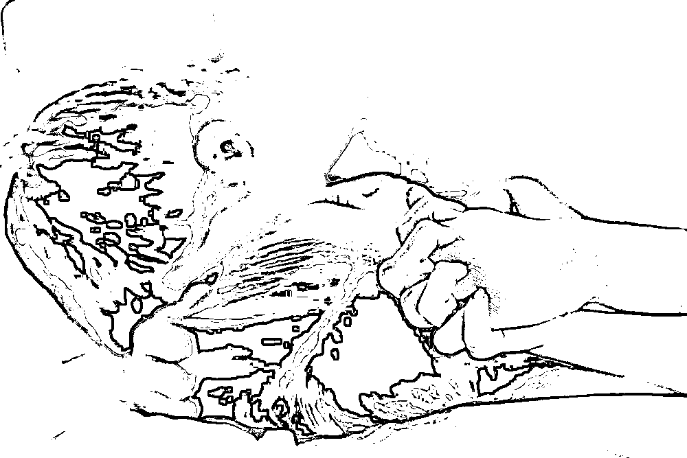
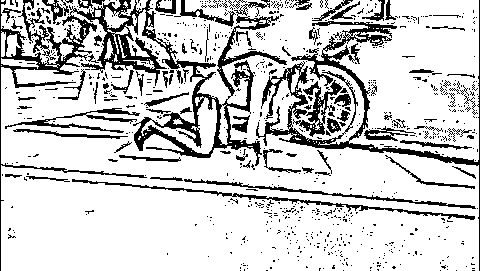
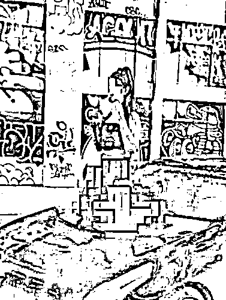
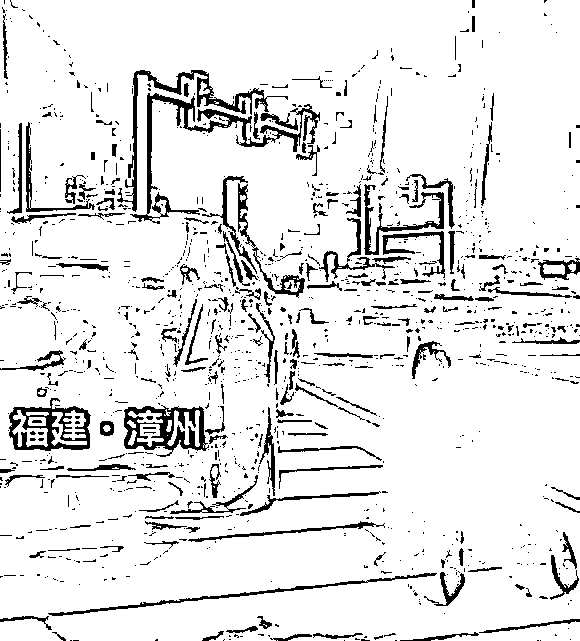
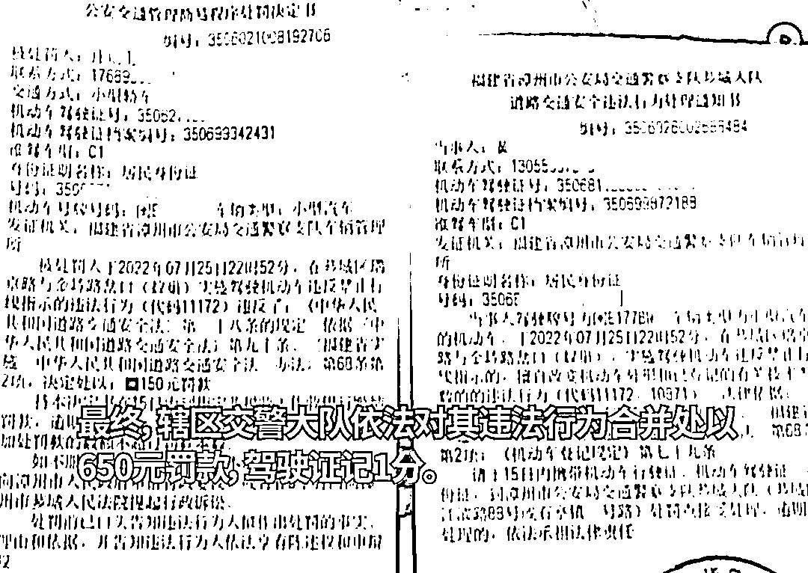
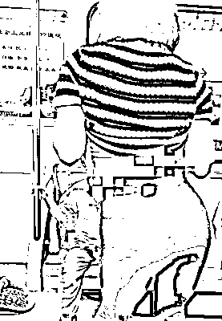
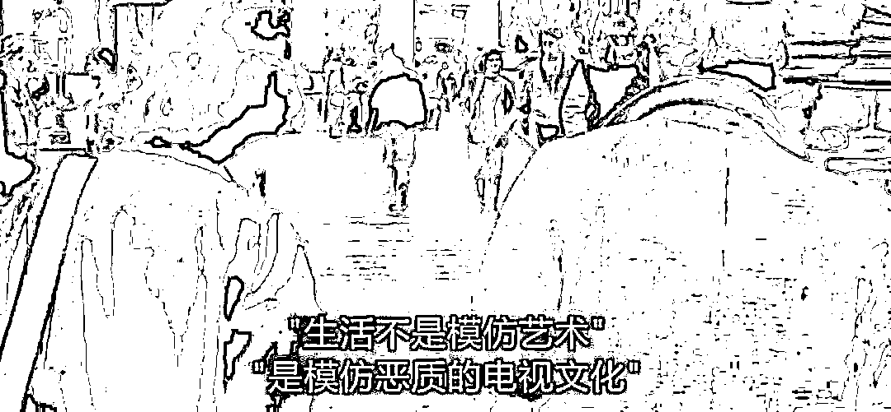

# 辣眼睛！“咬安全套、扯黑丝”，车友群户外拍不雅照，大尺度视频疯传，为了红无下限

> 原文：[`mp.weixin.qq.com/s?__biz=MzIyMDYwMTk0Mw==&mid=2247542883&idx=1&sn=b065eab043f9209d705c7dbc7b45d66a&chksm=97cbe35ba0bc6a4d6345fb6dba74392a0d162015f3075447588c63324fea264fba3d7bcc3851&scene=27#wechat_redirect`](http://mp.weixin.qq.com/s?__biz=MzIyMDYwMTk0Mw==&mid=2247542883&idx=1&sn=b065eab043f9209d705c7dbc7b45d66a&chksm=97cbe35ba0bc6a4d6345fb6dba74392a0d162015f3075447588c63324fea264fba3d7bcc3851&scene=27#wechat_redirect)

图文均来源网络 

01

《孟子·离娄上》孟子曰：“人必自侮，然后人侮之。”

大致意思是：“人啊，一定是自辱德行，然后别人才去侮辱他”

近日在福建漳州有网友举报，某车辆违法占道拍摄的视频在网上热传，引发广大网友关注讨论。

视频 内容太辣眼睛，女子穿着性感街头摆拍。

从视频中的画面可以看到，这名女子身穿黑色短上衣加黑色丝袜，脚上穿着一双黑色的高跟鞋，打扮得性感火辣。

她趴在地上，背对着镜头扭动臀部，在摄影师的拍摄下做出各种撩人的动作。图片来源：网络，侵删

接下来，女子的拍摄场地由地面换到了车上。

**她跪在车旁，叉开双腿坐在发动机盖上，做出各种不雅的姿势拍摄。让人不得不浮想联翩。**

原本拍摄就已经很大尺度了，后来拍摄组的工作人员又拿来一个安全套，要女子咬在嘴里拍摄？这一波操作实在让人大跌眼镜。

图片来源：网络，侵删

让人更不能理解的是，这明明挺不合理的要求，女子竟然没有反驳，而是直接拿过安全套，放在嘴里，熟练地拍摄起来。

这样的无理要求还不停止于此，后来为了让拍摄更加性感，又有工作人员上前将女子的丝袜撕破。

而这全程，女子都没有表现出丝毫的不悦，也并没有觉得拍摄很难为情。

02

网友将该事件举报后，7 月 28 日，漳州交警发布称，因涉嫌违反禁令标志停车和非法改装车辆，芗城交警已经依法对当事人庄某和黄某进行了传唤，并进行了处罚及驾驶证扣分处罚。据当事人庄某称：他跟几个凯迪拉克车友，就想到蚁巢那边拍一下照，并在网络上传播了一些这种比较诱惑、比较不好的东西，也意识到了自己的做法是违法的，也愿意接受处罚，希望大家不要效仿。**最终，辖区交警大队依法对其违法行为合并处以 650 元罚款，驾驶证扣 1 分。**图片来源：网络，侵删视频一出，评论区骂声一片：

> “为了博眼球连底线都没有了，这种人就应该重罚！”
> 
> "女孩子不检点啊"
> 
> “其实这种就应该加大力度，不要姑息！！罚钱是少！！应该进去 15 日留案底”“这样的人应该严禁”

图片来源：网络，侵删

不管他们是为了流量也好，放纵欲望也罢，都不应该丢了底线。

没了羞耻心，人和动物就没了区别。

不知大家还记不记得“成都地铁事件”

有网友曝料称一女子在成都地铁内当着对面座位上小孩的面大跳热舞，动作暴露，十分不雅。图片来源：新浪微博，侵删视频显示，女子站在地铁车厢过道内，对着一小男孩跳舞，旁若无人地做着提臀、扭屁股等动作，之后还撩起上衣，露出内衣，并时不时将脸凑到小男孩面前，一旁尴尬的男性乘客选择走开，小男孩则不知所措地坐在位置上。但该女子却不以为然，依然继续着她的舞蹈。在视频评论下方，有网友怀疑当事女子嗑药或存在精神疾病，也有网友认为，当事人是为了拍视频博取关注度。

但这样没下限的行为，不仅是对自身的轻贱，也是对公序良俗的破坏。

03

网络的飞速发展，让我们能够看到世界的另一面，了解到不同人的生活状态，也让人们的价值观在不知不觉中发生改变。

在这样一个时代，内涵似乎渐渐变得不重要，在越来越多人的认知里，好像谁能博取更多流量，赚得盆满钵满，谁才是大家心目中的榜样。

无论是拍摄大尺度照片的车友，还是在地铁大跳热舞的女子，也许有人会说，不管干什么，都是他们的个人自由。

是的，我们本身无权干涉他人的行为，但这一切都要建立在公共道德之上。在公众场合放浪形骸，不仅自己丑态百出，也会给别人造成不良影响。图片来源：网络，侵删世间从不缺乏为搏眼球丑态百出的人，缺的是具备分寸感、羞耻心的高尚品德。

**道德感是一生的课题，不要在欲望的驱使下，成为生活里的“小丑”。**

来源：话痨 ， 幸福小酒馆 

欢迎关注灰产圈社群服务号

