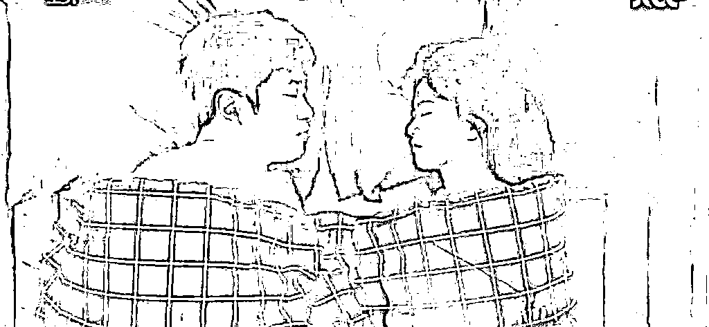
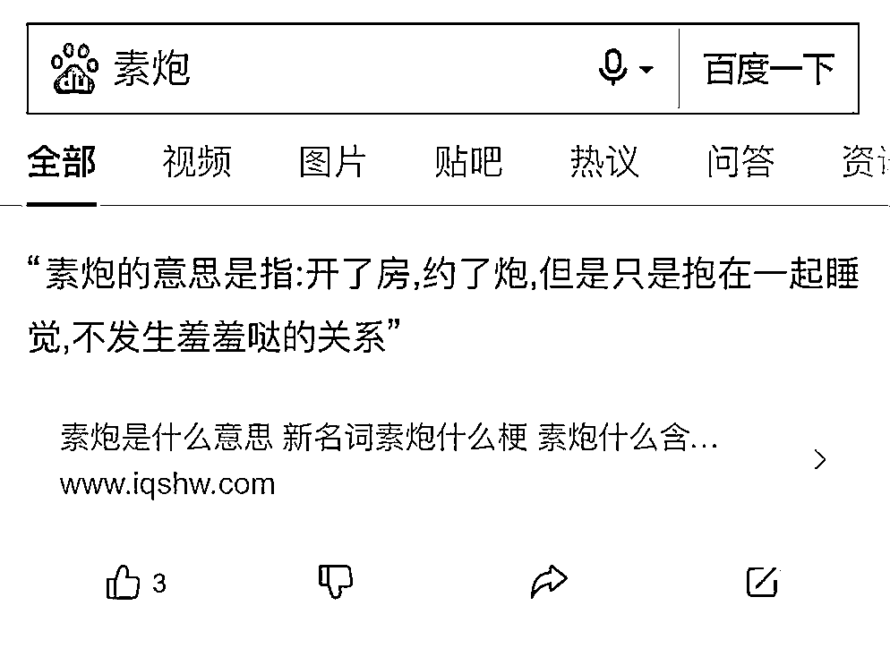
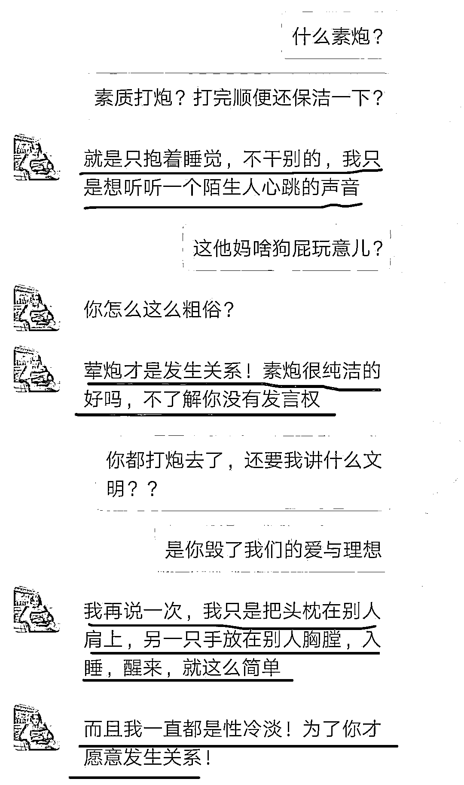
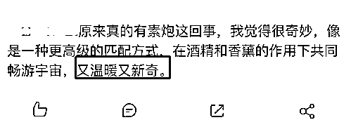
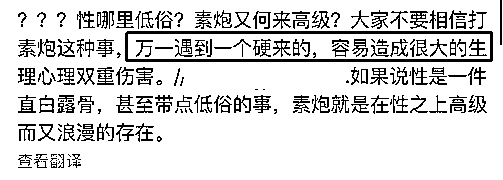
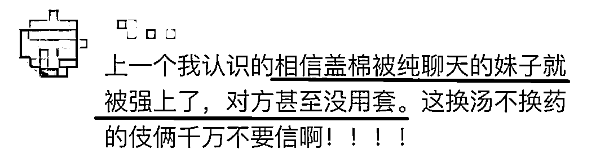
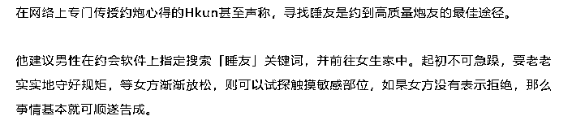
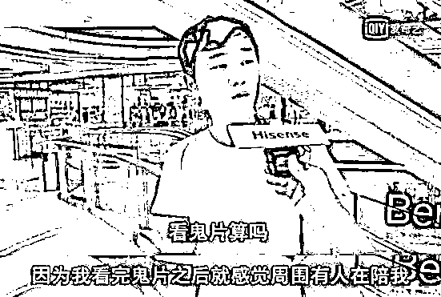

# “约素炮会上瘾吗？”我们采访了 100 个女孩...

> 原文：[`mp.weixin.qq.com/s?__biz=MzIyMDYwMTk0Mw==&mid=2247542883&idx=2&sn=6872b2f53c6fdcd47a6cf1064c53e0d7&chksm=97cbe35ba0bc6a4d5eb931e55fe809b7193e20d2b87a3c2e50567aaef771568db317da9fd1f4&scene=27#wechat_redirect`](http://mp.weixin.qq.com/s?__biz=MzIyMDYwMTk0Mw==&mid=2247542883&idx=2&sn=6872b2f53c6fdcd47a6cf1064c53e0d7&chksm=97cbe35ba0bc6a4d5eb931e55fe809b7193e20d2b87a3c2e50567aaef771568db317da9fd1f4&scene=27#wechat_redirect)

**你，听说过****约素炮****吗？**

**最近看到一个新名词，叫“约素炮”。**

俩人开房不发生关系，就是单纯的抱在一起睡个觉。

这个词的起源是一个有男朋友的女生，和陌生男的在酒店开房，被熟人撞见后，她解释说自己仅仅只是约了个“素炮”。

女生非常坦荡：

**“我是和他开房了，但我们没发生关系，只睡觉了。”**

以上对话听起来就像是：

**我爱的人是你，只不过你的身体不懂我，而他的身体懂我，所以我只是短暂的听一下陌生的心跳，你不要想多，这不是出轨。**

而在对话中被一方形容为“约素炮”的行为，是指“单纯抱在一起睡觉，不发生性关系”的约炮行为。

男朋友显然对这个说法不够满意，觉得女生可能没有别的想法，但男的肯定“刹不住车”。

一部分网友真诚的讨论了“约素炮”这个现象，觉得这个东西真实的解决了当代年轻人的某些需求：

也有人理性地站出来表示担心：

话说回来，在约“素炮”这个现象背后，最值得让人深思的是，越来越多的年轻人，开始过那种“不占有”的生活。

需要的个人物品越来越少，欲望越来越低，人也越来越佛系。不需要的东西，扔掉；复杂的人际关系，扔掉；疲惫的男女关系，扔掉。

连性生活，也不想要了。他们需要的，仅仅只是打着折扣的陌生人的拥抱，来慰籍自己日渐冰冷的心。

他们越来越倾向于那种简单的、不用过多参与的情感关系。

有专家说，这个无性恋者的数量占据世界总人口的 1%，也就是说每 100 个人里，就有可能有一个是无性恋者。

这个数量并不小，他可能会是一个打扮时髦的小姐姐，也可能会是身边一起讨论八卦新闻的同事。

然而，虽然看起来与常人无异，但或许只有无性恋者自己明白，他们应该是这个世界上最孤独的一群人了。

**无性恋，开始成为一部分疲惫的年轻人的常态。**

如今，大多数年轻人每天接触的东西都是冰冷的手机、键盘、电梯按钮。

人如果长期缺乏肌肤接触，就容易患上”肌肤饥渴症“。很容易陷入缺乏关爱的焦虑。

他们发现，找到那些有相同需求的人，谈天说地，相拥而睡。这种带有交流的肢体接触，能缓解大部分焦虑。

素炮，由此而生。

**但这种行为绝对不值得提倡。**

**因为对于有伴侣的人来说，不管是哪种约炮，都是板上钉钉的出轨行为；**

**而那些单身人士约素炮，虽不好从道德上去批判他，但也说明这个人心理情感是有所缺失的。**

在日本，有人早早的从这种孤独感里嗅到了商机，因而把素炮做大做强，还发展成一种叫添い寝的产业链：

有年轻的漂亮女孩穿着可爱的女仆装，跟你拥抱聊天。

你可以把头放在她们柔软的腿上，放松的倾诉自己的无奈与寂寞。

再或者就是沉默着，让时间温暖的流逝下去。

不过小姐姐们会按照时长与相处的具体姿势收费。

陪伴入眠的受众群体，也不仅仅针对男性。

日本的 Rose Sheep 公司，就是专门为女性提供素炮服务的。

只要打个电话，就有年轻帅气的男孩子上门陪你拥抱入眠，但每睡个 2 小时，折合成人民币就要花费一千多元。

渴望拥抱不是错，它是人类最原始的需求。

**但约素炮其实存在着很大的安全隐患。**

一些心智不成熟的女孩们，一直以为约素炮有多美好、多浪漫。

想当然的认为素炮代表着鲜花红酒、蜡烛香薰，还有温柔帅气小哥哥的拥抱。

但是，你怎么就知道你的运气会不会出问题？

如果你碰到的是一个借素炮之名，行荤炮之实的油腻渣男呢？

你永远不知道炮友是不是人面兽心。

因害怕孤单而饱尝苦果的受害者大有人在，有人染了艾滋病、有人被敲诈勒索、甚至还有人死在了陌生人的床上……

虽然提前都会说好，彼此不发生性行为，但要是男生没忍住，体力上没有优势的女孩子很容易受侵害。

曾经有女孩子跟人约素炮，谁知道中途对方变卦，强行跟她发生了性关系。

事后女孩报警，强奸者被判了 3 年。

直到最后，犯人才交代说，其实他一开始就没想着要素的。

跟这个强奸犯类似，不少男人约素炮，就为了找到高质量的炮友。

他们甚至摸清楚了令人恶心的“进攻方式”：

开始时装绅士，只要女生不反抗，就可以进一步接触。

对于女生来说，”约素炮“不仅安全没有保障，被伴侣发现更是难以解释，甚至无奈分手。

 

某个知名博主曾经做过一次采访，

叫做“你能接受男友/女友约素炮吗？”

一百多个受访者，有 90%的人都不接受，他们表示：

约炮就是约炮，还扯什么素的荤的，都是劈腿！

的确，爱情具有排他性，绝大部分人都不希望对象约素炮。

《中国 80、90 性福报告》中有这样一个数据：

> 一线城市平均每周一次以上性生活人群占比 45%，二线城市 53%，三线及以上城市达 57%。

**在压力越来越大、节奏越来越快的现代生活中，年轻人们的时间一再而再地被压缩，也没有多余的精力去维护一段亲密的关系。**

**宁愿一个人呆着，也不想去做多余的社交，别说性生活了，就连正常去恋爱都变成了一件难度性十足的挑战。**

有人曾这样评价自己，每次看到电视剧中甜甜的恋爱也会很羡慕，但就是没有那个动力让自己也参与其中。

也有已经恋爱甚至结婚的人说，两个人天天除了工作以外根本无话可说，上一次的性生活也是好几个月前的事，维持这样的关系真的很累。

一边渴望有人陪伴，一边又排斥多余的交流。

这也难怪“约素炮”这样没有负担的陪伴方式受到越来越多年轻人欢迎。

**从某种程度上说，生活把很多人都变成了另一种“无性恋者”，也活成了一座座没有人烟的孤岛。**

其实除了约素炮，解决孤独的办法有很多，比如找心理咨询师，养养宠物，培养一两个兴趣爱好，参加联谊……

一天就 24 个小时，能给自己的时间不多，做做上面其中两样，就够你折腾的了。

**而靠约素炮的方法排解孤独，永远只能治标不治本。**

犀妹并不是对这些“社交”抱有偏见，只是由衷地祝愿每个人都能找到真正合适的取悦自己的手段。

**无性恋者也好，普通人也罢，都请不要丧失勇敢去爱的勇气。**

**其实无论素炮还是荤炮，都只是过眼云烟，比起短暂的抚慰，我们更应该专注于未来的美好。**

找一个人，长久的相爱，在爱情中持续发热，让生命热气腾腾。 

希望大家都能遇到那个对的人，做对的爱。

**别以素炮之名，玷污爱情，挑战人性。**

**每一个人，也都应该值得被真心以待。**

来源：老朱大叔，新洞察   *文章综合自：

斜杠先生（ID：isslash）：《“约素炮会上瘾吗？”我们采访了 100 个女孩...》

https://mp.weixin.qq.com/s/3rli1fvu6wmB58amJ2B_Gg

木棉说（ID：mumianshuo）：《90 后流行“约素炮”：越来越多的年轻人正变得性冷淡》

https://mp.weixin.qq.com/s/qRauSOgnd1XlnZPEQSDuQw

果妈育儿宝典（ID：gmyebaodian）：《“约素炮”上瘾性行为，正在榨干这届年轻人》

欢迎关注灰产圈社群服务号

