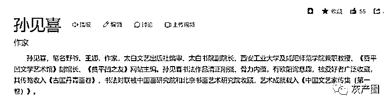
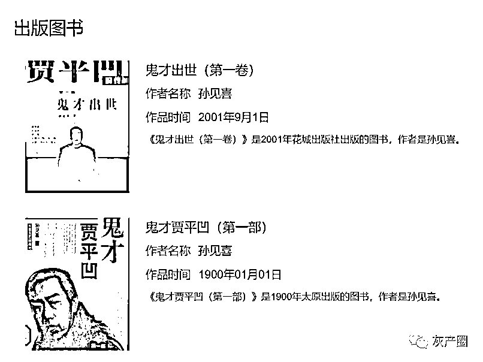
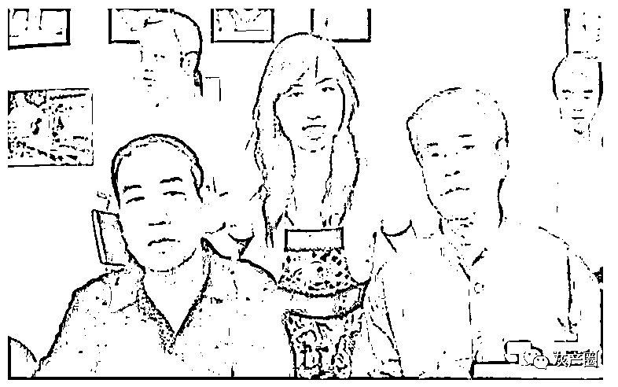
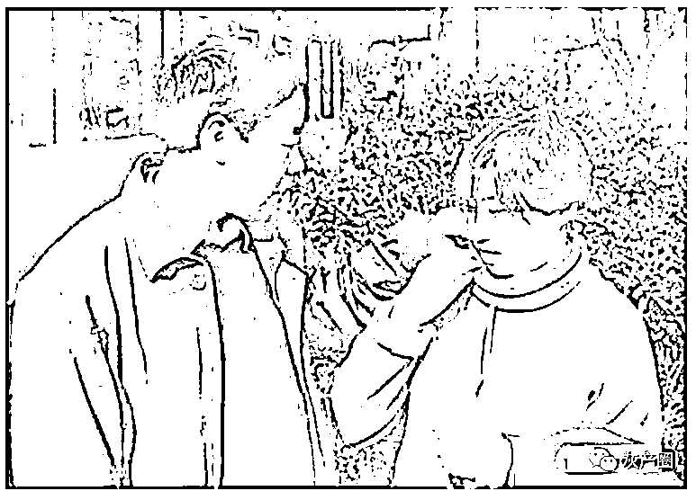

# 贾浅浅的第一篇文章是如何发表的

> 原文：[`mp.weixin.qq.com/s?__biz=MzIyMDYwMTk0Mw==&mid=2247542883&idx=4&sn=fec19002e47c3df2ea77150251fcb37f&chksm=97cbe35ba0bc6a4d71eeaeb2b5be5fcda8a1a14c4edc4e126033cf642f23b5407c6928ce8e90&scene=27#wechat_redirect`](http://mp.weixin.qq.com/s?__biz=MzIyMDYwMTk0Mw==&mid=2247542883&idx=4&sn=fec19002e47c3df2ea77150251fcb37f&chksm=97cbe35ba0bc6a4d71eeaeb2b5be5fcda8a1a14c4edc4e126033cf642f23b5407c6928ce8e90&scene=27#wechat_redirect)

**节选自《我的父亲贾平凹》**

第三次是刚上大学那会儿，写了一篇文章叫《我爱辣椒》，通过写我对辣椒的衷爱，从吃辣椒体会到的人生哲理，其中还是透射出父亲对我的影响。那天给父亲看这篇文章的情形是这样的：当时，我和我父亲各占据一间房子，他写他的，我写我的，我当时就在我的小房子里誊抄这篇文章。写好后，父亲正在午睡，我就轻手轻脚把这篇文章放在他书桌上，然后摸上床也假寐。但是两个房间的门却没关，我就静心等待他起床后的反应，因为紧张我的两个太阳穴突突地跳。

终于，父亲一个小时后窸窸窣窣地起床了，半个小时后听他给**孙见喜**伯伯打电话，说：“老孙呀，我这里有篇文章写得还行，刚好你办的刊物要稿子，就给你吧。”然后才笑嘻嘻地说：“这是我娃写的，趁我睡觉人家偷偷的给我放了篇稿子，上边还写着丑媳妇总要见公婆，把他家的……”这就是我第一篇发表的文章。

日后我总结为什么这篇文章能发表，并不是我的措辞有多高妙，立意有多深远，关键就是我拍对了马屁，博得了老爷子的欢心，这点太重要了。这以后我经常装作虚心好学的文学青年形象，向我父亲讨教问题，他一高兴有时妙语连珠，滔滔不绝。我就像空手扑蝴蝶一样愣头愣脑的，左边抓一下，右边扑一下，把好不容易费力抓来的几只艰难的吞进肚子里，有的还挣扎着想要跑出来，等到上课时老师组织大家讨论，我才从容不迫地转转脑袋，爽快地把这几只放生掉。

虽然有的没了触角，有的残了翅膀，有的断了腿脚，但毕竟有这些色彩斑澜的小精灵的环绕，我大放光彩，使得同学羡慕、老师赞许。那段时间，我被这种感觉所怂恿疯狂地写诗歌啊，散文啊，小说啊。常常深夜十一二点了几个连环电话把我父亲叫回来看我写的文章，真跟着了魔似的。我想我和文学的这份亲近，父亲也许起了最最直接的关系。

但是终于有一天，我发现我虽然极度狂热地崇拜父亲，但是流于表面和形式，我不能真正走入父亲的内心，了解他的精神世界以及灵魂深处。这种感觉很沮丧，就好比隔着厚厚的橱窗看着你心爱的蛋糕，你虽然能看得见但你碰不到更吃不着。痛定思痛，我觉得我这个“粉皮”应该升级了。所以我作出一个伟大的决定，从此我要研究我父亲了。我跑去把我这个决定告诉他时，我发现他嘴角有一丝不易察觉的微笑，很隐藏可还是被我发现了。我装模作样的说我要从以下几个方面入手来研究，你意如何？他沉思一下，抽着烟说，你说的那几个方面的资料都不太好收集，别说你了，就是我本人这些资料都不全，不好作。你可以从以下某某某几个方面来研究，比如说一、二、三，于是我迅速掏出笔和纸来，把他说的一、二、三全记录下来，还装作很谦虚很恭敬的模样。这就是历史上不多见的，被研究者指导研究者如何写关于研究他的文章这样一个经典场面。所以，我日后要是有幸出什么研究我父亲的书，大家一定要坚信这是我们俩人共同研究的结晶。

…… 

大家都知道，我是去年上的陕西师范大学研究生。当时入学考完试，有一个多月了，我心里没底，不知道发挥得怎么样，能不能考上，分数会不会上线？我就想让我父亲给师大研究生处打一个电话，问问怎么样，看有没有希望。我父亲可好直接顺水推舟地说，我和人家不熟，有些问题具体我也不清楚，你先自己打电话问，不行了我再打电话。就把我撂在一边了。又过了两个多月，学校还不见公布成绩，我有些焦急了，想让他问问虚实，谁知逼他紧了，他反而很不耐烦地数落我，说我这么大的人了，什么事情都要他操心，他还是不打，嫌我万一考得不好，给他丢人了。没过几天分数网上公布了，我考得还不错，超出去年分数线很多，但今年分数线迟迟没有公布，我又提心吊胆，坐卧不宁了。这会他又忙着出差开会，还是让我自己主动和人家联系，但是人家师大回复的口气，模棱两可，让人更琢磨不透，我就生气地抱怨他，女儿考研也是一件大事，非但不关心、支持、帮助，反而像没事人一样不闻不问。实话实说，有些时候家里人就是想借他的名气，走走后门，但人家总是摆出一副事务缠身、爱莫能助、顺水推舟、自己解决的姿态，真是让人又气又恨。全然不像有些家长对待子女的态度。老天保佑，再加上我先前的努力复习，终于在网上看到包括我在内的录取通知单。欣喜之余给他打电话，只听他在电话那头嘿嘿直笑，挂断电话后，又很快收到他的短消息，上面写着：祝贺！热烈祝贺！！！

从很多事情上，你都可以看出他其实是一个很怕被人麻烦，同时又很怕麻烦别人的人，通常越是自己亲近的人，他越怕求人办事，因为他脸皮薄，老是张不开嘴。反而，别人的事他总是尽心尽力。因此，这次考研，看到他这么个态度，我就已经作好打算，如果今年考不上，也不难为他开口求人，自己好好复习再考一年，但是有一件事，却让我总也忘不了。

…… 

我作为贾平凹的女儿自有风光得意的时候，也碰上很多恼人失意的事，但这并不妨碍我极度狂热地仰慕、崇拜他。如果有下辈子的话，我还要做他最宠爱的女儿！

延伸阅读:

[贾浅浅高考 200 多分，却上 211（她的诗曝光，震惊了网友）](http://mp.weixin.qq.com/s?__biz=MzIyMDYwMTk0Mw==&mid=2247542844&idx=1&sn=01887b794b4ec74a3abe16daf31cdd1c&chksm=97cbe304a0bc6a12ecf89d4eeb70ff29ebb15140970c966e8289958a33b6e4be8d330c189ef0&scene=21#wechat_redirect)

来源：宾曰语云

欢迎关注灰产圈社群服务号

