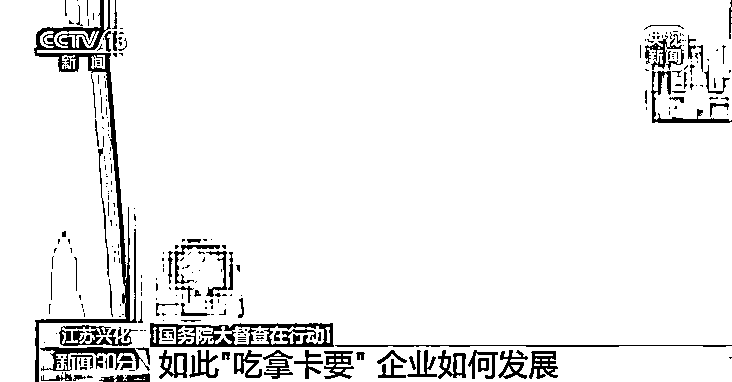
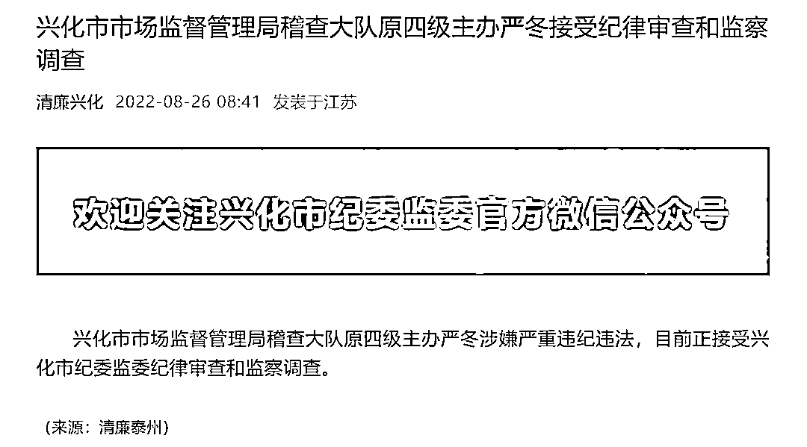
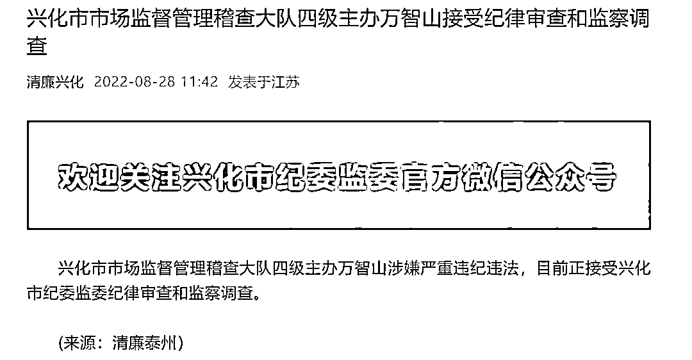

# 科长“吃拿卡要”现场曝光

> 原文：[`mp.weixin.qq.com/s?__biz=MzIyMDYwMTk0Mw==&mid=2247542883&idx=6&sn=cd969476f6ec3d867fc7f4cb033031de&chksm=97cbe35ba0bc6a4de1c25247e97f221d4e2adfc775550538c50e5630192564eef493b7e48fc8&scene=27#wechat_redirect`](http://mp.weixin.qq.com/s?__biz=MzIyMDYwMTk0Mw==&mid=2247542883&idx=6&sn=cd969476f6ec3d867fc7f4cb033031de&chksm=97cbe35ba0bc6a4de1c25247e97f221d4e2adfc775550538c50e5630192564eef493b7e48fc8&scene=27#wechat_redirect)

8 月 23 日，据新华社报道，为深入贯彻党中央、国务院决策部署，全面落实疫情要防住、经济要稳住、发展要安全的要求，推动中央经济工作会议和《政府工作报告》确定的各项任务以及稳经济一揽子政策措施落到实处，保持经济运行在合理区间，**国务院决定开展第九次大督查**。按照统一安排，19 个国务院督查组分赴山西省、内蒙古自治区、黑龙江省、上海市、江苏省、浙江省、福建省、江西省、河南省、湖北省、湖南省、广东省、广西壮族自治区、云南省、西藏自治区、陕西省、甘肃省、青海省、新疆维吾尔自治区等 19 个省（区、市）和新疆生产建设兵团开展实地督查工作。

8 月 26 日，央视新闻曝光了江苏泰州兴化市市场监管局工作人员“吃拿卡要”的行为。国务院大督查第五督查组督促兴化市政府严肃处理相关责任人。

[`mp.weixin.qq.com/mp/readtemplate?t=pages/video_player_tmpl&action=mpvideo&auto=0&vid=wxv_2550207125952708610`](https://mp.weixin.qq.com/mp/readtemplate?t=pages/video_player_tmpl&action=mpvideo&auto=0&vid=wxv_2550207125952708610)

视频视频来源：央视新闻

央视节目播放了今年 6 月 5 日江苏泰州兴化市市场监管局工作人员要求企业请客吃饭的场景。

为何要请这顿饭？事情要从今年 2 月份说起。兴化市某企业负责人杜先生因为要在兴化市大垛镇投资办厂，来到兴化市市场监管局咨询。杜先生说，“先找了一个姓万的科长，然后第二天他带人来我厂里。他说那人也是科长，姓严。他们说这些东西他们可以办，**办 QS 认证，做（申报）材料要一万元钱**。（没办法）他们主管我们。”

节目披露，万某是兴化市市场监管局质监科现任科长，他向杜先生介绍的是质监科原科长严某。**杜先生因担心拒绝二人会惹麻烦，就支付了原本不用支付的申报资料费一万元**。此后四个月，杜先生先后遭遇了五次“吃拿卡要”。

图片来源：央视新闻视频截图

督查组调查发现，2019 年 9 月以来，严某等人以工业产品许可证编写、申报资料等为名，收取数十家企业共计十多万元。

督查组发现，杜先生的遭遇并非个例，有多家企业主表达了对兴化市市场监管局等多个职能部门乱作为的不满。兴化市某企业负责人向督查组工作人员说，“你正规去办也许能够办得下来，**但是会卡你很长很长时间**。但是你花钱让他去办，这个事情就不一样了。”

针对发现的问题，国务院大督查第五督查组向兴化市委市政府进行了反馈。

图片来源：央视新闻视频截图

督查组成员崔慧说，“我们已经督促兴化市人民政府严肃处理相关责任人，同时举一反三，研究采取坚决有效的措施，根治这类影响营商环境的行为，改善当地的营商环境。”

兴化市市长殷俊表态，“**诚恳接受，自查自纠，积极整改，即知即改**。”

8 月 26 日，据江苏泰州“清廉兴化”官方微信公众号消息，兴化市市场监督管理局稽查大队原四级主办严冬涉嫌严重违纪违法，目前正接受兴化市纪委监委纪律审查和监察调查。 

8 月 28 日，据“清廉兴化”消息，兴化市市场监督管理稽查大队四级主办万智山涉嫌严重违纪违法，目前正接受兴化市纪委监委纪律审查和监察调查。

来源：每日经济新闻综合央视网、新京报政事儿

欢迎关注灰产圈社群服务号

