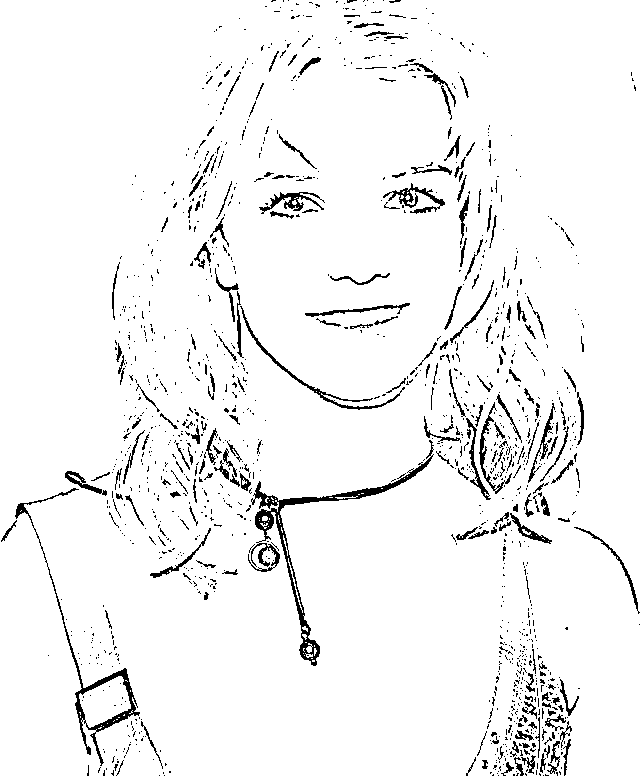
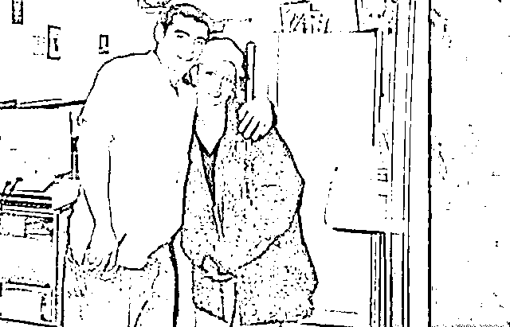
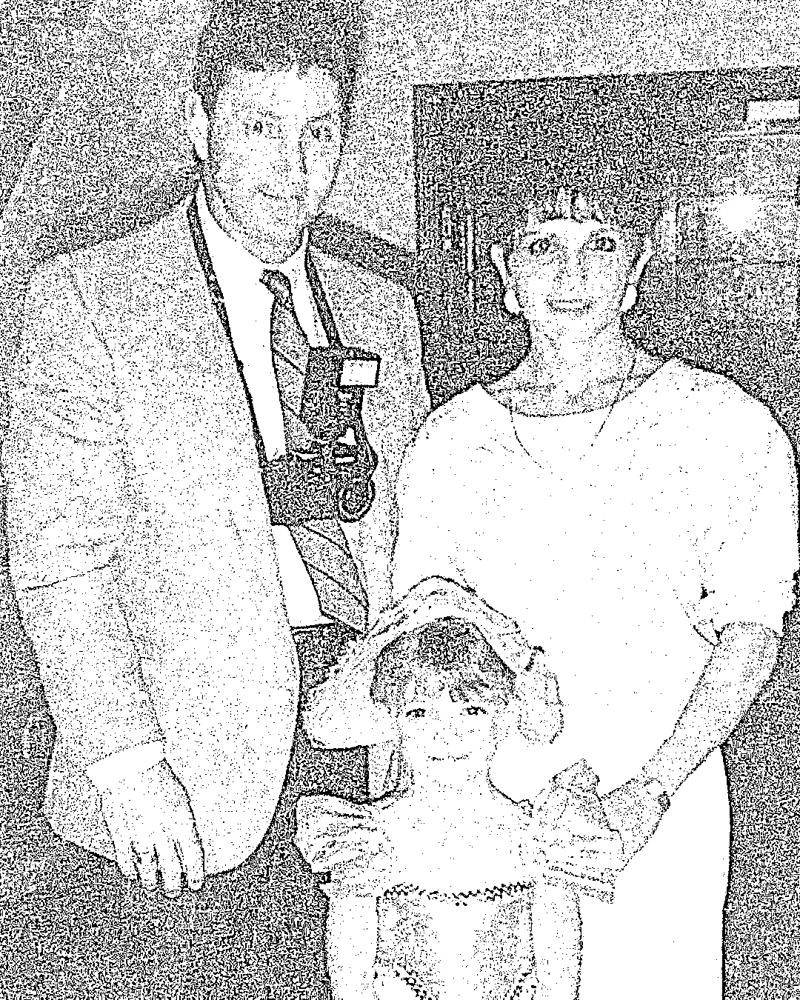
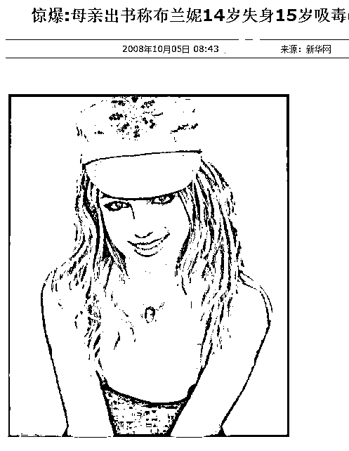
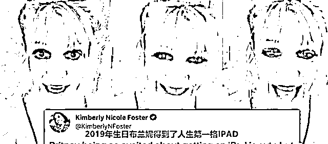
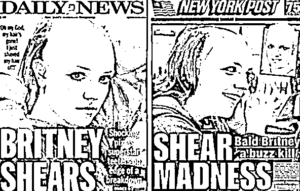
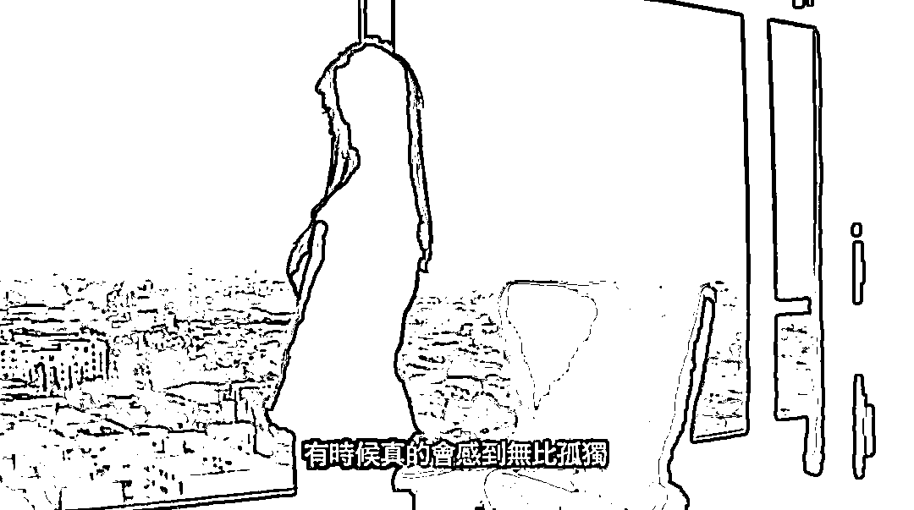

# 顶流女星被灌药节育、软禁 13 年：一代女神，沦为玩物？亲人的伤害太残忍

> 原文：[`mp.weixin.qq.com/s?__biz=MzIyMDYwMTk0Mw==&mid=2247542960&idx=1&sn=20f3068584a97209375841298e290533&chksm=97cbe388a0bc6a9e32391a4762a530200e6618be73889e9c02b77b4a142c6b1fcbce6b6c7721&scene=27#wechat_redirect`](http://mp.weixin.qq.com/s?__biz=MzIyMDYwMTk0Mw==&mid=2247542960&idx=1&sn=20f3068584a97209375841298e290533&chksm=97cbe388a0bc6a9e32391a4762a530200e6618be73889e9c02b77b4a142c6b1fcbce6b6c7721&scene=27#wechat_redirect)

图文均来源网络 

01

在 21 世纪初，曾流行过这样一段话：

**“你可以不知道美国总统是谁，但你不能不知道小甜甜布兰妮。”**

要知道“小甜甜”的名号，要是回溯到 2003 年前，她绝对担得起“全球顶流”的称号。

巅峰时的她，被泰勒.斯威夫特奉为偶像、被 Lady Gaga 致敬红毯造型，说是“神仙”的“神仙”也不为过。

但是，被称为小甜甜的她，过得可一点也不甜。

她的人生正好与昵称相反，美惨强就是她的形容词。

19 岁时，出道仅一年的布兰妮 · 斯皮尔斯，身价已经过亿。

她共获得 1 座格莱美奖、包括 1 座终生成就奖在内的 6 座 MTV 音乐视频带大奖、7 座公告牌音乐奖。

图片来源：网络，侵删

可是如今，布兰妮却逐渐消失在大众的视野中，偶有热搜，也大都是负面。

更有人直言，她的精神状况出现了问题。

**一代天后成了一代癫后。**

02

在她事业如日中天的时候，爱情也悄悄地随之到来。

布兰妮的第一任男友是贾斯汀.布莱克，彼时，二人携手共进，本以为是灵魂伴侣。

布兰妮也一直对外保持清纯玉女，作为青少年榜样的形象。

可谁能想到这段恋情给小甜甜造成了致命性的打击。

二人分手后，贾老板先是在新歌 MV 中安排了一段女主出轨的戏码，侮辱布兰妮，还称布兰妮有过肢体关系，透露二人私生活细节。

贾老板的这样一番言论，直接把她推下悬崖。

布兰妮伤心至极，于是选择了与自己儿时的朋友贾森闪婚。

可笑的是，这段婚姻在 55 小时之后，便以女方赔付 400 万美金告终了。

图片来源：网络，侵删

然而，高额的赡养费并未让小甜甜吸取教训。

也许是太过憧憬婚姻，不到一年，布兰妮再次与伴舞凯文迈入婚姻的殿堂。

起初，她以为自己遇到了真爱，各种大秀恩爱，谁知凯文却是个实打实的软饭渣男。凯文之前有女友，并且已经怀孕，布兰妮一度被传言是小三。

而凯文为了傍上布兰妮的大腿，抛弃了怀着身孕的女友，想尽办法与布兰妮结婚。

**婚后的布兰妮，为了稳固感情，更是为凯文生下了两个孩子。**

然而幸福的家庭没并没有挽留住浪子的野心，婚后，他马上暴露出了本性，每天无所事事，只顾花天酒地，用小甜甜的钱，和别的女人逍遥快活，还妄想让小甜甜给自己出专辑。

这样的行为终于激怒了小甜甜，可是离婚却成了难事。

凯文以两人的“恩爱”视频作威胁，索要天价分手费以及争夺孩子的抚养权。

便是从此刻开始，年仅 25 岁的布兰妮的性格开始了巨变。 

**“剃光头发”、“同性恋倾向”、“沦为玩物”，成为了一代天后的负面标签。**

03

如果用一句话描述，布兰妮的一生，似乎都在追逐爱的道路上。

而这背后，离不开她糟糕的原生家庭。

布兰妮的父亲是一名建筑承包商，终日沉迷酒精；母亲则是一名老师，专注于培养女儿。

因为小时候便呈现出的唱歌天赋，布兰妮被母亲严格教导与控制。

当同龄人都在享受童年的时候，布兰妮早早的就被送进了各种培训班。

3 岁起，布兰妮就开始学习唱歌、跳舞和体操。

4 岁时，布兰妮就开始到教堂里唱歌。那时起，布兰妮的父母，就发觉里自己女儿非常有才华。

8 岁那年，布兰妮在母亲的陪同下参加迪士尼的选秀，落选的她却被制作人一眼看中，并帮助她在纽约找了一名经纪人。

11 岁时，布兰妮成功入选了迪斯尼公司下属的 “米奇老鼠俱乐部”节目，开始了各地的环游表演，唱歌、跳舞、上电视。两年后，迪士尼取消了该档节目，布兰妮回到了家乡读书。

除了沦为赚钱机器，布兰妮的生活黯淡无光。

年少时，无力反抗，但被压制的渴望不会消失，会存在于潜意识中，在日后某个时刻爆发出来。

到了布兰妮青春期的时候，因布兰妮的反抗，其母更是出书大骂：

**“问题少女布兰妮·斯皮尔斯从 13 岁开始酗酒、14 岁失去童贞、15 岁则开始尝试 XD。”**

图片来源：网络，侵删

那么无法获得母爱的布兰妮，在父亲身边，是否又会有不同的处境呢？

**答案却是残酷的。**

2008 年，布兰妮感情失利，又面对媒体的网暴，精神沮丧。

在这样的特殊情境下，父亲采取的行动是：

为了获得布兰妮的财产，父亲将她骗进了医院，并且如愿以偿地拿到了一份“早发性痴呆症”的病历单，然后获得了女儿的监护权。

看起来是关心女儿的身体健康，其实他只是想要获得布兰妮的财产而已。并且在布兰妮的数度挣扎当中，她还被父亲送进了精神病院进行治疗。

可是一边被判定是精神患者，一边还能完成巡演活动，这难道不是个悖论么？

布兰妮的父亲不断的接商演和节目，想要攫取布兰妮的剩余价值。

虽然年少成名，收入不菲，可谁能想到，一代天后，居然没有一点财富的支配力，没有银行卡，就连手机都是父亲保管。

2019 年，布兰妮在社交平台上发布了自己的动态，她看上去憔悴无比，与粉丝分享，自己终于拥有了人生中第一个 IPAD。 

图片来源：网络，侵删

如此简单的愿望，普通人尚且可以实现，家喻户晓的明星，却要依靠生日才能达成。

就这样，她被父亲软禁了 13 年，甚至一度给她注射药物，灌药节育。

布兰妮想过反抗，但她不敢，若是试图反抗的话，就会被父亲威胁见不了孩子。

布兰妮曾哭诉道：

**她很渴望继续过上可以自由结婚生子生活，却被父亲和团队禁止再结婚生子，并在体内强制安装节育器。**

**父亲伙同外人把 Britney 搞入精神病中心，甚至因为布兰妮爸爸的不满，一度把精神药物强制换成其他控制度更高的药物。**

图片来源：网络，侵删

布兰妮情路的不顺，以及对家庭的反抗，在媒体面前，却仅仅是用“疯了”两个字，一笔带过。

04

回看布兰妮的前半生，真的令人惋惜。

换句话说，她一生追逐爱，追逐认同，却从来不知道爱到底是什么。

人这一生，匆匆数十载，每个人都是摸着石头渡过生命之河。但为人父母，早于孩子降临人世，需要的给予孩子正确的引导，而不是一味地“禁锢”他们。

**面对亲人的桎梏，我们要如何挣脱？**

首先你要有这个意识，你有选择的权利，你是自由的，你是可以改变的。然后去建立自己的根基，包括物质根基和精神根基。

我们改变不了家人，不幸生在这样的家庭，惟有学会爱自己，接纳自己，学会尊重并表达自己的感受。

图片来源：网络，侵删

另外，我还相对布兰妮的父母说几句话。

黄磊有一句教育格言：

> “我从未把她当做孩子，她是一个有思想的人，她有她的秘密，她的想法，她的人生。她不属于我，我们之间是彼此独立的个体，我不把自己的意志强加于她，我们像朋友一样相处。”

**不把自己的野心强加在孩子身上，是为人父母的基本觉悟。**

最后，祝愿布兰妮的人生，从此可以顺遂洒脱，自由快乐。

来源：话痨 幸福小酒馆

欢迎关注灰产圈社群服务号

