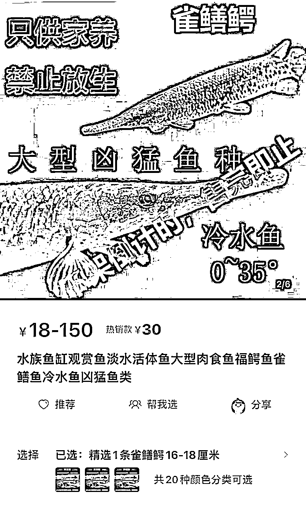
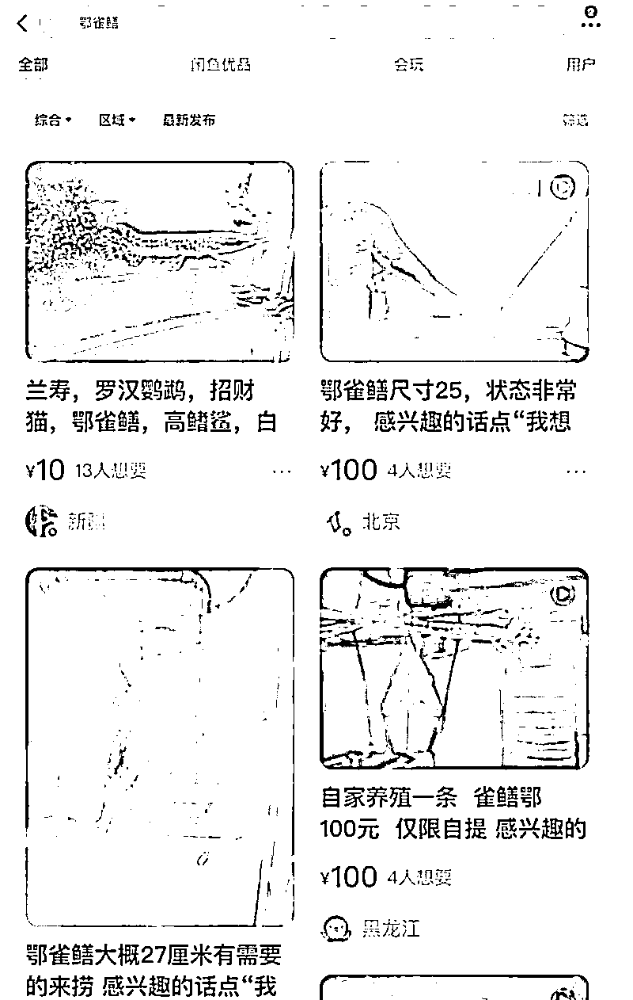
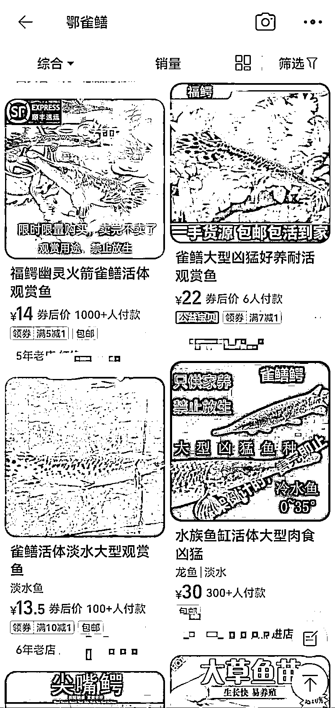

# 凶猛的鳄雀鳝：有商家变换关键词出售，一二十元可买一条！

> 原文：[`mp.weixin.qq.com/s?__biz=MzIyMDYwMTk0Mw==&mid=2247542960&idx=4&sn=798040a70f74688e7a1fe35864175b2a&chksm=97cbe388a0bc6a9e7930fc50c1d5b72f41a65eed69cf2760e2d2136d2e240b20987f8b61e7de&scene=27#wechat_redirect`](http://mp.weixin.qq.com/s?__biz=MzIyMDYwMTk0Mw==&mid=2247542960&idx=4&sn=798040a70f74688e7a1fe35864175b2a&chksm=97cbe388a0bc6a9e7930fc50c1d5b72f41a65eed69cf2760e2d2136d2e240b20987f8b61e7de&scene=27#wechat_redirect)

[`v.qq.com/iframe/preview.html?width=500&height=375&auto=0&vid=d3354ktne4m`](https://v.qq.com/iframe/preview.html?width=500&height=375&auto=0&vid=d3354ktne4m)

河南汝州抽干湖水耗时约一个月捕获鳄雀鳝，令这一外来入侵物种走进公众视野。汝州市城市中央公园管理方 8 月 27 日透露一雌一雄两条鳄雀鳝被捕获并无害化处理后，8 月 28 日，南都记者注意到，在部分电商平台，鳄雀鳝的“身影”并未消失。一些二手平台卖家出售原因包括“太大了放不下”、“吃食猛，养不起了”。尽管商家提醒“养不了不能放生”，但消费者购买后的行为完全靠自律，无法完全杜绝随意放生的行为。

汝州城市中央公园管理方此前向南都记者表示，推测涉事鳄雀鳝是人为放生，“买来观赏后发现长得太快养不了，私自放生到湖里的”，工作人员表示，擅自放生该物种为违法行为，有关部门正在进行调查。

**有电商平台商家变换关键词出售，**

**25 元就能买一条**

公开资料显示，鳄雀鳝别称为“幽灵火箭”、“福鳄”、“大雀鳝”，其为大型凶猛鱼类，主要生活在淡水，鱼卵及内脏有毒，食量大，会大量捕食鱼类和其他生物。就网络争议，汝州城市中央公园管理人员曾向南都记者解释称，抽干湖水捕获这一外来入侵物种，不是作秀，是因为该物种在水中属于“霸主”，且有攻击儿童的案例。

作为外来入侵物种，鳄雀鳝的来源受到关注。

8 月 26 日，南都记者检索发现，有电商平台在相关报道热议后，下架了鳄雀鳝活体鱼的销售。南都记者在一鳄雀鳝线上爱好群了解到，有爱好者表示，鳄雀鳝生长速度快，“两个月长了好多，太能炫了，鱼缸都变挤了”。部分爱好者透露，目前鳄雀鳝线上销售渠道变少，在部分电商平台上，直接搜索无法显示，只能联系相熟的商家购入。

8 月 27 日，南都记者再次检索多家主流电商平台发现，仍有电商商家在出售鳄雀鳝，通过变换“鄂雀鳝”“雀鳝鳄”等字眼规避“鳄雀鳝”这一关键词，并在宣传页面打出“禁止放生、售完即止”的字眼。

有商家的鳄雀鳝商品链接显示，月销量在 1000 条以上，价格在十几元至几百元不等，尺寸小的 10 多元至 25 元的价格，就可以买到。此外，还有与鳄雀鳝同属雀鳝科的尖嘴鳄在售，据公开资料，其同样属于不能私自放生的观赏鱼类。

有商家向南都记者表示，鳄雀鳝相对较好养，对水温水质要求不高，30 度左右即可。商家也作出提醒，鳄雀鳝为凶猛大型鱼，若与其他鱼一同生活，最好选择体型接近的鱼，否则会吃体型较小的鱼。

在二手交易平台上，鳄雀鳝也并不难找到。卖家转手原因显示，有“不想养”、“太大了放不下”、“吃食猛，养不起了”等，尺寸在 20 厘米至 70 厘米不等。

有商家也提醒，“凶猛大型鱼只适合在家鱼缸饲养观赏，一般养两年可以到 70 多厘米”、“养大后实在养不了，一般可以卖给或者送给喜欢养猛鱼的人，但一定不能放生。”

南都记者注意到，在电商平台页面，仅 8 月 26 日，新增了不少消费者购前咨询“养这个是否违法”的提问，不少已购消费者答复称，“可以养，别放生就行”。

中国渔业协会原生水生物及水域生态专业委员会副主任周卓诚在接受媒体采访时表示，由于鳄雀鳝不是禁止交易的保护动物，目前法律没有明确禁止售卖，这无法杜绝部分消费者购买后随意放生、丢弃。南京江豚水生生物保护协会秘书长姜盟在接受媒体采访时建议，应请相关主管部门和专家重新评估，规范水生生物宠物市场的销售与管理。

汝州城市中央公园管理方此前向南都记者表示，作为一种外来大型凶猛鱼类的鳄雀鳝，放生至新一片水域后会大量捕食本土鱼类并危害当地生态，损害生物多样性。

其同时称，鳄雀鳝也系观赏鱼类，推测是人为放生，“买来观赏后发现长得太快养不了，私自放生到湖里的”，工作人员表示，擅自放生该物种为违法行为，有关部门正在进行调查。

**多地近期频现其身影，**

**擅自放生涉嫌刑事犯罪**

公开报道显示，鳄雀鳝的踪迹在广东、广西、福建、河南等多地出现，近期甚至频频出现在小区、公园等地。

8 月 1 日，北京一小区居民在景观水系中发现半米多长的“鳄鱼”，捕获后确认为鳄雀鳝，疑为居民放生。8 月 11 日，云南昆明一小区居民在该小区的观景池内，发现一只鳄雀鳝。26 日，该小区物业将其捕获。8 月 17 日，江苏靖江市一小区景观池内发现鳄雀鳝，一名男孩的手指被咬伤。

对于鳄雀鳝的综合治理，官方已有相关明文规定。

在 2021 年 1 月 20 日，农业农村部、自然资源部、生态环境部、海关总署、国家林草局联合发布《关于印发<进一步加强外来物种入侵防控工作方案>的通知》，其中提到，“强化水生外来物种养殖环节监管，推进水葫芦、福寿螺、鳄雀鳝等水生外来入侵物种综合治理。”

2022 年，农业农村部等相关部门制定《关于印发外来入侵物种普查总体方案的通知》，对 10 种主要外来水生生物进行全国性普查，其中就包含鳄雀鳝。今年 8 月 1 日起施行的《外来入侵物种管理办法》明确，任何单位和个人未经批准，不得擅自引进、释放或者丢弃外来物种。涉嫌犯罪的，依法移送司法机关追究刑事责任。

除了鳄雀鳝，因擅自放生物种造成不良影响的案例不鲜见。

2021 年 9 月，郝某某、范某某将人工养殖的鳄鱼幼崽放生于河北邯郸武安市京娘湖景区湖水中。群众发现后此鳄鱼后立即举报，经专业团队人员连日搜寻，9 月 24 日，鳄鱼被捕捞上岸，但因天气原因，此鳄鱼无法适应野外水生环境而导致死亡。经调查，郝某某、范某某的行为已违反治安管理处罚法第二十三条第一款第二项之规定，构成扰乱公共场所秩序行为，公安机关依法对郝某某和范某某予以治安处罚。

今年 7 月，苏州河管理站接到 13 起鱼类死亡污染投诉，并协调保洁单位进行突发污染应急处置。据媒体报道，河道管理部门每天上下午进行全覆盖巡查，发现经常有人群在苏州河沿岸进行大规模放生，这些鱼遇到高温暴雨天气极易死亡，甚至发烂发臭到影响附近居民生活，污染水域环境。

目前，全国多地正在开展水生生物入侵物种调查，多地呼吁广大市民，不要擅自引进、释放或者丢弃外来水生物种。公众在发现福寿螺、鳄雀鳝等水生外来入侵物种后，可以及时向公安部门、保护协会以及水生生物保护主管部门提供相关线索。

来源：南方都市报 APP·即时新闻。采写：南都记者 黄驰波 实习生 廖泳梅 视频：卢慧明 编辑： 张亚莉

欢迎关注灰产圈社群服务号

