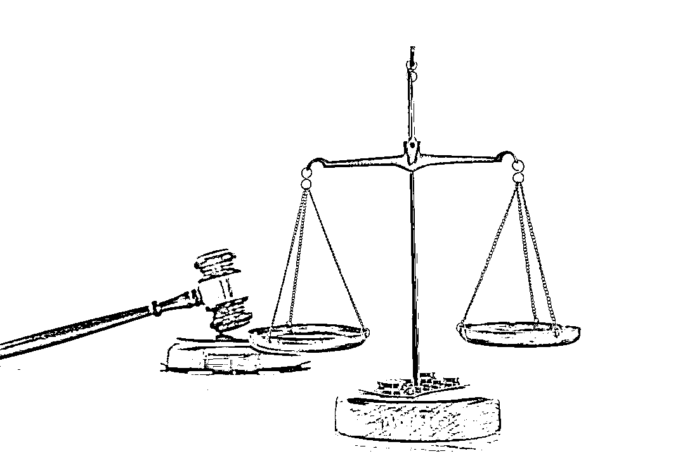
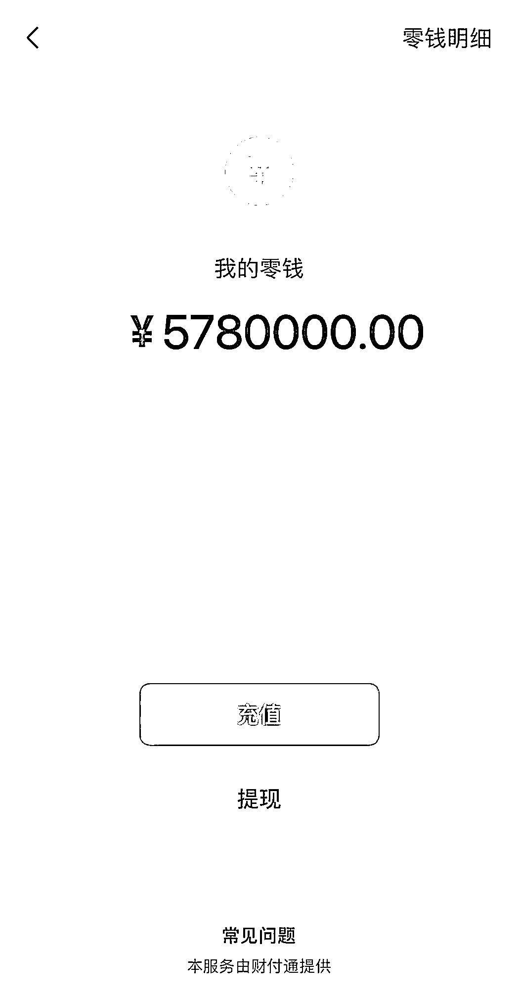

# 小伙为了找人“借钱”，晒出账户余额：看，578 万……

> 原文：[`mp.weixin.qq.com/s?__biz=MzIyMDYwMTk0Mw==&mid=2247542960&idx=5&sn=c976bfb66d52998ac6cf7c59afca9b87&chksm=97cbe388a0bc6a9ed960d7d04ad537da22dd02199578517e6eb1006c759ff6f41aeee7895bf7&scene=27#wechat_redirect`](http://mp.weixin.qq.com/s?__biz=MzIyMDYwMTk0Mw==&mid=2247542960&idx=5&sn=c976bfb66d52998ac6cf7c59afca9b87&chksm=97cbe388a0bc6a9ed960d7d04ad537da22dd02199578517e6eb1006c759ff6f41aeee7895bf7&scene=27#wechat_redirect)

将银行卡挂失

截取转账失败的图片

声称自己银行卡被冻结

编造各种理由向熟人借款

8 个月中他竟然骗了 200 余万元

近日

经湖北省宜昌市夷陵区检察院提起公诉

法院以诈骗罪判处被告人万某

有期徒刑十三年六个月

并处罚金 10 万元

图片来源：摄图网-ID：501594553（图文无关）

**出狱 4 个月，无业小伙盯上好友**

2020 年 10 月，因诈骗罪被判处拘役六个月的万某刑满释放。他没有找工作，而是四处游荡，缺钱了就向父母要。不久后，万某迷上了一款网络赌博软件，每天都要赌上几把，很快便掏空了父母的家底。

2021 年 2 月，为了筹措赌资，万某将主意打到了朋友望先生的身上。为让望先生相信自己有还款能力，万某将提前准备好的 70 万元微信零钱余额截图发给望先生，再将自己的银行卡挂失，告知望先生自己要借点钱“搞正事”，挣到钱后可以一起分红。万某说：“我的银行卡被冻结了，钱取不出来了，不然也不会找你借钱的。”

见到截图中有这么多余额，望先生相信了万某。此后，2021 年 2 月至 6 月，万某多次以银行卡被冻结等理由向望先生借款 40 余万元。其间，望先生要求万某还款，但万某又一次凭借一张银行卡流水 390 余万元的截图和与银行工作人员的聊天记录取信于望先生，只还给他几千元了事。

此时，万某意识到不能再向望先生借钱了。于是，他将目标转移到了好友向先生身上。

**被害人当面对质发现真相**

2021 年 6 月，万某来到向先生经营的小店。二人聊天后，万某说要出去打牌，便离开了小店。没过多久，万某回到店中对向先生假装抱怨自己输了不少钱，并当着向先生的面给对方转账。向先生说：“你输这么多钱多不划算，不如你把钱借给我还房贷，到时候我连本带息一起还给你，你还能挣点利息。”万某一口应下，并当场打开显示有 130 万元余额的微信零钱，当着向先生的面，提取了 70 万元到自己的银行卡里，然后声称有事先走，晚点转账给向先生。然而，第二天向先生并没有收到转账。

接下来便是老套路，万某以银行卡冻结需要资金对冲、资金需要解冻、需要缴纳滞纳金等理由跟向先生借钱。为了证明自己有钱，万某发给向先生一张 578 万元的微信余额截图，并通过微信给向先生发了一张本息共计 160 万元的借条。此后，2021 年 6 月至 10 月，向先生共计给万某转账 130 余万元，扣除还款部分，向先生实际损失 90 余万元。

除了朋友，万某还将主意打到了自己的女友乔女士和网恋对象曾女士身上，并先后向二人借款共计 70 余万元。

2021 年 10 月，曾女士首先发现事情有些不对头。她联系到与万某的共同好友向先生，才发现向先生也遇到了同样的事情。随后，曾女士、向先生、乔女士三人碰面，将事情说开，发现才短短几个月，万某竟然跟他们三人都借了很多钱。

三人将万某叫到向先生家中，万某知道自己瞒不下去了。“这些都是假的，那个截图是我用软件做的。钱都让我输光了，没钱还给你们。”三人最终决定报警。

万某制作的虚假截图

2021 年 10 月 27 日，万某在家中被公安机关抓获归案。然而，从侦查案件到最终判决，万某始终坚称自己没有诈骗。“他们要钱的时候我也还了一些，我没有诈骗，我还打过一张借条，这是正常的借款行为。”

**用证据说话，拆穿谎言认定诈骗**

那么，万某的行为究竟是民事借贷，还是刑事诈骗？

对于万某坚称自己没有撒谎，微信余额的确有几百万元的供述，公安机关经调取其交易明细后发现，其微信零钱余额最多时为 5.7 万元，微信零钱通余额最多时为 11 万元，从未出现过上百万元的记录。万某称自己从未挂失过银行卡，而公安机关却查到，万某在 2021 年 4 月至 10 月间，先后通过手机银行挂失银行卡多达 18 次，均在几天后通过手机银行撤销，而手机银行挂失和撤销银行卡的步骤之一便是人脸识别，且其在与曾女士、向先生、乔女士三人对质时，曾亲口承认自己操作手机挂失过银行卡。

至于那张 160 万元的借条，承办检察官认为，区分民事借贷和刑事诈骗需要从多角度综合判断，其根本区别是被告人有没有非法占有的目的，是否有借条并不是区分二者的根本性条件。万某出具借条的行为，实为麻痹被害人，让对方更相信自己。万某名下无房、无车，无固定工作和收入来源，面对被害人多次催促还款，仅偿还小额资金，对大额部分却多次推托，甚至以各种理由进一步诈骗，拿到钱后全部用于网络赌博，导致被害人的钱款无法收回，综合判断万某具有非法占有目的。

检察机关认为，万某通过软件制作虚假余额截图和聊天记录，虚构还款能力，使被害人陷入错误认识，诈骗金额共计 200 余万元。今年 2 月 23 日，夷陵区检察院以万某涉嫌诈骗罪向法院提起公诉。日前，法院作出上述判决。

来源：检察日报正义网（ID：JCRB_zyw），每日经济新闻

欢迎关注灰产圈社群服务号

