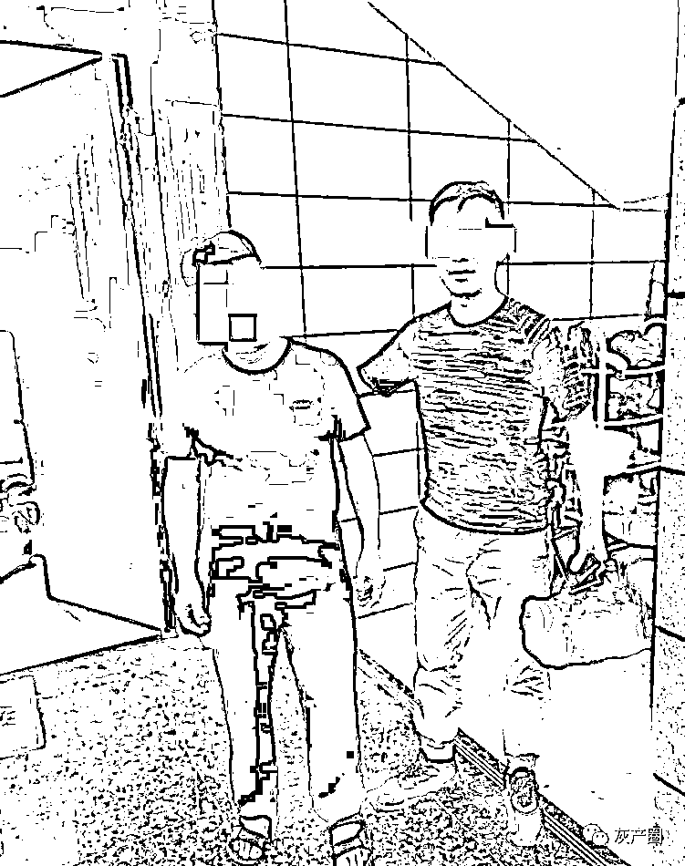
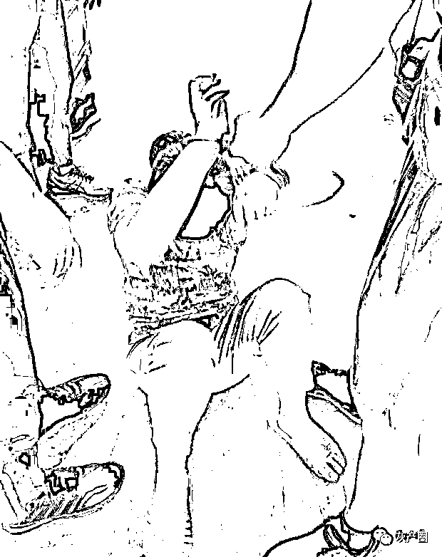

# “哥哥，我们自驾游吧？”杭州七旬大伯旅行团结识中年女子，迷迷糊糊写下巨额欠条……

> 原文：[`mp.weixin.qq.com/s?__biz=MzIyMDYwMTk0Mw==&mid=2247542960&idx=6&sn=1d3c28f195ed5ade5d74c41d16340e96&chksm=97cbe388a0bc6a9ea9e347cf8b9b9b1ea84b3c8ef161c1515af3a208456a68cce46e6870cbc0&scene=27#wechat_redirect`](http://mp.weixin.qq.com/s?__biz=MzIyMDYwMTk0Mw==&mid=2247542960&idx=6&sn=1d3c28f195ed5ade5d74c41d16340e96&chksm=97cbe388a0bc6a9ea9e347cf8b9b9b1ea84b3c8ef161c1515af3a208456a68cce46e6870cbc0&scene=27#wechat_redirect)

**杭州萧山 74 岁的何大伯，没想到在旅行中，有了一场邂逅。** 

何大伯是退休职工，去年 6 月，他和邻居报了个赴扬州的旅行团。

在旅行中，同团的金阿姨和她同行的男伴，邀请何大伯他们一起吃午饭，几个人就拼了桌。

金阿姨说她也是萧山的，何大伯一听，哇，这么巧。金阿姨又问“你是六几年生的啊”，何大伯一听乐了，这是夸自己年轻么，他说自己已经 74 了，金阿姨说“那我得叫你哥哥了。我现在还没退休呢，还得有几年呢。”

就这么，金阿姨“哥哥哥哥”地叫开了。几个人相聊甚欢，互相交换了联系方式。

何大伯回到杭州后，与金阿姨一直保持着微信联系。随着两个人越聊越深，金阿姨发来的微信，暧昧了起来。

“哥哥你来戴村玩啊！” 

“我去那边找哥哥你啊，你们那边应该还有个市场。”

“我想你了”……

**何大伯觉得自己的“第二春”来了。从扬州回来还没有多长时间，两个人又相约 7 月 12 日到桐庐游玩。**

金阿姨提议说这回不跟团了，我们就慢慢悠悠地自驾游吧。何大伯觉得挺好。

金阿姨说她会安排好，随后跟何大伯约好 12 日早上 6 点半有车来接，在萧山城厢镇江寺桥那边集合。

**当天早上 6:40，何大伯发现自驾游的车是辆面包车，一上车，车里还有几个不认识的人，**金阿姨解释说这些都是来自桐庐的朋友，是来招待他们的。

到了桐庐后，**金阿姨带着何大伯来到了一家农家乐，大家一起吃饭，喝了好几瓶酒。**

**何大伯喝得也不少，**有人提议说咱们玩点扑克牌吧，**何大伯本来想回去休息了，却被按下来，**对方说“我们小搞搞”。****

****何大伯迷迷糊糊地打了两局，**牌越打越输，他不想再打了，但眼前这几个新“朋友”口气一变，说，不打了可以，但得把输的钱交上。******

******何大伯意识到自己被骗了，说自己没有那么多钱。******

******金阿姨在一边突然说：**“他退休金每年有 5 万呢，还有房子收来的租金 10 多万呢”，**边上，另外几个人就威胁何大伯说，要是不交钱，就别想回家了。**他们逼何大伯写下欠条。********

******何大伯这才知道，**自己是上套了，什么金阿姨都是和他们一伙来骗自己的。可回到杭州，他不敢跟家里人说……********

******何大伯遇到的可不是什么善缘。******

********杭州萧山警方成功打掉了一个专门诈赌团伙，他们专门针对老人下手。******** 

****去年 7 月，萧山警方接到有人反映线索，**说他爸爸被人诈赌骗走 10 万元。**随后开展调查，**发现嫌疑人“布”了一个很大的局。****** 

********第一步，他们先组团旅游**，以“低价周边游”来吸引老人参加，从报名人中再找有钱的老伯；******

******第二步，派出团伙里的女成员，扮成导游、女性朋友角色接近老伯，和老伯们甜言蜜语，“暧昧”聊天，感情“投资”，**博取老伯们信任，老人们被甜言蜜语灌迷糊了，火候也差不多了，“女朋友”们又提出一起参加短途自驾游。****

******第三步，再接着，在旅行途中，他们就选当地一家农家乐吃饭****，**嫌疑人里男的女的轮番上场，**劝老伯们喝酒。******

********第四步，看他们喝多了，他们又提出“打牌玩玩”，**打牌时，老伯们也稀里糊涂了，**他们就出“老千”进行诈赌。********

******如果有老伯发现不对劲提出质疑，**团伙成员结伴威胁恐吓，老伯拿不出钱，还要逼迫老伯们写下欠条。********

******老伯们明知被骗不敢跟子女说，回到萧山后，**团伙成员还不断进行电话催讨骚扰。********

******专案组调查时，发现有这种遭遇的老人们回到萧山后都没报警。专案组挨家挨户走访，对每一位疑似被害老人耐心劝导，最后老人们才愿意说出实情。******

********被骗的老人有 60 多岁的，也有七十多岁的。********

****萧山警方经过研判，展开抓捕，抓获团伙成员 9 人。团伙成员们以为自己这出戏演得滴水不漏，没想到还是被看穿了。****

********

********

****这个案子，其实犯罪嫌疑人用的手段，本质上也是先打“感情牌”，然后获取信任后进行诈骗，出去旅游等这些，是为了逃避打击，以为这样案发地不在本地不容易被发现。而老人们吃了哑巴亏，怕说出来被子女责怪，没及时报案。****

****来源：都市快报，巴蜀反诈，全民反诈****

********

****欢迎关注灰产圈社群服务号****

********

********