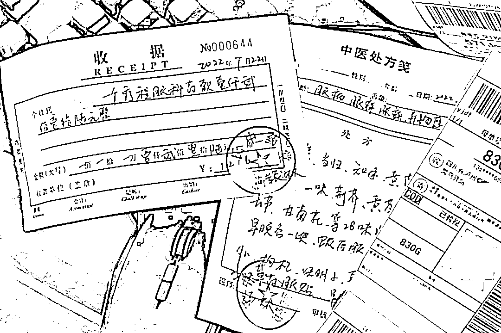
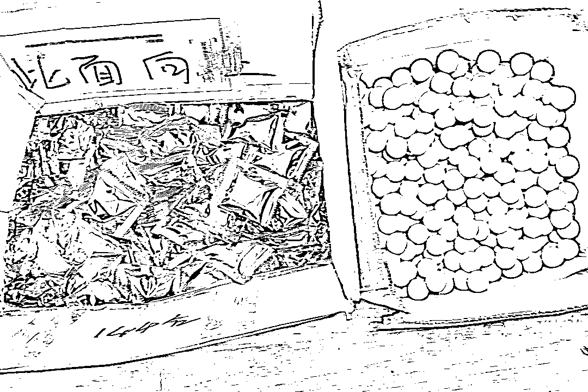
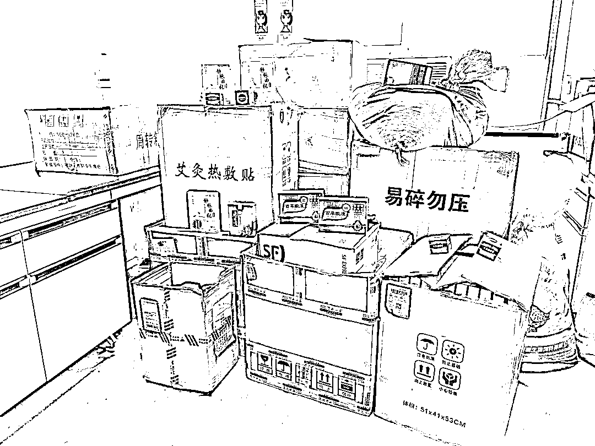
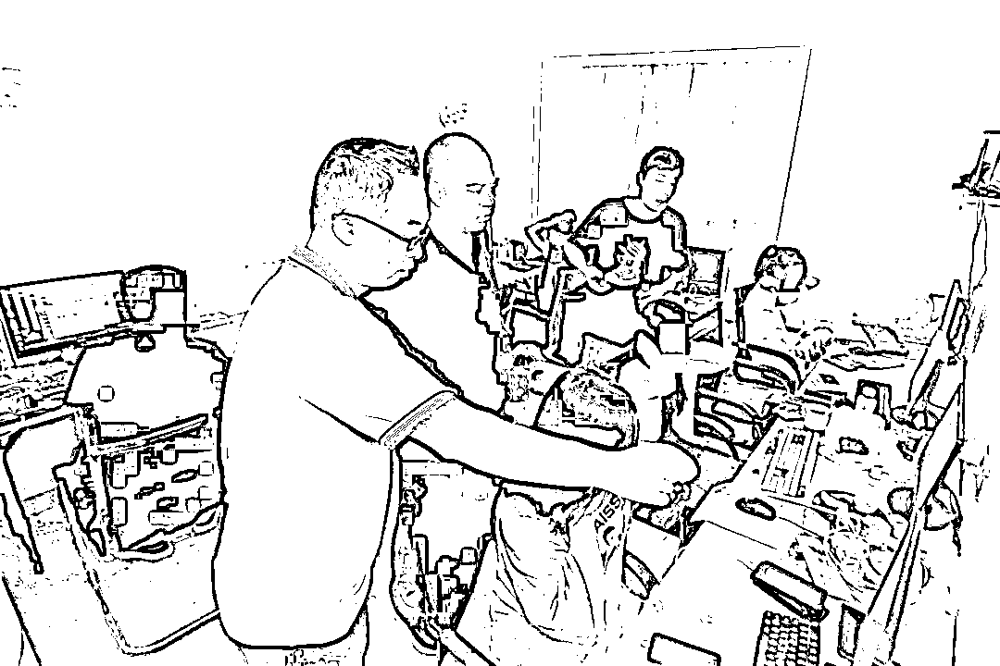
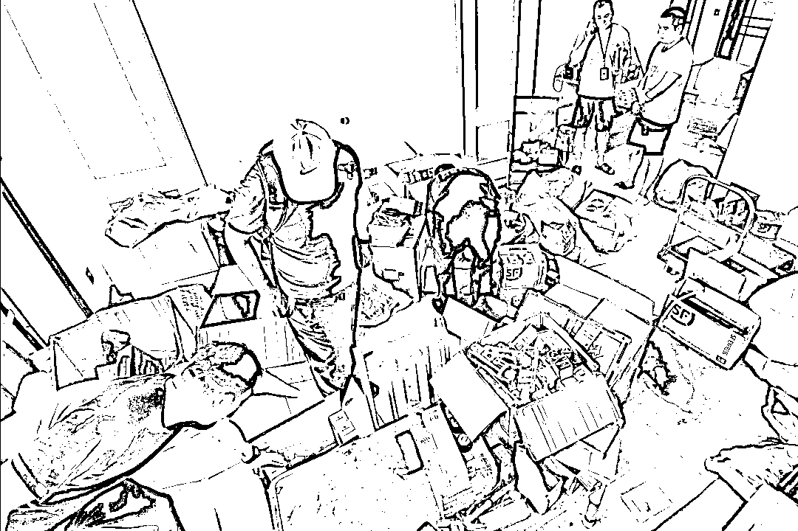

# 真假中医，合伙行骗！

> 原文：[`mp.weixin.qq.com/s?__biz=MzIyMDYwMTk0Mw==&mid=2247542960&idx=7&sn=4cf6947f481c6ddedd16209b75160c53&chksm=97cbe388a0bc6a9eb989d28714064e72e0fa74af0063ded56497f7c03e2b1a2fe0eb8c5724e6&scene=27#wechat_redirect`](http://mp.weixin.qq.com/s?__biz=MzIyMDYwMTk0Mw==&mid=2247542960&idx=7&sn=4cf6947f481c6ddedd16209b75160c53&chksm=97cbe388a0bc6a9eb989d28714064e72e0fa74af0063ded56497f7c03e2b1a2fe0eb8c5724e6&scene=27#wechat_redirect)

**我非常有把握才接诊，这是电视台对我的采访，还有其他患者的评价，你在乎疗效，我注重自己口碑。**

网络里，这是一位

来自中医世家、从医 30 余年的**“老中医”**

屏幕前，坐着的却是一个

初中学历、拿着“话术本”诈骗的

**犯罪嫌疑人**

**近 日**

武汉市公安局青山区分局（钢城分局）会同市公安局网安部门，从一起电信网络诈骗警情追查深挖、抽丝剥茧，在湖南省衡阳市抓获 10 名犯罪嫌疑人，收缴“三无”药品 10 余种、700 余盒，成功端掉一个诈骗窝点。该诈骗团伙冒用他人行医资格，在网上招揽病人、看病坐诊，将“三无”药品包装成“祖传秘方”后卖给病患，非法获利 600 余万元。

[`mp.weixin.qq.com/mp/readtemplate?t=pages/video_player_tmpl&action=mpvideo&auto=0&vid=wxv_2546800482246262785`](https://mp.weixin.qq.com/mp/readtemplate?t=pages/video_player_tmpl&action=mpvideo&auto=0&vid=wxv_2546800482246262785)

***“老中医”推销祖传秘方***

***受害人被骗 2 万元果断报警***

今年 6 月初，家住武汉市青山区的王女士因为静脉曲张久治未愈，在网上四处寻找偏方、名医，这时某网站弹出一个“某中医堂”的广告页面，页面上介绍该中医堂的医生是中医世家，从医三十余年，专治静脉曲张等疑难杂症。王女士便抱着试一试的心态，添加了“尹姓”中医的微信，这位“老中医”自称有祖传的秘方，对王女士的静脉曲张有奇效。王女士开始还半信半疑，“老中医”立即用微信发来了自己的医师资格证、电视台采访视频和朋友圈截图，王女士才信以为真。

“以我三十多年的从医经验来看，祖传秘方**有效率可达 95%，治愈率可达 90%。**坚持按照我的方子来用药，**康复没有问题。**”王阿姨便在“老中医”那里花了 2 万元购买了 8 个疗程中药，可吃完后，王女士的病情没有缓解。“这是慢性病，药千万不能停，要对我有信心”面对质疑，“老中医”这样回复，而王女士心里却泛起了嘀咕，选择了向青山警方报警。

***民警抓捕时正在行骗***

***仓库遍地“三无”药品***

武汉青山警方接到报警后研判深挖、开展数据警情碰撞，发现该团伙头目龙某与市局相关部门掌握的一条诈骗线索高度关联。民警顺线化装侦查，掌握到龙某等人在湖南省衡阳市租赁居民房屋，招聘业务员，打着“某中医堂”的旗号，招揽病患，用内部培训的话术骗取患者信任后，销售“三无”中药牟利。7 月 28 日，青山警方会同市公安局相关部门，组织 40 余名警力，兵分两路连夜赶赴湖南衡阳。

民警破门而入时，龙某正组织业务员招揽“生意”，房间内 6 名业务员电脑上的微信消息提示不停闪动，几名轻男女还在对照“话术本”，扮演“老中医”向病人推销药品。

与此同时，另一队民警也在该团伙骨干蒋某家里，将他和另一名骨干许某抓获。蒋某用来当仓库的房间里弥漫着刺鼻的药味，还有一箱箱没来得及包装的“三无”药品。“有没有行医资格？这些药有没有生产厂家和批号？”面对民警的突审，蒋某和许某低头不语。民警进一步审查发现，蒋某等人在网上购买了大量中药，有的还是来历不明的“三无”药品，经过话术推销，便成了中医世家的“祖传秘方”。

***真医生为利“站台”***

***大学生成骗子帮凶***

近日，随着另一名犯罪嫌疑人尹某被抓捕到案，该团伙犯罪情况被一一查明。经审查，该团伙头目龙某负责对“业务员”管理培训，发放工资奖金；合伙人许某负责广告引流、招揽病患，合伙人蒋某负责购买、包装、寄递药品。

以龙某为首的诈骗犯罪团伙打着“某中医堂”的旗号在网上投放广告，谎称来自“中医世家”，有治疗疑难杂症的“祖传秘方”，诱导患者添加“某中医堂”微信问诊。为了让患者相信自己、心甘情愿购买高价药品，该团伙“业务员”行骗用的微信也是尹姓医生穿“白大褂”的照片，他们还会主动向患者出示医师资格证，发送电视台采访报道视频。

“**我们不会医术，都是按照公司培训的模板回复治疗意见，**针对眼疾、静脉曲张、乳腺病推销一些膏药贴、艾灸贴、口服液、药丸。”在骗取患者信任后，这些“业务员”对照诈骗话术本里的“模板”，提供诊疗方案，借机推销药品。为了防止患者反悔不收货，他们每次收取一定比例的订金，再以快递货到付款的方式发货。

“如果有人要求用视频电话问诊，我们会让尹医生出面坐诊”犯罪嫌疑人许某所说的“尹医生”正是警方刚刚抓捕到案的尹某，**而尹某还是当地小有名气的一名中医。**“许某当时通过朋友找到我，借用我的医师资格证和照片，有时会让我帮着视频坐诊，推销一些他们的中药，每月给我 4000 元酬劳”**尹某明知许某等人违法犯罪，选择“睁一只眼闭一只眼”，收下了这些非法“酬劳”。**

为了牟取非法利益，龙某等人将黑手伸向了涉世未深的大学生和无所事事的辍学青年。该团伙 6 名“业务员”中，张某是刚毕业的大学生，李某是一名大学在校生，两人还是表姐妹。“龙某发布的招聘公告对专业没有要求，每月除了底薪，还有 11%的奖金提成，我最高时一个月赚了 1 万多”只想着轻松挣钱的她们就这样落入了龙某的圈套，成了犯罪团伙的帮凶。

据了解，龙某等人组成的诈骗团伙在一年多时间内通过购买、包装、高价销售药品，以同样的诈骗方式，非法牟利 600 余万元，受骗人员涉及全国 30 余省市、4200 余人，而这些一个疗程售价 2000 元至 3000 余元的“祖传秘方”，有的进价仅 20 元。目前，龙某、许某、蒋某、尹某等 10 人因涉嫌诈骗犯罪，被武汉青山警方依法采取刑事强制措施，该案正在进一步侦办深挖中。

素材来源：通讯员 李元辉 黄俊道 刘海

来源：平安武汉，利箭在出击

欢迎关注灰产圈社群服务号

