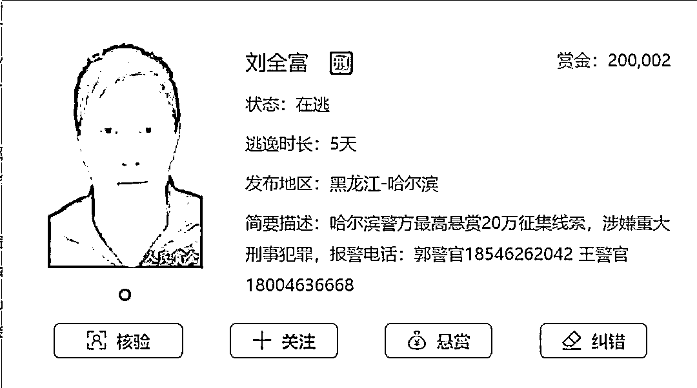
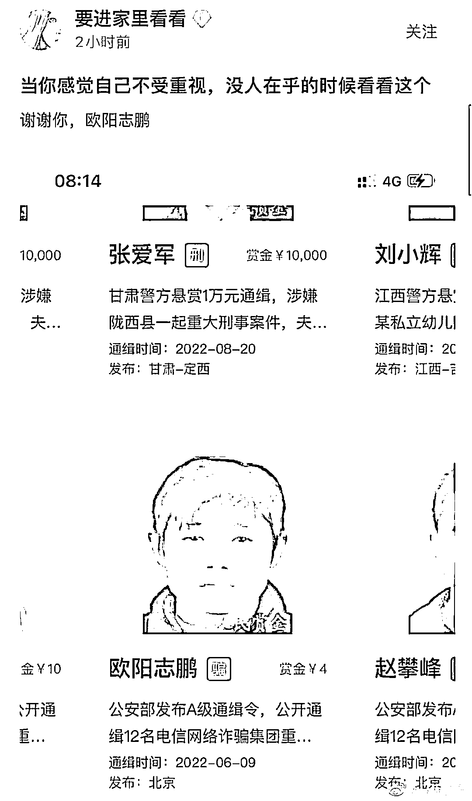
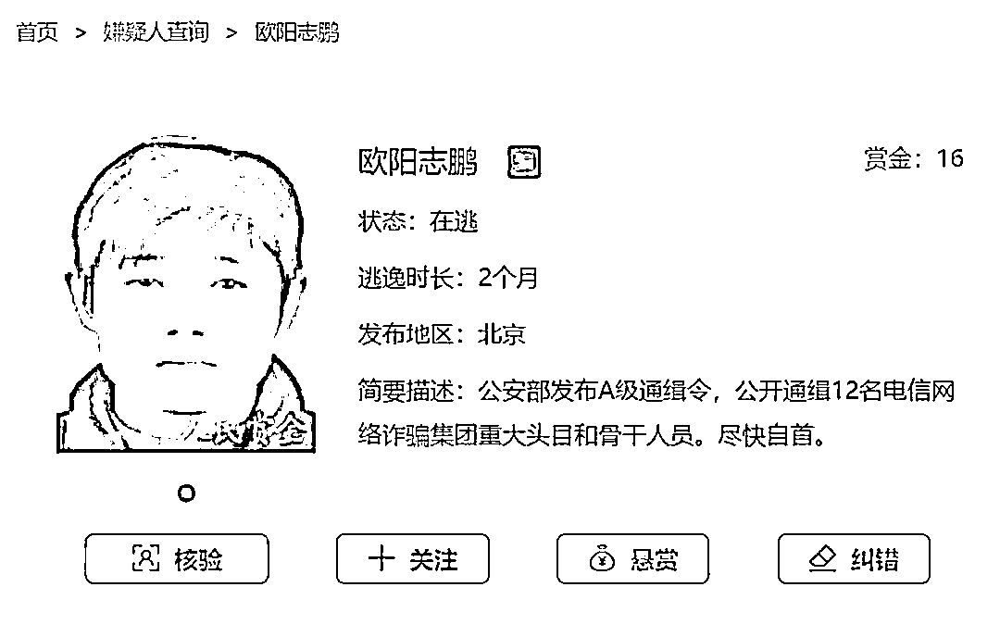

# 一名通缉犯的抓捕赏金仅 4 元？平台回应

> 原文：[`mp.weixin.qq.com/s?__biz=MzIyMDYwMTk0Mw==&mid=2247542960&idx=8&sn=990544b526bd736030ad313340fa22d1&chksm=97cbe388a0bc6a9e94f5fbf551c689d5eb343f150e43ef94fb4da25d3144677664161ab3d2da&scene=27#wechat_redirect`](http://mp.weixin.qq.com/s?__biz=MzIyMDYwMTk0Mw==&mid=2247542960&idx=8&sn=990544b526bd736030ad313340fa22d1&chksm=97cbe388a0bc6a9e94f5fbf551c689d5eb343f150e43ef94fb4da25d3144677664161ab3d2da&scene=27#wechat_redirect)

本文转自红星新闻

近日，一个名为欧阳志鹏的电诈犯罪嫌疑人引起网友关注。

网传的一张截图显示，一名犯罪嫌疑人欧阳志鹏的通缉悬赏金额仅有 4 元，而在他上方，另一名犯罪嫌疑人张爱军的通缉悬赏金额为 1 万元。

这张截图引发了网友的热议，大家都对这么低的悬赏金额表示好奇：“这人可能是诈骗团伙打扫宿舍卫生的。”还有人调侃：“当你感觉自己不受重视、没人在乎的时候看看这个。”

记者查询公安部网站发现，2022 年 6 月 9 日，公安部发布 A 级通缉令，公开通缉 12 名电信网络诈骗集团重大头目和骨干人员，包括李琳、刘峰亮、欧阳志鹏、朱振奎等，但通缉令中并无悬赏金额，网传的欧阳志鹏 4 元悬赏来自于一个名叫“人民赏金”的 APP。

8 月 28 日中午，记者登录人民赏金 APP，发现欧阳志鹏在该平台的赏金已经增加到 16 元。

其赏金已经增加到 16 元（网络截图）

欧阳志鹏等人的通缉令中，没有写明具体的奖金额度。因此，人民赏金平台转发的被通缉信息中，悬赏金额只显示了网友众筹部分，公安机关悬赏部分显示为零。

记者查询发现，公安部 6 月发布的 12 名电诈犯罪嫌疑人之一朱振奎在人民赏金平台的悬赏金额，也只有 10 元，其中公安机关悬赏部分也是零。进一步检索该平台发现，还有不少被通缉嫌疑人的悬赏金额为几万元到上百万元不等，这些悬赏金是各级公安机关提供并公布的。比如犯罪嫌疑人刘全富的悬赏金额为 200002 元，其中 20 万元是哈尔滨警方的悬赏，2 元是网友的悬赏。

**平台：app 上的网友众筹金额并非警方的悬赏金额**

**人民赏金 APP 负责人袁先生向极目新闻记者介绍，公安机关发布的欧阳志鹏等人的通缉令中，没有写明具体的奖金额度。因此，人民赏金平台转发的被通缉信息中，悬赏金额只显示了网友众筹部分，公安机关悬赏部分显示为零。**

**“打击犯罪，人人有责。”袁先生介绍，人民赏金平台是他在业余时间创立的，转发的通缉信息均从官方渠道获得，建立平台的初衷是为打击犯罪出一份力。**

**有网友质疑，人民赏金平台向网友众筹赏金，是否涉嫌非法集资甚至诈骗？对此袁先生表示：“众筹赏金制度可以最大限度地增加赏金金额，提高大众举报的参与力度和积极性，使‘专业追逃’上升为‘人人追逃’，形成强大的追逃声势，引发社会广泛关注，让犯罪嫌疑人无处可逃。但我们平台没有任何盈利，那些犯罪嫌疑人落网后无人领取的赏金，我们都用作公益的捐献。”**

****律师：网站应确保参与打赏者享有基本的知情权****

****北京大成（武汉）律师事务所柴欣律师表示，如果人民赏金平台上的通缉犯信息都来自于国家相关部门公开的通缉网站，则不涉及侵犯个人隐私，也不违法。但该网站应确保提供的信息准确，要实时更新，以免出现通缉犯已经被抓到，还面向公众征集赏金、进行众筹的情况。对于该网站募集的赏金，应实时或定期公开，让公众知晓资金走向，确保参与打赏者享有基本的知情权。****

****来源：南风窗  值班编辑：苏米 排版：茜雯****

********

****欢迎关注灰产圈社群服务号****

********

********