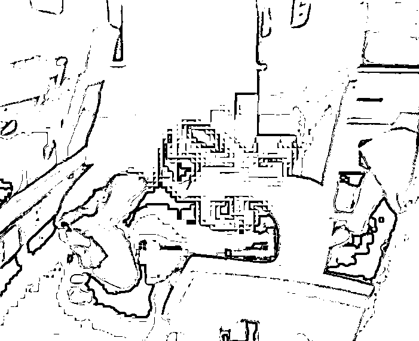
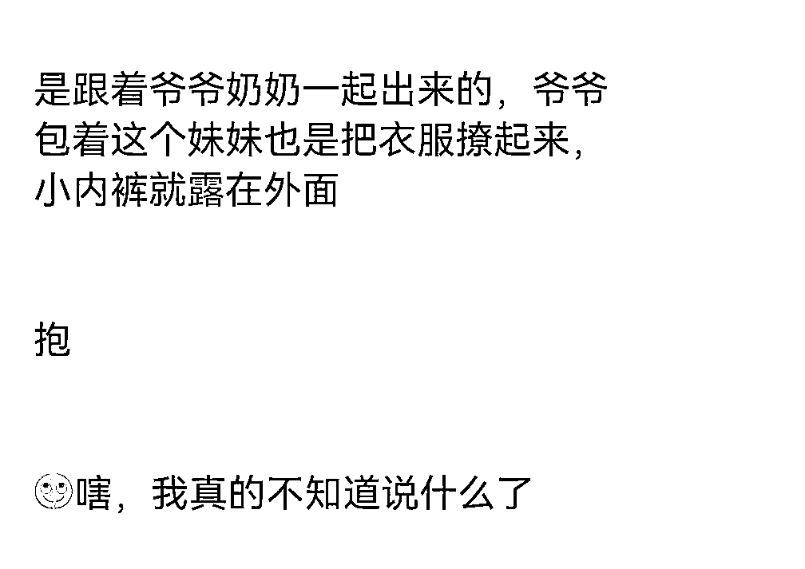
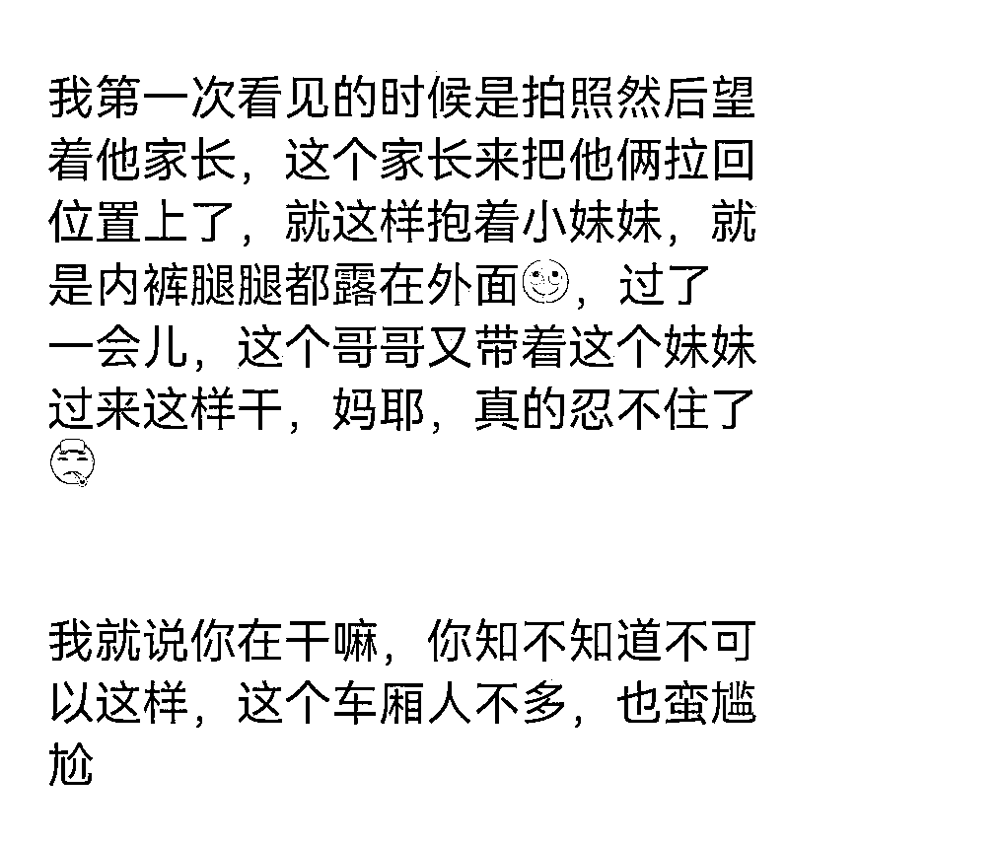
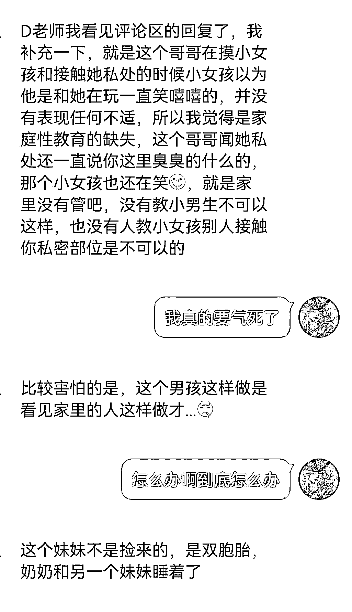
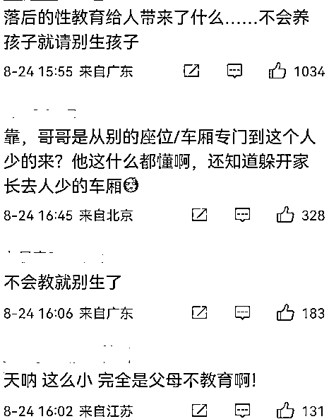
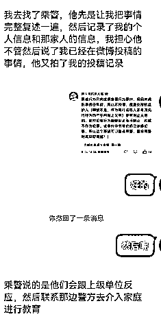
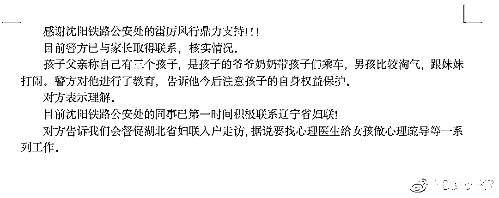
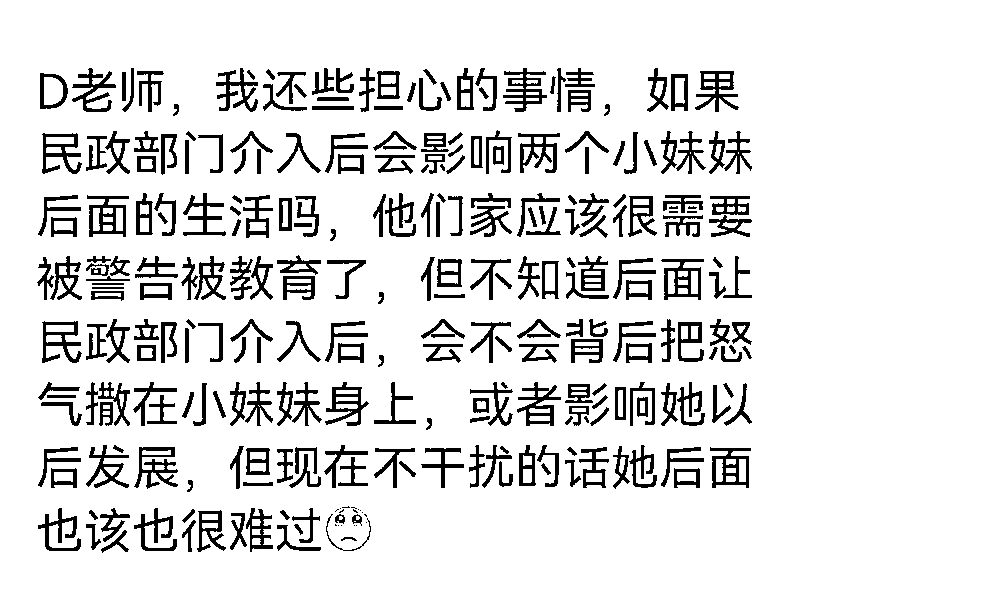
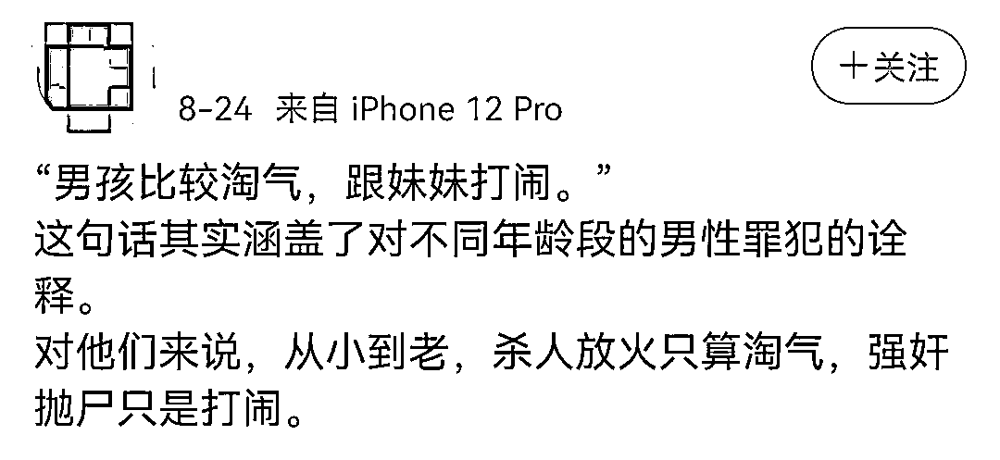

# 哥哥高铁上当众猥亵亲妹妹？？？摸 xiong、闻内裤、撩裙子？！家长视若无睹…

> 原文：[`mp.weixin.qq.com/s?__biz=MzIyMDYwMTk0Mw==&mid=2247543013&idx=1&sn=82ee5b1d8710f8707cd604e529db2e4e&chksm=97cbe3dda0bc6acb7e7b4722a9acfdec455349f001a1f0e68aa9da8974b583f817cb6e04330f&scene=27#wechat_redirect`](http://mp.weixin.qq.com/s?__biz=MzIyMDYwMTk0Mw==&mid=2247543013&idx=1&sn=82ee5b1d8710f8707cd604e529db2e4e&chksm=97cbe3dda0bc6acb7e7b4722a9acfdec455349f001a1f0e68aa9da8974b583f817cb6e04330f&scene=27#wechat_redirect)

# 

在微博上看到这张图片的时候，我震惊了！ 

今晚这篇文章，想跟大家聊聊中国式家长在处理孩子关系时，**有多么的失智，多么的无语，多么的匪夷所思......**

看到这张图的时候，真的**惊到了。**

**这，这可是高铁上啊，大庭广众之下，这是什么动作？**男孩看起来已经 11、12 岁，小姑娘小小的，可能就 4、5 岁，****

****小姑娘穿着的是个裙子双腿张开，****

****男孩呢，**就这样钻在小女孩的腿之间......******

************

******相信任何一个正常人在看到这样画面的时候，**都会产生一种生理性的不适！********

******因为这样的画面，实在是太尴尬太不适宜了。******

******后续经过调查，这两个孩子，是什么关系呢？原来，两人是亲兄妹的关系，这次坐高铁，是和爷爷奶奶一起出来，**而他们的家长就在旁边，对上面的这个画面，可以说是熟视无睹。********

******还是一个女孩在看到之后，拍下来投稿发给了网上的一个博主。******

******当时，女孩看到这场景，先是看了看小孩的家长，******

******但是，人家并没有任何的表示，只是把孩子拉回座位，似乎觉得这种事情没有什么大不了，******

******而抱女孩的那位爷爷呢，也根本意识不到**女孩应有的隐私，抱孩子的时候，整个内裤都露在外面。********

********

****就这样消停了一会，小男孩忍不住了，又开始蠢蠢欲动，对小女孩动手动脚，这时候，网友忍不住了，对男孩说：****

******“你在干嘛，你知不知道不可以这样？”******

********

****男孩才短暂地停下了动作，****

****可是，网友一个外人，就算这句话在当下制止了男孩，****

****那么，在下车之后呢？****

****在家里呢？****

****后续，****

****这个网友还补充了一些细节，当时，男孩在摸小女孩和闻 sichu 的时候，**小姑娘脸上是笑嘻嘻的，******

******因为实在太小了，她根本没有意识，不觉得有任何不妥，******

************

******看起来，这似乎已经不是第一次有这样的事情发生。******

******而且，更细思极恐的是，小男生也并不是很大的年龄，******

******这样动作，他是从哪里学来的？电视么？******

************

******还是从自己家里人身上学到的？******

********真的，细想起来，太可怕了。********

******落后的性教育到底会给女孩带来怎样的心理阴影？现在她年纪还小，没有感知，那再大一点呢？******

******等到 6、7 岁，女孩有了更清楚的性别意识，男孩也更大一点了，万一有更过火的事情发生，**一切后悔还来得及么？********

******女网友因为对这个小姑娘太过同情，最终想到了报警，她通过乘务员找到了乘警，并且告诉了乘警事情的大概，******

************

******后面，沈阳的铁路公安，也真的介入了此事，经核实，孩子的父亲有三个孩子，******

******一个男孩，两个妹妹，在其父亲的描述中，**男孩比较淘气，喜欢跟妹妹打闹，**才出现了高铁上的那种情形，******

************

******怎么说呢？典型的中国家庭式结局。******

********猥亵？打闹？用词一变，性质完全改变。********

******爷爷奶奶就不说了，我不指望老一辈人能有多么健全的性别意识，可是很明显，这位父亲，对这件事的定义，**仍然是“不严重”的。********

******如果我没有猜错的话，回到家之后，对男孩最重的责罚，无非也就是毒打一顿罢了，**什么性教育，什么心理疏通？真的会有么？********

******说真的，我不抱希望。******

******更可怕的是，这么一家人出了这么一档子丑事，到最后，这口气，会被发泄到谁的身上？******

******男孩也就算了，**会不会把怒气撒到女孩身上？********

********

****谁都不敢保证。****

****在微博上看到一位网友的评论，真的非常精辟。****

********

****“男孩比较淘气，跟妹妹打闹”，****

****这句话，其实涵盖了对不同年龄段的男性罪犯的诠释。对他们来说，**从小到老，杀人放火只算淘气，强 j 抛尸，只是打闹。******

******说白了，在重男轻女的时代诅咒下，在中国式家庭无限的包容下，有很大一批人，**长成了这类男宝宝的形象，而到底是什么“成全”了他呢？********

******是他自己，还是所有助纣为虐的家人们？******

******这责任，还真的划分不清。******

# ******来源：摩登岛姐（ID：youtaiduqingnian），不惑先生******

************

******欢迎关注灰产圈社群服务号******

************

************