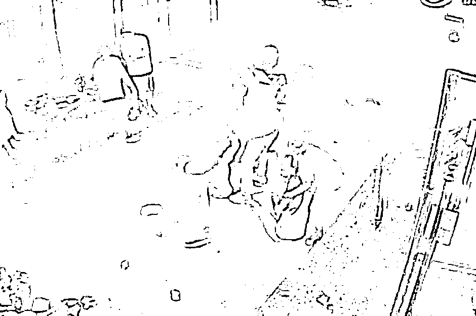
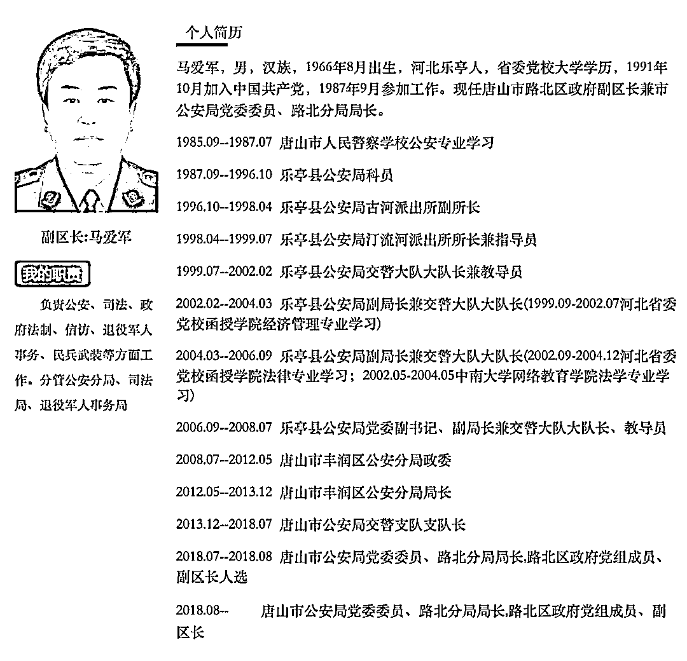

# 唐山打人案最新进展：路北分局局长等 8 人被留置，3 人为首次披露

> 原文：[`mp.weixin.qq.com/s?__biz=MzIyMDYwMTk0Mw==&mid=2247543013&idx=2&sn=76f55583088cea1cde2599dff2efcec0&chksm=97cbe3dda0bc6acbea8f1e8fce4b0bc8909232bdf991e854c21362fb0c926605dc8469356248&scene=27#wechat_redirect`](http://mp.weixin.qq.com/s?__biz=MzIyMDYwMTk0Mw==&mid=2247543013&idx=2&sn=76f55583088cea1cde2599dff2efcec0&chksm=97cbe3dda0bc6acbea8f1e8fce4b0bc8909232bdf991e854c21362fb0c926605dc8469356248&scene=27#wechat_redirect)

**15 人被查，8 人被留置**

**通报中提到：河北省纪委监委组织协调唐山、廊坊、衡水等地纪委监委对 15 名相关人员立案审查调查，其中对**8 名公职人员采取留置措施**，初步查出了违纪违法及涉嫌滥用职权、徇私枉法、行贿、受贿等职务犯罪问题。**

****

**这 8 名公职人员分别是：** 

*   **唐山市路北区政府党组成员、副区长，市公安局路北分局党委书记、局长马爱军**

*   **唐山市公安局路北分局机场路派出所所长胡斌**

*   **长虹道警务站副站长韩志勇**

*   **机场路派出所民警陈志伟**

*   **光明里派出所原所长范立峰**

*   **光明里派出所副所长王洪伟**

*   **乔屯派出所副所长王志鹏**

*   **唐山市公安局交警支队四级警长安迪**

**划重点，纪委监委初步查出了违纪违法及涉嫌滥用职权、徇私枉法、行贿、受贿等职务犯罪问题。**

**通报中还提到，纪检监察机关将深挖彻查，依纪依法严肃处理。**

****马爱军最后一次露面还是在 4 月底****

****几个细节值得关注。**** 

****其一，上述 8 人中，有 5 人在今年 6 月被查。****

****在 6 月 21 日，河北省纪委监委曾发布《唐山市公安局路北分局局长马爱军等人接受审查调查》，当时的通报显示，共有 5 人被查，分别是马爱军、胡斌、韩志勇、陈志伟和范立峰。****

****马爱军，男，汉族，1966 年 8 月出生，河北乐亭人，省委党校大学学历，1991 年 10 月加入中国共产党，1987 年 9 月参加工作。****

********

****公开资料显示，马爱军毕业于唐山市人民警察学校公安专业，毕业后成为乐亭县公安局科员，此后他历任乐亭县公安局古河派出所副所长、汀流河派出所所长兼指导员、交警大队大队长兼教导员、副局长兼交警大队大队长等。**** 

****2008 年 7 月，马爱军履新唐山市丰润区公安分局政委，后任唐山市丰润区公安分局局长、唐山市公安局交警支队支队长等。****

****2018 年 7 月，马爱军担任唐山市公安局党委委员、路北分局局长，路北区政府党组成员、副区长人选，2018 年 8 月任唐山市公安局党委委员、路北分局局长，路北区政府党组成员、副区长。****

****根据此前路北区政府官网显示，**马爱军最后一次露面是在 4 月 27 日。******

****当天上午，路北区召开打击治理电信网络新型违法犯罪工作联席会。副区长、公安分局局长马爱军出席会议并讲话。****

****另外，**机场路派出所民警陈志伟在被查之前曾经接受媒体采访。******

****2022 年 6 月 12 日，中央广电总台中国之声发布《警方回应烧烤店打人案：接警后 5 分钟赶到，5 名嫌疑人有前科》一文。****

****其中，唐山市公安局路北分局机场路派出所民警陈志伟介绍，受伤的四名女子其中两人伤情较重，在辖区某医院接受治疗，伤情稳定；另两名女子伤势较轻，未住院治疗。****

****民警陈志伟称，“6 月 10 日凌晨 02:41，我单位接到 110 指挥中心派警，接到报警后，我单位 02:46 左右赶到现场，第一时间询问现场人员，了解案发经过。案发后，打人男子均逃离了现场。”****

****但根据河北省公安厅今天的通报中提到，唐山市公安局路北分局机场路派出所民警率辅警于 3 时 09 分赶到现场开展处置工作。****

******首次披露的 3 人******

******第二，此次公布的 8 人名单中，有三人是首次对外披露，即**光明里派出所副所长王洪伟、乔屯派出所副所长王志鹏、唐山市公安局交警支队四级警长安迪。******** 

******政知君注意到，其中，王洪伟是光明里派出所原所长范立峰的副手。******

******今年 6 月 21 日上午，河北省公安厅官方微博发布关于陈某志等涉嫌寻衅滋事、暴力殴打他人等案件侦办进展情况的通报。******

******当时的通报中提到了陈某志等人过往涉及非法拘禁等违法犯罪情况。******

******2015 年 12 月 12 日，陈某志以追讨索要债务为由，指使刘某、高某、侯某亮、王某对商某凯实施殴打后非法拘禁，经伤情鉴定商某凯为轻伤。******

******南都记者检索发现，一个名为“路北巡控”的美篇账号曾在 2019 年 7 月 3 日发布名为“110 那些事——光明里派出所抓获一名涉嫌非法拘禁的网上逃犯”的文章。******

******“路北巡控”上述文章中提到，陈某志等人在大院将商某凯殴打后，将其关在车的后备箱长达十个小时。******

******该篇文章提到，**时任光明里派出所所长范立峰当时针对此案专门成立破案小组，当时的组长就是副所长王洪伟。********

********“恶势力组织”********

******也是在 8 月 29 日，河北检方通报陈某志等涉嫌恶势力组织违法犯罪案件审查起诉情况。****** 

******通报提到，8 月 11 日，陈某志等涉嫌恶势力组织违法犯罪案件由河北省廊坊市公安局广阳分局侦查终结，移送廊坊市广阳区人民检察院审查起诉。******

******近日，廊坊市广阳区人民检察院依法向廊坊市广阳区人民法院提起公诉。******

******检察机关经依法审查查明：******

*   ******2022 年 6 月 10 日 2 时 40 分许，陈某志、马某齐、刘某 1、陈某亮、李某 1、沈某俊、李某瑞及刘某 2、姜某萍（二人作不起诉处理）在唐山市路北区某烧烤店吃饭时，陈某志对正在店内与同事李某、远某、刘某某用餐的王某某进行骚扰，遭到王某某的拒绝和斥责后，陈某志遂殴打王某某，王某某与李某对其进行反抗，后陈某志、马某齐、刘某 1、陈某亮、李某 1、沈某俊分别在烧烤店内、店外便道上、店旁小胡同内，共同对被害人王某某、李某、远某、刘某某持椅子、酒瓶击打或拳打脚踢。******

*   ******案发后，4 名被害人由 120 救护车送医，其中，李某、远某经医院检查无需留院治疗后自行离开；**王某某、刘某某在普通病房住院接受治疗，于 7 月 1 日出院。********

*   ********经法医鉴定，被害人王某某、刘某某构成轻伤二级，李某、远某构成轻微伤。********

******同时，经公安机关询问被害人、讯问犯罪嫌疑人，并综合现场勘查、调查取证，认定网传 4 名被害人在小胡同内遭性侵害、从楼上被扔下、被汽车碾压等均为虚假信息。******

******另经公安机关依法深入侦查，检察机关审查查明，**2012 年以来，陈某志等长期纠集在一起，在唐山市等地涉嫌以暴力、威胁等手段，实施非法拘禁、聚众斗殴、故意伤害、开设赌场、抢劫、掩饰、隐瞒犯罪所得、帮助信息网络犯罪活动、寻衅滋事等刑事犯罪 11 起，实施寻衅滋事、故意伤害等行政违法 4 起，逐渐形成了以陈某志为纠集者的恶势力组织。********

******该恶势力组织为非作恶，欺压百姓，破坏当地经济、社会生活秩序，造成恶劣的社会影响。******

******廊坊市广阳区人民检察院经审查认为，陈某志等 28 名被告人的犯罪事实清楚，证据确实、充分，依法应当追究刑事责任，根据《中华人民共和国刑事诉讼法》第一百七十六条之规定，对陈某志等人依法提起公诉。******

******来源：政知见，景来律师******

************

******欢迎关注灰产圈社群服务号******

************

************