# 质疑警察、抹黑军人的都是些什么“人”？

> 原文：[`mp.weixin.qq.com/s?__biz=MzIyMDYwMTk0Mw==&mid=2247543013&idx=3&sn=097cf61537a3204f6bb3aa002d825902&chksm=97cbe3dda0bc6acb8fee3bc50470d7cd8ee2cff491b41bb66b925d71731b66076162b46c698c&scene=27#wechat_redirect`](http://mp.weixin.qq.com/s?__biz=MzIyMDYwMTk0Mw==&mid=2247543013&idx=3&sn=097cf61537a3204f6bb3aa002d825902&chksm=97cbe3dda0bc6acb8fee3bc50470d7cd8ee2cff491b41bb66b925d71731b66076162b46c698c&scene=27#wechat_redirect)

今天我一定要同时跟各位讲讲唐山打人案和川渝山火，太气人了。 

不夸张地说，网络上充斥着太多太多魑魅魍魉。 

**8 月 29 日，唐山打人案被打女子首次发声，大家看看耗材****（指的是公知、50 万、带路党这些人）都是怎么评论的：**

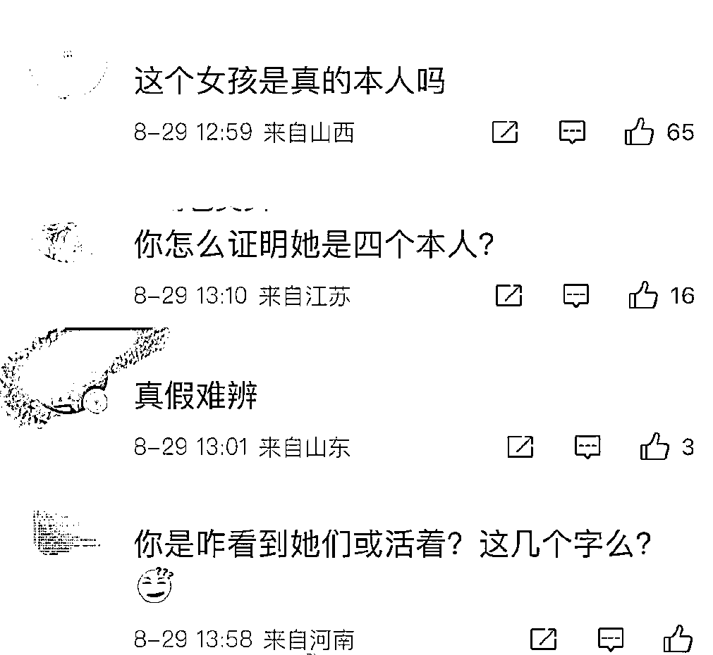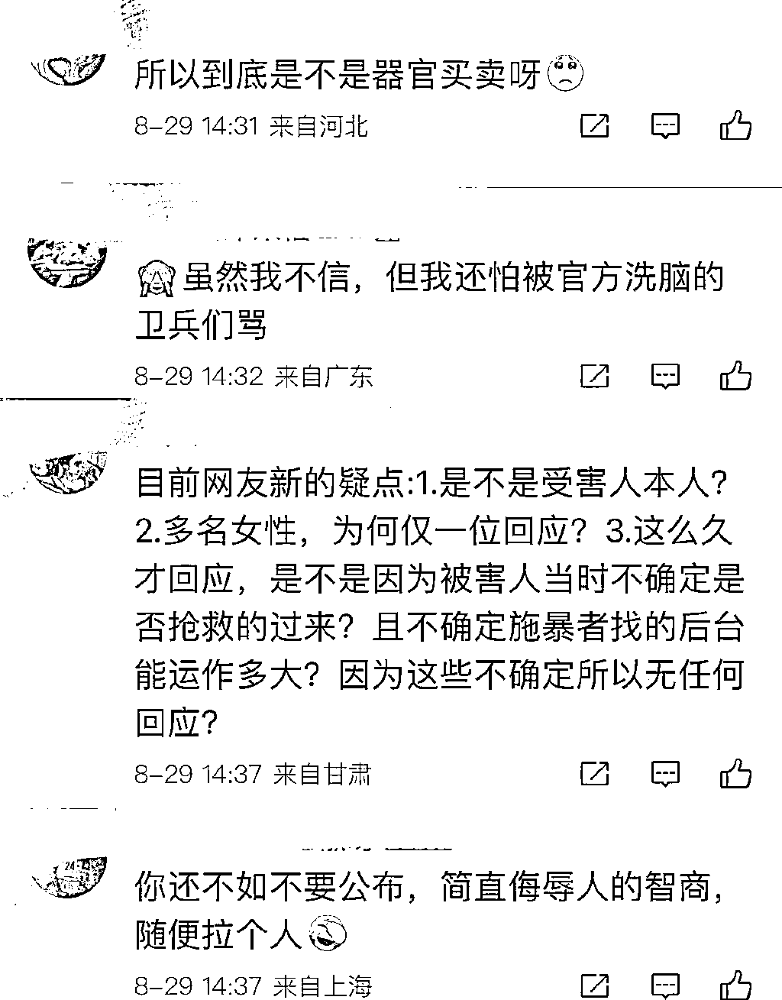 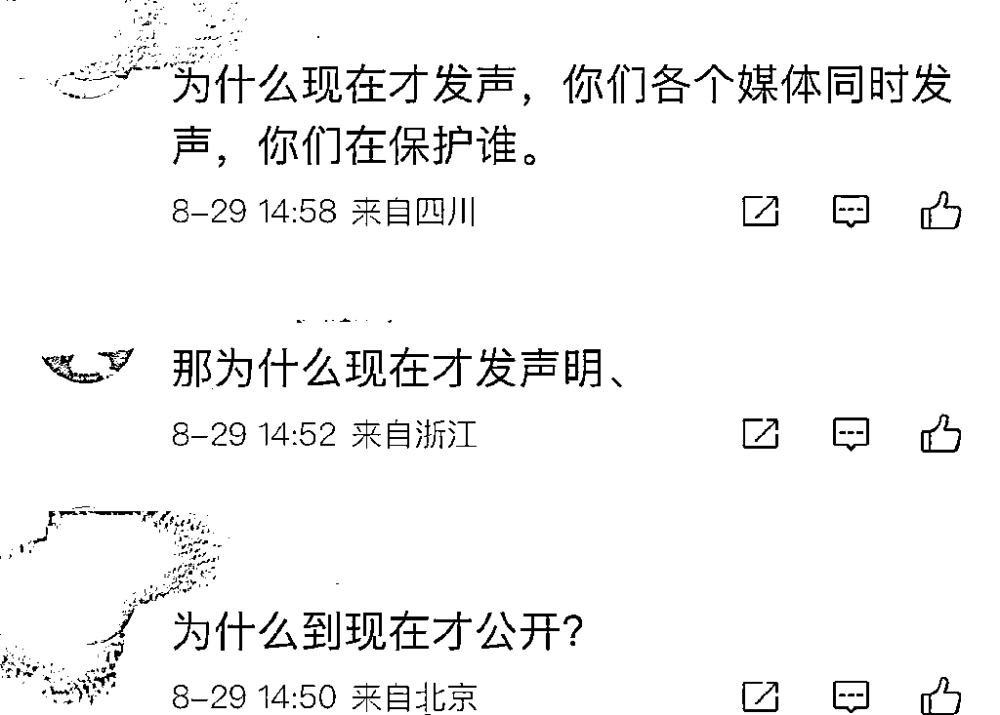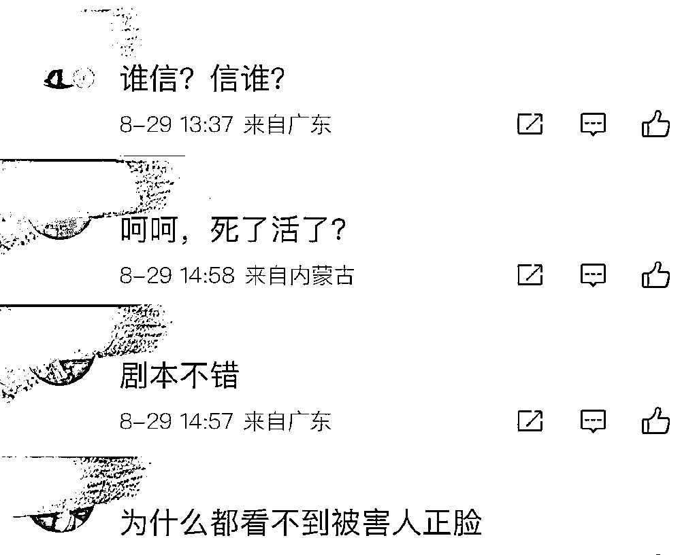

**这样的留言太多太多了，截图都截不过来。**

唐山打人案刚发生的时候，他们挑拨男女对立、散播各种谣言，辟谣后他们又带节奏说通报是假的。

事情调查清楚后，真相摆在眼前，他们又质疑被打女子迟迟不露面，肯定死了，当女子首次发声后他们又质疑并非本人，是演员背对着镜头对着剧本在念。

**他们制造舆论强烈要求被打女子露脸说出事情真相，怀疑警方调查太久是留出充足的时间改写事实。**

**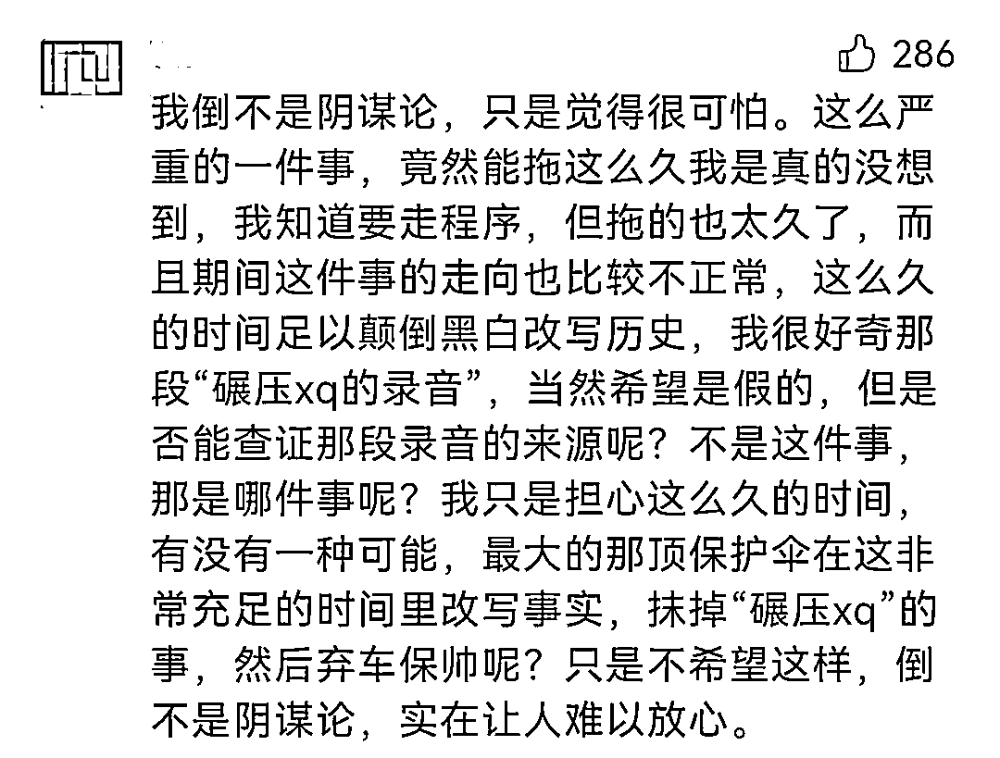**

官方蓝底白字的通报加上央视的采访，他们哪是不信，分明是揣着明白装糊涂，千方百计地想煽动舆论。

**他们巴不得全国公安以及政府丧失公信力！**

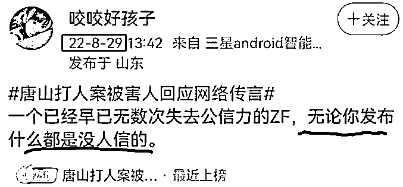

**再看川渝山火事件！**

8 月 28 日，云南省森林消防总队增援重庆最后一批 304 名指战员撤离时，当地居民手拿土特产、挥动国旗涌上街头，紧紧围在车队两侧表达不舍与感谢，甚至还有人一时找不到物资，急得直接把闺蜜把车里塞。

**这一幕幕动人场景，被评为“中国独有的场面”。**

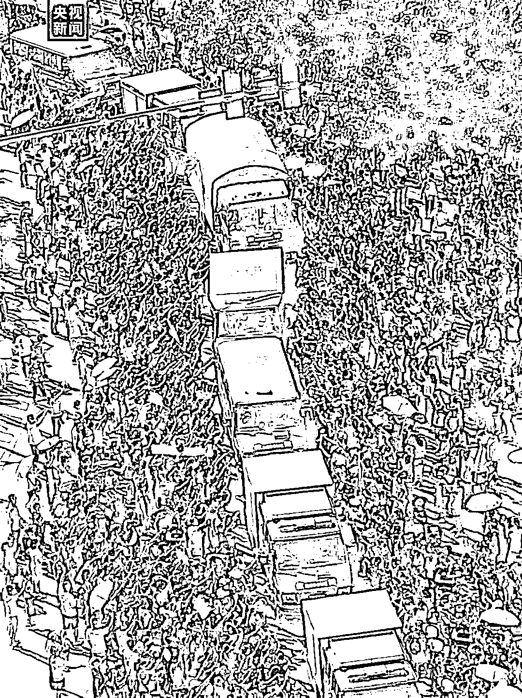

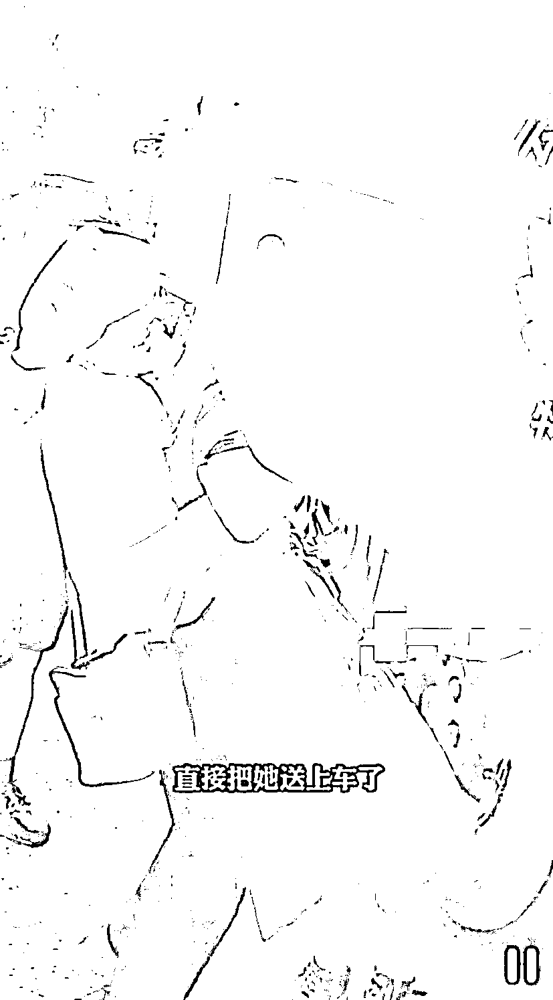

**但在耗材的眼里，就变成了“军人镇压群众抗议被围”，****抹黑军人颠倒黑白的功力张嘴就来。**

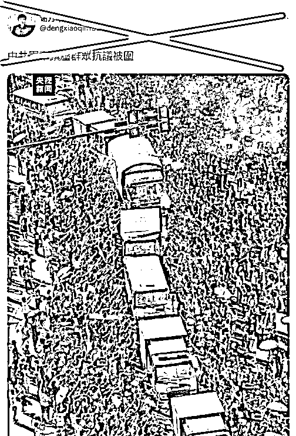

**还有一些耗材，认为川渝山火发生后应该看着它烧，不应该扑灭。**

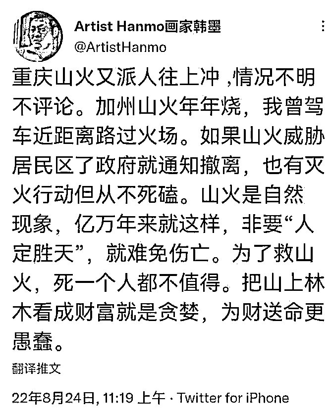

**这位****听说来自清华美院的画师****称：**“加州的山火年年烧，人家政府就通知居民撤离”“把山上林木看成财富就是贪婪，为财送命更愚蠢。”

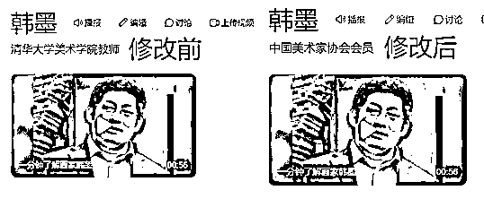

（修改词条的速度超快）

**你以为他在表达生命更可贵，实际上他在说我们愚蠢和贪婪。**

他拿美国跟我们对比，说美国面对山火从来都不会人定胜天，该跑就跑，该逃就逃，中国应该向美国学习。

关于这一点我们真没法跟西方比，因为西方遇到洪水，他们乘坐诺亚方舟逃离，遇到山火，他们还是乘坐诺亚方舟逃离。

而我们，天上有十个太阳导致旱灾，有后羿射日；黄河泛滥民不聊生，有大禹治水；即使天空被捅出一个窟窿，也会有女娲补天。

**我们不畏艰险、百折不挠、勤劳勇敢的品德在躺平方面的确不如美国。**

更加双标的是，这位画师看到川渝有山火，他嘲讽我们贪婪，格局上不如美国；可当美国那边真的发生山火时，他又在力挺特朗普大骂民主党。

一时间让人分不清他到底是中国人还是美国公民。但无论如何，他罔顾事实贬低中国，给人的感觉就像看到一只蟑螂，恶心！

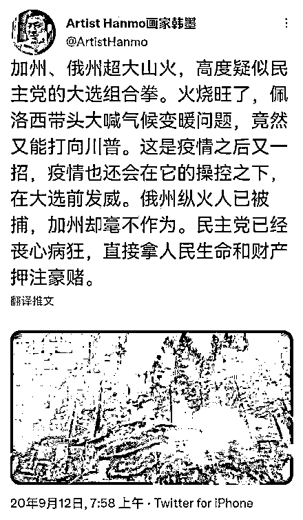

**最离谱的是这位，他从一场山火中看出中国人私德有亏，然后又转过头跪舔西方人明辨是非。**

**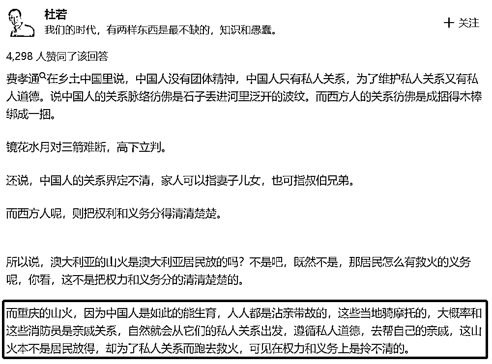**

**在他眼里，志愿者和消防员是亲戚关系，救火不是团结，而是因为私人关系，真正团结的只有西方人。**

这种“人才”待在国内真是屈才，建议移民局清理出去。

**除了上面这些耗材和洋奴，还有大量千篇一律的通稿在不留余力地在为西方洗白。**

事出反常必有妖，发爱国言论的时候，文案和标点符号都不会这么整齐。

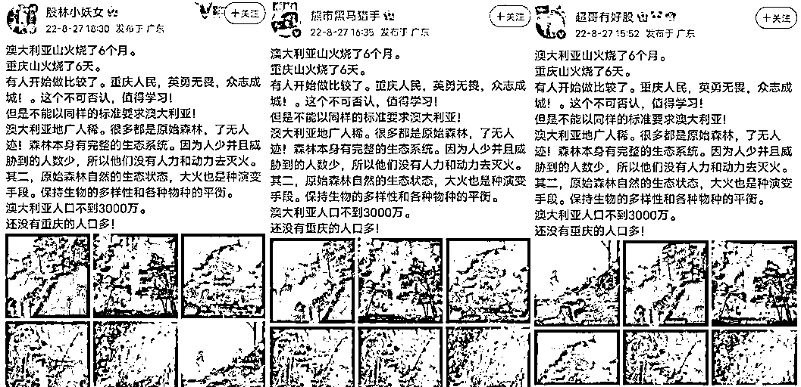

这些耗材、洋奴的字里行间半句不提吃里扒外，我横竖想不通，仔细看了半天，才从字缝里看出字来，满屏幕无不透露着数典忘祖，一个个像极了行走的 50 万！

**他们只要看到能搅浑舆论的风吹草动，就开始肆意颠倒黑白，简直是贱出高度，蠢到极致，坏入骨髓了！**

**为什么说他们贱？**

因为唐山打人事件虽然恶劣，但在现今的社会上只是个例。我老家经过扫黑行动，那些臭名昭著的黑社会团伙都已在服刑，剩下一些街溜子也都夹起尾巴做人。

而此次川渝山火无一人牺牲，面对自然灾害我们众志成城，取得了巨大的胜利。

可耗材们看不惯，于是他们贱嗖嗖地说唐山打人案还有黑幕，被打女子已经死了，川渝山火就不应该扑灭，扑灭了也不是团结。

如此见不得国人好，这不是贱是什么？

**为什么说他们蠢？**

比如那个在知乎说我们中国人关系界定不清，我想说中华文明上下五千年，靠的是“礼义廉耻、同宗同源”等文明传承了一代又一代，靠的是“天下兴亡，匹夫有责”的精神抵抗外敌，才迎来如今的安居乐业。

反观他吹捧的西方，历史中只有战争和侵略，希腊神话中只有乱伦和相残。

放着自己祖国的文化不去拜读，反而去吹捧西方的权利和义务，这不是蠢是什么？

**为什么说他们坏？**

唐山打人事件专案组收集了固定证据材料 3000 余份，这需要付出的时间和精力难以想象，这份恪尽职守难道不值得我们夸赞一句吗？

川渝山火军警民合作，零牺牲扑灭山火的这一幕足以载入历史，这种旷世壮举难道不值得我们歌颂吗？

可耗材们呢？他们不仅不赞美，还要抹黑，不仅不敬佩，还要挑拨，不仅不讴歌，还要嘲讽。这不是坏是什么？

**所以我说这些质疑警察、抹黑军人的人又贱又蠢又坏，活着浪费粮食，死了浪费土地，我光看他们一眼都觉得污染眼睛。**

**各位觉得呢？**

来源：一帆 SPACE 作者：太白 

欢迎关注灰产圈社群服务号

