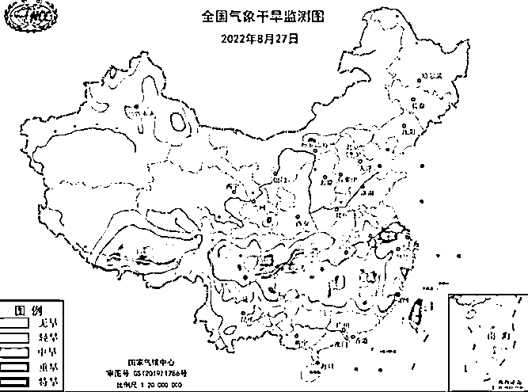

# 专家建议城里人少跳“广场舞”：学习农民早睡，可以省电……

> 原文：[`mp.weixin.qq.com/s?__biz=MzIyMDYwMTk0Mw==&mid=2247543013&idx=6&sn=4d2314e1f5b4516e16a76f6a50793a09&chksm=97cbe3dda0bc6acbe12f014ff260e2dc562e009e8bac269f2011788410d7e75507227f62f2e8&scene=27#wechat_redirect`](http://mp.weixin.qq.com/s?__biz=MzIyMDYwMTk0Mw==&mid=2247543013&idx=6&sn=4d2314e1f5b4516e16a76f6a50793a09&chksm=97cbe3dda0bc6acbe12f014ff260e2dc562e009e8bac269f2011788410d7e75507227f62f2e8&scene=27#wechat_redirect)

由于持续遭遇高温干旱天气，四川、重庆等地近期不同程度地限电......

最近在新京报的直播节目中，有专家提出：建议城里人少在晚上跳广场舞，早点回家。 

该专家表示：**民生用电是最优先的，就像商场可以早点关门、广场的路灯可以关闭，天黑了大家就像农民一样，赶紧回家。**

图片来源：快科技

专家这么说的原因是：城里人跟农民不一样，农民是日出而作，日落而息，而城里人凌晨两三点还不睡觉，大上午了也不起来。

**所以可以学一点农民，晚上不熬夜，别在外面跳广场舞了，赶紧回家节约用电。**

据相关资料数据显示，由于极端高温导致空调降温用电需求激增，国家电网四川电力 7 月份售电量达 290.87 亿度，同比增长 19.79％，刷新单月售电量最高纪录。

虽然高温天气已经有所缓解，但是近期，中央气象台持续发布了气象干旱橙色预警，长江流域的旱情形势依然很严峻......

图片来源：九派新闻

除了国内提倡省电以外，最近法国也为了环保，法国总统马克龙宣布了一项新政策：将在法国推动电动自行车发展。

**如果愿意放弃汽车转向电动自行车，那么法国会补贴近 2.7 万元人民币。**

根据法国的新目标，预计到 2024 年，全国 9%的人口将改用自行车出行，为此法国将推出高额补贴，给那些放弃汽车、购买电动自行车的人补偿 4000 欧元（折合人民币为 2.7 万元）

不过补贴也不是针对所有人的，主要是提供给那些低收入群体的城市居民，据了解在法国，电动自行车的价格通常在几百欧元左右。

个别高端的会超过 1000 欧元，因此 4000 欧元的电动自行车补贴还是很高的。

大家对于“少跳广场舞不熬夜省电”和“放弃汽车就给补贴”，这两种环保措施都有什么看法？

<mpvideosnap class="js_uneditable custom_select_card channels_iframe videosnap_video_iframe" data-pluginname="videosnap" data-id="export/UzFfAgtgekIEAQAAAAAAGzoClDUNOwAAAAstQy6ubaLX4KHWvLEZgBPEwKMQanxOYd6CzNPgMIuAplqJSaGo1El-s6Ok2ig0" data-url="https://findermp.video.qq.com/251/20304/stodownload?encfilekey=rjD5jyTuFrIpZ2ibE8T7YmwgiahniaXswqzaWbSwlxKSLDMBEOUS07Jk00LHEYichXpS8ickogiaBdg900IeiaJSy2GroEgEGGkRPibmtic4Ggnp8fIKwThc9RSPqWQ&amp;adaptivelytrans=0&amp;bizid=1023&amp;dotrans=0&amp;hy=SH&amp;idx=1&amp;m=&amp;scene=0&amp;token=x5Y29zUxcibAlEF045W4uGn74OZLfibtXxPzQHezxlg9O94rMDmsJ4OE7T7iasUEyAfdMZeclvR8qQ" data-headimgurl="http://wx.qlogo.cn/finderhead/ibq4aVwOt6HNqrr8OD3sCviaytF3B8TqCwHicxsuIanAJo/0" data-username="v2_060000231003b20faec8c6e48a1acbd3ce04ef33b077a1e41d0d3794ed88ea537878dbe65910@finder" data-nickname="灰产圈+" data-desc="专家建议#专家#伪专家@灰产圈+ " data-nonceid="11984856585539454478" data-type="video" data-width="1920" data-height="1080"></mpvideosnap>

欢迎留言！

**延伸阅读：**

**[各路专家严重脱离人民群众和现实社会的言论合集，林子大了什么鸟都有](http://mp.weixin.qq.com/s?__biz=MzIyMDYwMTk0Mw==&mid=2247542960&idx=3&sn=9388fdb8177fa66b6d453a1a79e02091&chksm=97cbe388a0bc6a9eeb1e58aedd86d0445cccc82b73cf447279b82b86aa54d6b4efbafbb8ae86&scene=21#wechat_redirect)**

来源：躺倒鸭

欢迎关注灰产圈社群服务号

