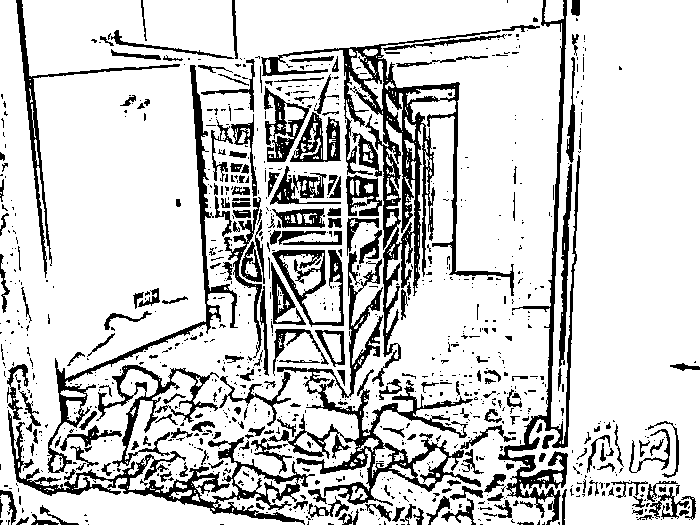
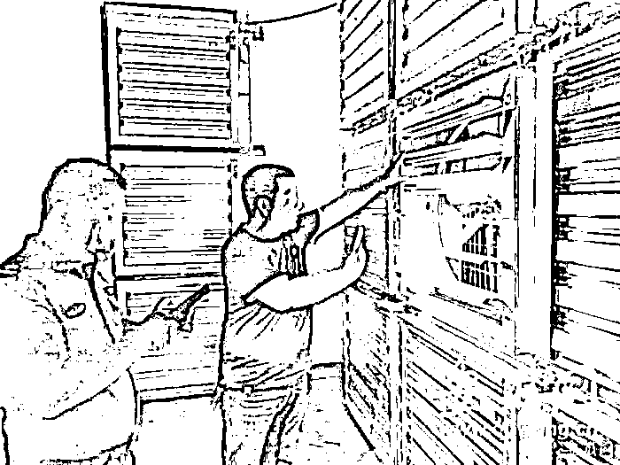

# 地下车库惊现“比特币”工厂？被人发现后，三个小时后，两百多台“比特币”矿机“不翼而飞”！

> 原文：[`mp.weixin.qq.com/s?__biz=MzIyMDYwMTk0Mw==&mid=2247543013&idx=7&sn=557eef1fa75523300f29f42e2f61e964&chksm=97cbe3dda0bc6acbe4ec8ee52e006b0fcef151392198e2a271756dce8192ac9a6634e96102e4&scene=27#wechat_redirect`](http://mp.weixin.qq.com/s?__biz=MzIyMDYwMTk0Mw==&mid=2247543013&idx=7&sn=557eef1fa75523300f29f42e2f61e964&chksm=97cbe3dda0bc6acbe4ec8ee52e006b0fcef151392198e2a271756dce8192ac9a6634e96102e4&scene=27#wechat_redirect)

近日，蚌埠恒大御景湾小区多位住户反映，该小区内 16 号楼地下车库内噪音不断，严重影响住户的生活。8 月 28 日下午三时，大皖新闻记者随同有关部门前往现场了解情况，**经过初步调查，****证实这是一起私自改建地下车库，且违章封闭的行为，根据现场的相关物证，疑为一处“比特币”加工生产点。**同时，该小区商业房内还有一处类似房屋。目前，**相关部门正在对违章搭建进行拆除，并将对租房人员行为进行调查。**

**疑惑：地下车库噪音不断**

“路过地下车库的时候，能听到类似于空调外机工作的轰轰声，就觉得很奇怪，但是也不知道从哪里发出来的。”最近一段时间，蚌埠恒大御景湾小区的居民李女士一直被地下车库的噪音困扰。据了解，小区内有多位住户不同程度受到噪音影响，也通过不同方式反映过。

热心住户张勇（化名）表示，8 月 27 日下午，在了解了小区内地下车库噪音不断的事情后，他和另一位业主前往 16 号楼地下二层查看。最终在电梯房的东侧，他们发现了一处由多个地下车位封闭而成的一间屋。“那个地方在地下车库比较隐蔽的位置，一般人也不会往那边去，当时确实能听到轰轰的声音，而且摸了一下墙壁也特别烫，我觉得肯定有问题。”通过掀开的排气扇百叶扇，张勇他俩发现，里面排列整齐的货架上，多台机器正在运行，从了解的情况判断，至少有两百多台“比特币”矿机正在工作。“这就是比特币的挖矿机械在运作，规模不小。”张勇表示。

散热装置。

室内现场。

放置设备的架子。

破拆。

检查整治中。

**现场：屋内设备已被搬空**

8 月 28 日下午三时，大皖新闻记者进入恒大御景湾小区，在 16 号楼地下二层，通过排气百叶扇可以看到，里面是一大堆置物货架，但货架上已经完全腾空。

“除了这一处，还有一处商业房也是一样的摆放，”另一位热心业主将记者带到 11 号楼 216 商铺门面房，在这里可以看到：现场大门紧闭，通过几个地面排气口，看到屋内是和 16 号楼地下车库里类似的置物货架。这位热心业主介绍，这几处排气口本来也是塞起来的，他们觉得可疑，后来才打开的，现在可以看到，里面也只有空空的货柜了。

同时，赶到现场的蚌埠市蚌山区政府相关负责人表示，可以初步判定，封堵地下车库车位，进行这类活动肯定未经批准，辖区物业办、城管部门及警方要落实责任，28 日当晚，必须将这处封闭的现场清理整改完毕。同时，对于两处货架上之前摆放的物品展开调查，严格按照执法程序处理。

小区正门。

**质疑：物业竟称不知情**

大皖记者了解到，蚌埠恒大御景湾小区于 2015 年建成，其物业公司为金碧物业有限公司蚌埠分公司。对于小区内为何出现这种情况，记者随后在现场找到了金碧物业有限公司蚌埠分公司一名负责人，面对记者的询问，他拒绝回答，并表示一概不知。在随后的追问中，这位负责人干脆选择了离开。

下午 5 时，大皖新闻记者再次来到 16 号楼地下室，原本封闭的车位改建成的房间已经被破拆，屋内只剩空空的货架。

采访中，多位业主对物业的做法表示了严重质疑，在地下车库这样的封闭空间内，搭建这样大型工程，物业为何没有发现？屋内设施的用电和通讯网络也均是通过小区物业顺利接通，物业为何会不知情？同时，张勇反映，他是 8 月 27 日下午五点多反映该情况的，为何八点多再次去查看时，这么多台机器会不翼而飞？为此，小区的业主们向大皖记者表示，他们希望有关部门能够严格调查，彻底解决问题，给小区住户一个交代。

来源：大皖新闻，利箭在行动

欢迎关注灰产圈社群服务号

