# 奶奶嘴含孙子生殖器，父亲“强暴”女儿拍视频：没有界限感的亲情有多可怕！

> 原文：[`mp.weixin.qq.com/s?__biz=MzIyMDYwMTk0Mw==&mid=2247543136&idx=1&sn=264abe66a7a52ca2af8c65459686d1ae&chksm=97cbe258a0bc6b4e17c7f6fc9162a346e6fecc52b5c952796330aa4982f2eb47edd6dcbdd731&scene=27#wechat_redirect`](http://mp.weixin.qq.com/s?__biz=MzIyMDYwMTk0Mw==&mid=2247543136&idx=1&sn=264abe66a7a52ca2af8c65459686d1ae&chksm=97cbe258a0bc6b4e17c7f6fc9162a346e6fecc52b5c952796330aa4982f2eb47edd6dcbdd731&scene=27#wechat_redirect)

********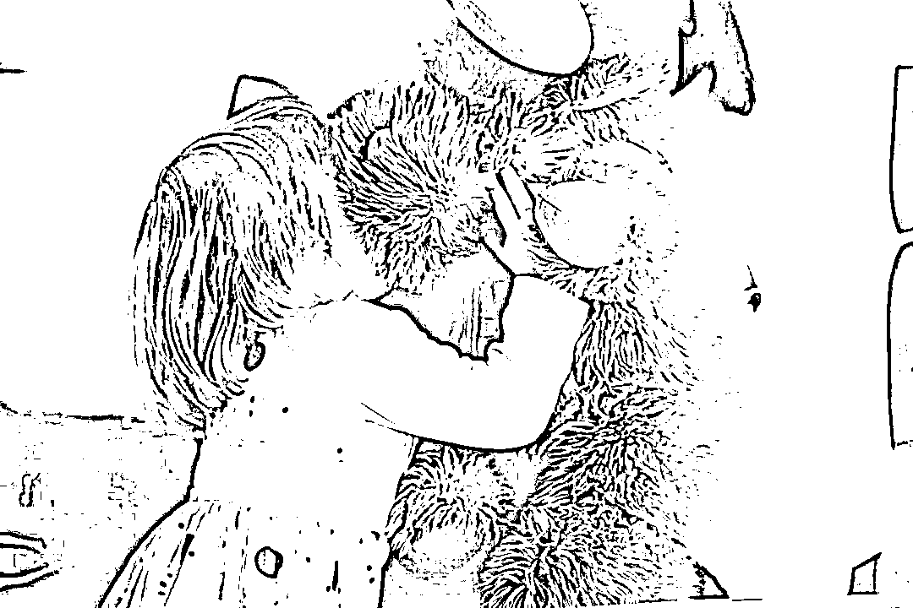********

一样。这时候他可以摸出一支烟抽起来，借点儿暖气。黄昏来了，屋子里的东西只剩些轮廓，暂时懒得开灯，也可以点上一支烟，看烟头上的火一闪一闪的，像亲密的低语，只有自己听得出。要是生气，也不妨迁怒一下，使劲儿吸他十来口。客来了，若你倦了说不得话，或者找不出可说的，干坐着岂不着急？这时候最好拈起一支烟将嘴堵上等你对面的人。若是他也这么办，便尽时间在烟子里爬过去。各人抓着一个新伴儿，大可以盘桓一会的。

从前抽水烟旱烟，不过一种不伤大雅的嗜好，现在抽烟却成了派头。抽烟卷儿指头黄了，由它去。用烟嘴不独麻烦，也小气，又跟烟隔得那么老远的。今儿大褂上一个窟窿，明儿坎肩上一个，由他去。一支烟里的尼古丁可以毒死一个小麻雀，也由它去。总之，蹩蹩扭扭的，其实也还是个“满不在乎”罢了。烟有好有坏，味有浓有淡，能够辨味的是内行，不择烟而抽的是大方之家。

十年前我写过诗；后来不写诗了，写散文；入中年以后，散文也不大写得出了--现在是，比散文还要“散”的无话可说！许多人苦于有话说不出，另有许多人苦于有话无处说；他们的苦还在话中，我这无话可说的苦却在话外。我觉得自己是一张枯叶，一张烂纸，在这个大时代里。

在别处说过，我的“忆的路”是“平如砥”“直如矢”的；我永远不曾有过惊心动魄的生活，即使在别人想来最风华的少年时代。我的颜色永远是灰的。我的职业是三个教书；我的朋友永远是那么几个，我的女人永远是那么一个。有些人生活太丰富了，太复杂了，会忘记自己，看不清楚自己，我是什么时候都“了了玲玲地”知道，记住，自己是怎样简单的一个人。

但是为什么还会写出诗文呢？--虽然都是些废话。这是时代为之！十年前正是五四运动的时期，大伙儿蓬蓬勃勃的朝气，紧逼着我这个年轻的学生；于是乎跟着人家的脚印，也说说什么自然，什么人生。但这只是些范畴而已。我是个懒人，平心而论，又不曾遭过怎样了不得的逆境；既不深思力索，又未亲自体验，范畴终于只是范畴，此处也只是廉价的，新瓶里装旧酒的感伤。当时芝麻黄豆大的事，都不惜郑重地写出来，现在看看，苦笑而已。

先驱者告诉我们说自己的话。不幸这些自己往往是简单的，说来说去是那一套；终于说的听的都腻了。--我便是其中的一个。这些人自己其实并没有什么话，只是说些中外贤哲说过的和并世少年将说的话。真正有自己的话要说的是不多的几个人；因为真正一面生活一面吟味那生活的只有不多的几个人。一般人只是生活，按着不同的程度照例生活。

这点简单的意思也还是到中年才觉出的；少年时多少有些热气，想不到这里。中年人无论怎样不好，但看事看得清楚，看得开，却是可取的。这时候眼前没有雾，顶上没有云彩，有的只是自己的路。他负着经验的担子，一步步踏上这条无尽的然而实在的路。他回看少年人那些情感的玩意，觉得一种轻松的意味。他乐意分析他背上的经验，不止是少年时的那些；他不愿远远地捉摸，而愿剥开来细细地看。也知道剥开后便没了那跳跃着的力量，但他不在乎这个，他明白在冷静中有他所需要的。这时候他若偶然说话，决不会是感伤的或印象的，他要告诉你怎样走着他的路，不然就是，所剥开的是些什么玩意。但中年人是很胆小的；他听别人的话渐渐多了，说了的他不说，说得好的他不说。所以终于往往无话可说--特别是一个寻常的人像我。但沉默又是寻常的人所难堪的，我说苦在话外，以此。

中年人若还打着少年人的调子，--姑不论调子的好坏--原也未尝不可，只总觉“像煞有介事”。他要用很大的力量去写出那冒着热气或流着眼泪的话；一个神经敏锐的人对于这个是不容易忍耐的，无论在自己在别人。这好比上了年纪的太太小姐们还涂脂抹粉地到大庭广众里去卖弄一般，是殊可不必的了。

其实这些都可以说是废话，只要想一想咱们这年头。这年头要的是“代言人”，而且将一切说话的都看作“代言人”；压根儿就无所谓自己的话。这样一来，如我辈者，倒可以将从前狂妄之罪减轻，而现在是更无话可说了。

但近来在戴译《唯物史观的文学论》里看到，法国俗语“无话可说”竟与“一切皆好”同意。呜呼，这是多么损的一句话，对于我，对于我的时代！　罗马（Ｒｏｍｅ）是历史上大帝国的都城，想象起来，总是气象万千似的。现在它的光荣虽然早过去了，但是从七零八落的废墟里，后人还可仿佛于百一。这些废墟，旧有的加上新发掘的，几乎随处可见，像特意点缀这座古城的一般。这边几根石柱子，那边几段破墙，带着当年的尘土，寂寞地陷在大坑里；虽然在夏天中午的太阳，照上去也黯黯淡淡，没有多少劲儿。就中罗马市场（fｏｒｕｍ　Ｒｏｍａｎｕｍ）规模最大。这里是古罗马城的中心，有法庭，神庙，与住宅的残迹。卡司多和波鲁斯庙的三根哥林斯式的柱子，顶上还有片石相连着；在全场中最为秀拔，像三个丰姿飘洒的少年用手横遮着额角，正在眺望这一片古市场。想当年这里终日挤挤闹闹的也不知有多少人，各有各的心思，各有各的手法；现在只剩三两起游客指手画脚地在死一般的寂静里。犄角上有一所住宅，情形还好；一面是三间住屋，有壁画，已模糊了，地是嵌石铺成的；旁厢是饭厅，壁画极讲究，画的都是正大的题目，他们是很看重饭厅的。市场上面便是巴拉丁山，是饱历兴衰的地方。最早是一个村落，只有些茅草屋子；罗马共和末期，一姓贵族聚居在这里；帝国时代，更是繁华。游人走上山去，两旁宏壮的住屋还留下完整的黄土坯子，可以见出当时阔人家的气局。屋顶一片平场，原是许多花园，总名法内塞园子，也是四百年前的旧迹；现在点缀些花木，一角上还有一座小喷泉。在这园子里看脚底下的古市场，全景都在望中了。 

　　市场东边是斗狮场，还可以看见大概的规模；在许多宏壮的废墟里，这个算是情形最好的。外墙是一个大圆圈儿，分四层，要仰起头才能看到顶上。下三层都是一色的圆拱门和柱子，上一层只有小长方窗户和楞子，这种单纯的对照教人觉得这座建筑是整整的一块，好像直上云霄的松柏，老干亭亭，没有一些繁枝细节。里面中间原是大平场；中古时在这儿筑起堡垒，现在满是一道道颓毁的墙基，倒成了四不像。这场子便是斗狮场；环绕着的是观众的坐位。下两层是包厢，皇帝与外宾的在最下层，上层是贵族的；第三层公务员坐；最上层平民坐：共可容四五万人。狮子洞还在下一层，有口直通场中。斗狮是一种刑罚，也可以说是一种裁判：罪囚放在狮子面前，让狮子去搏他；他若居然制死了狮子，便是直道在他一边，他就可自由了。但自然是让狮子吃掉的多；这些人大约就算活该。想到临场的罪囚和他亲族的悲苦与恐怖，他的仇人的痛快，皇帝的威风，与一般观众好奇的紧张的面目，真好比一场恶梦。这个场子建筑在一世纪，原是戏园子，后来才改作斗狮之用。 

　　斗狮场南面不远是卡拉卡拉浴场。古罗马人颇讲究洗澡，浴场都造得好，这一所更其华丽。全场用大理石砌成，用嵌石铺地；有壁画，有雕像，用具也不寻常。房子高大，分两层，都用圆拱门，走进去觉得稳稳的；里面金碧辉煌，与壁画雕像相得益彰。居中是大健身房，有喷泉两座。场子占地六英亩，可容一千六百人洗浴。洗浴分冷热水蒸气三种，各占一所屋子。古罗马人上浴场来，不单是为洗澡；他们可以在这儿商量买卖，和解讼事等等，正和我们上茶店上饭店一般作用。这儿还有好些游艺，他们公余或倦后来洗一个澡，找几个朋友到游艺室去消遣一回，要不然，到客厅去谈谈话，都是很“写意”的。现在却只剩下一大堆遗迹。大理石本来还有不少，早给搬去造圣彼得等教堂去了；零星的物件陈列在博物院里。我们所看见的只是些巍巍峨峨参参差差的黄土骨子，站在太阳里，还有学者们精心研究出来的《卡拉卡拉浴场图》的照片，都只是所谓过屠门大嚼而已。 

　　罗马从中古以来便以教堂著名。康南海《罗马游纪》中引杜牧的诗“南朝四百八十寺，多少楼台烟雨中”，光景大约有些相像的；只可惜初夏去的人无从领略那烟雨罢了。圣彼得堂最精妙，在城北尼罗圆场的旧址上。尼罗在此地杀了许多基督教徒。据说圣彼得上十字架后也便葬在这里。这教堂几经兴废，现在的房屋是十六世纪初年动工，经了许多建筑师的手。密凯安杰罗七十二岁时，受保罗第三的命，在这儿工作了十七年。后人以为天使保罗第三假手于这一个大艺术家，给这座大建筑定下了规模；以后虽有增改，但大体总是依着他的。教堂内部参照卡拉卡拉浴场的式样，许多高大的圆拱门稳稳地支着那座穹隆顶。教堂长六百九十六英尺，宽四百五十英尺，穹隆顶高四百○三英尺，可是乍看不觉得是这么大。因为平常看屋子大小，总以屋内饰物等为标准，饰物等的尺寸无形中是有谱子的。圣彼得堂里的却大得离了谱子，“天使像巨人，鸽子像老鹰”；所以教堂真正的大小，一下倒不容易看出了。但是你若看里面走动着的人，便渐渐觉得不同。教堂用彩色大理石砌墙，加上好些嵌石的大幅的名画，大都是亮蓝与朱红二色；鲜明丰丽，不像普通教堂一味阴沉沉的。密凯安杰罗雕的彼得像，温和光洁，别是一格，在教堂的犄角上。 

　　圣彼得堂两边的列柱回廊像两只胳膊拥抱着圣彼得圆场；留下一个口子，却又像个玦。场中央是一座埃及的纪功方尖柱，左右各有大喷泉。那两道回廊是十七世纪时亚历山大第三所造，成于倍里尼（Ｐｅｒｎｉｎｉ）之手。廊子里有四排多力克式石柱，共二百八十四根；顶上前后都有栏干，前面栏干上并有许多小雕像。场左右地上有两块圆石头，站在上面看同一边的廊子，觉得只有一排柱子，气魄更雄伟了。这个圆场外有一道弯弯的白石线，便是梵蒂冈与意大利的分界。教皇每年复活节站在圣彼得堂的露台上为人民祝福，这个场子内外据说是拥挤不堪的。 

　　圣保罗堂在南城外，相传是圣保罗葬地的遗址，也是柱子好。门前一个方院子，四面廊子里都是些整块石头凿出来的大柱子，比圣彼得的两道廊子却质朴得多。教堂里面也简单空廓，没有什么东西。但中间那八十根花岗石的柱子，和尽头处那六根蜡石的柱子，纵横地排着，看上去仿佛到了人迹罕至的远古的森林里。柱子上头墙上，周围安着嵌石的历代教皇像，一律圆框子。教堂旁边另有一个小柱廊，是十二世纪造的。这座廊子围着一所方院子，在低低的墙基上排着两层各色各样的细柱子——有些还嵌着金色玻璃块儿。这座廊子精工可以说像湘绣，秀美却又像王羲之的书法。 

　　在城中心的威尼斯方场上巍然蹯踞着的，是也马奴儿第二的纪功廊。这是近代意大利的建筑，不缺少力量。一道弯弯的长廊，在高大的石基上。前面三层石级：第一层在中间，第二三层分开左右两道，通到廊子两头。这座廊子左右上下都匀称，中间又有那一弯，便兼有动静之美了。从廊前列柱间看到暮色中的罗马全城，觉得幽远无穷。 

　　罗马艺术的宝藏自然在梵蒂冈宫；卡辟多林博物院中也有一些，但比起梵蒂冈来就太少了。梵蒂冈有好几个雕刻院，收藏约有四千件，著名的《拉奥孔》（Ｌａｏｃｏｏeｎ）便在这里。画院藏画五十幅，都是精品，拉飞尔的《基督现身图》是其中之一，现在却因修理关着。梵蒂冈的壁画极精彩，多是拉飞尔和他门徒的手笔，为别处所不及。有四间拉飞尔室和一些廊子，里面满是他们的东西。拉飞尔由此得名。他是乌尔比奴人，父亲是诗人兼画家。他到罗马后，极为人所爱重，大家都要教他画；他忙不过来，只好收些门徒作助手。他的特长在画人体。这是实在的人，肢体圆满而结实，有肉有骨头。这自然受了些佛罗伦司派的影响，但大半还是他的天才。他对于气韵，远近，大小与颜色也都有敏锐的感觉，所以成为大家。他在罗马住的屋子还在，坟在国葬院里。歇司丁堂与拉飞尔室齐名，也在宫内。这个神堂是十五世纪时歇司土司第四造的，第一百三十三英尺，宽四十五英尺。两旁墙的上部，都由佛罗伦司派画家装饰，有波铁乞利在内。屋顶的画满都是密凯安杰罗的，歇司丁堂著名在此。密凯安杰罗是佛罗伦司派的极峰。他不多作画，一生精华都在这里。他画这屋顶时候，以深沉肃穆的心情渗入画中。他的构图里气韵流动着，形体的勾勒也自然灵妙，还有那雄伟出尘的风度，都是他独具的好处。堂中祭坛的墙上也是他的大画，叫做《最后的审判》。这幅壁画是以后多年画的，费了他七年工夫。 

　　罗马城外有好几处隧道，是一世纪到五世纪时候基督教徒挖下来做墓穴的，但也用作敬神的地方。尼罗搜杀基督教徒，他们往往避难于此。最值得看的是圣卡里斯多隧道。那儿还有一种热诚花，十二瓣，据说是代表十二使徒的。我们看的是圣赛巴司提亚堂底下的那一处，大家点了小蜡烛下去。曲曲折折的狭路，两旁是大大小小深深浅浅的墓穴；现在自然是空的，可是有时还看见些零星的白骨。有一处据说圣彼得住过，成了龛堂，壁上画得很好。另处也还有些壁画的残迹。这个隧道似乎有四层，占的地方也不小。圣赛巴司提亚堂里保存着一块石头，上有大脚印两个；他们说是耶稣基督的，现在供养在神龛里。另一个教堂也供着这么一块石头，据说是仿本。 

　　缧绁堂建于第五世纪，专为供养拴过圣彼得的一条铁链子。现在这条链子还好好的在一个精美的龛子里。堂中周理乌司第二纪念碑上有密凯安杰罗雕的几座像；摩西像尤为著名。那种原始的坚定的精神和勇猛的力量从眉目上，胡须上，胳膊上，手上，腿上，处处透露出来，教你觉得见着了一个伟大的人。又有个阿拉古里堂，中有圣婴像。这个圣婴自然便是耶稣基督；是十五世纪耶路撒冷一个教徒用橄榄木雕的。他带它到罗马，供养在这个堂里。四方来许愿的很多，据说非常灵验；它身上密层层地挂着许多金银饰器都是人家还愿的。还有好些信写给它，表示敬慕的意思。 

　　罗马城西南角上，挨着古城墙，是英国坟场或叫做新教坟场。这里边葬的大都是艺术家与诗人，所以来参谒来凭吊的意大利人和别国的人终日不绝。就中最有名的自然是十九世纪英国浪漫诗人雪莱与济兹的墓。雪莱的心葬在英国，他的遗灰在这儿。墓在古城墙下斜坡上，盖有一块长方的白石；第一行刻着“心中心”，下面两行是生卒年月，再下三行是莎士比亚《风暴》中的仙歌。 

　　　　彼无毫毛损， 

　　　　海涛变化之， 

　　　　从此更神奇。 

　　好在恰恰关合雪莱的死和他的为人。济兹墓相去不远，有墓碑，上面刻着道： 

　　　　这座坟里是 

　　　　英国一位少年诗人的遗体； 

　　　　他临死时候， 

　　　　想着他仇人们的恶势力， 

　　　　痛心极了，叫将下面这一句话 

　　　　刻在他的墓碑上： 

　　　　“这儿躺着一个人， 

　　　　他的名字是用水写的。” 

　　末一行是速朽的意思；但他的名字正所谓“不废江河万古流”，又岂是当时人所料得到的。后来有人别作新解，根据这一行话做了一首诗，连济兹的小像一块儿刻铜嵌在他墓旁墙上。这首诗的原文是很有风趣的。 

　　　　济兹名字好， 

　　　　说是水写成； 

　　　　一点一滴水， 

　　　　后人的泪痕—— 

　　　　英雄枯万骨， 

　　　　难如此感人。 

　　　　安睡吧， 

　　　　陈词虽挂漏， 

　　　　高风自峥嵘。 

　　这座坟场是罗马富有诗意的一角；有些爱罗马的人虽不死在意大利，也会遗嘱葬在这座“永远的城”的永远的一角里。 

的电灯光下，谈到Ｗ的小说。 

　　“他还在河南吧？Ｃ大学那边很好吧？”我随便问着。

　　“不，他上美国去了。”

　　“美国？做什么去？”

　　“你觉得很奇怪吧？——波定谟约翰郝勃金医院打电报约他做助手去。”

　　“哦！就是他研究心理学的地方！他在那边成绩总很好？——这回去他很愿意吧？”

　　“不见得愿意。他动身前到北京来过，我请他在启新吃饭；

　　他很不高兴的样子。”

　　“这又为什么呢？”

　　“他觉得中国没有他做事的地方。”

　　“他回来才一年呢。Ｃ大学那边没有钱吧？”

　　“不但没有钱，他们说他是疯子！”

　　“疯子！”

　　我们默然相对，暂时无话可说。

　　我想起第一回认识Ｗ的名字，是在《新生》杂志上。那时我在Ｐ大学读书，Ｗ也在那里。我在《新生》上看见的是他的小说；但一个朋友告诉我，他心理学的书读得真多；Ｐ大学图书馆里所有的，他都读了。文学书他也读得不少。他说他是无一刻不读书的。我第一次见他的面，是在Ｐ大学宿舍的走道上；他正和朋友走着。有人告诉我，这就是Ｗ了。微曲的背，小而黑的脸，长头发和近视眼，这就是Ｗ了。以后我常常看他的文字，记起他这样一个人。有一回我拿一篇心理学的译文，托一个朋友请他看看。他逐一给我改正了好几十条，不曾放松一个字。永远的惭愧和感谢留在我心里。

　　我又想到杭州那一晚上。他突然来看我了。他说和Ｐ游了三日，明早就要到上海去。他原是山东人；这回来上海，是要上美国去的。我问起哥仑比亚大学的《心理学，哲学，与科学方法》杂志，我知道那是有名的杂志。但他说里面往往一年没有一篇好文章，没有什么意思。他说近来各心理学家在英国开了一个会，有几个人的话有味。他又用铅笔随便的在桌上一本簿子的后面，写了《哲学的科学》一个书名与其出版处，说是新书，可以看看。他说要走了。我送他到旅馆里。见他床上摊着一本《人生与地理》，随便拿过来翻着。他说这本小书很著名，很好的。我们在晕黄的电灯光下，默然相对了一会，又问答了几句简单的话；我就走了。直到现在，还不曾见过他。

　　他到美国去后，初时还写了些文字，后来就没有了。他的名字，在一般人心里，已如远处的云烟了。我倒还记着他。两三年以后，才又在《文学日报》上见到他一篇诗，是写一种清趣的。我只念过他这一篇诗。他的小说我却念过不少；最使我不能忘记的是那篇《雨夜》，是写北京人力车夫的生活的。Ｗ是学科学的人，应该很冷静，但他的小说却又很热很热的。

　　这就是Ｗ了。

　　ｐ也上美国去，但不久就回来了。他在波定谟住了些日子，Ｗ是常常见着的。他回国后，有一个热天，和我在南京清凉山上谈起Ｗ的事。他说Ｗ在研究行为派的心理学。他几乎终日在实验室里；他解剖过许多老鼠，研究它们的行为。ｐ说自己本来也愿意学心理学的；但看了老鼠临终的颤动，他执刀的手便战战的放不下去了。因此只好改行。而Ｗ是“奏刀駋然”，“踌躇满志”，ｐ觉得那是不可及的。ｐ又说Ｗ研究动物行为既久，看明它们所有的生活，只是那几种生理的欲望，如食欲，性欲，所玩的把戏，毫无什么大道理存乎其间。因而推想人的生活，也未必别有何种高贵的动机；我们第一要承认我们是动物，这便是真人。Ｗ的确是如此做人的。Ｐ说他也相信Ｗ的话；真的，Ｐ回国后的态度是大大的不同了。Ｗ只管做他自己的人，却得着Ｐ这样一个信徒，他自己也未必料得着的。

　　Ｐ又告诉我Ｗ恋爱的故事。是的，恋爱的故事！Ｐ说这是一个日本人，和Ｗ一同研究的，但后来走了，这件事也就完了。Ｐ说得如此冷淡，毫不像我们所想的恋爱的故事！Ｐ又曾指出《来日》上Ｗ的一篇《月光》给我看。这是一篇小说，叙述一对男女趁着月光在河边一只空船里密谈。那女的是个有夫之妇。这时四无人迹，他俩谈得亲热极了。但Ｐ说Ｗ的胆子太小了，所以这一回密谈之后，便撒了手。这篇文字是Ｗ自己写的，虽没有如火如荼的热闹，但却别有一种意思。科学与文学，科学与恋爱，这就是Ｗ了。

　　“‘疯子’！”我这时忽然似乎彻悟了说，“也许是的吧？我想。一个人冷而又热，是会变疯子的。”

　　“唔，”ｐ点头。

　　“他其实大可以不必管什么中国不中国了；偏偏又恋恋不舍的！”

　　“是啰。Ｗ这回真不高兴。Ｋ在美国借了他的钱。这回他到北京，特地老远的跑去和Ｋ要钱。Ｋ的没钱，他也知道；他也并不指望这笔钱用。只想借此去骂他一顿罢了，据说拍了桌子大骂呢！”

　　“这与他的写小说一样的道理呀！唉，这就是Ｗ了。”

　　Ｐ无语，我却想起一件事：

　　“Ｗ到美国后有信来么？”

　　“长远了，没有信。”

　　我们于是都又默然。

　　１９２６年７月２０日，白马湖。

　　（原载１９２６年８月１日《文学周报》第２３６期）

一九二三年八月的一晚，我和平伯同游秦淮河；平伯是初泛，我是重来了。我们雇了一只“七板子”，在夕阳已去，皎月方来的时候，便下了船。于是桨声汩——汩，我们开始领略那晃荡着蔷薇色的历史的秦淮河的滋味了。

　　秦淮河里的船，比北京万甡园，颐和园的船好，比西湖的船好，比扬州瘦西湖的船也好。这几处的船不是觉着笨，就是觉着简陋、局促；都不能引起乘客们的情韵，如秦淮河的船一样。秦淮河的船约略可分为两种：一是大船；一是小船，就是所谓“七板子”。大船舱口阔大，可容二三十人。里面陈设着字画和光洁的红木家具，桌上一律嵌着冰凉的大理石面。窗格雕镂颇细，使人起柔腻之感。窗格里映着红色蓝色的玻璃；玻璃上有精致的花纹，也颇悦人目。“七板子”规模虽不及大船，但那淡蓝色的栏干，空敞的舱，也足系人情思。而最出色处却在它的舱前。舱前是甲板上的一部。上面有弧形的顶，两边用疏疏的栏干支着。里面通常放着两张藤的躺椅。躺下，可以谈天，可以望远，可以顾盼两岸的河房。大船上也有这个，便在小船上更觉清隽罢了。舱前的顶下，一律悬着灯彩；灯的多少，明暗，彩苏的精粗，艳晦，是不一的。但好歹总还你一个灯彩。这灯彩实在是最能钩人的东西。夜幕垂垂地下来时，大小船上都点起灯火。从两重玻璃里映出那辐射着的黄黄的散光，反晕出一片朦胧的烟霭；透过这烟霭，在黯黯的水波里，又逗起缕缕的明漪。在这薄霭和微漪里，听着那悠然的间歇的桨声，谁能不被引入他的美梦去呢？只愁梦太多了，这些大小船儿如何载得起呀？我们这时模模糊糊的谈着明末的秦淮河的艳迹，如《桃花扇》及《板桥杂记》里所载的。我们真神往了。我们仿佛亲见那时华灯映水，画舫凌波的光景了。于是我们的船便成了历史的重载了。我们终于恍然秦淮河的船所以雅丽过于他处，而又有奇异的吸引力的，实在是许多历史的影象使然了。

　　秦淮河的水是碧阴阴的；看起来厚而不腻，或者是六朝金粉所凝么？我们初上船的时候，天色还未断黑，那漾漾的柔波是这样的恬静，委婉，使我们一面有水阔天空之想，一面又憧憬着纸醉金迷之境了。等到灯火明时，阴阴的变为沉沉了：黯淡的水光，像梦一般；那偶然闪烁着的光芒，就是梦的眼睛了。我们坐在舱前，因了那隆起的顶棚，仿佛总是昂着首向前走着似的；于是飘飘然如御风而行的我们，看着那些自在的湾泊着的船，船里走马灯般的人物，便像是下界一般，迢迢的远了，又像在雾里看花，尽朦朦胧胧的。这时我们已过了利涉桥，望见东关头了。沿路听见断续的歌声：有从沿河的妓楼飘来的，有从河上船里度来的。我们明知那些歌声，只是些因袭的言词，从生涩的歌喉里机械的发出来的；但它们经了夏夜的微风的吹漾和水波的摇拂，袅娜着到我们耳边的时候，已经不单是她们的歌声，而混着微风和河水的密语了。于是我们不得不被牵惹着，震撼着，相与浮沉于这歌声里了。从东关头转湾，不久就到大中桥。大中桥共有三个桥拱，都很阔大，俨然是三座门儿；使我们觉得我们的船和船里的我们，在桥下过去时，真是太无颜色了。桥砖是深褐色，表明它的历史的长久；但都完好无缺，令人太息于古昔工程的坚美。桥上两旁都是木壁的房子，中间应该有街路？这些房子都破旧了，多年烟熏的迹，遮没了当年的美丽。我想象秦淮河的极盛时，在这样宏阔的桥上，特地盖了房子，必然是髹漆得富富丽丽的；晚间必然是灯火通明的。现在却只剩下一片黑沉沉！但是桥上造着房子，毕竟使我们多少可以想见往日的繁华；这也慰情聊胜无了。过了大中桥，便到了灯月交辉，笙歌彻夜的秦淮河；这才是秦淮河的真面目哩。

　　大中桥外，顿然空阔，和桥内两岸排着密密的人家的大异了。一眼望去，疏疏的林，淡淡的月，衬着蓝蔚的天，颇像荒江野渡光景；那边呢，郁丛丛的，阴森森的，又似乎藏着无边的黑暗：令人几乎不信那是繁华的秦淮河了。但是河中眩晕着的灯光，纵横着的画舫，悠扬着的笛韵，夹着那吱吱的胡琴声，终于使我们认识绿如茵陈酒的秦淮水了。此地天裸露着的多些，故觉夜来的独迟些；从清清的水影里，我们感到的只是薄薄的夜——这正是秦淮河的夜。大中桥外，本来还有一座复成桥，是船夫口中的我们的游踪尽处，或也是秦淮河繁华的尽处了。我的脚曾踏过复成桥的脊，在十三四岁的时候。但是两次游秦淮河，却都不曾见着复成桥的面；明知总在前途的，却常觉得有些虚无缥缈似的。我想，不见倒也好。这时正是盛夏。我们下船后，借着新生的晚凉和河上的微风，暑气已渐渐销散；到了此地，豁然开朗，身子顿然轻了——习习的清风荏苒在面上，手上，衣上，这便又感到了一缕新凉了。南京的日光，大概没有杭州猛烈；西湖的夏夜老是热蓬蓬的，水像沸着一般，秦淮河的水却尽是这样冷冷地绿着。任你人影的憧憧，歌声的扰扰，总像隔着一层薄薄的绿纱面幂似的；它尽是这样静静的，冷冷的绿着。我们出了大中桥，走不上半里路，船夫便将船划到一旁，停了桨由它宕着。他以为那里正是繁华的极点，再过去就是荒凉了；所以让我们多多赏鉴一会儿。他自己却静静的蹲着。他是看惯这光景的了，大约只是一个无可无不可。这无可无不可，无论是升的沉的，总之，都比我们高了。

　　那时河里闹热极了；船大半泊着，小半在水上穿梭似的来往。停泊着的都在近市的那一边，我们的船自然也夹在其中。因为这边略略的挤，便觉得那边十分的疏了。在每一只船从那边过去时，我们能画出它的轻轻的影和曲曲的波，在我们的心上；这显着是空，且显着是静了。那时处处都是歌声和凄厉的胡琴声，圆润的喉咙，确乎是很少的。但那生涩的，尖脆的调子能使人有少年的，粗率不拘的感觉，也正可快我们的意。况且多少隔开些儿听着，因为想象与渴慕的做美，总觉更有滋味；而竞发的喧嚣，抑扬的不齐，远近的杂沓，和乐器的嘈嘈切切，合成另一意味的谐音，也使我们无所适从，如随着大风而走。这实在因为我们的心枯涩久了，变为脆弱；故偶然润泽一下，便疯狂似的不能自主了。但秦淮河确也腻人。即如船里的人面，无论是和我们一堆儿泊着的，无论是从我们眼前过去的，总是模模糊糊的，甚至渺渺茫茫的；任你张圆了眼睛，揩净了眦垢，也是枉然。这真够人想呢。在我们停泊的地方，灯光原是纷然的；不过这些灯光都是黄而有晕的。黄已经不能明了，再加上了晕，便更不成了。灯愈多，晕就愈甚；在繁星般的黄的交错里，秦淮河仿佛笼上了一团光雾。光芒与雾气腾腾的晕着，什么都只剩了轮廓了；所以人面的详细的曲线，便消失于我们的眼底了。但灯光究竟夺不了那边的月色；灯光是浑的，月色是清的，在浑沌的灯光里，渗入了一派清辉，却真是奇迹！那晚月儿已瘦削了两三分。她晚妆才罢，盈盈的上了柳梢头。天是蓝得可爱，仿佛一汪水似的；月儿便更出落得精神了。岸上原有三株两株的垂杨树，淡淡的影子，在水里摇曳着。它们那柔细的枝条浴着月光，就像一支支美人的臂膊，交互的缠着，挽着；又像是月儿披着的发。而月儿偶然也从它们的交叉处偷偷窥看我们，大有小姑娘怕羞的样子。岸上另有几株不知名的老树，光光的立着；在月光里照起来。却又俨然是精神矍铄的老人。远处——快到天际线了，才有一两片白云，亮得现出异彩，像美丽的贝壳一般。白云下便是黑黑的一带轮廓；是一条随意画的不规则的曲线。这一段光景，和河中的风味大异了。但灯与月竟能并存着，交融着，使月成了缠绵的月，灯射着渺渺的灵辉；这正是天之所以厚秦淮河，也正是天之所以厚我们了。

　　这时却遇着了难解的纠纷。秦淮河上原有一种歌妓，是以歌为业的。从前都在茶舫上，唱些大曲之类。每日午后一时起；什么时候止，却忘记了。晚上照样也有一回。也在黄晕的灯光里。我从前过南京时，曾随着朋友去听过两次。因为茶舫里的人脸太多了，觉得不大适意，终于听不出所以然。前年听说歌妓被取缔了，不知怎的，颇涉想了几次——却想不出什么。这次到南京，先到茶舫上去看看，觉得颇是寂寥，令我无端的怅怅了。不料她们却仍在秦淮河里挣扎着，不料她们竟会纠缠到我们，我于是很张皇了。她们也乘着“七板子”，她们总是坐在舱前的。舱前点着石油汽灯，光亮眩人眼目：坐在下面的，自然是纤毫毕见了——引诱客人们的力量，也便在此了。舱里躲着乐工等人，映着汽灯的余辉蠕动着；他们是永远不被注意的。每船的歌妓大约都是二人；天色一黑。她们的船就在大中桥外往来不息的兜生意。无论行着的船，泊着的船，都要来兜揽的。这都是我后来推想出来的。那晚不知怎样，忽然轮着我们的船了。我们的船好好的停着，一只歌舫划向我们来的；渐渐和我们的船并着了。铄铄的灯光逼得我们皱起了眉头；我们的风尘色全给它托出来了，这使我踧踖不安了。那时一个伙计跨过船来，拿着摊开的歌折，就近塞向我的手里，说，“点几出吧”！他跨过来的时候，我们船上似乎有许多眼光跟着。同时相近的别的船上也似乎有许多眼睛炯炯的向我们船上看着。我真窘了！我也装出大方的样子，向歌妓们瞥了一眼，但究竟是不成的！我勉强将那歌折翻了一翻，却不曾看清了几个字；便赶紧递还那伙计，一面不好意思地说，“不要，我们……不要。”他便塞给平伯。平伯掉转头去，摇手说，“不要！”那人还腻着不走。平伯又回过脸来，摇着头道，“不要！”于是那人重到我处。我窘着再拒绝了他。他这才有所不屑似的走了。我的心立刻放下，如释了重负一般。我们就开始自白了。

　　我说我受了道德律的压迫，拒绝了她们；心里似乎很抱歉的。这所谓抱歉，一面对于她们，一面对于我自己。她们于我们虽然没有很奢的希望；但总有些希望的。我们拒绝了她们，无论理由如何充足，却使她们的希望受了伤；这总有几分不做美了。这是我觉得很怅怅的。至于我自己，更有一种不足之感。我这时被四面的歌声诱惑了，降服了；但是远远的，远远的歌声总仿佛隔着重衣搔痒似的，越搔越搔不着痒处。我于是憧憬着贴耳的妙音了。在歌舫划来时，我的憧憬，变为盼望；我固执的盼望着，有如饥渴。虽然从浅薄的经验里，也能够推知，那贴耳的歌声，将剥去了一切的美妙；但一个平常的人像我的，谁愿凭了理性之力去丑化未来呢？我宁愿自己骗着了。不过我的社会感性是很敏锐的；我的思力能拆穿道德律的西洋镜，而我的感情却终于被它压服着，我于是有所顾忌了，尤其是在众目昭彰的时候。道德律的力，本来是民众赋予的；在民众的面前，自然更显出它的威严了。我这时一面盼望，一面却感到了两重的禁制：一，在通俗的意义上，接近妓者总算一种不正当的行为；二，妓是一种不健全的职业，我们对于她们，应有哀矜勿喜之心，不应赏玩的去听她们的歌。在众目睽睽之下，这两种思想在我心里最为旺盛。她们暂时压倒了我的听歌的盼望，这便成就了我的灰色的拒绝。那时的心实在异常状态中，觉得颇是昏乱。歌舫去了，暂时宁靖之后，我的思绪又如潮涌了。两个相反的意思在我心头往复：卖歌和卖淫不同，听歌和狎妓不同，又干道德甚事？——但是，但是，她们既被逼的以歌为业，她们的歌必无艺术味的；况她们的身世，我们究竟该同情的。所以拒绝倒也是正办。但这些意思终于不曾撇开我的听歌的盼望。它力量异常坚强；它总想将别的思绪踏在脚下。从这重重的争斗里，我感到了浓厚的不足之感。这不足之感使我的心盘旋不安，起坐都不安宁了。唉！我承认我是一个自私的人！平伯呢，却与我不同。他引周启明先生的诗，“因为我有妻子，所以我爱一切的女人，因为我有子女，所以我爱一切的孩子。”①

　　--------

　　①原诗是，“我为了自己的儿女才爱小孩子，为了自己的妻才爱女人”，见《雪朝》第４８页。

　　他的意思可以见了。他因为推及的同情，爱着那些歌妓，并且尊重着她们，所以拒绝了她们。在这种情形下，他自然以为听歌是对于她们的一种侮辱。但他也是想听歌的，虽然不和我一样，所以在他的心中，当然也有一番小小的争斗；争斗的结果，是同情胜了。至于道德律，在他是没有什么的；因为他很有蔑视一切的倾向，民众的力量在他是不大觉着的。这时他的心意的活动比较简单，又比较松弱，故事后还怡然自若；我却不能了。这里平伯又比我高了。

　　在我们谈话中间，又来了两只歌舫。伙计照前一样的请我们点戏，我们照前一样的拒绝了。我受了三次窘，心里的不安更甚了。清艳的夜景也为之减色。船夫大约因为要赶第二趟生意，催着我们回去；我们无可无不可的答应了。我们渐渐和那些晕黄的灯光远了，只有些月色冷清清的随着我们的归舟。我们的船竟没个伴儿，秦淮河的夜正长哩！到大中桥近处，才遇着一只来船。这是一只载妓的板船，黑漆漆的没有一点光。船头上坐着一个妓女；暗里看出，白地小花的衫子，黑的下衣。她手里拉着胡琴，口里唱着青衫的调子。她唱得响亮而圆转；当她的船箭一般驶过去时，余音还袅袅的在我们耳际，使我们倾听而向往。想不到在弩末的游踪里，还能领略到这样的清歌！这时船过大中桥了，森森的水影，如黑暗张着巨口，要将我们的船吞了下去，我们回顾那渺渺的黄光，不胜依恋之情；我们感到了寂寞了！这一段地方夜色甚浓，又有两头的灯火招邀着；桥外的灯火不用说了，过了桥另有东关头疏疏的灯火。我们忽然仰头看见依人的素月，不觉深悔归来之早了！走过东关头，有一两只大船湾泊着，又有几只船向我们来着。嚣嚣的一阵歌声人语，仿佛笑我们无伴的孤舟哩。东关头转湾，河上的夜色更浓了；临水的妓楼上，时时从帘缝里射出一线一线的灯光；仿佛黑暗从酣睡里眨了一眨眼。我们默然的对着，静听那汩——汩的桨声，几乎要入睡了；朦胧里却温寻着适才的繁华的余味。我那不安的心在静里愈显活跃了！这时我们都有了不足之感，而我的更其浓厚。我们却只不愿回去，于是只能由懊悔而怅惘了。船里便满载着怅惘了。直到利涉桥下，微微嘈杂的人声，才使我豁然一惊；那光景却又不同。右岸的河房里，都大开了窗户，里面亮着晃晃的电灯，电灯的光射到水上，蜿蜒曲折，闪闪不息，正如跳舞着的仙女的臂膊。我们的船已在她的臂膊里了；如睡在摇篮里一样，倦了的我们便又入梦了。那电灯下的人物，只觉像蚂蚁一般，更不去萦念。这是最后的梦；可惜是最短的梦！黑暗重复落在我们面前，我们看见傍岸的空船上一星两星的，枯燥无力又摇摇不定的灯光。我们的梦醒了，我们知道就要上岸了；我们心里充满了幻灭的情思。

　　１９２３年１０月１１日作完，于温州。

　　（原载１９２４年１月２５日《东方杂志》第２１卷第２号２０周年纪念号）

　这几天心里颇不宁静。今晚在院子里坐着乘凉，忽然想起日日走过的荷塘，在这满月的光里，总该另有一番样子吧。月亮渐渐地升高了，墙外马路上孩子们的欢笑，已经听不见了；妻在屋里拍着闰儿，迷迷糊糊地哼着眠歌。我悄悄地披了大衫，带上门出去。

　　沿着荷塘，是一条曲折的小煤屑路。这是一条幽僻的路；白天也少人走，夜晚更加寂寞。荷塘四面，长着许多树，蓊蓊郁郁的。路的一旁，是些杨柳，和一些不知道名字的树。没有月光的晚上，这路上阴森森的，有些怕人。今晚却很好，虽然月光也还是淡淡的。

　　路上只我一个人，背着手踱着。这一片天地好像是我的；我也像超出了平常的自己，到了另一世界里。我爱热闹，也爱冷静；爱群居，也爱独处。像今晚上，一个人在这苍茫的月下，什么都可以想，什么都可以不想，便觉是个自由的人。白天里一定要做的事，一定要说的话，现在都可不理。这是独处的妙处，我且受用这无边的荷香月色好了。

　　曲曲折折的荷塘上面，弥望的是田田的叶子。叶子出水很高，像亭亭的舞女的裙。层层的叶子中间，零星地点缀着些白花，有袅娜地开着的，有羞涩地打着朵儿的；正如一粒粒的明珠，又如碧天里的星星，又如刚出浴的美人。微风过处，送来缕缕清香，仿佛远处高楼上渺茫的歌声似的。这时候叶子与花也有一丝的颤动，像闪电般，霎时传过荷塘的那边去了。叶子本是肩并肩密密地挨着，这便宛然有了一道凝碧的波痕。叶子底下是脉脉的流水，遮住了，不能见一些颜色；而叶子却更见风致了。

　　月光如流水一般，静静地泻在这一片叶子和花上。薄薄的青雾浮起在荷塘里。叶子和花仿佛在牛乳中洗过一样；又像笼着轻纱的梦。虽然是满月，天上却有一层淡淡的云，所以不能朗照；但我以为这恰是到了好处——酣眠固不可少，小睡也别有风味的。月光是隔了树照过来的，高处丛生的灌木，落下参差的斑驳的黑影，峭楞楞如鬼一般；弯弯的杨柳的稀疏的倩影，却又像是画在荷叶上。塘中的月色并不均匀；但光与影有着和谐的旋律，如梵婀玲上奏着的名曲。

　　荷塘的四面，远远近近，高高低低都是树，而杨柳最多。这些树将一片荷塘重重围住；只在小路一旁，漏着几段空隙，像是特为月光留下的。树色一例是阴阴的，乍看像一团烟雾；但杨柳的丰姿，便在烟雾里也辨得出。树梢上隐隐约约的是一带远山，只有些大意罢了。树缝里也漏着一两点路灯光，没精打采的，是渴睡人的眼。这时候最热闹的，要数树上的蝉声与水里的蛙声；但热闹是它们的，我什么也没有。

　　忽然想起采莲的事情来了。采莲是江南的旧俗，似乎很早就有，而六朝时为盛；从诗歌里可以约略知道。采莲的是少年的女子，她们是荡着小船，唱着艳歌去的。采莲人不用说很多，还有看采莲的人。那是一个热闹的季节，也是一个风流的季节。梁元帝《采莲赋》里说得好：

　　于是妖童媛女，荡舟心许；鷁首徐回，兼传羽杯；欋将移而藻挂，船欲动而萍开。尔其纤腰束素，迁延顾步；夏始春余，叶嫩花初，恐沾裳而浅笑，畏倾船而敛裾。

　　可见当时嬉游的光景了。这真是有趣的事，可惜我们现在早已无福消受了。

　　于是又记起《西洲曲》里的句子：

　　采莲南塘秋，莲花过人头；低头弄莲子，莲子清如水。今晚若有采莲人，这儿的莲花也算得“过人头”了；只不见一些流水的影子，是不行的。这令我到底惦着江南了。——这样想着，猛一抬头，不觉已是自己的门前；轻轻地推门进去，什么声息也没有，妻已睡熟好久了。

　　１９２７年７月，北京清华园。

　　（原载１９２７年７月１０日《小说月报》第１８卷第７期）

　　我第一次与圣陶见面是在民国十年的秋天。那时刘延陵兄介绍我到吴淞炮台湾中国公学教书。到了那边，他就和我说：“叶圣陶也在这儿。”我们都念过圣陶的小说，所以他这样告我。我好奇地问道：“怎样一个人？”出乎我的意外，他回答我：“一位老先生哩。”但是延陵和我去访问圣陶的时候，我觉得他的年纪并不老，只那朴实的服色和沉默的风度与我们平日所想象的苏州少年文人叶圣陶不甚符合罢了。

　　记得见面的那一天是一个阴天。我见了生人照例说不出话；圣陶似乎也如此。我们只谈了几句关于作品的泛泛的意见，便告辞了。延陵告诉我每星期六圣陶总回甪直去；他很爱他的家。他在校时常邀延陵出去散步；我因与他不熟，只独自坐在屋里。不久，中国公学忽然起了风潮。我向延陵说起一个强硬的办法；——实在是一个笨而无聊的办法！——我说只怕叶圣陶未必赞成。但是出乎我的意外，他居然赞成了！后来细想他许是有意优容我们吧；这真是老大哥的态度呢。我们的办法天然是失败了，风潮延宕下去；于是大家都住到上海来。我和圣陶差不多天天见面；同时又认识了西谛，予同诸兄。这样经过了一个月；这一个月实在是我的很好的日子。

　　我看出圣陶始终是个寡言的人。大家聚谈的时候，他总是坐在那里听着。他却并不是喜欢孤独，他似乎老是那么有味地听着。至于与人独对的时候，自然多少要说些话；但辩论是不来的。他觉得辩论要开始了，往往微笑着说：“这个弄不大清楚了。”这样就过去了。他又是个极和易的人，轻易看不见他的怒色。他辛辛苦苦保存着的《晨报》副张，上面有他自己的文字的，特地从家里捎来给我看；让我随便放在一个书架上，给散失了。当他和我同时发见这件事时，他只略露惋惜的颜色，随即说：“由他去末哉，由他去末哉！”我是至今惭愧着，因为我知道他作文是不留稿的。他的和易出于天性，并非阅历世故，矫揉造作而成。他对于世间妥协的精神是极厌恨的。在这一月中，我看见他发过一次怒；——始终我只看见他发过这一次怒——那便是对于风潮的妥协论者的蔑视。

　　风潮结束了，我到杭州教书。那边学校当局要我约圣陶去。圣陶来信说：“我们要痛痛快快游西湖，不管这是冬天。”他来了，教我上车站去接。我知道他到了车站这一类地方，是会觉得寂寞的。他的家实在太好了，他的衣着，一向都是家里管。我常想，他好像一个小孩子；像小孩子的天真，也像小孩子的离不开家里人。必须离开家里人时，他也得找些熟朋友伴着；孤独在他简直是有些可怕的。所以他到校时，本来是独住一屋的，却愿意将那间屋做我们两人的卧室，而将我那间做书室。这样可以常常相伴；我自然也乐意，我们不时到西湖边去；有时下湖，有时只喝喝酒。在校时各据一桌，我只预备功课，他却老是写小说和童话。初到时，学校当局来看过他。第二天，我问他，“要不要去看看他们？”他皱眉道：“一定要去么？等一天吧。”后来始终没有去。他是最反对形式主义的。

　　那时他小说的材料，是旧日的储积；童话的材料有时却是片刻的感兴。如《稻草人》中《大喉咙》一篇便是。那天早上，我们都醒在床上，听见工厂的汽笛；他便说：“今天又有一篇了，我已经想好了，来的真快呵。”那篇的艺术很巧，谁想他只是片刻的构思呢！他写文字时，往往拈笔伸纸，便手不停挥地写下去，开始及中间，停笔踌躇时绝少。他的稿子极清楚，每页至多只有三五个涂改的字。他说他从来是这样的。每篇写毕，我自然先睹为快；他往往称述结尾的适宜，他说对于结尾是有些把握的。看完，他立即封寄《小说月报》；照例用平信寄。我总劝他挂号；但他说：“我老是这样的。”他在杭州不过两个月，写的真不少，教人羡慕不已。《火灾》里从《饭》起到《风潮》这七篇，还有《稻草人》中一部分，都是那时我亲眼看他写的。

　　在杭州待了两个月，放寒假前，他便匆匆地回去了；他实在离不开家，临去时让我告诉学校当局，无论如何不回来了。但他却到北平住了半年，也是朋友拉去的。我前些日子偶翻十一年的《晨报副刊》，看见他那时途中思家的小诗，重念了两遍，觉得怪有意思。北平回去不久，便入了商务印书馆编译部，家也搬到上海。从此在上海待下去，直到现在——中间又被朋友拉到福州一次，有一篇《将离》抒写那回的别恨，是缠绵悱恻的文字。这些日子，我在浙江乱跑，有时到上海小住，他常请了假和我各处玩儿或喝酒。有一回，我便住在他家，但我到上海，总爱出门，因此他老说没有能畅谈；

　　他写信给我，老说这回来要畅谈几天才行。

　　十六年一月，我接眷北来，路过上海，许多熟朋友和我饯行，圣陶也在。那晚我们痛快地喝酒，发议论；他是照例地默着。酒喝完了，又去乱走，他也跟着。到了一处，朋友们和他开了个小玩笑；他脸上略露窘意，但仍微笑地默着。圣陶不是个浪漫的人；在一种意义上，他正是延陵所说的“老先生”。但他能了解别人，能谅解别人，他自己也能“作达”，所以仍然——也许格外——是可亲的。那晚快夜半了，走过爱多亚路，他向我诵周美成的词，“酒已都醒，如何消夜永！”我没有说什么；那时的心情，大约也不能说什么的。我们到一品香又消磨了半夜。这一回特别对不起圣陶；他是不能少睡觉的人。他家虽住在上海，而起居还依着乡居的日子；早七点起，晚九点睡。有一回我九点十分去，他家已熄了灯，关好门了。这种自然的，有秩序的生活是对的。那晚上伯祥说：“圣兄明天要不舒服了。”想起来真是不知要怎样感谢才好。

　　第二天我便上船走了，一眨眼三年半，没有上南方去。信也很少，却全是我的懒。我只能从圣陶的小说里看出他心境的迁变；这个我要留在另一文中说。圣陶这几年里似乎到十字街头走过一趟，但现在怎么样呢？我却不甚了然。他从前晚饭时总喝点酒，“以半醺为度”；近来不大能喝酒了，却学了吹笛——前些日子说已会一出《八阳》，现在该又会了别的了吧。他本来喜欢看看电影，现在又喜欢听听昆曲了。但这些都不是“厌世”，如或人所说的；圣陶是不会厌世的，我知道。又，他虽会喝酒，加上吹笛，却不曾抽什么“上等的纸烟”，也不曾住过什么“小小别墅”，如或人所想的，这个我也知道。

　　１９３０年７月，北平清华园。

伦敦卖旧书的铺子，集中在切林克拉斯路（Ｃｈａｒｉｎｇ　Ｃｒｏｓｓ　Ｒｏａｄ）；那是热闹地方，顶容易找。路不宽，也不长，只这么弯弯的一段儿；两旁不短的是书，玻璃窗里齐整整排着的，门口摊儿上乱哄哄摆着的，都有。加上那徘徊在窗前的，围绕着摊儿的，看书的人，到处显得拥拥挤挤，看过去路便更窄了。摊儿上看最痛快，随你翻，用不着“劳驾”“多谢”；可是让风吹日晒的到底没什么好书，要看好的还得进铺子去。进去了有时也可随便看，随便翻，但用得着“劳驾”“多谢”的时候也有；不过爱买不买，决不至于遭白眼。说是旧书，新书可也有的是；只是来者多数为的旧书罢了。最大的一家要算福也尔（fｏｙｌｅ），在路西；新旧大楼隔着一道小街相对着，共占七号门牌，都是四层，旧大楼还带地下室——可并不是地窨子。店里按着书的性质分二十五部；地下室里满是旧文学书。这爿店二十八年前本是一家小铺子，只用了一个店员；现在店员差不多到了二百人，藏书到了二百万种，伦敦的《晨报》称为“世界最大的新旧书店”。两边店门口也摆着书摊儿，可是比别家的大。我的一本《袖珍欧洲指南》，就在这儿从那穿了满染着书尘的工作衣的店员手里，用半价买到的。在摊儿上翻书的时候，往往看不见店员的影子；等到选好了书四面找他，他却从不知那一个角落里钻出来了。但最值得流连的还是那间地下室；那儿有好多排书架子，地上还东一堆西一堆的。乍进去，好像掉在书海里；慢慢地才找出道儿来。屋里不够亮，土又多，离窗户远些的地方，白日也得开灯。可是看得自在；他们是早七点到晚九点，你待个几点钟不在乎，一天去几趟也不在乎。只有一件，不可着急。你得像逛庙会逛小市那样，一半玩儿，一半当真，翻翻看看，看看翻翻；也许好几回碰不见一本合意的书，也许霎时间到手了不止一本。

　　开铺子少不了生意经，福也尔的却颇高雅。他们在旧大楼的四层上留出一间美术馆，不时地展览一些画。去看不花钱，还送展览目录；目录后面印着几行字，告诉你要买美术书可到馆旁艺术部去。展览的画也并不坏，有卖的，有不卖的。他们又常在馆里举行演讲会，讲的人和主席的人当中，不缺少知名的。听讲也不用花钱；只每季的演讲程序表下，“恭请你注意组织演讲会的福也尔书店”。还有所谓文学午餐会，记得也在馆里。他们请一两个小名人做主角，随便谁，纳了餐费便可加入；英国的午餐很简单，费不会多。假使有闲工夫，去领略领略那名隽的谈吐，倒也值得的，不过去的却并不怎样多。

　　牛津街是伦敦的东西通衢，繁华无比，街上呢绒店最多；但也有一家大书铺，叫做彭勃思（Ｂｕｍｐｕｓ）的便是。这铺子开设于一七九○年左右，原在别处；一八五○年在牛津街开了一个分店，十九世纪末便全挪到那边去了，维多利亚时代，店主多马斯彭勃思很通声气，来往的有迭更斯，兰姆，麦考莱，威治威斯等人；铺子就在这时候出了名。店后本连着旧法院，有看守所，守卫室等，十几年来都让店里给买下了。这点古迹增加了人对于书店的趣味。法院的会议圆厅现在专作书籍展览会之用；守卫室陈列插图的书，看守所变成新书的货栈。但当日的光景还可从一些画里看出：如十八世纪罗兰生（Ｒｏｗｌａｎｄｓｏｎ）所画守卫室内部，是晚上各守卫提了灯准备去查监的情形，瞧着很忙碌的样子。再有一个图，画的是一七二九的一个守卫，神气够凶的。看守所也有一幅画，砖砌的一重重大拱门，石板铺的地，看守室的厚木板门严严锁着，只留下一个小方窗，还用十字形的铁条界着；真是铜墙铁壁，插翅也飞不出去。

　　这家铺子是五层大楼，却没有福也尔家地方大。下层卖新书，三楼卖儿童书，外国书，四楼五楼卖廉价书；二楼卖绝版书，难得的本子，精装的新书，还有《圣经》，祈祷书，书影等等，似乎是菁华所在。他们有初印本，精印本，著者自印本，著者签字本等目录，搜罗甚博，福也尔家所不及。新书用小牛皮或摩洛哥皮（山羊皮——羊皮也可仿制）装订，烫上金色或别种颜色的立体派图案；稀疏的几条平直线或弧线，还有“点儿”，错综着配置，透出干净，利落，平静，显豁，看了心目清朗。装订的书，数这儿讲究，别家书店里少见。书影是仿中世纪的抄本的一叶，大抵是祷文之类。中世纪抄本用黑色花体字，文首第一字母和叶边空处，常用蓝色金色画上各种花饰，典丽矞皇，穷极工巧，而又经久不变；仿本自然说不上这些，只取其也有一点古色古香罢了。

　　一九三一年里，这铺子举行过两回展览会，一回是剑桥书籍展览，一回是近代插图书籍展览，都在那“会议厅”里。重要的自然是第一回。牛津剑桥是英国最著名的大学；各有印刷所，也都著名。这里从前展览过牛津书籍，现在再展览剑桥的，可谓无遗憾了。这一年是剑桥目下的辟特印刷所（Ｔｈｅ　Ｐｉｔｔ　Ｐｒｅｓｓ）奠基百年纪念，展览会便为的庆祝这个。展览会由鼎鼎大名的斯密兹将军（Ｇｅｎｅｒａｌ　Ｓｍｕｔｓ）开幕，到者有科学家詹姆士金斯（Ｊａｍｅｓ　Ｊｅａｎｓ），亚特爱丁顿（Ａｒｔｈｕｒ　Ｅｄｄｉｎｇｔｏｎ），还有别的人。展览分两部，现在出版的书约莫四千册是一类；另一类是历史部分。剑桥的书字型清晰，墨色匀称，行款合式，书扉和书衣上最见工夫；尤其擅长的是算学书，专门的科学书。这两种书需要极精密的技巧，极仔细的校对；剑桥是第一把手。但是这些东西，还有他们印的那些冷僻的外国语书，都卖得少，赚不了钱。除了是大学印刷所，别家大概很少愿意承印。剑桥又承印《圣经》；英国准印《圣经》的只剑桥牛津和王家印刷人。斯密兹说剑桥就靠《圣经》和教科书赚钱。可是《泰晤士报》社论中说现在印《圣经》的责任重大，认真地考究地印，也只能够本罢了。——

　　一五八八年英国最早的《圣经》便是由剑桥承印的。英国印第一本书，出于伦敦威廉甲克司登（Ｗｉｌｌｉａｍ　Ｃａｘｔｏｎ）之手，那是一四七七年。到了一五二一，约翰席勃齐（Ｊｏｈｎ　Ｓｉｂｅｒｃｈ）来到剑桥，一年内印了八本书，剑桥印刷事业才创始。八年之后，大学方面因为有一家书纸店与异端的新教派勾结，怕他们利用书籍宣传，便呈请政府，求英王核准，在剑桥只许有三家书铺，让他们宣誓不卖未经大学检查员审定的书。那时英王是亨利第八；一五三四年颁给他们勅书，授权他们选三家书纸店兼印刷人，或书铺，“印行大学校长或他的代理人等所审定的各种书籍”。这便是剑桥印书的法律根据。不过直到一五八三年，他们才真正印起书来。那时伦敦各家书纸店有印书的专利权，任意抬高价钱。他们妒忌剑桥印书，更恨的是卖得贱。恰好一六二○年剑桥翻印了他们一本文法书，他们就在法庭告了一状。剑桥师生老早不乐意他们抬价钱，这一来更愤愤不平；大学副校长第二年乘英王詹姆士第一上新市场去，半路上就递上一件呈子，附了一个比较价目表。这样小题大做，真有些书呆子气。王和诸大臣商议了一下，批道，我们现在事情很多，没工夫讨论大学与诸家书纸店的权益；但准大学印刷人出售那些文法书，以救济他的支绌。这算是碰了个软钉子，可也算是胜利。那呈子，那批，和上文说的那本《圣经》都在这一回展览中。席勃齐印的八本书也有两种在这里。此外还有一六二九年初印的定本《圣经》，书扉雕刻繁细，手艺精工之极。又密尔顿《力息达斯》（Ｌｙｃｉｄａｓ）的初本也在展览着，那是经他亲手校改过的。

　　近代插图书籍展览，在圣诞节前不久，大约是让做父母的给孩子们多买点节礼吧。但在一个外国人，却也值得看看。展览的是七十年来的作品，虽没有什么系统，在这里却可以找着各种美，各种趋势。插图与装饰画不一样，得吟味原书的文字，透出自己的机锋。心要灵，手要熟，二者不可缺一。或实写，或想象，因原书情境，画人性习而异。——童话的插图却只得凭空着笔，想象更自由些；在不自由的成人看来，也许别有一种滋味。看过赵译《阿丽思漫游奇境记》里谭尼尔（Ｊｏｈｎ　Ｔｅｎｎｉｅｌ）的插画的，当会有同感吧。——所展览的，幽默，秀美，粗豪，典重，各擅胜场，琳琅满目；有人称为“视觉的音乐”，颇为近之。最有味的，同一作家，各家插画所表现的却大不相同。譬如莪默伽亚谟（Ｏｍａｒ　Ｋｈａｙｙａｍ），莎士比亚，几乎在一个人手里一个样子；展览会里书多，比较着看方便，可以扩充眼界。插图有“黑白”的，有彩色的；“黑白”的多，为的省事省钱。就黑白画而论，从前是雕版，后来是照相；照相虽然精细，可是失掉了那种生力，只要拿原稿对看就会觉出。这儿也展览原稿，或是灰笔画，或是水彩画；不但可以“对看”，也可以让那些艺术家更和我们接近些。《观察报》记者记这回展览会，说插图的书，字往往印得特别大，意在和谐；却实在不便看。他主张书与图分开，字还照寻常大小印。他自然指大本子而言。但那种“和谐”其实也可爱；若说不便，这种书原是让你慢慢玩赏的，那能像读报一样目下数行呢？再说，将配好了的对儿生生拆开，不但大小不称，怕还要多花钱。

　　诗籍铺（Ｔｈｅ　Ｐｏｅｔｒｙ　Ｂｏｏｋｓｈｏｐ）真是米米小，在一个大地方的一道小街上。“叫名”街，实在一条小胡同吧。门前不大见车马，不说；就是行人，一天也只寥寥几个。那道街斜对着无人不知的大英博物院；街口钉着小小的一块字号木牌。初次去时，人家教在博物院左近找。问院门口守卫，他不知道有这个铺子，问路上戴着常礼帽的老者，他想没有这么一个铺子；好容易才找着那块小木牌，真是“远在天边，近在眼前”。这铺子从前在另一处，那才冷僻，连裴歹克的地图上都没名字，据说那儿是一所老宅子，才真够诗味，挪到现在这样平常的地带，未免太可惜。那时候美国游客常去，一个原因许是美国看不见那样老宅子。

　　诗人赫洛德孟罗（Ｈａｒｏｌｄ　Ｍｏｎｒｏ）在一九一二年创办了这爿诗籍铺。用意在让诗与社会发生点切实的关系。孟罗是二十多年来伦敦文学生涯里一个要紧角色。从一九一一给诗社办《诗刊》（Ｐｏｅｔｒｙ　Ｒｅｖｉｅｗ）起知名。在第一期里，他说，“诗与人生的关系得再认真讨论，用于别种艺术的标准也该用于诗。”他觉得能做诗的该做诗，有困难时该帮助他，让他能做下去；一般人也该念诗，受用诗。为了前一件，他要自办杂志，为了后一件，他要办读诗会；为了这两件，他办了诗籍铺。这铺子印行过《乔治诗选》（Ｇｅｏｒｇｉａｎ　Ｐｏｅｔｒｙ），乔治是现在英王的名字，意思就是当代诗选，所收的都是代表作家。第一册出版，一时风靡，买诗念诗的都多了起来；社会确乎大受影响。诗选共五册；出第五册时在一九二二，那时乔治诗人的诗兴却渐渐衰了。一九一九到二五年铺子里又印行《市本》月刊（Ｔｈｅ　Ｃｈａｐｂｏｏｋ）登载诗歌，评论，木刻等，颇多新进作家。

　　读诗会也在铺子里；星期四晚上准六点钟起，在一间小楼上。一年中也有些时候定好了没有。从创始以来，差不多没有间断过。前前后后著名的诗人几乎都在这儿读过诗：他们自己的诗，或他们喜欢的诗。入场券六便士，在英国算贱，合四五毛钱。在伦敦的时候，也去过两回。那时孟罗病了，不大能问事，铺子里颇为黯淡。两回都是他夫人爱立达克莱曼答斯基（Ａｌｉｄａ　Ｋｌｅｍｅｎｔａｓｋｉ）读，说是找不着别人。那问小楼也容得下四五十位子，两回去，人都不少；第二回满了座，而且几乎都是女人——还有挨着墙站着听的。屋内只读诗的人小桌上一盏蓝罩子的桌灯亮着，幽幽的。她读济兹和别人的诗，读得很好，口齿既清楚，又有顿挫，内行说，能表出原诗的情味。英国诗有两种读法，将每个重音咬得清清楚楚，顿挫的地方用力，和说话的调子不相像，约翰德林瓦特（Ｊｏｈｎ　Ｄｒｉｎｋｗａｔｅｒ）便主张这一种。他说，读诗若用说话的调子，太随便，诗会跑了。但是参用一点儿，像克莱曼答斯基女士那样，也似乎自然流利，别有味道。这怕要看什么样的诗，什么样的读诗人，不可一概而论。但英国读诗，除不吟而诵，与中国根本不同之处，还有一件：他们按着文气停顿，不按着行，也不一定按着韵脚。这因为他们的诗以轻重为节奏，文句组织又不同，往往一句跨两行三行，却非作一句读不可，韵脚便只得轻轻地滑过去。读诗是一种才能，但也需要训练；他们注重这个，训练的机会多，所以是诗人都能来一手。

　　铺子在楼下，只一间，可是和读诗那座楼远隔着一条甬道。屋子有点黑，四壁是书架，中间桌上放着些诗歌篇子（Ｓｈｅｅｔｓ），木刻画。篇子有宽长两种，印着诗歌，加上些零星的彩画，是给大人和孩子玩儿的。犄角儿上一张帐桌子，坐着一个戴近视眼镜的，和蔼可亲的，圆脸的中年妇人。桌前装着火炉，炉旁蹲着一只大白狮子猫，和女人一样胖。有时也遇见克莱曼答斯基女士，匆匆地来匆匆地去。孟罗死在一九三二年三月十五日。第二天晚上到铺子里去，看见两个年轻人在和那女人司帐说话；说到诗，说到人生，都是哀悼孟罗的。话音很悲伤，却如清泉流泻，差不多句句像诗；女司帐说不出什么，唯唯而已。孟罗在日最尽力于诗人文人的结合，他老让各色的才人聚在一块儿。又好客，

家里炉旁（英国终年有用火炉的时候）常有许多人聚谈，到深夜才去。这两位青年的伤感不是偶然的。他的铺子可是赚不了钱；死后由他夫人接手，勉强张罗，现在许还开着。

　　１９３４年１０月２７日作。

（原载１９３５年１月１日《中学生》第５１号） 

**“孩子被奶奶裹丁丁……”**

有新手妈妈跟言姐抱怨，说自己和婆婆在育儿理念上有着强烈的认知差异，

尤其是婆婆的一个特殊爱好，最令她觉之恶寒！

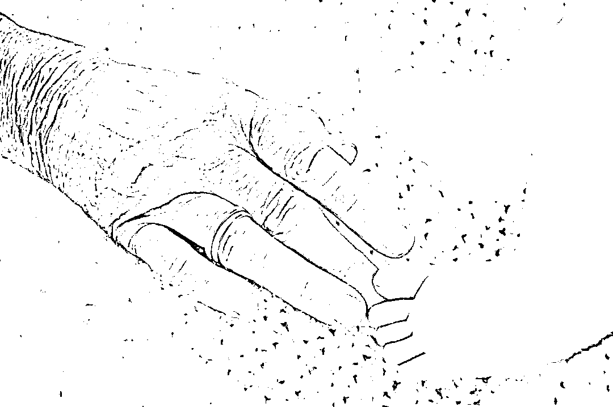

原来，来自农村的婆婆，在生活上没什么卫生意识，

还特别喜欢反复查看、抚摸碰触小孙子的生殖器，

更甚还教着引导孩子自己去摸……

她已经数次跟老人提起，这样的行为很不妥当，

还可能让孩子的敏感部位有感染疾病的风险！

可老人就是不管不顾，觉得自己是在表达对孩子的亲热和喜爱，

双方争执不下，搞得婆媳矛盾激化，

两人剑拔弩张，家庭氛围苦不堪言。

**不得不说，在老一辈的认知中，很多的育儿理念，可能会颠覆年轻人的三观！**

这样的现象还不是个例，无独有偶，最近言姐还关注到一个帖子，

也是媳妇吐槽奇葩婆婆，标题里的关键词，就已经很令人觉之不适……

“孩子被奶奶裹丁丁了……”

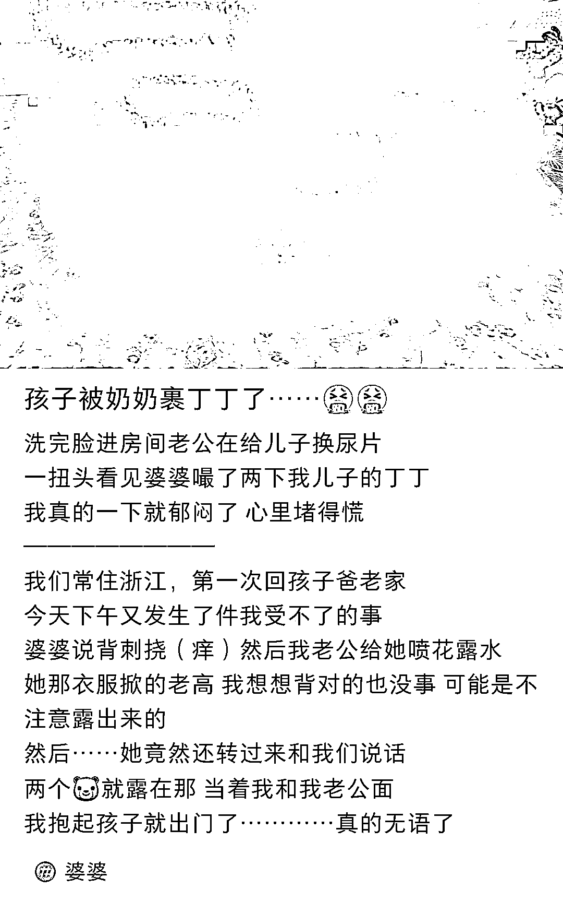

这里的“裹”，是指用嘴含住的意思，和文中的“嘬”同义，

也就是说，这位奶奶，会用自己的嘴巴，去含住裹吸小孙子的生殖器……

还在已为人父的儿子面前坦胸露乳，毫无羞耻心和界限感，

在网友的评论中，我们了解到，

**有些地方还存在同类型的“吃鸡礼”——**

一石激起千层浪，很多网友将自己的亲身经历，或是周遭的言谈相传分享而出，

掀起了一场关于“亲属和幼儿间奇葩互动内容”的激烈讨论。

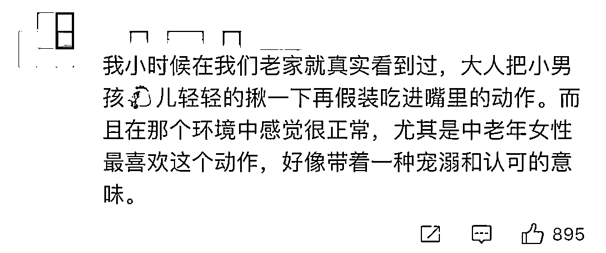

很多心水男孩子的老人家，会把男孩子的丁丁当成炫耀性别的宝贝，

这来源于“生殖崇拜”的老思想和传统，在现如今也依旧存在——

“很常见”

亲亲孩子的小手小脚还可以理解，

肆无忌惮亲小鸡，是不是就有些，难以言喻……

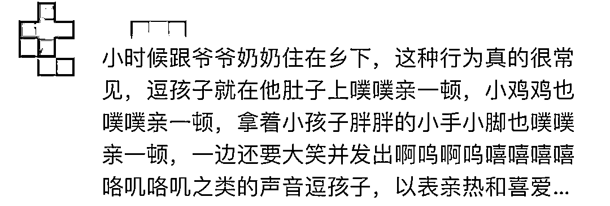

“老人觉得是喜欢孩子的一种方式”

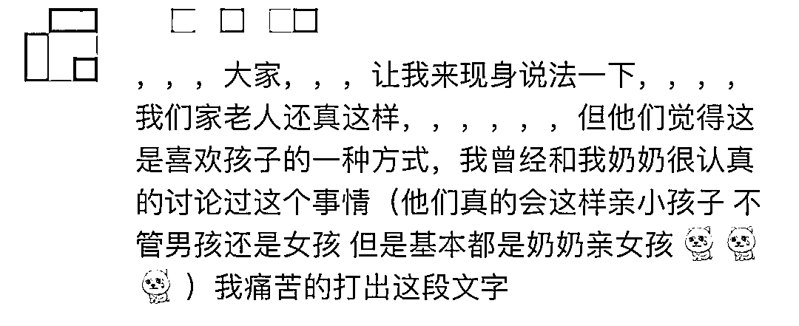

“总是亲儿子丁丁”

“中年妇女逗弄小男孩”

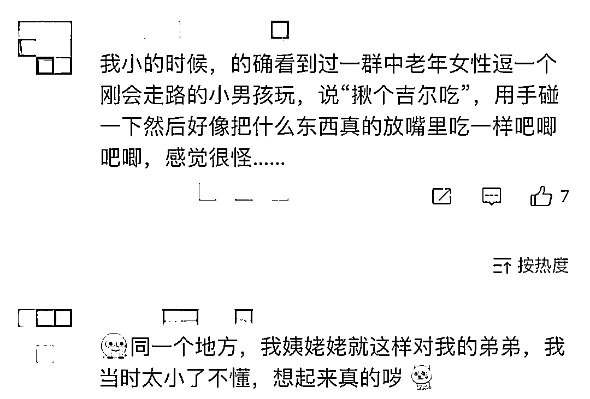

评论区的回答中，还有更令人喷饭的事，

以孩子的生殖器为主题拍百日照，

还放大了当背景墙？？？

这是什么奇葩操作……

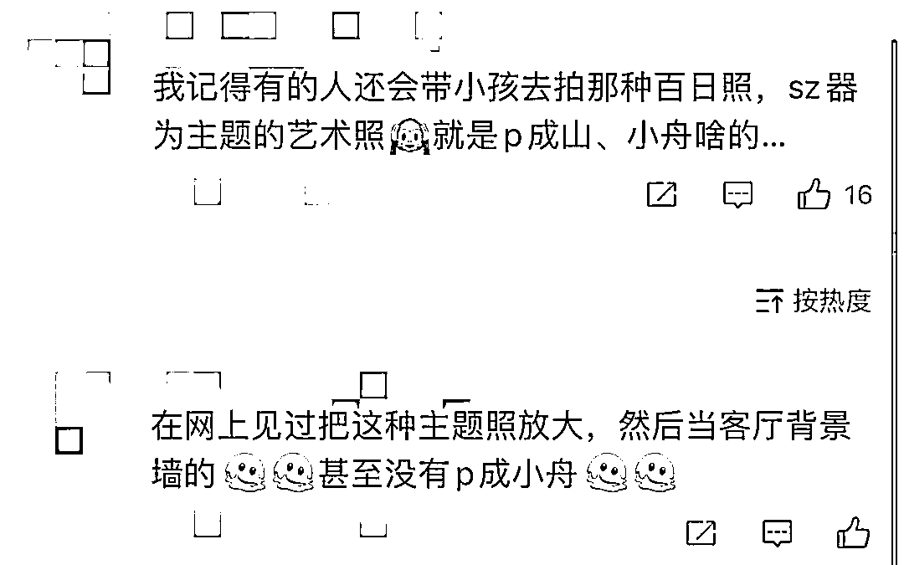

而小孩子的模仿和复刻能力，超乎我们大人的想象，

他们会学习并且模仿这样的“吃鸡礼”——

甚至是以此为荣，来要挟大人！

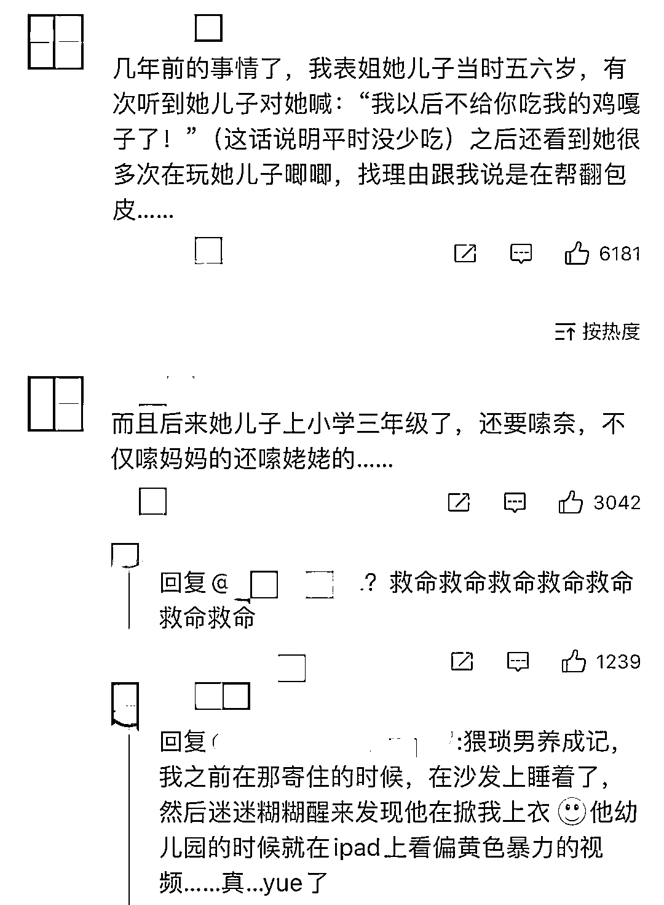

**家长给孩子埋下了不正确的性认知界限，**

**很可能在日后，他们会做出更可怕的举动！**

为什么咱们的长辈们，就这么喜欢玩弄或是炫耀小男孩的生殖器，已经到了习惯性的地步？

言姐想起此前一个很经典的话题性案件，

一位中国大爷，在国外因为碰触了一个小孩子的丁丁，而被起诉……

虽然最终，该大爷被以存在文化差异的缘由，无罪释放，

但值得我们深思的是，这样的文化，是否真得妥当呢？

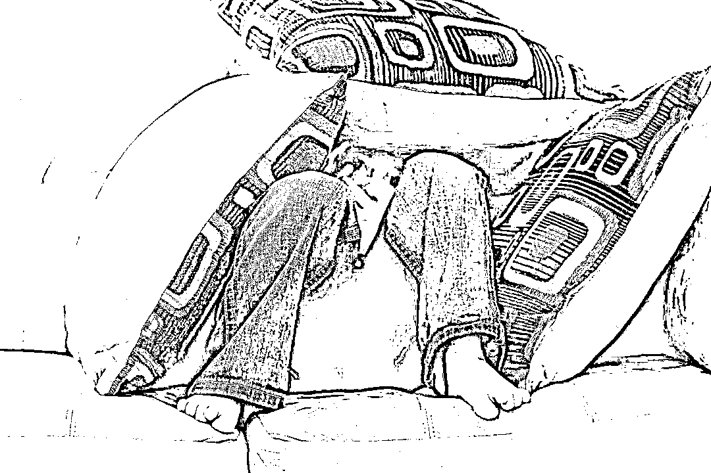

**“吃鸡礼”是疼爱还是侵害**

我们将话题的重点聚焦于，类似“吃鸡礼”这样的行为，

算不算是猥亵和侵害儿童？

对于如此这般对待孩童的方式，

有的人表示，大人们也不是故意如此，

中国式家长缺少亲子间的界限感，尤其是性别意识方面的概念，

以逗小孩为引子，诱发的争论性事件也不在少数，

但更多的人则表示，完全难以理解，

甚至觉得这类举动无比恶心！

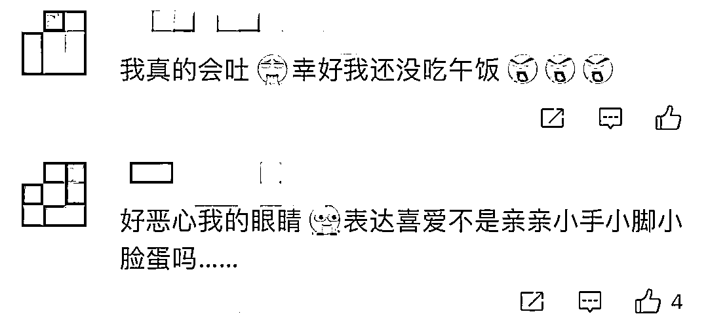

有网友认为，这就是猥亵儿童，

大人们助纣为虐，在培养将来的犯罪者，

因为家里人近乎变态的溺爱，才会让很多的男性，

成为“不正常”的那种人……

大家也纷纷分享出，真实发生的案例，

有很多家长，和孩子之间的界限感微弱，

甚至已经达到了骚扰的程度！

母亲在公众场合舌吻孩子……

儿子上小学了还要含着妈妈的乳房吃奶……

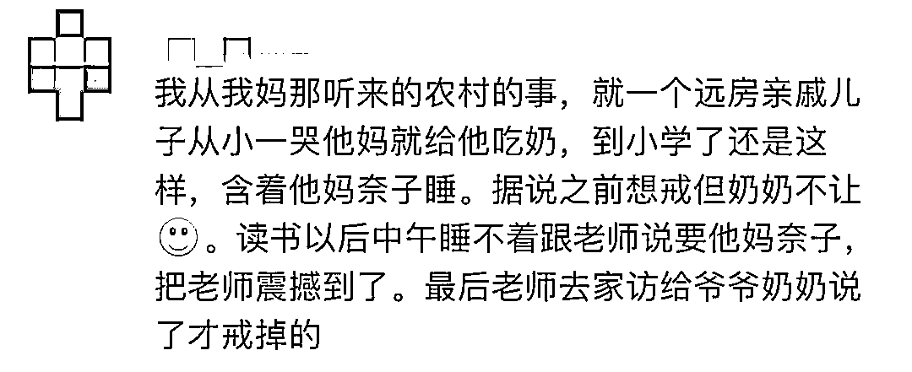

上了高中的男生还在和妈妈亲密同睡……

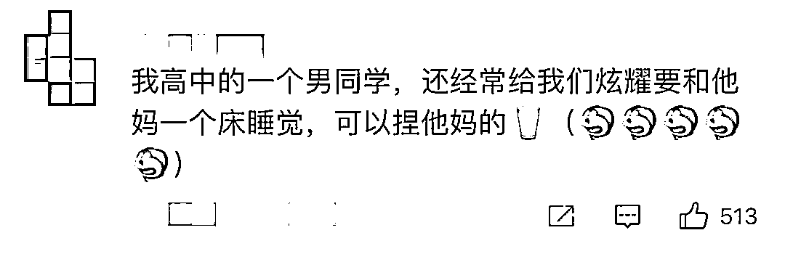

母子之间“坦诚相待”，洗内衣裤……

18 岁了还和母亲伸舌头躺床自拍……

上大学了也还跟妈妈同床共枕……

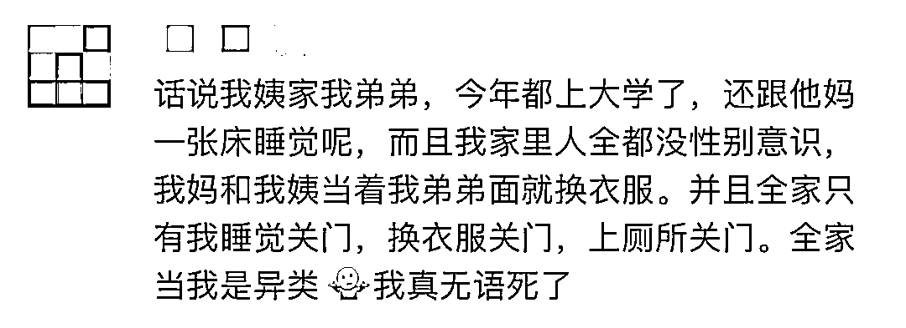

儿子即使已经娶妻生子，也还是没有收敛，

婆婆当着儿媳妇的面，直勾勾盯着儿子的下体……

这样的母子越界行为，肯定不是一天所成，

定是从儿子幼时就形成的习惯，习惯成自然。

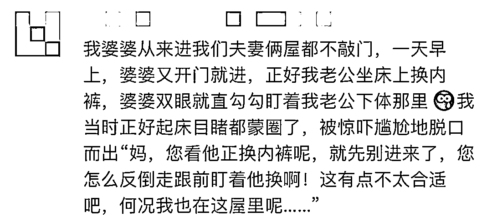

幼子尚稚时，未能形成正确的性认知感，

他们的习性和发展，都将取决于大人的教育，

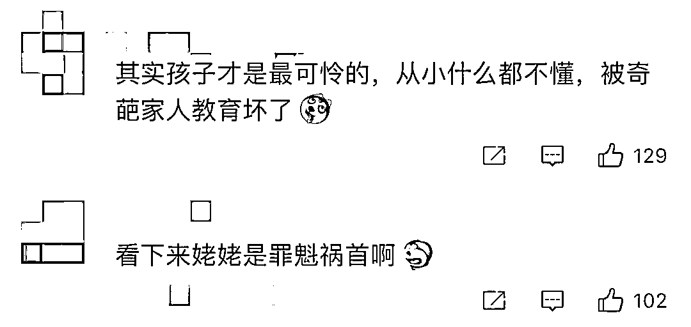

在这个敏感时期，周围的人如何对待他们，

就会成为孩子，看待和反馈世界的个人行为范本。

根据数据反馈显示，很多的恋童癖犯人，在幼时，自己就是被猥亵过的被害者……

**即使是至亲之人之间，也应有隐私意识，**

更不该逾越性别，不管不顾身体差异，

将孩子本该私密的部位尽数展现给他人，

尤其是很多老人，不以为耻反以为荣，

看到一条评论很是戳中重点，

那些指点年轻女孩们穿衣过于暴露的老古董们，

有多少又同样是对小孩子的隐私随意处置的人呢？

遇到前文中的种种情况，究竟有怎样好的解决方式？

也希望大家多多留言，分享你的观点和做法。

**没有边界感的亲情有多可怕！**

除了恶意逗弄幼儿的生殖器，还有很多亲子间的逾越行径，被抛到了明面上，该引起我们的讨论反思。

亲人之间就可以肆意妄为吗？

近日，言姐刷到一则离谱的短视频，

内容是，一个男人笑嘻嘻地在床上俯身压制着一个小女孩！

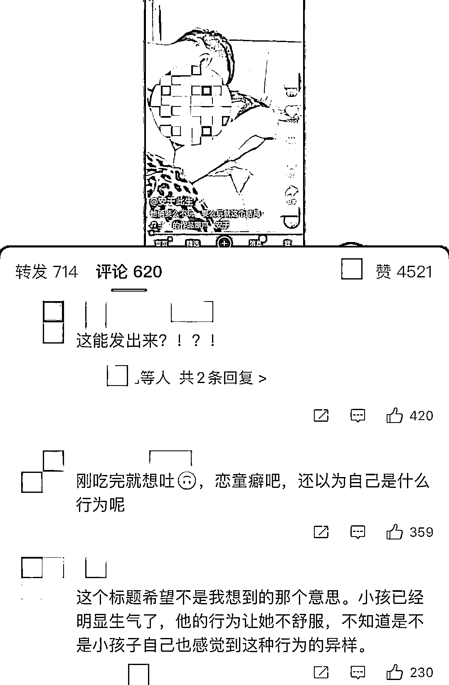

只见男人双手钳住小女孩举过头顶的手，并将自己的面部贴近磨蹭着女孩的脸部颈部位置，

期间女孩子一直在使劲挣扎，并且大声喊出了“放开我的手啊”这样求助的话，

明显是自己也感受到了不适，想要脱离男人的控制……

这竟是上演了一出，类似强制亲热的戏码，

据称两人是父女关系，拍摄视频的人还是孩子的亲妈，视频配文是：

“他俩要么不玩，要么玩就这个结局！”

虽目的是在炫耀父女关系的亲近，

但这也太惊悚和过分了吧？

你说这是父女亲昵？！

**我只看出了不适感和危险的气息！**

即使是亲血缘父女，也不该有如此行径吧，

代入小女孩视角，更是细思极恐！！

被与自己相比过于悬殊的男性力量压制，

似是被强制侵犯一般，却反抗不能，满是绝望……

这会给女孩子带来多深的心理阴影！

搞不懂这些人，是真的觉得这样的行为有趣，

还是低劣到想要抓住猎奇的流量密码，

总之不管是哪一类缘由，都其罪当诛！

截至发文前，在网友的群情激愤下，该账号已经被注销，后续的处理相信一定会跟上。

此前，还看到过女儿穿着清凉，扑向爸爸索拥索吻的这类视频，

或者是女儿和妈妈雌竞，说自己才是正宫，爸爸只爱自己……

这些畸形的亲子关系，对孩子的影响潜移默化，注定会带来不好的作用，

希望大家都引以为戒，平台也能加大管理和筛选力度，

华兹华斯曾说，孩子是成人的雏形，

**别让家长的不当行为，成为将孩子扭曲化的诱因！**

希望所有的孩子，都能在适宜妥当的爱意中，积极健康的长大成人。

来源：娇妈 言情说

欢迎关注灰产圈社群服务号

