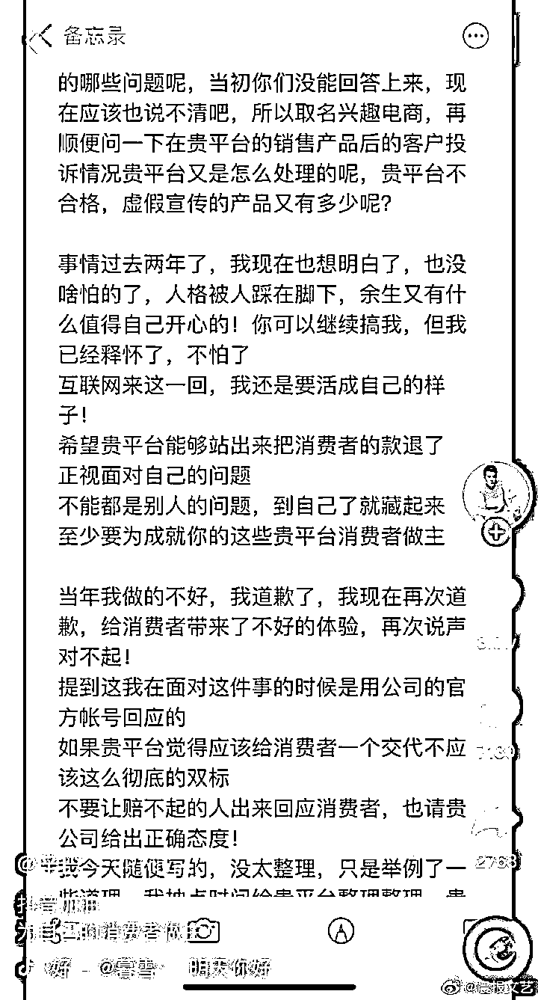
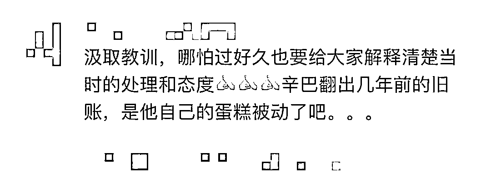

# 辛巴炮轰刘畊宏，指责他们也卖过假燕窝

> 原文：[`mp.weixin.qq.com/s?__biz=MzIyMDYwMTk0Mw==&mid=2247543136&idx=2&sn=861bc118e7142a29309124ca1b6fce2d&chksm=97cbe258a0bc6b4e04ecc72378a2f50d1ca5b294afde4dedfebd74d73bc3d39d1921b4c0e9e7&scene=27#wechat_redirect`](http://mp.weixin.qq.com/s?__biz=MzIyMDYwMTk0Mw==&mid=2247543136&idx=2&sn=861bc118e7142a29309124ca1b6fce2d&chksm=97cbe258a0bc6b4e04ecc72378a2f50d1ca5b294afde4dedfebd74d73bc3d39d1921b4c0e9e7&scene=27#wechat_redirect)

8 月 30 日晚，曾因售卖假燕窝，导致账号被封禁的网络主播辛巴，发长文**爆料知名网络主播刘畊宏夫妇也带货过同款假燕窝，**引发广泛关注。该话题登上热搜第一，阅读量近 6 亿。

有网友发现，辛巴的某音账号遭到官方封禁，勒令其在封禁 24 小时后才能复播，平台给出的原因是辛巴涉嫌贬低与损害平台形象。

而辛巴发布的视频中，直接把抖音官方给出的封禁理由贴了出来，并嘲讽抖音“**你的形象是被你控制出来的么？**”

截图自辛巴抖音账号

辛巴爆料刘畊宏夫妇卖同款假燕窝

单价还比自己高 100 元

据悉，早些时候，辛巴在抖音发布长文，控诉抖音“双标”，**因为“糖水燕窝”一事，其它知名带货主播均没有受到处罚。**

辛巴在长文中透露，**当初抖音的诸多网红以及明星(包括刘耕宏)卖了同款燕窝，销售价格 300 多每单，宣传内容坚决存在虚假宣传以及夸大宣传 (有视频为证)。**

截图自辛巴抖音账号

刘畊宏致歉：愿意承担退赔费用

针对网传刘畊宏夫妇

卖茗挚燕窝产品假货的消息

今天午间

天赋星球官微发布致歉声明称

旗下艺人刘畊宏夫妇

曾与杭州麦空创意文化有限公司

合作淘宝电商直播

合作过程中

杭州麦空公司确实推荐了

茗挚燕窝产品

在淘宝直播间直播活动中销售

刘畊宏夫妇合作 MCN 公司声明 

↓↓↓

声明称，经向杭州麦空公司了解，杭州麦空公司的反馈情况为：**当时品牌方提供有检验报告，至今品牌方仍未与杭州麦空公司确认，在淘宝直播间所售卖的茗挚燕窝产品与其它平台直播间发生问题的茗挚燕窝产品是否为同批次商品。**

天赋星球表示，刘畊宏夫妇已要求并督促杭州麦空公司妥善处理上述事件，并对消费者进行依法退赔。基于受限于淘宝平台对消费者个人信息的保护，公司无法取得消费者联系方式，但对于 2020 年在公司艺人淘宝直播间购买过茗挚燕窝产品的消费者的退款退赔要求，公司愿意承担所有费用。

今天中午，刘畊宏在微博发文道歉，话题冲上微博热搜榜首。

**“对于我先前合作的公司选品不够严谨，导致信任我的消费者受到损害，我感到非常抱歉，也因过去的经历，现在的团队更加严谨把关。”**

此外，杭州麦空文化同时发布声明，称公司于 2020 年开始与刘畊宏夫妇在淘宝直播业务进行合作，公司负责所有直播间选品与运营工作，刘畊宏夫妇负责直播间推广带货。

杭州麦空文化称，2020 年 9 月-10 月，其提供选品的“茗挚”品牌碗装燕窝产品在刘畊宏夫妇直播间共计销售 177 单。同年 11 月，其它直播间爆发燕窝纠纷事件，其已第一时间协助消费者向品牌方维权。一周内退款 25 单。

天眼查 App 显示，“假燕窝事件”涉事品牌方为广州融昱贸易有限公司。该公司成立于 2019 年 1 月，行政处罚信息显示，**该公司因虚假宣传、涉案产品标签存在瑕疵等，于 2021 年 1 月被罚款 200 万并吊销营业执照。**

风险信息还显示，该公司存在 2 条被执行人信息和 1 条限制消费令，被执行总金额超 3496 万元。同时，该公司还存在多次因网络购物合同纠纷被起诉。

值得一提的是，**在辛巴发声前，“假燕窝事件”就已步入庭审阶段。**

今年 5 月 9 日，河南省消费者协会就“辛巴燕窝事件”发起的消费公益民事诉讼在郑州市中级人民法院开庭审理。双方的争议主要集中在本次诉讼是否影响正在进行中的退赔程序、永久封禁辛巴账号等是否合理、本案是否符合民事公益诉讼条件等问题。据澎湃新闻报道，庭审尾声，各方表示愿意在法庭主持下调解。

刘畊宏泪昨晚洒直播间

刘畊宏夫妇近几个月通过直播带领网友跳操、健身，热度高涨。

8 月 30 日晚，一则“刘畊宏哭了”的话题也登上微博热搜，网友纷纷猜测是否与辛巴的爆料有关，但相关视频中，**刘畊宏称是因为大家对他的支持而感动，这些支持让他觉得很有使命感。****截至 8 月 31 日，刘畊宏在抖音平台拥有粉丝 7300 万。**

截至今天下午 3 时，话题#刘畊宏道歉#已经引发超 2.6 亿阅读，超 1.9 万讨论。

有网友认为 

**同样售卖了假货** 

**应该“一视同仁”**

有网友认为 

**辛巴出于自身利益原因“翻旧账”**

**“五十步笑百步”**

来源：大 R 说安全

欢迎关注灰产圈社群服务号

