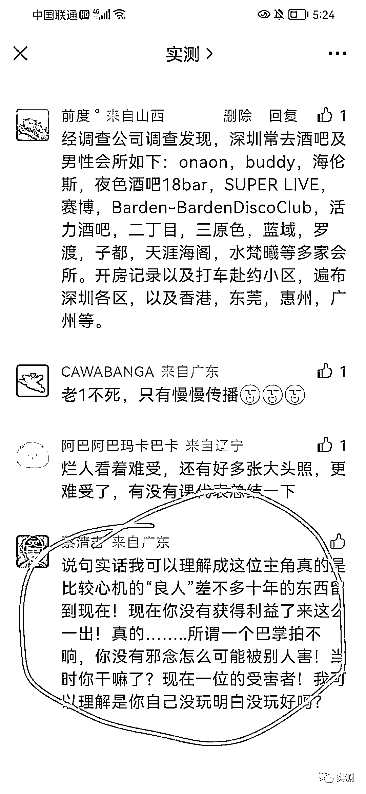

# 男同圈有人连命都不要了？

> 原文：[`mp.weixin.qq.com/s?__biz=MzIyMDYwMTk0Mw==&mid=2247543136&idx=4&sn=f393c17fb1f6ad6b5a746a731f8c1aab&chksm=97cbe258a0bc6b4ec9441b8fdde8a1ba52107c169095590c0011d42390d0133f0c3438f2819e&scene=27#wechat_redirect`](http://mp.weixin.qq.com/s?__biz=MzIyMDYwMTk0Mw==&mid=2247543136&idx=4&sn=f393c17fb1f6ad6b5a746a731f8c1aab&chksm=97cbe258a0bc6b4ec9441b8fdde8a1ba52107c169095590c0011d42390d0133f0c3438f2819e&scene=27#wechat_redirect)

在某些出卖性用品的网站

尤其是面向男同志群体的网商

有一种叫做 0 号胶囊的产品

产品形容的五花八门

甚至还提供了用户反馈

以吸引人的眼球

宣称可以降低肛交中被插入一方的痛苦

** 0 号“神器”真就有这么神？**

0 号胶囊的主要成分是

**二甲基色胺 5-MeO-Dipt**

**属于国家严格管制的一类精神药品**

外观为白色或米黄色

在台湾被称为“火狐狸”“黑猫”

在日本俗称“烟斗”

化学结构与苯丙胺相似

是苯丙胺的衍生物

**（甲基苯丙胺即冰毒）**

这种物质可以通过鼻腔、直肠黏膜吸收

**但口服有剧毒**

因此衍生出了 0 号胶囊的形式

使用后有兴奋感、性冲动和发泄的欲望

甚至还会产生迷幻

从而失去对疼痛的感知

达到持续兴奋的效果

目前市面上流通的 0 号胶囊

大多为化学合成

纯度更高、作用更强

其致幻功能可以令人在不同程度上的与现实脱离

间接地达到放松自我控制

提高自我印象、降低自卑的假象

人体摄入 5-MeO-Dipt 的副作用

包括瞳孔放大、恶心、下颚禁闭

肌肉紧张过度、高血压、心脏过速等

使用超过 6 毫克就可能产生幻听、行动迟缓

甚至丧失意志

**严重者会出现全身抽搐、****急性心脏衰竭，****导致死亡** 

曾经就有一名 29 岁男子

为寻找性乐趣使用 5-MeO-Dipt

导致急性心脏衰竭死亡

其尸检结果显示心脏和肝脏

有动脉炎、心肌局部缺血

白血球增多、肺部充血等症状

同时，这类产品宣称可以

降低肛交中被插入方的痛苦

**殊不知，“疼痛”是进化过程中产生的**

**一种非常重要的生理机能**

**是防止严重伤害的重要能力 **

肛交中出现的疼痛 

是软组织已经或即将受损的迹象，是警告信号

这个时候如果由于外用麻醉药品

降低或掩饰了疼痛

就很有可能导致软组织严重损伤……

最后，除了药物本身对身体的致命威胁外

致幻和催情的作用

严重影响了使用者的意识和判断力

很多时候顾不上使用安全套

从而丧失了自我保护的机会

 **切记：珍爱生命，远离毒品**

最后的最后，

招商银行深圳员工

涉毒涉艾滋涉男同的大瓜了解下

男同圈里 

有人自己命不要了 

还祸害别人 

来源：广州禁毒，实测

欢迎关注灰产圈社群服务号

