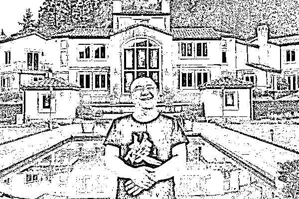

# 在币圈割韭菜赚几个亿，逃到美国住豪宅开豪车！

> 原文：[`mp.weixin.qq.com/s?__biz=MzIyMDYwMTk0Mw==&mid=2247543136&idx=5&sn=7e41608b3687348e06339a7b89da5220&chksm=97cbe258a0bc6b4e749aab23ecac69d004401415aaf175bffe13514d11f1b56d8a1182e223e7&scene=27#wechat_redirect`](http://mp.weixin.qq.com/s?__biz=MzIyMDYwMTk0Mw==&mid=2247543136&idx=5&sn=7e41608b3687348e06339a7b89da5220&chksm=97cbe258a0bc6b4e749aab23ecac69d004401415aaf175bffe13514d11f1b56d8a1182e223e7&scene=27#wechat_redirect)

在币圈，从来不缺屌丝逆袭，实现财富自由的故事。

郭宏才，币圈人称“宝二爷”，币圈老韭菜无人不知无人不晓，一个高中毕业的牛肉贩。卖牛肉卖出了瓶颈，一个偶然的机会，他接触到了比特币。

从此，郭宏才 All In 币圈，化身“宝二爷”，活跃在币圈。

那么，郭宏才是如何接触到比特币？又如何通过比特币改天逆命？

宝二爷原名郭宏才，小名二宝，出生于山西平遥。学生时代的他爱说话、爱张罗，热情好客，完全不似那个年代的学生一样矜持和羞涩。

当同窗都在考试的枷锁里默默忍受的时候，郭宏才却总能谈笑风生，虽然成绩一般，却常常成为焦点。

“二宝脑子活，爱说话，在开学第一天自我介绍时就给大家留下极深的印象。”据郭宏才平遥中学的同学回忆，“如今他成为亿万富翁，在媒体聚光灯下侃侃而谈，我丝毫不惊讶，他天生就与普通人不一样。”

郭宏才在平遥中学时的师生合影

2003 年，高考结束，考了 300 分的郭宏才也有一个清华梦，当清华大学的第一志愿落榜后，他孤身北上，在清华的照澜院租了一间小房子，一边旁听课程，一边琢磨怎么赚钱。

在清华的三年半，郭宏才捣腾过域名，建过网站，卖过光盘，当过清华的网络电话校园总代理，收入最多时能有几十万。

2006 年，有些放荡不羁也有些浪漫情怀的郭宏才，决定外出“流浪”，于是他离开北京，单枪匹马去川藏线骑行。

在川藏线上穿行的郭宏才

值得铭记的是，在川藏公路上，郭宏才遇到了一生挚爱。

那天，参加学校集体骑行活动的金洋洋，与郭宏才在公路上相遇，二人一见钟情，互留了手机号码。

分开后，光棍郭宏才一直对金洋洋念念不忘，思念让他不顾一切，他直接去到金洋洋的老家四川绵阳。见到金洋洋的父母，郭宏才直接自报家门，说他是金洋洋的男友。

金洋洋当时也是一愣，并没有反驳，默认即是承认。就这样，郭宏才把金洋洋拿下。不得不佩服郭宏才，总是不走寻常路，连撩妹的操作，都是那么风骚，也正是因为金洋洋，才有了后来的“币圈宝二爷”。

那时的郭宏才还是个没车没房的普通瘦小伙，金洋洋也只是四川农业大学的学生，当时的他们不会想到，12 年后会住进美国一万平的别墅里，身价过亿。

2008 年，金洋洋大学毕业，两人决定去上海干一番事业。彼时，正是电子商务创业大潮，于是郭宏才将家乡的特产——平遥牛肉，搬上了天猫商城。

创业初期，郭宏才与金洋洋租住在上海浦东川沙镇的一个阁楼里，冬天没有暖气，他们只能把装满热水的桶放到房间里取暖，最冷的时候，二人蜷缩在睡袋里过夜。

郭宏才和金洋洋携手共度了一段艰难的创业期，遇到困境都咬牙坚持了下来，借着首批天猫入驻商家的优势，生意逐渐有了起色。

五年时间过去，他们从无到有，将牛肉生意做的风生水起，同时还销售山西的各种特产，不仅在天猫商城里拿过销量第一，还是山西地区数一数二的卖家。

日子逐渐稳定，郭宏才却坐不住了。

“有一天早上醒来，二宝突然告诉我，他一眼能看到未来六十年的生活，他想换一种活法。”金洋洋回忆。

于是在 2013 年，郭宏才带着金洋洋重返北京。

郭宏才接触比特币，还要感谢夫人金洋洋。

初到北京的金洋洋，每天漫无目的的闲逛，有一天逛到海淀区的创业大街，歪打误撞进了车库咖啡，于是打开了新世界的大门。

“没有车库咖啡，就没有今天的币圈。”多年后郭宏才这样评价。

当时车库咖啡还只是个创业孵化平台，直到有一天来了一个“传销大师”，讲了一次区块链和比特币，收获了很多追随者，这些人后来都赚了钱，这个“传销大师”就是李笑来。

李笑来

金洋洋一听就着迷了，立马拿出十几万，买了几百枚比特币。当时，一枚比特币的价格，大概 500 元。刚开始金洋洋并没有把这事告诉郭宏才，但比特币的价格马上涨到了 600 元。

人都是这样，亏钱了不愿意说，赚钱了就忍不住想说；金洋洋也没忍住，把花十几万买比特币的事，告诉了郭宏才。

郭宏才吓得不轻，认为金洋洋是参加了传销，被骗了。他叫金洋洋马上把比特币卖掉，但金洋洋死活不干。

万般无奈之下，郭宏才跟着金洋洋，来到了车库咖啡，结识了李笑来。谁知李笑来洗脑能力实在太强，没花多少功夫，郭宏才就被李笑来彻底洗脑了。

郭宏才茅塞顿开，他再也不想卖什么牛肉了，比特币才是他的未来。于是，他辞去了卖牛肉的工作，其实他也没有工作，只是全身心地投入到了比特币。

刚接触比特币，郭宏才就孤注一掷，问朋友亲戚借了不少钱，全部梭哈买了比特币。

2013 年底，郭宏才还做了一档《宝二爷手把手教你玩转比特币》的视频节目，正式以“宝二爷”的名号行走币圈。 

在郭宏才的指导下，金洋洋也做了一个节目《洋洋访谈》，专门访谈当时活跃于币圈的人物。

就这样，火币网的李林、OKEx 的徐明星、比特大陆的吴忌寒，都是通过这种方式结识的。 

但是，和很多新手刚进入币圈一样，还没赚到多少钱，郭宏才很快就面临巨额损失。 

2014 年，发生了震惊币圈的门头沟交易所跑路事件，比特币价格崩盘，迎来了熊市。随着币价暴跌，郭宏才每天都看着账户市值缩水，很多钱都是借来的，这让他承担着巨大的压力。

当时，很多矿机厂商的矿机，根本卖不出去，他们只好自己拿来挖矿。

比特大陆的吴忌寒，在深圳沙井有一个矿场，但当时用的是工业用电，每度电费要 9 毛钱。 

在几个朋友的资助下，2015 年郭宏才跑到内蒙古，建立了一个比特币矿场。 

那里的电费便宜，每度电只要 3 毛钱，而且气候凉爽，正好解决了比特币矿机发热量大的问题。 

当时，郭宏才的矿场，每天能够产出 500 枚的比特币。但矿场一天的电费要去到 50 多万元，按照当时的币价，挖出的币卖掉后，刚够交电费的。 

这个时候，郭宏才意识到，只有比特币的价格上涨，他才有可能真正赚到钱。 

而要让比特币的价格上涨，就必须让更多人知道比特币，让更多人达成共识。

几经周折之下，郭宏才将这个矿场卖给了比特大陆。

为了扩大影响力，郭宏才以 5000 个比特币的成本，买下了 BTC123，这个当时国内最大的比特币资讯网站。 

然后，他和金洋洋一起，开着他的国产加长车，开启了比特币中国行，走到全国各地，进行比特币布道。 

2015 年，郭宏才就在全国进行演讲，但当时行情低迷，并没有太多人参加这种聚会。所以，“宝二爷”的名号，其实并不响。 

真正让“宝二爷”声名鹊起的，是在 2016 年。 

那一年，达沃斯经济论坛邀请郭宏才参加，他是作为矿场主的身份受邀请的。 

那个时候，郭宏才并不太清楚达沃斯是一个什么规格的会，以为就是几个兄弟吹吹牛。 

他没多想，穿着短裤衩和拖鞋就去了。 

谁知到了会场，由于穿着过于随意，被保安拦了下来，不让进。 

在主办方的协调之下，郭宏才才进到会场。 

会议期间，在一群西装革履的金融人士面前，郭宏才用他自学来的英文，侃侃而谈。他甚至大言不惭地说：比特币的市值会超过所有国家的 GDP。

郭宏才参加达沃斯论坛

在场的金融人士，都以为郭宏才疯了，现场只有一个了解比特币的人士，觉得他说得有道理。

这次参加达沃斯论坛，让郭宏才成功出圈，彻底火了。“宝二爷”也由一个无名之辈，成了一名币圈大佬。 

也就是这一年，他说出了那句最有名的话“有生之年，比特币如果不到 100 万美金，我就直播吃××”。

虽然语言简单粗暴，甚至粗鲁，但这依然没有影响他成为了很多追逐财富自由之人的“偶像”。

可能也确实是因为接地气吧，很多人挺吃他这一套，2017 年 8 月，宝二爷的一场直播有十万人观看，他细数了比特币几年来的发展情况，为粉丝充值信仰，同时也收获了鲜花、火箭等价值上万的直播礼物。

也是在 2017 年，郭宏才熬到到了比特币牛市。随着币价上涨，他卖掉了一些比特币，用以偿还之前的亏空。 

随着比特币的赚钱效应越来越强，越来越多的新韭菜加入到炒币大军。 

与此同时，以太坊智能合约不断完善，将项目方发空气币的门槛降到非常低。那一年，成了山寨币 ICO 元年，各种各样的空气币横行。

很多项目方，项目白皮书都是从淘宝上买来，改一改就发币出来圈钱。

为了吸引韭菜进来接盘，项目方需要找一些币圈的大咖进来站台，有着大量粉丝的郭宏才，自然成为了项目方狩猎的对象。

刚开始，郭宏才也是来者不拒，明码实价，站台一个项目，就要收 1%的站台费。

其实 1％站台费这是算是个乌龙事件，郭宏才在“王峰十问”中说，本想拿收取 1%站台费的条件吓退那些未经他允许就将他照片和名字写到白皮书里的项目方，没想到消息一出上百家项目方主动找上门，二话不说就打币，这才有了明码标价站台之说。

短短三个月的时间，郭宏才就站台了 30 多个项目，市值至少达到 4 个亿。很多项目，郭宏才自己都看不懂，他自己也不投资。

只要项目方给站台费，他都不余遗力地卖力宣传，与项目方一起大刀阔斧的割韭菜，单单这几个月的时候，宝二爷赚了别人几辈子都赚不来的财富，而后，国家出手，制止了他们这疯狂的行为。

2017 年 9 月 4 日，央行联合七部门发文全面叫停 ICO，将 ICO 定性为非法集资，经营加密货币交易所为非法行为。

通过站台 ICO 项目收割了大量韭菜的郭宏才，此时似乎也有一点点心虚。此时的郭宏才，手中持有的比特币以及站台获得的财富，花几辈子也花不完。于是，他给自己找了一个后路，悄无声息地跑到美国去了。

郭宏才的豪宅

2018 年年初宝二爷携家带口搬去了美国，并且在极短的时间就拿到了绿卡，之后花了大概 500 个比特币买了一座 1 万平米的庄园，他自己取名叫“韭菜庄园”，还在庄园里开辟了一小块地种了韭菜，这可能就是土豪的恶趣味吧。

宝二爷和他的“韭菜庄园”

另外他还花 25 个比特币妻子买了辆白色劳斯莱斯幻影，现在他的庄园里一共停了三辆豪车，白色劳斯莱斯，黑色限量版的劳斯莱斯老爷车，还有银色雷克萨斯。其中黑色劳斯莱斯是他在 2016 年花了 100 个比特币买的。

宝二爷和他的劳斯莱斯

宝二爷一直以他毒辣、粗鄙浅薄的直白言论闻名于币圈，也从不加掩饰他炫富的“暴发户”形象，因为宝二爷认为币圈里的文化就是草根文化、屌丝文化，他就用非常简单的营销模式和最俗的方式让大家记住——“先把牛逼吹出去，万一实现了呢”。

所以，在互联网上想赚钱，最先学会的就是：吹牛逼。

如今，宝二爷已经实现了年轻时候有豪宅豪车的梦想，现在只差登上月球和比特币涨到 100 万美金了。

从宝二爷的发家史中，我们能了解和学习到什么？百晓生总结一下六点，希望对在币圈的你们能有所帮助。 

1、宝二爷也经历了资产大幅度缩水的过程。相信在这个过程中，宝二爷应该也是非常痛苦的。但是借着高利贷还能熬过来，这个确实不得不说宝二爷运气好。建议大家如果不是逼不得已的情况，还是不要去贷款玩项目！

2、比特币产量太少，满足不了一个家庭有一个比特币的需求。但是有这个认知的家庭，应该留一个就够了。比特币不在乎现在的价格多少。关键是我们能否拿得住。

3、来得早，不如来得巧。2017 年进场，做对了事情，在短短一年的时间内，财富翻了几千倍的人大有人在，这种事情可遇不可求。但是在疯狂的 2017 年，确实就有这么神奇的事情。或许下一次牛市的到来，还会有这种机会，大家做好准备了吗？

4、目前区块链仍处于一个初级阶段，这个行业的机会还有很多。当 00 后开始步入社会以后，区块链才开始进入成熟阶段。在这之前投资都不晚，10 美金的比特币只是时间问题。（这里是百晓生的个人理解，不作为投资意见）

5、比特币就是加密货币赌场的股份。拿着股份不要动，然后看别人在里面赌。只要别人在这赌，总有输钱的。赌场总是赢钱的，股东自然也就能赚钱。

6、在币圈真正赚钱的，就是长期拿着比特币的人，他们不频繁交易，只拿着币，然后等着。用时间的复利来增值的。

来源：百晓生道破盘

欢迎关注灰产圈社群服务号

