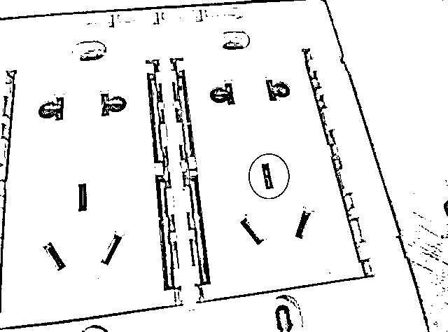
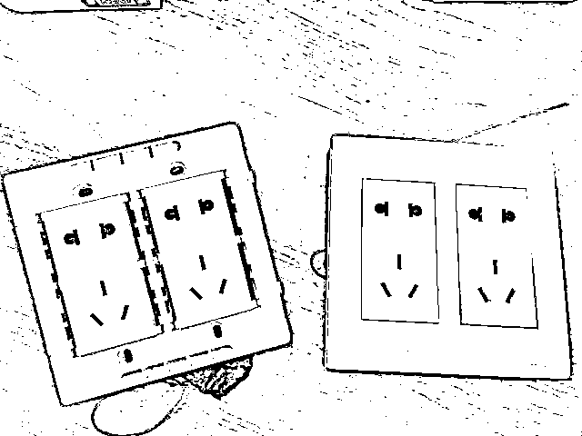
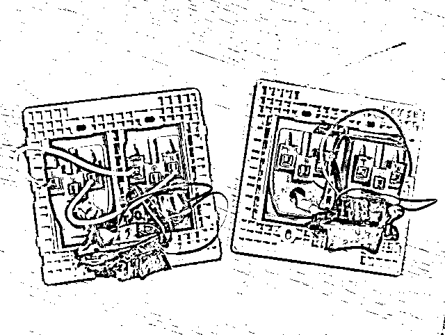

# 男子刷视频竟看到自家卧室！已被偷拍半年

> 原文：[`mp.weixin.qq.com/s?__biz=MzIyMDYwMTk0Mw==&mid=2247543136&idx=8&sn=b4dcd328727ff047e6fecef45dc00b2c&chksm=97cbe258a0bc6b4e7ff4832fcaf5dead2e129661812d83bfb558a8a92fde5ed34fcc0cf4dca2&scene=27#wechat_redirect`](http://mp.weixin.qq.com/s?__biz=MzIyMDYwMTk0Mw==&mid=2247543136&idx=8&sn=b4dcd328727ff047e6fecef45dc00b2c&chksm=97cbe258a0bc6b4e7ff4832fcaf5dead2e129661812d83bfb558a8a92fde5ed34fcc0cf4dca2&scene=27#wechat_redirect)

上周六早上，家住钱塘区的小王躺在自家床上，点开短视频 APP，刷了起来。没多久，他刷到一条一分多钟的视频，让他冷汗直流，大脑一片空白。

他大声喊来妻子，小夫妻俩再看了一遍视频，直接报了警。

视频究竟是什么内容，让这对小夫妻如此害怕和愤怒？

画面里，正是小王所躺着的卧室！小王的妻子还出现在画面里来回走动，夫妻俩的一举一动全部被记录下来！

看过不少新闻的小王知道自己家肯定被人安装偷拍设备了，可找来找去，都没发现任何可能的偷拍设备。越想越慌的他，给白杨派出所报了警。

小王所住的房子是企业安排的出租房，面积不小，小王夫妻住在其中一间。民警赶到的时候，先了解了视频的内容，是被发到网上的一分多钟短视频，发布时间是 8 月 26 日的深夜。

从视频的角度，民警大致有了数。他拿来警用手电，对准床头边的插座缝隙一照，果然发现了一个极小的红点。

小王拿来螺丝刀一撬，所有人都被震惊了：看似普通的插座背后竟暗藏玄机，里面连接着一个微型的针孔摄像头。民警让小王把房间里所有的插座全部拆下，果然又在床对面的墙上插座里发现一个。

从图片可见，白色五孔的插座板，外表并无特殊之处。小王告诉民警，在他入住时，这些插座就存在了，自己从没更换过。而且平时不太用这个三角插头，没想到里面竟然有这么可怕的东西！

那么，在插座里安装的人，显然和发布视频的人有着直接关系。

让民警出乎意料的是，**小王讲，他和妻子都认识发布视频的人，是他们的同事，90 后小伙健某。**

很快，民警就将健某传唤至派出所。

起初，健某还想抵赖，但当民警将他隐藏在手机“保险箱”APP 的视频翻找出来后，最终，他还是低下了头。

小王夫妇觉得很震惊，健某虽然不和他们住在一个出租房，但大家平时玩的很好，健某也结婚了，怎么会做出如此变态的事情？

据健某交代，自己平时经常去同事家玩，所以大家都对自己没什么防备。他通过网购买了隐藏式的针孔摄像头，**利用和小王做同事的便利，趁小王夫妻俩出去玩和上班，不在家的时候，找机会溜进两人卧室进行了安装**，通过远程方式偷窥、观看及下载，以满足个人的畸形欲望。

另外，民警还在健某房间中搜出另一部手机、iPad 等作案工具和大量视频。

目前，健某因侵犯他人隐私被行政拘留，案件正在进一步办理中。此外，受害者小王夫妇也表示，将通过法院起诉健某，主张民事赔偿。

警方提醒

公民的隐私权依法受法律保护，未经同意私自偷拍公民起居生活者，应承担侵权责任。

那么，如何检查发现房间内的摄像头？检测公寓、房屋或酒店房间中隐藏的秘密摄像头的最简单方法是什么？如何在找到隐藏的监控摄像头？警方总结了几种有效方法，可帮助您发现隐藏监控摄像头和监听设备。

1

仔细扫描环境中可疑的隐藏摄像机。室内隐藏摄像头的最常见位置（包括但不限于）：烟雾探测器、空气过滤器设备、书籍、电源插座、桌面植物、纸巾盒、数字电视盒、吹风机支架、壁挂钟或闹钟。

2

关掉房间里的灯以发现隐藏的摄像头。你可以根据夜视监控工作原理来查找房间内隐藏的摄像头。大多数隐藏式摄像头都有红色或绿色 LED。LED 在光线不足的情况下会闪烁或发光。摄像头在光线不足的情况下，摄像机镜头周围的 LED 会自动点亮，为摄像机补充照明，从而产生清晰的夜视图像。

3

直接打开手电筒，关掉房间里的灯。用手电筒在房间周围摇晃。慢慢来，从不同的角度检查任何可疑的位置。如果您发现物体有任何反射光，则那里可能有隐藏的摄像头。

来源：杭州日报，红网

欢迎关注灰产圈社群服务号

